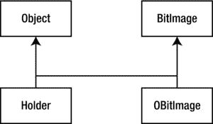
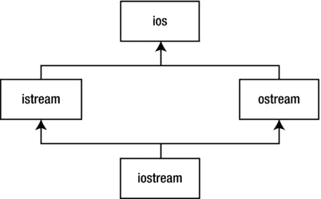
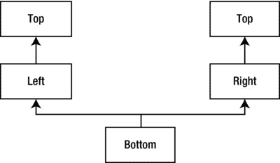
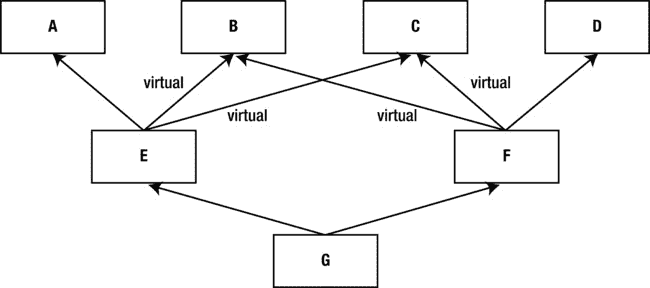

第二十一章


多重继承

多重继承(MI)的基本概念听起来很简单:通过从多个基类继承来创建一个新类型。语法正是您所期望的，只要继承图简单，MI 也可以很简单。

然而，MI 可以引入许多歧义和奇怪的情况，这将在本章中讨论。但首先，对这个问题有一些看法是有帮助的。

远景

在 C++ 之前，最成功的面向对象语言是 Smalltalk。Smalltalk 是作为一种面向对象的语言从头开始创建的。它通常被称为纯语言，而 C++被称为混合语言，因为它支持多种编程范例，而不仅仅是面向对象的范例。Smalltalk 的一个设计决策是所有的类都在一个单一的层次结构中派生，以一个单一的基类为根(称为`Object`——这是基于*对象的层次结构*的模型)。在 Smalltalk 中，如果不从现有的类派生，就无法创建新的类，这就是为什么在 Smalltalk 中需要一定的时间才能变得高效:在开始创建新的类之前，您必须学习类库。因此，Smalltalk 类层次结构是一个单一的整体树。

Smalltalk 中的类通常有许多共同点，它们总是有*一些*的共同点(`Object`的特征和行为)，所以你不会经常遇到需要从多个基类继承的情况。然而，使用 C++你可以创建任意多的不同继承树 。所以为了逻辑完整性，语言必须能够一次组合多个类——因此需要多重继承。

然而，程序员需要多重继承这一点并不明显，对于它在 C++中是否必不可少还存在很多争议。MI 于 1989 年被添加到美国电话电报公司 2.0 版本中，是该语言相对于 1.0 版本的第一个重大变化。从那以后，标准 C++中加入了许多其他特性(尤其是模板),这些特性改变了我们对编程的看法，并将 MI 置于一个不那么重要的位置。您可以将 MI 视为一个“次要”的语言特性，很少涉及到您的日常设计决策。

MI 最迫切的论点之一涉及容器 。假设您想要创建一个每个人都可以轻松使用的容器。一种方法是使用`void*`作为容器内部的类型。然而，Smalltalk 的方法是创建一个保存`Object`的容器，因为`Object`是 Smalltalk 层次结构的基本类型。因为 Smalltalk 中的一切最终都是从`Object`中派生出来的，一个容纳`Object` s 的容器可以容纳任何东西。

现在考虑一下 C++中的情况。假设供应商`A`创建了一个基于对象的层次结构，其中包含一组有用的容器，包括您想要使用的名为`Holder`的容器。接下来，您会遇到 vendor `B`的类层次结构，其中包含一些对您来说很重要的其他类，例如保存图形图像的`BitImage`类。制作`BitImage` s 的`Holder`的唯一方法是从两个`Object`派生一个新类，这样它就可以保存在`Holder`和`BitImage`中，如图[图 21-1](#Fig1) 所示。



[图 21-1](#_Fig1) 。一个说明 MI 需要创建一个对象容器的例子。要成为位图像的持有者，您需要 MI

这被认为是 MI 的一个重要原因，许多类库都是基于这个模型构建的。您可能需要 MI 的另一个原因与设计有关。您可以有意地使用 MI 来使设计更加灵活或有用(或者至少看起来如此)。这样的例子在最初的`iostream`库设计 中[图 21-2](#Fig2) (在今天的模板设计中依然坚持)。



[图 21-2](#_Fig2) 。有意使用 MI 使 iostream 设计更加灵活和有用

`istream`和`ostream`本身都是有用的类，但是它们也可以由一个结合了它们的特征和行为的类同时派生出来。类`ios`提供了所有流类共有的东西，因此在这种情况下，MI 是一个代码分解机制 。

不管你使用 MI *，*的动机是什么，它比看起来更难使用。

接口继承

多重继承的一个没有争议的用途与*接口继承*有关。在 C++中，所有的继承都是*实现继承*，因为基类中的一切，接口和实现，都变成了派生类的一部分。不可能只继承类的一部分(比如说，只继承接口)。正如[第 14 章](14.html)所解释的，`private`和`protected`继承 使得当被一个派生类对象的客户使用时，限制对从基类继承的成员的访问成为可能，但是这并不影响派生类；它仍然包含所有基类数据，并且可以访问所有非`private`基类成员。

另一方面，接口继承只是将成员函数*声明*添加到一个派生类接口中，在 C++中不被直接支持。在 C++中模拟接口继承的常用技术是从一个*接口类* 派生而来，这个类只包含声明(*没有数据或函数体*)。这些声明将是纯虚函数，除了析构函数。清单 21-1 包含了一个例子。

***[清单 21-1](#_list1)*** 。阐释多接口继承

```cpp
//: C21:Interfaces.cpp
// Multiple interface inheritance.
#include <iostream>
#include <sstream>
#include <string>
using namespace std;

class Printable {
public:
  virtual ∼Printable() {}
  virtual void print(ostream&) const = 0;
};

class Intable {
public:
  virtual ∼Intable() {}
  virtual int toInt() const = 0;
};

class Stringable {
public:
  virtual ∼Stringable() {}
  virtual string toString() const = 0;
};

class Able : public Printable, public Intable,
             public Stringable {
  int myData;
public:
  Able(int x) { myData = x; }
  void print(ostream& os) const { os << myData; }
  int toInt() const { return myData; }
  string toString() const {
    ostringstream os;
    os << myData;
    return os.str();
  }
};

void testPrintable(const Printable& p) {
  p.print(cout);
  cout << endl;
}

void testIntable(const Intable& n) {
  cout << n.toInt() + 1 << endl;
}

void testStringable(const Stringable& s) {
  cout << s.toString() + "th" << endl;
}

int main() {
  Able a(7);
  testPrintable(a);
  testIntable(a);
  testStringable(a);
} ///:∼
```

类`Able`“实现”接口`Printable`、`Intable`和`Stringable`，因为它为它们声明的函数提供了实现。因为`Able`从所有三个类派生而来，`Able`对象有多个 is-a 关系。例如，对象`a`可以作为一个`Printable`对象，因为它的类`Able`公开地从`Printable`派生，并为`print()`提供了一个实现。测试函数不需要知道它们的参数的最派生类型；他们只需要一个可以替代其参数类型的对象。

通常，模板解决方案更简洁；参见[清单 21-2](#list2) 。

***[清单 21-2](#_list2)*** 。说明隐式接口继承(使用模板)

```cpp
//: C21:Interfaces2.cpp
// Implicit interface inheritance via templates.
#include <iostream>
#include <sstream>
#include <string>
using namespace std;

class Able {
  int myData;
public:
  Able(int x) { myData = x; }
  void print(ostream& os) const { os << myData; }
  int toInt() const { return myData; }
  string toString() const {
    ostringstream os;
    os << myData;
    return os.str();
  }
};
template<class Printable>
void testPrintable(const Printable& p) {
  p.print(cout);
  cout << endl;
}

template<class Intable>
void testIntable(const Intable& n) {
  cout << n.toInt() + 1 << endl;
}
template<class Stringable>
void testStringable(const Stringable& s) {
  cout << s.toString() + "th" << endl;
}
int main() {
  Able a(7);
  testPrintable(a);
  testIntable(a);
  testStringable(a);
} ///:∼
```

名字`Printable`、`Intable`和`Stringable`现在只是模板参数，假设在它们各自的上下文中指示的操作的存在。换句话说，测试函数可以接受任何类型的参数，只要这些参数能够为成员函数定义提供正确的签名和返回类型；不必从公共基类派生。有些人更喜欢第一个版本，因为类型名通过继承保证了预期接口的实现。其他人满足于这样一个事实，即如果测试函数所要求的操作不能被它们的模板类型参数所满足，错误仍然会在编译时被捕获。后一种方法在技术上是一种比前一种(继承)方法“更弱”的类型检查形式，但是对程序员(和程序)的影响是相同的。这是当今许多 C++程序员可以接受的弱类型的一种形式。

实现继承

如前所述，C++只提供实现继承，这意味着你总是从你的基类继承所有的东西。这可能很好，因为它使您不必实现派生类中的所有内容，如前面的接口继承示例所示。多重继承的一个常见用法是使用 *mixin 类* ，这些类通过继承向其他类添加功能。Mixin 类不打算自己实例化。

举个例子，假设你是一个支持数据库访问的类的客户。在这种情况下，您只有一个头文件可用——部分原因是您无法访问实现的源代码。为了便于说明，假设[清单 21-3](#list3) 中所示的`Database`类 的实现。

***[清单 21-3](#_list3)*** 。实现数据库类

```cpp
//: C21:Database.h
// A prototypical resource class.
#ifndef DATABASE_H
#define DATABASE_H
#include <iostream>
#include <stdexcept>
#include <string>

struct DatabaseError : std::runtime_error {
  DatabaseError(const std::string& msg)
    : std::runtime_error(msg) {}
};

class Database {
  std::string dbid;
public:
  Database(const std::string& dbStr) : dbid(dbStr) {}
  virtual ∼Database() {}
  void open() throw(DatabaseError) {
    std::cout << "Connected to " << dbid << std::endl;
  }
  void close() {
    std::cout << dbid << " closed" << std::endl;
  }
  // Other database functions...
};
#endif // DATABASE_H ///:∼
```

/*我们省略了实际的数据库功能(存储、检索等等)，但这在这里并不重要。使用这个类需要一个数据库连接字符串，调用`Database::open()`来连接，调用`Database::close()`来断开:*/

```cpp
//: C21:UseDatabase.cpp
#include "Database.h" // To be INCLUDED from Header FILE
// above
int main() {
  Database db("MyDatabase");
  db.open();
  // Use other db functions...
  db.close();
}
/* Output:
connected to MyDatabase
MyDatabase closed
*/ ///:∼
```

在典型的客户机-服务器情况下，一个客户机将有多个对象共享一个到数据库的连接。重要的是，数据库最终要关闭，但只有在不再需要访问它之后。通常通过一个类来封装这种行为，该类跟踪使用数据库连接的客户端实体的数量，并在该数量变为零时自动终止连接。要将引用计数添加到`Database`类中，可以使用多重继承将名为`Countable` 的类混合到`Database`类中，以创建一个新类`DBConnection`。清单 21-4 包含了`Countable` mixin 类。

***[清单 21-4](#_list4)*** 。说明可数的“mixin”类

```cpp
//: C21:Countable.h
// A "mixin" class.
#ifndef COUNTABLE_H
#define COUNTABLE_H
#include <cassert>

class Countable {
  long count;
protected:
  Countable() { count = 0; }
  virtual ∼Countable() { assert(count == 0); }
public:
  long attach() { return ++count; }
  long detach() {
    return (--count > 0) ? count : (delete this, 0);
  }
  long refCount() const { return count; }
};
#endif // COUNTABLE_H ///:∼
```

很明显，这不是一个独立的类，因为它的构造函数是`protected`；它需要一个朋友或一个派生类来使用。析构函数必须是虚拟的，这一点很重要，因为它只能从`detach()`中的`delete this`语句中调用，并且您希望派生的对象被正确地销毁。

`DBConnection`类继承了`Database`和`Countable`，并提供了一个静态的`create()`函数来初始化它的`Countable`子对象；参见[清单 21-5](#list5) 。

***[清单 21-5](#_list5)*** 。使用可数的“mixin”类

```cpp
//: C21:DBConnection.h
// Uses a "mixin" class.
#ifndef DBCONNECTION_H
#define DBCONNECTION_H
#include <cassert>
#include <string>
#include "Countable.h"               // To be INCLUDED from Header FILE
                                     // above
#include "Database.h"
using std::string;

class DBConnection : public Database, public Countable {
  DBConnection(const DBConnection&); // Disallow copy
  DBConnection& operator=(const DBConnection&);
protected:
  DBConnection(const string& dbStr) throw(DatabaseError)
  : Database(dbStr) { open(); }
  ∼DBConnection() { close(); }
public:
  static DBConnection*
  create(const string& dbStr) throw(DatabaseError) {
    DBConnection* con = new DBConnection(dbStr);
    con->attach();
    assert(con->refCount() == 1);
    return con;
  }
  // Other added functionality as desired...
};
#endif                               // DBCONNECTION_H ///:∼
```

您现在有了一个引用计数的数据库连接，而无需修改`Database`类，并且您可以放心地假设它不会被秘密终止。打开和关闭是通过`DBConnection`构造函数和析构函数使用资源获取初始化(RAII)习惯用法来完成的。这使得`DBConnection`易于使用，如清单 21-6 中的[所示。](#list6)

***[清单 21-6](#_list6)*** 。测试出可数的“mixin”类

```cpp
//: C21:UseDatabase2.cpp
// Tests the Countable "mixin" class.
#include <cassert>
#include "DBConnection.h"   // To be INCLUDED from Header FILE
                            // above
class DBClient {
  DBConnection* db;
public:
  DBClient(DBConnection* dbCon) {
    db = dbCon;
    db->attach();
  }
  ∼DBClient() { db->detach(); }
  // Other database requests using db...
};
int main() {
  DBConnection* db = DBConnection::create("MyDatabase");
  assert(db->refCount() == 1);
  DBClient c1(db);
  assert(db->refCount() == 2);
  DBClient c2(db);
  assert(db->refCount() == 3);
  // Use database, then release attach from original create
  db->detach();
  assert(db->refCount() == 2);
} ///:∼
```

对`DBConnection::create()`的调用调用`attach()`，所以当你完成时，你必须显式地调用`detach()`来释放最初对连接的保持。注意，`DBClient`类也使用 RAII 来管理它对连接的使用。当程序终止时，两个`DBClient`对象的析构函数将减少引用计数(通过调用`detach()`，它从`Countable`继承而来)，当对象`c1`被销毁后计数达到零时，数据库连接将被关闭(因为`Countable`的虚拟析构函数)。

模板方法通常用于 mixin 继承，允许用户在编译时指定想要哪种风格的 mixin。这样，您可以使用不同的引用计数方法，而不用显式地定义两次`DBConnection`。清单 21-7 展示了它是如何完成的。

***[清单 21-7](#_list7)*** 。说明一个参数化的“mixin”类(使用模板)

```cpp
//: C21:DBConnection2.h
// A parameterized mixin.
#ifndef DBCONNECTION2_H
#define DBCONNECTION2_H
#include <cassert>
#include <string>
#include "Database.h"
using std::string;

template<class Counter>
class DBConnection : public Database, public Counter {
  DBConnection(const DBConnection&); // Disallow copy
  DBConnection& operator=(const DBConnection&);
protected:
  DBConnection(const string& dbStr) throw(DatabaseError)
  : Database(dbStr) { open(); }
  ∼DBConnection() { close(); }
public:
  static DBConnection* create(const string& dbStr)
  throw(DatabaseError) {
    DBConnection* con = new DBConnection(dbStr);
    con->attach();
    assert(con->refCount() == 1);
    return con;
  }
  // Other added functionality as desired...
};
#endif                               // DBCONNECTION2_H ///:∼
```

这里唯一的变化是类定义的模板前缀(为了清楚起见，将`Countable`重命名为`Counter`)。您还可以将数据库类作为模板参数(如果您有多个数据库访问类可供选择)，但它不是 mixin，因为它是一个独立的类。[清单 21-8](#list8) 使用最初的`Countable`作为`Counter` mixin 类型，但是你可以使用任何实现适当接口的类型(`attach()`、`detach()`等等)。

***[清单 21-8](#_list8)*** 。测试参数化的“mixin”类

```cpp
//: C21:UseDatabase3.cpp
// Tests a parameterized "mixin" class.
#include <cassert>
#include "Countable.h"
#include "DBConnection2.h"           // To be INCLUDED from Header FILE
                                     // above
class DBClient {
  DBConnection<Countable>* db;

public:
  DBClient(DBConnection<Countable>* dbCon) {
    db = dbCon;

    db->attach();
  }

  ∼DBClient() { db->detach(); }
};

int main() {
  DBConnection<Countable>* db =
    DBConnection<Countable>::create("MyDatabase");

  assert(db->refCount() == 1);
  DBClient c1(db);

  assert(db->refCount() == 2);
  DBClient c2(db);

  assert(db->refCount() == 3);
  db->detach();

  assert(db->refCount() == 2);
} ///:∼
```

多参数混合的一般模式很简单。

```cpp
template<class Mixin1, class Mixin2, ... , class MixinK>
class Subject : public Mixin1,
                public Mixin2,
                ...
                publicMixinK {...};
```

重复子对象

当从基类继承时，您会在派生类中获得该基类的所有数据成员的副本。清单 21-9 显示了如何在内存中布置多个基础子对象。

***[清单 21-9](#_list9)*** 。使用 MI 演示子对象的布局

```cpp
//: C21:Offset.cpp
// Illustrates layout of subobjects with MI.
#include <iostream>
using namespace std;

class A { int x; };
class B { int y; };
class C : public A, public B { int z; };

int main() {
  cout << "sizeof(A) == " << sizeof(A) << endl;
  cout << "sizeof(B) == " << sizeof(B) << endl;
  cout << "sizeof(C) == " << sizeof(C) << endl;

  C c;
  cout << "&c == " << &c << endl;

  A* ap = &c;
  B* bp = &c;

  cout << "ap == " << static_cast<void*>(ap) << endl;
  cout << "bp == " << static_cast<void*>(bp) << endl;

  C* cp = static_cast<C*>(bp);
  cout << "cp == " << static_cast<void*>(cp) << endl;
  cout << "bp == cp? " << boolalpha << (bp == cp) << endl;

  cp = 0;
  bp = cp;

  cout << bp << endl;
} ///:∼
```

`/*` *输出:*

```cpp
sizeof(A) == 4
sizeof(B) == 4
sizeof(C) == 12
&c == 1245052
ap == 1245052
bp == 1245056
cp == 1245052
bp == cp? true
0
*/
```

正如你所看到的，对象`C`的`B`部分从整个对象的开始处偏移了 4 个字节，这暗示了[图 21-3](#Fig3) 中的布局。


[图 21-3](#_Fig3) 。输出数据的布局

对象`C`从它的`A`子对象开始，然后是`B`部分，最后是来自完整类型`C`本身的数据。因为一个`C` *是-an* `A`而*是-a* `B`，所以可以向上造型为任何一种基类。当向上转换到一个`A`时，产生的指针指向`A`部分，恰好在`C`对象的开头，所以地址`ap`与表达式`&c`相同。然而，当向上转换到`B`时，结果指针必须指向`B`子对象实际驻留的位置，因为类`B`对类`C`(或类`A`)一无所知。换句话说，`bp`指向的对象必须能够表现为一个独立的`B`对象(除了任何必需的多态行为)。

当将`bp`造型回`C*`时，由于原始对象首先是一个`C`，因此`B`子对象所在的位置是已知的，因此指针被调整回完整对象的原始地址。如果`bp`一开始就指向一个独立的`B`对象，而不是一个`C`对象，那么强制转换就是非法的。此外，在比较`bp == cp`中，`cp`被隐式转换为`B*`，因为这是使比较有意义的唯一方式(也就是说，总是允许向上转换)，因此产生了`true`结果。因此，当在子对象和完整类型之间来回转换时，会应用适当的偏移量。

显然，空指针需要特殊处理，因为如果指针从零开始，在转换到`B`子对象或从`B`子对象转换时盲目减去偏移量将导致无效地址。由于这个原因，当转换到一个`B*`或从一个`B*`转换时，编译器生成逻辑首先检查指针是否为零。如果不是，它应用偏移量；否则，它将其保留为零。

用你目前看到的语法，如果你有多个基类，并且这些基类又有一个公共基类，你将有两个顶级基类的副本，如你在[清单 21-10](#list10) 中看到的。

***[清单 21-10](#_list10)*** 。演示重复的子对象

```cpp
//: C21:Duplicate.cpp
// Shows duplicate subobjects.
#include <iostream>
using namespace std;

class Top {
  int x;
public:
  Top(int n) { x = n; }
};

class Left : public Top {
  int y;
public:
  Left(int m, int n) : Top(m) { y = n; }
};

class Right : public Top {
  int z;
public:
  Right(int m, int n) : Top(m) { z = n; }
};

class Bottom : public Left, public Right {
  int w;
public:
  Bottom(int i, int j, int k, int m)
  : Left(i, k), Right(j, k) { w = m; }
};

int main() {
  Bottom b(1, 2, 3, 4);
  cout << sizeof b << endl; // 20
} ///:∼
```

由于`b`的大小是 20 字节，所以在一个完整的`Bottom`对象中总共有五个整数。这个场景的典型类图T3 如图[图 21-4](#Fig4) 所示。


[图 21-4](#_Fig4) 。菱形继承场景的类图

这就是所谓的“钻石继承”，但在这种情况下，它会更好地呈现为[图 21-5](#Fig5) 。



[图 21-5](#_Fig5) 。相同场景下更好的类图

这种设计的笨拙表现在前面代码中的`Bottom`类的构造函数中。用户认为只需要四个整数，但是`Left`和`Right`需要的两个参数应该传递哪些实参呢？尽管这种设计本质上并不是“错误的”*，*，但它通常不是应用程序所需要的。当试图将指向`Bottom`对象的指针转换成指向`Top`的指针时，也会出现问题。如前所示，地址可能需要调整，这取决于子对象在完整对象中的位置，但这里有两个*`Top`子对象可供选择。编译器不知道选择哪个，所以这样的向上转换是不明确的，也是不允许的。同样的推理解释了为什么一个`Bottom`对象不能调用一个只在`Top`中定义的函数。如果这样的函数`Top::f()`存在，调用`b.f()`将需要引用一个`Top`子对象作为执行上下文，有两个可供选择。*

 *虚拟基础类

在这种情况下，你通常想要的是*真*钻石继承 ，其中一个单独的`Top`对象由一个完整的`Bottom`对象中的`Left`和`Right`子对象共享，这就是第一个类图所描述的。这是通过使`Top`成为`Left`和`Right`的*虚拟基类*来实现的，如[清单 21-11](#list11) 所示。

***[清单 21-11](#_list11)*** 。展示真正的钻石传承

```cpp
//: C21:VirtualBase.cpp
// Shows a shared subobject via a virtual base.
#include <iostream>
using namespace std;

class Top {
protected:
  int x;
public:
  Top(int n) { x = n; }
  virtual ∼Top() {}
  friend ostream&
  operator<<(ostream& os, const Top& t) {
    return os << t.x;
  }
};

class Left : virtual public Top {
protected:
  int y;
public:
  Left(int m, int n) : Top(m) { y = n; }
}
class Right : virtual public Top {
protected:
  int z;
public:
  Right(int m, int n) : Top(m) { z = n; }
};

class Bottom : public Left, public Right {
  int w;
public:
  Bottom(int i, int j, int k, int m)
  : Top(i), Left(0, j), Right(0, k) { w = m; }
  friend ostream&
  operator<<(ostream& os, const Bottom& b) {
    return os << b.x << ',' << b.y << ',' << b.z
              << ',' << b.w;
  }
};
int main() {
  Bottom b(1, 2, 3, 4);
  cout << sizeof b << endl;
  cout << b << endl;
  cout << static_cast<void*>(&b) << endl;
  Top* p = static_cast<Top*>(&b);
  cout << *p << endl;
  cout << static_cast<void*>(p) << endl;
  cout << dynamic_cast<void*>(p) << endl;
} ///:∼
```

给定类型的每个虚拟基引用同一个对象，不管它出现在层次结构中的什么位置。这意味着当一个`Bottom`对象被实例化时，对象布局 可能看起来像[图 21-6](#Fig6) 。


[图 21-6](#_Fig6) 。对象布局

`Left`和`Right`子对象每个都有一个指向共享的`Top`子对象的指针(或一些概念上的等价物)，并且在`Left`和`Right`成员函数中对该子对象的所有引用都将通过这些指针。这里，当从一个`Bottom`向上转换到一个`Top`对象时，没有歧义，因为只有一个`Top`对象要转换。

清单 21-11 中[程序的输出如下:](#list11)

```cpp
36
1,2,3,4
1245032
1
1245060
1245032
```

打印的地址表明这个特定的实现确实在完整对象的末尾存储了`Top`子对象(尽管它放在哪里并不重要)。`dynamic_cast`到`void*`的结果总是解析为完整对象的地址。

尽管这样做在技术上是非法的，但是如果您删除虚拟析构函数(和`dynamic_cast`语句，这样程序将会编译)，那么`Bottom`的大小将会减少到 24 个字节。这似乎是相当于三个指针大小的减少。为什么？

重要的是不要把这些数字看得太重。当添加虚拟构造函数时，其他编译器只能将大小增加 4 个字节。不是编译器作者，我不能告诉你他们的秘密。但是，我可以告诉你，有了多重继承，一个派生的对象必须表现得好像它有多个 VPTRs，每个 VPTRs 对应于它的一个直接基类，这些基类也有虚函数。就这么简单。编译器进行作者发明的任何优化，但是行为必须是相同的。

清单 21-11 中最奇怪的事情是`Bottom`构造函数中`Top`的初始化器。通常人们不担心初始化直接基类之外的子对象，因为所有的类都负责初始化它们自己的基类。然而，从`Bottom`到`Top`有多条路径，因此依靠中间类`Left`和`Right`来传递必要的初始化数据会导致一种不确定性——谁负责执行初始化？由于这个原因，*大多数派生类必须初始化一个虚拟基* 。但是同样初始化`Top`的`Left`和`Right`构造函数中的表达式呢？在创建独立的`Left`或`Right`对象时，它们当然是必要的，但是在创建`Bottom`对象时，它们必须被*忽略*(因此在`Bottom`构造函数中，它们的初始值为零——当`Left`和`Right`构造函数在`Bottom`对象的上下文中执行时，这些槽中的任何值都被忽略)。编译器会为您处理所有这些，但是理解责任在哪里是很重要的。始终确保多重继承层次结构中的所有具体(非抽象)类知道任何虚拟基，并适当地初始化它们。

这些责任规则不仅适用于初始化，还适用于跨越类层次结构的所有操作。考虑清单 21-11 中[的流插入器。我们使数据受到保护，这样我们就可以“欺骗”并访问`operator<<(ostream&, const Bottom&)`中的继承数据。将打印每个子对象的工作分配给相应的类并让派生类根据需要调用其基类函数通常更有意义。如果我们像清单 21-12 所示的](#list11)[那样用`operator<<()`尝试会发生什么？](#list12)

***[清单 21-12](#_list12)*** 。演示了一个错误的方法来实现运算符< < ()

```cpp
//: C21:VirtualBase2.cpp
// How NOT to implement operator<<.
#include <iostream>
using namespace std;

class Top {
  int x;
public:
  Top(int n) { x = n; }
  virtual ∼Top() {}
  friend ostream& operator<<(ostream& os, const Top& t) {
    return os << t.x;
  }
};

class Left : virtual public Top {
  int y;
public:
  Left(int m, int n) : Top(m) { y = n; }
  friend ostream& operator<<(ostream& os, const Left& l) {
    return os << static_cast<const Top&>(l) << ',' << l.y;
  }
};

class Right : virtual public Top {
  int z;
public:
  Right(int m, int n) : Top(m) { z = n; }
  friend ostream& operator<<(ostream& os, const Right& r) {
    return os << static_cast<const Top&>(r) << ',' << r.z;
  }
};

class Bottom : public Left, public Right {
  int w;
public:
  Bottom(int i, int j, int k, int m)
  : Top(i), Left(0, j), Right(0, k) { w = m; }
  friend ostream& operator<<(ostream& os, const Bottom& b){
    return os << static_cast<const Left&>(b)
      << ',' << static_cast<const Right&>(b)
      << ',' << b.w;
  }
};

int main() {
  Bottom b(1, 2, 3, 4);
  cout << b << endl;  // 1,2,1,3,4
} ///:∼
```

你不能像通常那样盲目地向上分担责任，因为`Left`和`Right`流插入器都调用`Top`插入器，同样会有数据重复。相反，你需要模仿编译器在初始化时做的事情。一个解决方案是在知道虚拟基类的类中提供特殊的函数，这些函数在打印时忽略虚拟基类(把工作留给最派生的类)，如[清单 21-13](#list13) 所示。

***[清单 21-13](#_list13)*** 。演示正确的流插入器

```cpp
//: C21:VirtualBase3.cpp
// A correct stream inserter.
#include <iostream>
using namespace std;

class Top {
  int x;
public:
  Top(int n) { x = n; }
  virtual ∼Top() {}
  friend ostream& operator<<(ostream& os, const Top& t) {
    return os << t.x;
  }
};

class Left : virtual public Top {
  int y;
protected:
  void specialPrint(ostream& os) const {
    // Only print Left's part
    os << ',' << y;
  }
public:
  Left(int m, int n) : Top(m) { y = n; }
  friend ostream& operator<<(ostream& os, const Left& l) {
    return os << static_cast<const Top&>(l) << ',' << l.y;
  }
};

class Right : virtual public Top {
  int z;
protected:
  void specialPrint(ostream& os) const {
    // Only print Right's part
    os << ',' << z;
  }
public:
  Right(int m, int n) : Top(m) { z = n; }
  friend ostream& operator<<(ostream& os, const Right& r) {
    return os << static_cast<const Top&>(r) << ',' << r.z;
  }
};

class Bottom : public Left, public Right {
  int w;
public:
  Bottom(int i, int j, int k, int m)
  : Top(i), Left(0, j), Right(0, k) { w = m; }

  friend ostream& operator<<(ostream& os, const Bottom& b){
    os << static_cast<const Top&>(b);
    b.Left::specialPrint(os);
    b.Right::specialPrint(os);
    return os << ',' << b.w;
  }
};

int main() {
  Bottom b(1, 2, 3, 4);
  cout << b << endl;  // 1,2,3,4
} ///:∼
```

`specialPrint()`函数是`protected`,因为它们只会被`Bottom`调用。它们只打印自己的数据，忽略它们的`Top`子对象，因为在调用这些函数时`Bottom`插入器处于控制中。`Bottom`插入器必须知道虚拟基，就像`Bottom`构造器需要知道的一样。同样的推理也适用于具有虚拟基的层次结构中的赋值操作符，以及任何想要在层次结构中的所有类之间共享工作的函数，无论是否是成员。

讨论了虚拟基类之后，现在让我们来说明对象初始化 的“完整故事”。因为虚拟基产生共享子对象，所以在共享发生之前它们应该是可用的是有意义的。所以子对象的初始化顺序递归地遵循这些规则。

1.  所有虚拟基类子对象根据它们在类定义中出现的位置，以自上而下、从左到右的顺序初始化。
2.  然后，非虚拟基类按通常的顺序初始化。
3.  所有成员对象都按声明顺序初始化。
4.  完整对象的构造函数执行。

清单 21-14 展示了这种行为。

***[清单 21-14](#_list14)*** 。用虚拟基类阐释初始化顺序

```cpp
//: C21:VirtInit.cpp
// Illustrates initialization order with virtual bases.
#include <iostream>
#include <string>
using namespace std;

class M {
public:
  M(const string& s) { cout << "M " << s << endl; }
};
class A {
  M m;
public:
  A(const string& s) : m("in A") {
    cout << "A " << s << endl;
  }
  virtual ∼A() {}
};

class B {
  M m;
public:
  B(const string& s) : m("in B")  {
    cout << "B " << s << endl;
  }
  virtual ∼B() {}
};

class C {
  M m;
public:
  C(const string& s) : m("in C")  {
    cout << "C " << s << endl;
  }
  virtual ∼C() {}
};

class D {
  M m;
public:
  D(const string& s) : m("in D") {
    cout << "D " << s << endl;
  }
  virtual ∼D() {}
};

class E : public A, virtual public B, virtual public C {
  M m;
public:
  E(const string& s) : A("from E"), B("from E"),
  C("from E"), m("in E") {
    cout << "E " << s << endl;
  }
};

class F : virtual public B, virtual public C, public D {
  M m;
public:
  F(const string& s) : B("from F"), C("from F"),
  D("from F"), m("in F") {
    cout << "F " << s << endl;
  }
};

class G : public E, public F {
  M m;
public:
  G(const string& s) : B("from G"), C("from G"),
  E("from G"),  F("from G"), m("in G") {
    cout << "G " << s << endl;
  }
};
int main() {
  G g("from main");
} ///:∼
```

这个程序的输出是

```cpp
M in B
B from G
M in C
C from G
M in A
A from E
M in E
E from G
M in D
D from F
M in F
F from G
M in G
G from main
```



[图 21-7](#_Fig7) 。显示各种类别

这段代码中的类可以用[图 21-7](#Fig7) 来表示。

每个类都有一个类型为`M`的嵌入成员。注意只有四个派生是虚拟的:`B`和`C`的`E`，以及`B`和`C`的`F`。

`G`的初始化要求它的`E`和`F`部分首先被初始化，但是`B`和`C`子对象首先被初始化，因为它们是虚拟基，并且是从`G`的初始化器初始化的，`G`是最衍生的类。类`B`没有基类，所以根据规则 3，它的成员对象`M`被初始化，然后它的构造函数从`G`打印出`B`，对于`E`的`C`主题也是如此。`E`子对象需要`A`、`B`和`C`子对象。由于`B`和`C`已经初始化，接下来初始化`E`子对象的`A`子对象，然后初始化`E`子对象本身。对`G`的`F`子对象重复相同的场景，但是不重复虚拟基础的初始化。

姓名查询问题

用子对象说明的歧义适用于任何名称，包括函数名。如果一个类有多个共享同名成员函数的直接基类，而你调用了其中一个成员函数，编译器不知道选择哪个。清单 21-15 中的程序会报告这样一个错误。

***[清单 21-15](#_list15)*** 。说明不明确的函数名

```cpp
//: C21:AmbiguousName.cpp {-xo}
class Top {
public:
  virtual ∼Top() {}
};

class Left : virtual public Top {
public:
  void f() {}
};

class Right : virtual public Top {
public:
  void f() {}
};

class Bottom : public Left, public Right {};
int main() {
  Bottom b;
  b.f(); // Error here
} ///:∼
```

类`Bottom`继承了两个同名的函数(签名是*不相关的*，因为名称查找发生在重载解析之前)，没有办法在它们之间进行选择。消除调用歧义的常用技术是用基类名称限定函数调用；参见清单 21-16 。

***[清单 21-16](#_list16)*** 。解决[清单 21-15](#list15) 中的歧义

```cpp
//: C21:BreakTie.cpp
class Top {
public:
  virtual ∼Top() {}
};

class Left : virtual public Top {
public:
  void f() {}
};

class Right : virtual public Top {
public:
  void f() {}
};

class Bottom : public Left, public Right {
public:
  using Left::f;
};

int main() {
  Bottom b;
  b.f(); // Calls Left::f()
} ///:∼
```

`Left::f`这个名字现在在`Bottom`的范围内，所以`Right::f`这个名字甚至不在考虑范围内。为了引入超出`Left::f()`所提供的额外功能，您实现了一个调用`Left::f()`的`Bottom::f()`函数。

在层次结构的不同分支中出现的同名函数经常会发生冲突。清单 21-17 中的层次结构没有这样的问题。

***[清单 21-17](#_list17)*** 。说明了解决类层次结构中函数名歧义的优势原则

```cpp
//: C21:Dominance.cpp
class Top {
public:
  virtual ∼Top() {}
  virtual void f() {}
};

class Left : virtual public Top {
public:
  void f() {}
};

class Right : virtual public Top {};

class Bottom : public Left, public Right {};

int main() {
  Bottom b;
  b.f(); // Calls Left::f()
} ///:∼
```

这里没有明确的`Right::f()`。由于`Left::f()`是最衍生的，所以选择它。为什么呢？假设`Right`不存在，给出单继承层次结构`Top <= Left <= Bottom`。由于正常的作用域规则:派生类被认为是基类的嵌套作用域，你当然会期望`Left::f()`是由表达式`b.f()`调用的函数。一般来说，如果`A`直接或间接地从`B`派生，或者换句话说，如果`A`在层次结构中比`B`更“派生”，则名称`A::f` *支配名称`B::f`。因此，在两个同名函数之间进行选择时，编译器会选择占优势的那个。如果没有主导名，就有歧义。*

清单 21-18 进一步说明了优势原则。

***[清单 21-18](#_list18)*** 。说明优势原则(再次)来解决更多的歧义

```cpp
//: C21:Dominance2.cpp
#include <iostream>
using namespace std;

class A {
public:
  virtual ∼A() {}
  virtual void f() { cout << "A::f\n"; }
};

class B : virtual public A {
public:
  void f() { cout << "B::f\n"; }
};

class C : public B {};
class D : public C, virtual public A {};

int main() {
  B* p = new D;
  p->f(); // Calls B::f()
  delete p;
} ///:∼
```

该层次的类图如图 21-8 所示。


[图 21-8](#_Fig8) 。类图

类`A`是`B`的基类(在本例中是直接基类)，因此名字`B::f`支配着`A::f`。

避糜

当是否使用多重继承的问题出现时，至少要问两个问题。

1.  你需要通过你的新类型显示这两个类的公共接口吗？(相反，看看一个类是否可以包含在另一个类中，只在新的类中暴露其部分接口。)
2.  您需要向上转换到两个基类吗？(当您有两个以上的基类时，这也适用。)

如果你能对任何一个问题回答“不”，你就可以避免使用 MI，并且很可能应该这样做。

注意一个类只需要作为函数参数向上转换的情况。在这种情况下，可以嵌入该类，并在新类中提供自动类型转换功能，以产生对嵌入对象的引用。每当您使用新类的对象作为需要嵌入对象的函数的参数时，都会使用类型转换函数。但是，类型转换不能用于正常的多态成员函数选择；这需要继承。比起继承，更喜欢组合是一个好的总体设计准则。

扩展一个接口

多重继承的一个最好的用途涉及到不受你控制的代码。假设您已经获得了一个包含头文件和已编译成员函数的库，但是没有成员函数的源代码。这个库是一个带有虚函数的类层次结构，它包含一些全局函数，这些函数将指针指向库的基类；也就是说，它多态地使用库对象*。现在，假设您围绕这个库构建了一个应用程序，并编写了自己的代码，以多种形式使用基类。*

 *在项目开发的后期或维护期间，您发现供应商提供的基类接口没有提供您需要的东西:函数可能是非虚拟的，而您需要它是虚拟的，或者接口中完全没有虚拟函数，但它对解决您的问题是必不可少的。多重继承可能是解决方案。例如，[清单 21-19](#list19) 包含了你获得的一个库的头文件。

***[清单 21-19](#_list19)*** 。说明供应商提供的类头

```cpp
//: C21:Vendor.h
// Vendor-supplied class header
// You only get this & the compiled Vendor.obj.
#ifndef VENDOR_H
#define VENDOR_H

class Vendor {
public:
  virtual void v() const;
  void f() const; // Might want this to be virtual...
  ∼Vendor();      // Oops! Not virtual!
};

class Vendor1 : public Vendor {
public:
  void v() const;
  void f() const;
  ∼Vendor1();
};

void A(const Vendor&);
void B(const Vendor&);
// Etc.
#endif            // VENDOR_H ///:∼
```

假设库要大得多，有更多的派生类和更大的接口。注意，它还包括函数`A()`和`B()`，这两个函数接受一个基本引用，并对其进行多态处理。[清单 21-20](#list20) 包含了库的实现文件。

***[清单 21-20](#_list20)*** 。实现清单 21-19 (Vendor.h) 中的头文件

```cpp
//: C21:Vendor.cpp {O}
// Assume this is compiled and unavailable to you.
#include "Vendor.h"   // To be INCLUDED from Header FILE
                      // above
#include <iostream>
using namespace std;

void Vendor::v() const { cout << "Vendor::v()" << endl; }

void Vendor::f() const { cout << "Vendor::f()" << endl; }

Vendor::∼Vendor() { cout << "∼Vendor()" << endl; }

void Vendor1::v() const { cout << "Vendor1::v()" << endl; }

void Vendor1::f() const { cout << "Vendor1::f()" << endl; }

Vendor1::∼Vendor1() { cout << "∼Vendor1()" << endl; }

void A(const Vendor& v) {
  // ...
  v.v();
  v.f();
  // ...
}

void B(const Vendor& v) {
  // ...
  v.v();
  v.f();
  // ...
} ///:∼
```

在您的项目中，该源代码对您不可用。相反，您会得到一个编译后的文件，名为`Vendor.obj`或`Vendor.lib`(或者，带有适用于您的系统的等效文件后缀)。

问题出现在这个库的使用上。首先，析构函数不是虚拟的。此外，`f()`未造虚；你假设库的创建者决定不需要它。您还发现基类的接口缺少一个对解决问题至关重要的功能。还假设你已经使用现有的接口编写了相当多的代码(更不用说功能`A()`和`B()`，它们已经超出了你的控制范围)，并且你不想改变它。

为了修复这个问题，你创建你自己的类接口，并从你的接口和现有的类中多重继承一组新的派生类，如清单 21-21 所示。

***[清单 21-21](#_list21)*** 。说明了如何使用 MI 修复清单 21-20 中的混乱

```cpp
//: C21:Paste.cpp
//{L} Vendor
// Fixing a mess with MI.
#include <iostream>
#include "Vendor.h"
using namespace std;

class MyBase { // Repair Vendor interface

public:
  virtual void v() const = 0;
  virtual void f() const = 0;
  // New interface function:
  virtual void g() const = 0;
  virtual ∼MyBase() { cout << "∼MyBase()" << endl; }
};

class Paste1 : public MyBase, public Vendor1 {

public:
  void v() const {
    cout << "Paste1::v()" << endl;
    Vendor1::v();
  }

  void f() const {
    cout << "Paste1::f()" << endl;
    Vendor1::f();
  }
  void g() const { cout << "Paste1::g()" << endl; }

  ∼Paste1() { cout << "∼Paste1()" << endl; }
};

int main() {
  Paste1& p1p = *new Paste1;
  MyBase& mp = p1p; // Upcast
  cout << "calling f()" << endl;
  mp.f();           // Right behavior
  cout << "calling g()" << endl;
  mp.g();           // New behavior
  cout << "calling A(p1p)" << endl;
  A(p1p);           // Same old behavior
  cout << "calling B(p1p)" << endl;
  B(p1p);           // Same old behavior
  cout << "delete mp" << endl;
  // Deleting a reference to a heap object:
  delete &mp;       // Right behavior
} ///:∼
```

在`MyBase`(其中*没有*使用 MI)中，`f()`和析构函数现在都是虚拟的，一个新的虚函数`g()`被添加到接口中。现在必须重新创建原始库中的每个派生类，在新接口中混合 MI。函数`Paste1::v()`和`Paste1::f()`只需要调用它们函数的原始基类版本。但是现在，如果你像在`main()`中一样向上投射到`MyBase`

```cpp
MyBase* mp = p1p; // Upcast
```

任何通过`mp`进行的函数调用都将是多态的，包括`delete`。另外，新的接口函数`g()`可以通过`mp`调用。下面是程序的输出:

```cpp
calling f()
Paste1::f()
Vendor1::f()
calling g()
Paste1::g()
calling A(p1p)
Paste1::v()
Vendor1::v()
Vendor::f()
calling B(p1p)
Paste1::v()
Vendor1::v()
Vendor::f()
delete mp
∼Paste1()
∼Vendor1()
∼Vendor()
∼MyBase()
```

原来的库函数`A()`和`B()`仍然工作相同(假设新的`v()`调用它的基类版本)。析构函数现在是`virtual`，并显示出*的正确行为*。

虽然这是一个混乱的例子，但它确实在实践中发生了，并且很好地演示了多重继承显然是必要的:您必须能够向上转换到两个基类。

审查会议

1.  C++中存在 MI T1 的一个原因是，它是一种 T2 混合语言，不能像 Smalltalk 和 Java 那样实现单一的类层次结构。
2.  相反，C++允许*形成许多继承树*，所以有时你可能需要将两个或更多树的接口组合成一个新类。
3.  如果没有“钻石”出现在你的类层次结构中，那么 MI 相当简单(*尽管基类中相同的函数签名仍然必须被解析*)。如果出现菱形，您可能希望通过引入虚拟基类来消除重复的*子对象*。这不仅增加了混乱，而且底层表示变得更加复杂和低效。
4.  多重继承被称为 90 年代的“goto”。“这看起来很合适，因为像 goto 一样， *MI 最好在普通编程中避免*，但偶尔会非常有用。这是 C++的一个“次要”但更高级的特性，旨在解决特殊情况下出现的问题。
5.  如果你发现自己经常使用它，你可能想看看你的推理。问问你自己，“我必须将*向上转换为所有的基类吗？”如果没有，如果*将所有不需要的类的实例嵌入到*中，你的生活会更容易。***