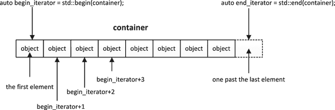
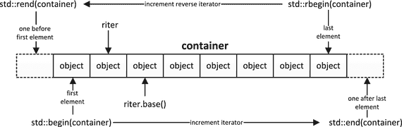
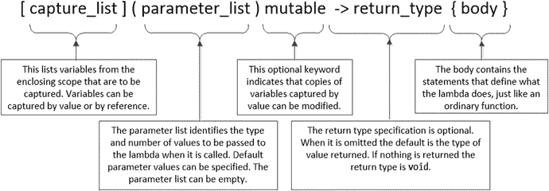

# 1.标准模板库简介

Electronic supplementary material The online version of this chapter (doi:[10.​1007/​978-1-4842-0004-9_​1](http://dx.doi.org/10.1007/978-1-4842-0004-9_1)) contains supplementary material, which is available to authorized users.

本章解释了标准模板库(STL)背后的基本思想。这是为了让您全面了解 STL 中各种类型的实体是如何联系在一起的。你会看到我在这本书的这一章中介绍的所有内容的更深入的例子和讨论。在本章中，您将了解以下内容:

*   STL 中有什么
*   如何定义和使用模板
*   什么是容器
*   什么是迭代器以及如何使用它
*   智能指针的重要性及其在容器中的使用
*   什么是算法，你如何应用它们
*   数字图书馆提供了什么
*   什么是函数对象
*   如何定义和使用 lambda 表达式

除了介绍 STL 背后的基本思想，本章还提供了一些你需要熟悉的 C++ 语言特性的简要提示，因为它们会在后面的章节中经常用到。如果您已经熟悉该主题，可以跳过这些部分。

## 基本思想

STL 是一套广泛而强大的工具，用于组织和处理数据。这些工具都是由模板定义的，因此数据可以是满足一些最低要求的任何类型。我假设您相当熟悉如何定义类模板和函数模板以及如何使用它们，但是我将在下一节提醒您这些的要点。STL 可以细分为四个概念库:

*   容器库定义了用于存储和管理数据的容器。该库的模板在以下头文件中定义:`array`、`vector`、`stack`、`queue`、`deque`、`list`、`forward_list`、`set`、`unordered_set`、`map`和`unordered_map`。
*   迭代器库定义了迭代器，迭代器是行为类似指针的对象，用于引用容器中的对象序列。该库在一个头文件`iterator`中定义。
*   算法库定义了广泛的算法，这些算法可以应用于存储在容器中的一组元素。该库的模板在`algorithm`头文件中定义。
*   Numerics 库定义了广泛的数字函数，包括容器中元素集的数字处理。该库还包括用于随机数生成的高级函数。该库的模板在标题`complex`、`cmath`、`valarray`、`numeric`、`random`、`ratio`和`cfenv`中定义。`cmath`头文件已经存在一段时间了，但它在 C++ 11 标准中得到了扩展，并被包含在这里，因为它包含了许多数学函数。

使用 STL，用非常少的几行代码就可以非常容易地完成许多复杂而困难的任务。例如，无需解释，下面的代码从标准输入流中读取任意数量的浮点值，并计算和输出平均值:

`std::vector<double> values;`

`std::cout << "Enter values separated by one or more spaces. Enter Ctrl+Z to end:\n ";`

`values.insert(std::begin(values), std::istream_iterator<double>(std::cin),`

`std::istream_iterator<double>());`

`std::cout << "The average is "`

`<< (std::accumulate(std::begin(values), std::end(values), 0.0)/values.size())`

`<< std::endl;`

它只需要四个语句！诚然，行很长，但不需要循环；这都是由 STL 负责的。可以很容易地修改这段代码，对文件中的数据做同样的工作。由于 STL 的强大功能和广泛的适用性，它是任何 C++ 程序员的必备工具箱。所有的 STL 名称都在`std`名称空间中，所以我不会总是在文本中用`std`明确限定 STL 名称。当然，在任何代码中，我都会在必要的地方限定名字。

## 模板

模板是一组函数或类的参数化规范。当您在代码中使用函数模板或类模板类型时，编译器可以在必要时使用模板来生成特定的函数或类定义。还可以为参数化类型别名定义模板。因此，模板不是可执行代码——它是创建代码的蓝图或方法。编译器会忽略程序中从未使用过的模板，因此不会产生任何代码。不使用的模板可能包含编程错误，包含它的程序仍将编译和执行；模板中的错误将不会被识别，直到该模板被用来创建随后被编译的代码。

从模板生成的函数或类定义是模板的实例或实例化。模板参数值通常是数据类型，因此可以为类型为`int,`的参数值生成一个函数或类定义，并为类型为`string`的参数值生成另一个定义。参数变量不一定是类型；参数规范可以是需要整数参数的整数类型。下面是一个非常简单的函数模板示例:

`template <typename T> T& larger(T& a, T& b)`

`{`

`return a > b ? a : b;`

`}`

这是返回两个参数中较大值的函数的模板。使用模板的唯一限制是参数的类型必须允许执行`>`比较。类型参数`T`决定了要创建的模板的具体实例。编译器可以从您使用`larger()`时提供的参数中推断出这一点，尽管您可以显式地提供它。例如:

`std::string first {"To be or not to be"};`

`std::string second {"That is the question."};`

`std::cout << larger(first, second) << std::endl;`

该代码要求包含`string`头。编译器会将`T`的参数推断为类型`string`。如果你想指定它，你可以写`larger<std::string>(first, second)`。当函数参数的类型不同时，需要指定模板类型参数。例如，如果你写了`larger(2, 3.5),`，编译器不能推导出`T`，因为它是不明确的——它可能是类型`int`或类型`double`。这种用法将导致错误消息。编写`larger<double>(2, 3.5)`将解决问题。

下面是一个类模板的示例:

`template <typename T> class Array`

`{`

`private:`

`T* elements;                                   // Array of type T`

`size_t count;                                  // Number of array elements`

`public:`

`explicit Array(size_t arraySize);              // Constructor`

`Array(const Array& other);                     // Copy Constructor`

`Array(Array&& other);                          // Move Constructor`

`virtual ∼Array();                              // Destructor`

`T& operator;                   // Subscript operator`

`const T& operator const;       // Subscript operator-const arrays`

`Array& operator=(const Array& rhs);            // Assignment operator`

`Array& operator=(Array&& rhs);                 // Move assignment operator`

`size_t size() { return count; }                // Accessor for count`

`};`

`size_t`类型别名在`cstddef`头中定义，代表无符号整数类型。这段代码为类型为`T`的元素数组定义了一个简单的模板。模板定义中出现的`Array`是隐含的`Array<T>`，如果你愿意，你可以这样写。在模板体之外——在一个外部函数成员定义中，你必须写`Array<T>`。赋值操作符允许将一个`Array<T>`对象赋给另一个，这是普通数组做不到的。如果您想禁止这个功能，您仍然需要将`operator=()`函数声明为模板的成员。如果不这样做，编译器将在必要时为模板实例创建一个公共的默认赋值操作符。为了防止使用赋值运算符，您应该将其指定为 deleted——如下所示:

`Array& operator=(const Array& rhs)=delete;     // No assignment operator`

一般来说，如果你需要定义任何一个复制或移动构造函数，复制或移动赋值操作符，或者析构函数，你应该定义所有的五个类成员，或者指定那些你不想删除的。

Note

实现移动构造函数和移动赋值操作符的类被称为具有移动语义。

`size()`成员是在类模板中实现的，所以默认情况下它是`inline`,不需要外部定义。类模板的函数成员的外部定义本身就是放在头文件中的模板——通常是与类模板相同的头文件。即使函数成员不依赖于类型参数`T`，也是如此，所以如果`size()`没有在类模板中定义，它将需要一个模板定义。定义函数成员的模板的类型参数列表必须与类模板的类型参数列表相同。下面是构造函数的定义:

`template <typename T>                       // This is a function template with parameter T`

`Array<T>::Array(size_t arraySize) try : elements {new T[arraySize]}, count {arraySize}`

`{}`

`catch(const std::exception& e)`

`{`

`st::cerr << "Memory allocation failure in Array constructor." << std::endl;`

`rethrow e;`

`}`

元素的内存分配可能会抛出异常，因此构造函数是一个函数`try`块。这允许异常被捕获和响应，但是异常必须被重新抛出——如果你没有在`catch`块中`rethrow`异常，它无论如何都会被重新抛出。模板类型参数在构造函数名的限定中是必不可少的，因为它将函数模板定义与类模板联系起来。注意，您没有在成员名称的限定符中使用`typename`关键字；它只在模板参数列表中使用。

当然，您可以为类模板的函数成员指定一个外部模板作为`inline`——例如，下面是如何定义`Array`模板的复制构造函数:

`template <typename T>`

`inline Array<T>::Array(const Array& other)`

`try : elements {new T[other.count]}, count {other.count}`

`{`

`for (size_t i {}; i < count; ++i)`

`elements[i] = other.elements[i];`

`}`

`catch (std::bad_alloc&)`

`{`

`std::cerr << "memory allocation failed for Array object copy." << std:: endl;`

`}`

这假设赋值操作符适用于类型`T`。如果在使用模板之前没有看到它的代码，您可能不会意识到对赋值操作符的依赖。这表明，对于动态分配内存的类，总是定义赋值操作符以及我前面提到的其他成员是多么重要。

Note

在指定模板参数时，`class`和`typename`关键字是可以互换的，因此在定义模板时，您可以编写`template<typename T>`或`template<class T>`。因为`T`不一定是一个类类型，我更喜欢使用`typename`，因为我觉得这更能表达模板类型参数可以是基本类型也可以是类类型的可能性。

编译器实例化一个类模板，作为具有由该模板产生的类型的对象的定义的结果。这里有一个例子:

`Array<int> data {40};`

除非有默认实参，否则每个类模板类型形参的实参总是必需的。当这个语句被编译时，会发生三件事:创建了对`Array<int>`类的定义，以便识别类型；生成了构造函数定义，因为必须调用它来创建对象；创建了析构函数，因为需要它来销毁对象。这就是编译器创建和销毁`data`对象所需要的全部内容，因此这是它此时从模板生成的唯一代码。类定义是通过用`int`代替模板定义中的`T`生成的，但是有一个微妙之处。编译器只编译程序使用的成员函数，所以你不一定要得到整个类，这个类是通过简单地替换模板参数得到的。基于对`data`对象的定义，该类将被定义为:

`class Array<int>`

`{`

`private:`

`int* elements;`

`size_t count;`

`public:`

`explicit Array(size_t arraySize);`

`virtual ∼Array();`

`};`

您可以看到，仅有的函数成员是构造函数和析构函数。编译器不会创建创建对象不需要的任何东西的实例，也不会包含程序中不需要的模板部分。

您可以为类型别名定义模板。当您使用 STL 时，这很有用。以下是类型别名的模板示例:

`template<typename T> using ptr = std::shared_ptr<T>;`

该模板将`ptr<T>`定义为智能指针模板类型`std::shared_ptr<T>`的别名。有了这个模板，你可以在你的代码中使用`ptr<std::string>`而不是`std::shared_ptr<std::string>`。它显然不那么冗长，更容易阅读。下面的`using`指令将进一步简化它:

`using std::string;`

现在你可以在你的代码中使用`ptr<string>`来代替`std::shared_ptr<std::string>`。类型别名模板可以使您的代码更容易理解和键入。

## 集装箱

容器是 STL 功能的基石，因为 STL 的大部分内容都与它们相关。容器是以特定方式存储和组织其他对象的对象。当你使用容器时，你不可避免地会使用迭代器来访问数据，所以你也需要很好地理解这些。STL 提供了几类容器:

*   序列容器以线性组织形式存储对象，类似于数组，但不一定存储在连续的内存中。您可以通过调用函数成员或迭代器来访问序列中的对象；在某些情况下，您还可以对索引使用下标运算符。
*   关联容器将对象与关联的键存储在一起。通过提供对象的关联键，可以从关联容器中检索对象。还可以使用迭代器检索关联容器中的对象。
*   容器适配器是适配器类模板，为访问存储在底层序列容器或关联容器中的数据提供了替代机制。

重要的是要认识到，除非对象是具有移动语义的类型的右值(临时对象),否则所有的 STL 容器都存储您在其中存储的对象的副本。STL 还要求 move 构造函数和赋值操作符必须被指定为`noexcept`，这表明它们不会抛出异常。如果将没有移动语义的类型的对象添加到容器中并修改原始对象，则原始对象和容器中的对象将会不同。但是，当您检索一个对象时，您会在容器中获得对该对象的引用，因此您可以修改存储的对象。存储的副本是使用对象类型的复制构造函数创建的。对于某些对象来说，复制可能是一个开销很大的过程。在这种情况下，最好是将指向对象的指针存储在容器中，或者假设已经为该类型实现了移动语义，则将对象移动到容器中。

Caution

不要将派生类对象存储在存储基类类型元素的容器中。这将导致派生类对象的切片。如果您想要访问容器中的派生类对象以获得多态行为，请将指向对象的指针存储在存储基类指针的容器中——或者更好的是存储指向基类型的智能指针。

容器将它们持有的对象存储在堆上，并自动管理它们占用的空间。存储类型为`T`的对象的容器中的空间分配由分配器管理，分配器的类型由模板参数指定。默认的类型参数是`std::allocator<T>`，这种类型的对象是一个分配器，为`T`类型的对象分配堆内存。这为您提供了提供自己的分配器的可能性。出于性能原因，您可能希望这样做，但是这很少是必要的，并且大多数时候默认分配器是好的。定义分配器是一个高级主题，我不会在本书中进一步讨论它。因此，当模板类型的最后一个模板参数表示分配器时，我将省略它。`std::vector<typename T, typename Allocator>`模板有一个指定为`std::allocator<T>`的`Allocator`默认值，所以我把它写成`std::vector<typename T>`。这个解释只是为了让你知道提供一个分配器的选项在那里。

如果要将`T`对象存储在容器中，类型`T`必须满足某些要求，而这些要求最终取决于您需要对元素执行的操作。容器通常需要复制元素，并且可能需要移动和交换元素。在这种情况下，`T`类型的对象存储在容器中的最低要求如下:

`class T`

`{`

`public:`

`T();                                          // default constructor`

`T(const T& t);                                // Copy constructor`

`∼T();                                         // Destructor`

`T& operator=(const T& t);                     // Assignment operator`

`};`

考虑到编译器在许多情况下为上述所有成员提供了默认实现，大多数类类型应该满足这些要求。请注意，`operator<()`没有包含在`T,`的定义中，但是没有定义`operator<()`的类型的对象将不能用作任何关联容器(如`map`和`set`)中的键，并且排序算法(如`sort()`和`merge()`)不能应用于元素不支持小于运算的序列。

Note

如果您的对象类型不符合您正在使用的容器的要求，或者您以其他方式误用了容器模板，您将经常得到与标准库头文件中的代码相关的编译器错误消息。当这种情况发生时，不要急于在标准库中报告错误。在使用 STL 的代码中寻找错误！

## 迭代程序

迭代器是一种类模板类型的对象，其行为类似指针。只要迭代器`iter`指向一个有效的对象，你就可以通过写`*iter`来解引用它以获得对该对象的引用。如果`iter`指向一个类对象，你可以通过写`iter->member`来访问该对象的成员`member`。因此，你可以像使用指针一样使用迭代器。

当您以某种方式处理容器中的元素时，尤其是在应用 STL 算法时，您可以使用迭代器来访问它们。因此迭代器将算法连接到容器中的元素，而不管容器的类型。迭代器将算法从数据源中分离出来；算法不知道数据来自哪个容器。迭代器是在`iterator`头中定义的模板类型的实例，但是这个头包含在所有定义容器的头中。

通常使用一对迭代器来定义一系列元素；元素可以是容器中的对象、标准数组中的元素、`string`对象中的字符，或者支持迭代器的任何其他类型对象中的元素。范围是由指向范围中第一个元素的开始迭代器和指向最后一个元素之后的元素的结束迭代器指定的元素序列。即使序列是容器中元素的子集，第二个迭代器仍然指向序列中最后一个元素之后的元素，而不是范围中的最后一个元素。代表容器中所有元素的范围的结束迭代器不会指向任何东西，因此不能被解引用。迭代器提供了一种标准的机制来识别 STL 和其他地方的元素。元素范围的规范与元素的来源无关，因此给定的算法可以应用于来自任何来源的元素范围，只要迭代器满足算法的要求。稍后我会详细介绍不同类型迭代器的特点。

一旦理解了迭代器的工作原理，就很容易定义自己的模板函数来处理迭代器指定为参数的数据序列。然后，函数模板的实例可以应用于来自任何源的数据，这些源可以定义为一个范围；代码处理数组中的数据就像处理向量容器中的数据一样。在本书的后面，您将会看到这方面的实例。

### 获取迭代器

通过调用容器对象的`begin()`和`end()`函数成员，可以从容器中获得迭代器；这些返回的迭代器分别指向第一个元素和最后一个元素。容器的`end()`成员返回的迭代器没有指向一个有效的元素，所以你不能取消引用它或者增加它。string 类如`std::string`也有这些函数成员，所以你也可以获得它们的迭代器。通过以容器对象为参数调用全局函数`std::begin()`和`std::end()`，可以获得与容器的`begin()`和`end()`函数成员返回的迭代器相同的迭代器；这些由`iterator`标题中的模板定义。全局`begin()`和`end()`函数使用普通数组或`string`对象作为参数，因此提供了一种统一的获取迭代器的方式。

迭代器允许你通过递增 begin 迭代器来遍历一个范围内的元素，从一个对象移动到下一个对象，如图 [1-1](#Fig1) 所示；图中的“容器”意味着一个`string`对象或数组，以及一个 STL 容器。通过比较递增的`begin`迭代器和`end`迭代器，可以确定何时到达最后一个元素。您还可以对迭代器应用其他操作，但这取决于迭代器的类型，而迭代器的类型又取决于您正在使用的容器的种类。有全局的`cbegin()`和`cend()`函数返回数组、容器或`string`对象的`const`迭代器。记住——`const`迭代器指向的是常量，你仍然可以修改迭代器本身。在本节的后面，我将介绍返回其他类型迭代器的其他全局函数。

图 1-1。

Operation of iterators

### 迭代器类别

所有迭代器类型都必须有一个复制构造函数、一个复制赋值操作符和一个析构函数。迭代器指向的对象必须是可交换的；我将在下一章进一步解释这意味着什么。有五类迭代器反映了不同级别的能力。不同的算法可能需要不同级别的迭代器能力来识别它们要操作的元素范围。类别不是新的迭代器模板类型；迭代器类型支持的类别由`iterator`模板的类型参数的实参值标识。我将在这一节的稍后部分对此进行更多的解释。

容器中迭代器的类别取决于容器的类型。类别使算法能够确定传递给它的迭代器的能力。算法可以以两种方式使用迭代器参数的类别:首先，它可以确定操作的最低功能要求得到满足；第二，如果超过迭代器的最低要求，算法可以使用扩展能力来更有效地执行操作。当然，算法只能应用于为迭代器提供所需功能级别的容器中的元素。

迭代器类别如下，从最简单到最复杂排序:

Input iterators have read access to objects. If `iter` is an input iterator, it must support the expression `*iter` to produce a reference to the value to which `iter` points. Input iterators are single use only, which means that once an iterator has been incremented, to access the previous element that it pointed to you need a new iterator. Each time you want to read a sequence, you must create a new iterator. The operations that you can apply to input iterators are: `++iter` or `iter++`; `iter1==iter2` and `iter1!=iter2`; and `*iter` Note the absence of the decrement operator. You can use the expression `iter->member` for input iterators.   Output iterators have write access to objects. If `iter` is an output iterator, it allows a new value to be assigned so `*iter=new_value` is supported. Output iterators are single use only. Each time you want to write a sequence, you must create a new iterator. The operations that you can apply to output iterators are: `++iter` or `iter++`; and `*iter` Note the absence of the decrement operator. You only get write access with output iterators. You cannot use the expression `iter->member` for output iterators.   Forward iterators combine the capabilities of input and output iterators and add the capability to be used more than once. Therefore you can reuse a forward iterator to read or write an element as many times as necessary. The operation to be performed determines when forward iterators are required. The `replace()` algorithm that searches a range and replaces elements requires the capability of a forward iterator, for example, because the iterator that points to an element that is to be replaced is reused to overwrite it.   Bidirectional iterators provide the same capabilities as forward iterators but allow traversal through a sequence backward as well as forward. Therefore in addition to incrementing these iterators to move to the next element, you can apply the prefix and postfix decrement operators, `--iter` and `iter--`, to move to the previous element.   Random access iterators provide the same capabilities as bidirectional iterators but also allow elements to be accessed at random. In addition to the operations permitted for bidirectional iterators, these support the following operations:

*   递增和递减一个整数:`iter+n`或`iter-n`和`iter+=n`或`iter-=n`
*   按整数索引:`iter[n]`，相当于`*(iter+n)`
*   两个迭代器的区别:`iter1-iter2`，产生一个整数指定元素个数。
*   比较迭代器:`iter1<iter2`、`iter1>iter2`、`iter1<=iter2`和`iter1>=iter2`。对一系列元素进行排序需要随机访问迭代器指定范围。可以在随机访问迭代器中使用下标操作符。给定一个迭代器`first`，表达式`first[3]`等价于`*(first+3)`，所以它访问第四个元素。一般来说，在带有迭代器的表达式`iter[n]`中，`iter`，`n`是一个偏移量，表达式返回从`iter`到偏移量`n`的元素的引用。请注意，没有检查应用于迭代器的下标操作符所使用的索引。没有什么可以阻止合法范围之外的索引值的使用。

每个迭代器类别由一个名为迭代器标签类的空类标识，该类用作`iterator`模板的类型参数。迭代器标签类的唯一目的是指定一个特定的迭代器类型可以做什么，因此它们被用作一个`iterator`模板类型参数。标准迭代器标记类有:

`input_iterator_tag`

`output_iterator_tag`

`forward_iterator_tag`源自`input_iterator_tag`

`bidirectional_iterator_tag`源自`forward_iterator_tag`

`random_access_iterator_tag`源自`bidirectional_iterator_tag`

这些类的继承结构反映了迭代器类别的累积性质。当创建一个`iterator`模板实例时，第一个模板类型参数将是迭代器标签类之一，它将决定迭代器的能力。在第二章中，我将解释如何定义你自己的迭代器以及如何定义它们的类别。

如果一个算法需要一个给定类别的迭代器，那么你就不能使用一个下级迭代器；然而，你总是可以使用一个高级迭代器。正向、双向和随机访问迭代器也可以是常量或可变的，这取决于对迭代器的解引用是产生一个引用还是一个`const`引用。显然你不能使用赋值左边的`const`迭代器的解引用结果。

容器中迭代器的特征取决于容器的类型。比如`vector`和`deque`容器提供随机访问迭代器；这反映了这些容器中的元素可以被随机访问的事实。另一方面，`list`和`map`容器总是提供双向迭代器；这些容器不支持对元素的随机访问。输入输出迭代器和前向迭代器类型通常用于为算法指定参数，以反映算法所需的最低能力水平。在本书的后面，我将在将算法应用于容器内容的上下文中，用工作示例进一步解释迭代器——在实际环境中，它们更容易理解。同时，这里有一个简单的例子来展示迭代器在数组中的作用:

`// Ex1_01.cpp`

`// Using iterators`

`#include <numeric>                          // For accumulate() - sums a range of elements`

`#include <iostream>                         // For standard streams`

`#include <iterator>                         // For iterators and begin() and end()`

`int main()`

`{`

`double data[] {2.5, 4.5, 6.5, 5.5, 8.5};`

`std::cout << "The array contains:\n";`

`for (auto iter = std::begin(data); iter != std::end(data); ++iter)`

`std::cout << *iter << " ";`

`auto total = std::accumulate(std::begin(data), std::end(data), 0.0);`

`std::cout << "\nThe sum of the array elements is " << total << std::endl;`

`}`

您可以看到，全局`begin()`和`end()`函数返回作为函数参数的数组元素的迭代器。迭代器用在列出元素值的`for`循环中。表达式`*iter`解引用迭代器通过引用访问值。当然，你可以在`for`循环体中增加`iter`，就像这样:

`for (auto iter = std::begin(data); iter != std::end(data);)`

`std::cout << *iter++ << " ";`

包含`iterator`头的指令可以省略，因为`iterator`包含在容器的任何头中，并且包含定义`accumulate()`函数模板的`numeric`头。`accumulate()`函数返回由前两个参数定义的范围内的元素之和，这两个参数必须是指定范围内第一个元素和最后一个元素的迭代器。第三个参数是用于求和的初始值。`accumulate()`函数适用于支持加法的任何类型的元素，因此它也适用于定义`operator+()`的任何类类型的对象。

Note

当我们开始对容器使用`accumulate()`时，你会看到，还有另一个版本的函数模板，它允许你指定一个不同的二进制操作来代替默认的`+`。

### 流迭代器

使用流迭代器在流和源或目的地之间以文本模式传输数据，可以通过迭代器访问源或目的地。因为 STL 算法接收的输入是由一对迭代器指定的范围，所以您可以将算法应用于通过输入流迭代器可访问的任何来源的可用对象。例如，这意味着算法可以应用于流中的对象，也可以应用于容器中的对象。算法也可以应用于任何其他可以提供可接受的迭代器的环境中；稍后我会解释迭代器是如何被接受的。同样，您可以通过使用输出流迭代器将一系列元素转移到输出流。标准迭代器将`iterator`模板类型作为基类。

创建一个流迭代器对象，它处理流对象中指定类型的数据；数据类型是迭代器模板类型参数，流对象是构造函数参数。一个`istream_iterator<T>`是一个输入迭代器，它可以从一个`istream`中读取类型为`T`的对象，它可以是一个文件流或者标准的输入流 c `i` n。对象是使用`>>`操作符读取的，所以要读取的对象类型必须支持它。`istream_iterator<T>`的无参数构造函数创建了一个结束迭代器对象，当到达一个流的末尾时，这个对象将被匹配。显然，当您想要传输混合类型的数据时，流迭代器不是合适的方法。默认情况下，`istream_iterator`对象忽略空白；您可以通过对底层输入流应用`std::noskipws`操纵器来覆盖它。一个`istream_iterator`只能用一次。如果您想再次从流中输入对象，您必须创建一个新的`istream_iterator`对象。

一个`ostream_iterator`补充了`istream_iterator`，因为它是一个输出迭代器，为对象向一个`ostream`提供一次性输出能力。使用`<<`操作符编写对象。当您创建一个`ostream_iterator`对象时，您可以选择指定一个分隔符字符串，它将被写入每个对象的输出之后。

下面是一个使用输入流迭代器的工作示例:

`// Ex1_02.cpp`

`// Using stream iterators`

`#include <numeric>                          // For accumulate() - sums a range of elements`

`#include <iostream>                         // For standard streams`

`#include <iterator>                         // For istream_iterator`

`int main()`

`{`

`std::cout << "Enter numeric values separated by spaces and enter Ctrl+Z to end:" << std::endl;`

`std::cout << "\nThe sum of the values you entered is "`

`<< std::accumulate(std::istream_iterator<double>(std::cin),`

`std::istream_iterator<double>(), 0.0)`

`<< std::endl;`

`}`

这将把`accumulate()`函数应用于由输入流迭代器为`cin`提供的一系列值。可以输入任意数量的值。第二个参数是流尾迭代器，当 read 设置流尾条件时，它将与第一个参数指定的迭代器匹配(对于文件流，称为`EOF`)；从键盘输入`Ctrl-Z`会导致这种情况。

### 迭代器适配器

迭代器适配器是为标准迭代器提供专门行为的类模板，因此它们是从`iterator`模板中派生出来的。适配器类模板定义了三种迭代器，反向迭代器、插入迭代器和移动迭代器。这些由以下模板类类型定义:`reverse_iterator`、`insert_iterator`和`move_iterator`。

#### 反向迭代器

反向迭代器的工作方式与标准迭代器相反。您可以创建双向或随机访问迭代器的反向迭代器版本。容器的`rbegin()`和`rend()`函数成员分别返回指向最后一个元素和第一个元素前的反向迭代器；同名的全局函数做同样的事情，如图 [1-2](#Fig2) 所示。

图 1-2。

Operations with reverse iterators

递增或递减反向迭代器在元素顺序方面与标准迭代器的工作方式相反，因此递增反向 begin 迭代器会导致它指向前面的元素——左边的那个——而递减它会指向下一个元素——右边的那个。图 [1-3](#Fig3) 显示了与标准迭代器相比，反向迭代器的增量方向。反向迭代器类型的模板是从常规迭代器的模板中派生出来的，它重载操作函数来实现反向操作。在`string`头中定义的字符串类也使反向迭代器可用，因此您可以调用`string`对象的`rbegin()`成员来获得指向最后一个字符的反向迭代器，调用字符串对象的`rend()`将返回指向第一个字符之前的反向迭代器。全局(和成员)`crbegin()`和`crend()`函数返回`const`反向迭代器。

图 1-3。

How iterators and reverse iterators relate to a container

你可以在反向随机访问迭代器中使用下标操作符，就像标准的随机访问迭代器一样，这在相反的意义上也是有效的。对于标准迭代器`iter`，表达式`iter[n]`导致`n`元素位于`iter`指向的元素之后，因此它相当于`*(iter+n)`。对于反向迭代器`riter`，表达式`riter[n]`等价于`*(riter+n),`，因此它返回位于`riter`所指向的元素之前`n`位置的元素。

图 [1-3](#Fig3) 显示了容器的反向迭代器和标准迭代器的关系。可以看到容器元素的反向迭代器相对于普通迭代器向左移动了一个位置。每个反向迭代器内部都包含一个标准迭代器，这个迭代器的位置是相似的，所以它不会指向同一个元素。一个`reverse_iterator`对象有一个返回底层迭代器的`base()`函数成员，因为它是一个标准迭代器，所以它的工作方式与反向迭代器相反。反向迭代器的基本迭代器`riter`指向范围末尾的下一个元素，如图 [1-3](#Fig3) 所示。容器的一些函数成员不接受反向迭代器。当你需要应用一个算法时，在这种情况下，已经使用反向迭代器找到了位置，你可以调用`base()`来获得反向迭代器对应的标准迭代器。显然，你需要考虑这样一个事实，基本迭代器将指向反向迭代器所标识的元素之后的元素。在下一章你会学到更多。

#### 插入迭代器

虽然插入迭代器是基于标准迭代器的，但是它们的功能有很大的不同。普通迭代器只能访问或更改一个范围内的现有元素。插入迭代器用于在容器中的任何地方添加新元素。插入迭代器不能应用于标准数组或`array<T,N>`容器，因为这些容器中的元素数量是固定的。有三种插入迭代器:

*   A `back_insert_iterator`通过调用`push_back()`函数成员在容器末尾添加新元素；`vector`、`list`和`deque`容器都有一个`push_back()`成员。如果容器没有定义`push_back()`，那么`back_insert_iterator`就不能使用。全局`back_inserter()`函数为作为参数传递的容器返回一个`back_insert_iterator`对象。
*   一个`front_insert_iterator`通过调用它的`push_front()`成员在容器的开头添加新元素；`list`、`forward_list`和`deque`容器有一个`push_front()`成员。不能对没有`push_front()`成员的容器使用`front_insert_iterator`。全局`front_inserter()`函数为容器返回一个作为参数传递的`front_inserter_iterator`对象；显然，容器必须是一个`list`、`forward_list`或`deque`容器。
*   您可以使用一个`insert_iterator`在任何具有`insert()`成员的容器的现有范围内插入新元素。在`string`头中定义的字符串类有一个`insert()`成员，所以一个`insert_iterator`对象处理这些成员。全局`inserter()`函数返回一个容器的`insert_iterator`对象，该容器被指定为第一个参数；第二个参数是一个迭代器，它指向容器中要插入元素的位置。

插入迭代器通常用作从指定范围复制元素的算法或生成新元素的算法的参数。你将在下一章看到它们的应用。

#### 移动迭代器

移动迭代器是从指向一个范围内的元素的常规迭代器创建的。您可以使用移动迭代器将一系列类对象移动到目标范围，而不是复制它们。用作输入迭代器的移动迭代器将它指向的对象转换为右值，这允许对象被移动而不是复制。因此，移动迭代器会使源范围中的原始元素处于未定义的状态，所以你不能使用它们。你可以通过传递一个普通的迭代器来获得一个`move_iterator`，例如由`begin()`和`end(),`返回给由`iterator`头中的模板定义的`make_move_iterator()`函数。因此，通过将容器的`begin()`和`end()`返回的迭代器传递给`make_move_iterator()`函数，您可以创建一对迭代器来定义要移动的元素范围。在本书的后面，您将看到展示如何使用移动迭代器的例子。

## 迭代器的运算

迭代器头定义了四个实现迭代器操作的函数模板:

*   将您作为第一个参数提供的迭代器递增第二个参数指定的元素数。第一个参数可以是任何具有输入迭代器功能的迭代器。如果迭代器是双向或随机访问迭代器，第二个参数可以为负，以递减迭代器。没有返回值。比如:`int data[] {1, 2, 3, 4, 5, 6};` `auto iter = std::begin(data);` `std::advance(iter, 3);` `std::cout << "Fourth element is " << *iter << std::endl;`
*   `distance()`返回由两个迭代器参数指定的范围内的元素个数。例如:`int data[] {1, 2, 3, 4, 5, 6};` `std::cout << "The number of elements in data is "` `<< std::distance(std::begin(data), std::end(data)) << std::endl;`
*   `next()`返回迭代器，该迭代器是将作为第一个参数提供的迭代器递增第二个参数指定的元素数而得到的。第一个参数必须具有正向迭代器功能。第二个参数的默认值为 1。比如:`int data[] {1, 2, 3, 4, 5, 6};` `auto iter = std::begin(data);` `auto fourth = std::next(iter, 3);` `std::cout << "1st element is " << *iter << " and the 4th is " << *fourth << std::endl;`
*   `prev()`返回一个迭代器，该迭代器是将作为第一个参数提供的迭代器减去作为第二个参数指定的元素数而得到的，默认值为 1。第一个参数必须具有双向迭代器功能。例如:`int data[] {1, 2, 3, 4, 5, 6};` `auto iter = std::end(data);` `std::cout << "Fourth element is " << *std::prev(iter, 3) <<  std::endl;`

显然，使用随机访问迭代器，您可以获得这些函数使用算术运算产生的结果，但是使用能力较弱类别的迭代器，您不能。这些函数可以简化除随机访问迭代器之外的操作代码。例如，为了在能力较弱的迭代器上产生与`advance()`相同的效果，您需要编写一个循环。

## 智能指针

作为 C++ 语言一部分的指针被称为原始指针，因为这些类型的变量只包含一个地址；原始指针可以包含自动变量、静态变量或在堆上创建的变量的地址。智能指针是一种模板类型的对象，它模仿原始指针，因为它包含一个地址，在某些方面，您可以以相同的方式使用它，但有两个主要区别:

*   智能指针仅用于存储在空闲存储(堆)中分配的内存地址。
*   您不能像处理原始指针那样对智能指针执行算术运算，如递增或递减。

对于在免费商店中创建的对象，使用智能指针通常比原始指针好得多。智能指针的巨大优势在于，您不必担心使用`delete`来释放堆内存，因为为智能指针所指向的对象分配的内存会在不再需要该对象时自动释放。这意味着您消除了内存泄漏的可能性。

您可以将智能指针存储在容器中，这在处理类类型的对象时特别有用。存储指针而不是对象允许您保留多态行为–如果您使用基类类型作为智能指针的模板类型参数，您可以使用它来指向派生类类型的对象。智能指针类型的模板在`memory`头中定义，因此您必须将它包含到源文件中才能使用它们。在`std`名称空间中，有三种类型的智能指针由以下模板定义:

*   一个`unique_ptr<T>`对象表现为一个指向类型`T`的指针，并且是唯一的，这意味着不能有一个以上的`unique_ptr<T>`对象包含相同的地址。一个`unique_ptr<T>`对象独占它所指向的对象。您不能分配或复制`unique_ptr<T>`对象。您可以使用`utility`标题中定义的`std::move()`函数将一个`unique_ptr<T>`对象存储的地址移动到另一个对象。操作后，原始对象将无效。当您需要强制一个对象的单一所有权时，可以使用`unique_ptr<T>`。
*   一个`shared_ptr<T>`对象表现为一个指向类型`T`的指针，与`unique_ptr<T>`相反，可以有任意数量的`shared_ptr<T>`对象包含相同的地址。因此`shared_ptr<T>`对象允许共享免费存储中的对象的所有权。记录包含给定地址的`shared_ptr<T>`对象的数量。每当创建包含给定堆地址的新的`shared_ptr<T>`对象时，包含该地址的`shared_ptr<T>`的引用计数就增加；当包含地址的`shared_ptr<T>`对象被销毁或被指定指向不同的地址时，引用计数递减。当没有包含给定地址的`shared_ptr<T>`对象时，引用计数将为零，该地址对象的堆内存将自动释放。所有指向同一个地址的`shared_ptr<T>`对象都可以访问这个地址的数量。
*   一个`weak_ptr<T>`链接到一个`shared_ptr` <t>对象并从其创建，并且包含相同的地址。创建一个</t> `weak_ptr<T>`不会增加被链接的`shared_ptr<T>`对象的引用计数，所以它不会阻止被指向的对象被销毁。当最后一个`shared_ptr<T>`引用被销毁或被重新分配指向一个不同的地址时，它的内存将被释放，即使关联的`weak_ptr<T>`对象可能仍然存在。

拥有`weak_ptr<T>`对象的主要原因是有可能无意中用`shared_ptr<T>`对象创建引用循环。从概念上讲，一个参考周期是一个`shared_ptr<T>`对象`pA`指向另一个`shared_ptr<T>`对象`pB`，而`pB`指向`pA`。在这种情况下，两者都不能被摧毁。实际上，这是以一种复杂得多的方式发生的。`weak_ptr<T>`对象旨在避免参考周期的问题。通过使用`weak_ptr<T>`对象指向单个`shared_ptr<T>`对象所指向的对象，可以避免引用循环；稍后我会解释。当最后一个`shared_ptr<T>`对象被销毁时，所指向的对象也被销毁。任何与`shared_ptr<T>`相关联的`weak_ptr<T>`对象将不会指向有效对象。

### 使用 unique_ptr <t>指针</t>

一个`unique_ptr<T>`对象唯一地存储一个地址，因此它所指向的对象被`unique_ptr<T>`对象独占。当`unique_ptr<T>`对象被销毁时，它所指向的对象也被销毁。这种类型的智能指针适用于不需要多个智能指针并且希望确保单点所有权的情况。当一个对象为一个`unique_ptr<T>`所拥有时，您可以通过使一个原始指针可用来提供对该对象的访问。下面是如何使用构造函数创建一个`unique_ptr<T>`:

`std::unique_ptr<std::string> pname {new std::string {"Algernon"}};`

在堆上创建的`string`对象被传递给`unique_ptr<string>`构造函数。默认构造函数将创建一个 unique_ptr <t>，用</t> `nullptr`作为内部原始指针。

创建`unique_ptr<T>`对象的一个更好的方法是使用在`memory`头中定义的`make_unique<T>()`函数模板:

`auto pname = std::make_unique<std::string>("Algernon");`

该函数通过将参数传递给类构造函数在堆上创建`string`对象，并创建和返回指向它的唯一指针。根据`T`构造函数的要求，你可以向`make_unique<T>()`函数提供任意多的参数。这里有一个例子:

`auto pstr = std::make_unique<std::string>(6, '*');`

有两个参数将被传递给`string`构造函数，因此创建的对象包含`"******"`。

您可以取消引用指针来访问对象，就像原始指针一样:

`std::cout << *pname << std::endl;      // Outputs Algernon`

您可以创建一个指向数组的`unique_ptr<T>`。例如:

`size_t len{10};`

`std::unique_ptr<int[]> pnumbers {new int[len]};th`

这创建了一个指向在自由存储中创建的`len`元素数组的`unique_ptr`对象。您可以通过调用`make_unique<T>()`获得相同的结果:

`auto pnumbers = std::make_unique<int[]>(len);`

这也创建了一个指向在堆上创建的`len`元素数组的指针。您可以使用带有`unique_ptr`变量的索引来访问数组元素。以下是更改这些值的方法:

`for(size_t i{} ; i < len ; ++i)`

`pnumbers[i] = i*i;`

这会将数组元素的值设置为其索引位置的平方。当然，您可以使用下标操作符来输出值:

`for(size_t i{} ; i < len ; ++i)`

`std::cout << pnumbers[i] << std::endl;`

不能通过值将`unique_ptr<T>`对象传递给函数，因为它不能被复制。您必须在函数中使用引用参数，以允许将`unique_ptr<T>`对象作为参数。你可以从一个函数中返回一个`unique_ptr<T>`，因为它不会被复制，但是会被一个隐式的移动操作返回。

您只能通过将`unique_ptr<T>`对象移动到容器中或就地创建来将它们存储在容器中，因为`unique_ptr<T>`对象不能被复制。永远不会有两个包含相同地址的`unique_ptr<T>`对象。`shared_ptr<T>`对象没有这个特性，所以每当你需要多个指针指向一个对象，或者需要复制存储智能指针的容器的内容时，你就使用这些；否则使用`unique_ptr<T>`物体。对于具有`unique_ptr<T>`元素的容器，您可能需要使指向一个对象的原始指针可用。下面是如何从一个`unique_ptr<T>`中获得一个原始指针:

`auto unique_p = std::make_unique<std::string>(6, '*');`

`std::string pstr {unique_p.get()};`

`get()`函数成员返回`unique_ptr<T>`包含的原始指针。这样做的典型情况是，当指向对象的智能指针封装在类对象中时，提供对该对象的访问。你不能归还`unique_ptr<T>`,因为它不能被复制。

#### 重置 unique_ptr <t>对象</t>

当智能指针被销毁时，`unique_ptr<T>`对象所指向的对象也被销毁。为没有参数的`unique_ptr<T>`对象调用`reset()`会销毁所指向的对象，并用`nullptr`替换`unique_ptr<T>`对象中的原始指针；这使您能够随时销毁所指向的对象。例如:

`auto pname = std::make_unique<std::string>("Algernon");`

`...`

`pname.reset();                                   // Release memory for string object`

您可以将空闲存储中一个新的`T`对象的地址传递给`reset(),`，之前被指向的对象将被销毁，其地址将被新对象的地址替换:

`pname.reset(new std::string{"Fred"});`

这将释放由`pname`指向的原始字符串的内存，在空闲存储中创建一个新的`string`对象`"Fred"`，并将其地址存储在`pname`中。

Caution

您不能将一个空闲存储对象的地址传递给另一个`unique_ptr<T>`对象包含的`reset()`，或者使用已经包含在另一个`unique_ptr<T>`中的地址创建一个新的`unique_ptr<T>`。这样的代码可能会编译，但是你的程序肯定会崩溃。第一个`unique_ptr<T>`的销毁将释放它所指向的对象的内存。第二个的销毁将导致尝试释放已经释放的内存。

你可以通过调用智能指针的`release()`来释放一个`unique_ptr<T>`所指向的对象。这将包含在`unique_ptr<T>`中的原始指针设置为`nullptr`，而不释放原始对象的内存。例如:

`auto up_name = std::make_unique<std::string>("Algernon");`

`std::unique_ptr<std::string> up_new_name{up_name.release()};`

`up_name`的`release()`成员返回包含`"Algernon"`的字符串对象的原始指针，因此在执行第二条语句后，`up_name`将包含`nullptr`，而`up_new_name`将指向原始的`"Algernon" string`对象。其效果是将自由存储中对象的所有权从一个唯一指针转移到另一个唯一指针。

您可以交换两个`unique_ptr<T>`指针所拥有的对象:

`auto pn1 = std::make_unique<std::string>("Jack");`

`auto pn2 = std::make_unique<std::string>("Jill");`

`pn1.swap(pn2);`

执行完这里的第二条语句后，`pn1`将指向字符串`"Jill"`，`pn2`将指向`"Jack."`

#### 比较和检查 unique_ptr <t>对象</t>

有一些非成员函数模板定义了一整套比较操作符，用来比较两个`unique_ptr<T>`对象或者比较一个`unique_ptr<T>`对象和`nullptr`。比较两个`unique_ptr<T>`对象比较它们的`get()`成员返回的地址。将`unique_ptr<T>`与`nullptr`进行比较，将智能指针的`get()`成员返回的地址与`nullptr`进行比较。

`unique_ptr<T>`对象可以隐式转换为类型`bool`。如果对象包含`nullptr`，转换的结果是`false`；否则结果就是`true`。这意味着您可以使用一个`if`语句来检查一个非空的`unique_ptr<T>`对象:

`auto up_name = std::make_unique<std::string>("Algernon");`

`std::unique_ptr<std::string> up_new{up_name.release()};`

`if(up_new)                                       // true if not nullptr`

`std::cout << "The name is " << *up_new << std::endl;`

`if(!up_name)                                     // true if nullptr`

`std::cout << "The unique pointer is nullptr" << std::endl;`

当您为唯一指针对象调用`reset()`或`release()`时，这种检查是可取的，因为您需要在取消引用之前确定`unique_ptr<T>`不是`nullptr`。

### 使用共享指针<t>指针</t>

您可以像这样定义一个`shared_ptr<T>`对象:

`std::shared_ptr<double> pdata {new double{999.0}};`

您还可以取消对共享指针的引用，以访问它所指向的内容或更改存储在以下地址的值:

`*pdata = 8888.0;`

`std::cout << *pdata << std::endl;      // Outputs 8888.0`

`*pdata = 8889.0;`

`std::cout << *pdata << std::endl;      // Outputs 8889.0`

`pdata`的定义包括为`double`变量分配一个堆内存，另一个分配与控制块的智能指针对象相关，用于记录智能指针的副本数量。分配堆内存在时间上相对昂贵。通过使用在`memory`头文件中定义的`make_shared<T>()`函数创建一个`shared_ptr<T>`类型的智能指针，可以使这个过程更加有效:

`auto pdata = std::make_shared<double>(999.0);  // Points to a double variable`

要在自由存储中创建的变量类型在尖括号之间指定。函数名后面括号中的参数用于初始化它创建的`double`变量。一般来说，`make_shared<T>()`函数可以有任意数量的参数，实际数量取决于被创建对象的类型。当您使用`make_shared<T>()`在自由存储中创建对象时，如果`T`构造函数需要的话，可以有两个或更多由逗号分隔的参数。`auto`关键字导致`pdata`的类型从`make_shared<T>()`返回的对象中自动推导出来，所以它将是`shared_ptr<double>`。但是不要忘记——当你指定一个类型为`auto`时，你不应该使用初始化列表，因为这个类型将被推断为`std::initializer_list`。

定义`shared_ptr<T>`时，可以用另一个初始化它:

`std::shared_ptr<double> pdata2 {pdata};`

`pdata2`指向与`pdata`相同的变量，这将导致引用计数递增。您也可以将一个`shared_ptr<T>`分配给另一个:

`std::shared_ptr<double> pdata{ new double{ 999.0 } };`

`std::shared_ptr<double> pdata2;        // Pointer contains nullptr`

`pdata2 = pdata;                        // Copy pointer - both point to the same variable`

`std::cout << *pdata << std::endl;      // Outputs 999.0`

当然，复制`pdata`会增加引用数。为了释放由变量`double`占用的内存，两个指针都必须被重置或销毁。默认情况下，不能使用`shared_ptr<T>`来存储在自由存储中创建的数组的地址。但是，您可以存储您在免费存储中创建的`array<T>`或`vector<T>`容器对象的地址。

Note

可以创建一个指向数组的`shared_ptr<T>`对象。这包括为删除函数提供一个定义，智能指针将使用该函数来释放数组的堆内存。如何做到这一点的细节超出了本书的范围。

与对`unique_ptr<T>`类似，通过调用`shared_ptr<T>`对象的`get()`成员，可以获得一个指向该对象的原始指针。对于上一节定义的`pdata`,您可以写:

`auto pvalue = pdata.get();             // pvalue is type double* and points to 999.0`

只有在必须使用原始指针时，才需要这样做。

Caution

一个`shared_ptr<T>`对象的副本只能由复制构造函数或复制赋值操作符创建。使用由`get()`返回的原始指针为不同的指针创建一个`shared_ptr<T>`将导致未定义的行为，这在大多数情况下意味着程序崩溃。

#### 重置 shared_ptr <t>对象</t>

如果您将`nullptr`分配给一个`shared_ptr<T>`对象，存储的地址将被替换为`nullptr`，其效果是将指向该对象的指针的引用计数减少 1。例如:

`auto pname = std::make_shared<std::string>("Charles Dickens");  // Points to a string object`

`// ... lots of other stuff happening...`

`pname = nullptr;                                                // Reset pname to nullptr`

这将在自由存储中创建一个用`"Charles Dickens"`初始化的`string`对象，并创建一个包含其地址的共享指针。最终，将`nullptr`分配给`pname`会替换用`nullptr`存储的地址。当然，持有`string`对象地址的任何其他`shared_ptr<T>`对象都将继续存在——只是引用计数会减少。

您可以通过调用不带参数值的`shared_ptr<T>`对象的`reset()`来获得相同的结果:

`pname.reset();                                                  // Reset to nullptr`

您还可以将一个原始指针传递给`reset()`来改变共享指针所指向的内容。例如:

`pname.reset(new std::string{"Jane Austen"});                    // pname points to new string`

`reset()`的参数必须是与最初存储在智能指针中的地址类型相同的地址，或者必须可以隐式转换为该类型。

#### 比较和检查 shared_ptr <t>对象</t>

您可以使用任何比较运算符将一个`shared_ptr<T>`对象中包含的地址与另一个对象进行比较，或者与`nullptr`进行比较。最有用的是相等或不相等的比较，它告诉你两个指针是否指向同一个对象。给定两个指向同一类型`T`的`shared_ptr<T>`对象`pA`和`pB`，可以这样比较它们:

`if((pA == pB) && (pA != nullptr))`

`std::cout << " Both pointers point to the same object.\n";`

指针可能都是`nullptr`并且相等，因此简单的比较不足以确定它们都指向同一个对象。像`unique_ptr<T>`一样，`shared_ptr<T>`对象可以隐式转换为类型`bool`，因此您可以将语句写成:

`if(pA && (pA == pB))`

`std::cout << " Both pointers point to the same object.\n";`

您还可以检查 shared_ptr <t>对象是否有重复:</t>

`auto pname = std::make_shared<std::string>("Charles Dickens");`

`if(pname.unique())`

`std::cout << there is only one..." << std::endl;`

`else`

`std::cout << there is more than one..." << std::endl;`

如果记录的对象实例数为 1，函数成员`unique()`返回`true`，否则返回`false`。您还可以确定有多少实例:

`if(pname.unique())`

`std::cout << there is only one..." << std::endl;`

`else`

`std::cout << there are " << pname.use_count() << " instances." << std::endl;`

成员返回调用它的对象的实例数。如果`share_ptr<T>`对象包含`nullptr`，则返回 0。

### 弱 _ 指针<t>指针</t>

只能从`shared_ptr<T>`对象创建`weak_ptr<T>`对象。`weak_ptr<T>`当类的对象在自由存储器中被创建时，指针通常被用作存储同一类的另一个实例的地址的类成员。在这种情况下，使用一个`shared_ptr<T>`成员指向同类型的另一个对象可能会产生一个引用循环，这将阻止类类型的对象被自动从空闲存储中删除。这种情况并不常见，但也有可能，如图 [1-4](#Fig4) 所示。

图 1-4。

How a reference cycle prevents objects from being deleted

删除图 [1-4](#Fig4) 中数组中的所有智能指针或将它们重置为`nullptr`不会删除它们所指向对象的内存。仍然有一个`shared_ptr<X>`对象包含每个对象的地址。没有剩余的外部指针可以访问这些对象，因此不能删除它们。如果对象使用`weak_ptr<X>`成员来引用其他对象，就可以避免这个问题。当数组中的外部指针被销毁或重置时，这些不会阻止对象被销毁。

您可以像这样创建一个`weak_ptr<T>`对象:

`auto pData = std::make_shared<X>();     // Create a shared pointer to an object of type X`

`std::weak_ptr<X> pwData {pData};        // Create a weak pointer from shared pointer`

`std::weak_ptr<X> pwData2 {pwData};      // Create a weak pointer from another`

因此，你可以从一个`shared_ptr<T>`或者一个现有的`weak_ptr<T>`中创建一个`weak_ptr<T>`。你不能用弱指针做很多事情——例如，你不能去引用它来访问它所指向的对象。您可以用一个`weak_ptr<T>`对象做两件事:

*   您可以测试它指向的对象是否仍然存在，这意味着仍然有一个`shared_ptr<T>`指向它。
*   您可以从一个`weak_ptr<T>`对象创建一个`shared_ptr<T>`对象。

下面是测试弱指针引用的对象是否存在的方法:

`if(pwData.expired())`

`std::cout << "Object no longer exists.\n";`

如果对象不再存在，`pwData`对象的`expired()`函数返回`true`。您可以从弱指针创建共享指针，如下所示:

`std::shared_ptr<X> pNew {pwData.lock()};`

如果对象存在，`lock()`函数通过返回一个初始化`pNew`的新的`shared_ptr<X>`对象来锁定该对象。如果对象不存在，`lock()`函数将返回一个包含`nullptr`的`shared_ptr<X>`对象。您可以在`if`语句中测试结果:

`if(pNew)`

`std::cout << "Shared pointer to object created.\n";`

`else`

`std::cout << "Object no longer exists.\n";`

使用`weak_ptr<T>`指针超出了本书的范围，所以我不会再深入研究。我将在第三章中探讨在容器中存储智能指针的含义和优点。

## 算法

算法提供了计算和分析功能，这些功能主要应用于由一对迭代器指定的一系列对象——begin 迭代器指向第一个元素，end 迭代器指向最后一个元素之后的一个元素。因为它们通过迭代器访问数据元素，所以算法不关心数据在哪里。您可以将算法应用于可以通过算法所需类型的迭代器访问的任何序列，因此您可以将算法应用于容器中的元素、`string`对象中的字符、标准数组元素、流以及存储在您定义的类类型的容器中的序列，只要您的类支持迭代器。

算法是 STL 中最大的工具集合。其中许多都与大量的应用程序相关，尽管有些应用程序在使用上非常专业。您可以将算法分为三大类:

Non-mutating sequence operations don’t change the sequence to which they are applied in any way. An algorithm that finds an element that matches a given value obvious doesn’t change the original data. Numerical algorithms such as `inner_product()` and `accumulate()` that process a sequence or sequences without changing them to produce a result also fall into this category. Algorithms in this category include `find()`, `count()`, `mismatch()`, `search()`, and `equal()`.   Mutating sequence operations do change the elements in a sequence. Algorithms in this category include `swap()`, `copy()`, `transform()`, `replace()`, `remove()`, `reverse()`, `rotate()`, `fill()`, and `shuffle()`. Heap operations also fall into this category.   Sorting, merging, and related operations in many instances will change the order of the sequences to which they are applied. Algorithms in this category `include sort()`, `stable_sort()`, `binary_search()`, `merge()`, `min()`,and `max()`.  

当然，我在这些类别中识别的算法的例子决不是可用的详尽列表；您将在后续章节中了解更多内容，以及如何应用它们。有些算法，比如`transform()`，需要一个函数作为参数传递，应用于一个范围内的元素。对元素重新排序的其他方法经常提供选项来为比较元素提供谓词。接下来让我们看看将一个函数作为参数传递给另一个函数的可能性。

## 将函数作为参数传递

可接受作为另一个函数的参数的函数的签名由函数参数的规范决定。参数说明取决于函数参数的性质。有三种方法可以将函数作为参数传递给另一个函数:

*   您可以使用一个函数指针，其中您使用函数名作为参数值。我不会对此做进一步的阐述，因为我假设你已经熟悉了函数指针，并且下两种可能性是更好的。
*   您可以传递一个函数对象作为参数。
*   您可以使用 lambda 表达式作为参数。

在接下来的章节中，你会看到很多使用最后两个选项的例子，所以我会提醒你这两个选项的细节，以防你对它们有点生疏。

### 功能对象

函数对象——也称为仿函数——是重载函数调用操作符`operator()()`的类的对象；它们提供了一种比使用原始函数指针更有效的方式来将一个函数作为参数传递给另一个函数。让我们看一个简单的例子。假设我这样定义了一个`Volume`类:

`class Volume`

`{`

`public:`

`double operator()(double x, double y, double z) {return x*y*z; }`

`};`

我可以创建一个`Volume`对象，我可以像使用函数一样计算体积:

`Volume volume;                              // Create a functor`

`double room { volume(16, 12, 8.5) };        // Room volume in cubic feet`

`room`的初始化列表中的值是为`volume`对象调用`operator()()`的结果，所以表达式等价于`volume.operator()(16, 12, 8.5)`。当函数接收一个函数对象作为参数时，它可以像函数一样使用。当然，你可以在一个类中定义多个版本的`operator()()`函数，这允许一个对象以不同的方式应用。假设我们已经定义了一个`Box`类，它的成员定义了一个对象的长度、宽度和高度，访问器函数成员返回这些值；我们可以扩展`Volume`类来容纳`Box`对象，如下所示:

`class Volume`

`{`

`public:`

`double operator()(double x, double y, double z) {return x*y*z; }`

`double operator()(const Box& box)`

`{ return box.getLength()*box.getWidth()*box.getHeight(); }`

`};`

现在可以用一个`Volume`物体来计算一个`Box`物体的体积:

`Box box{1.0, 2.0, 3.0};`

`std::cout << “The volume of the box is “ << volume(box) << std::endl;`

为了允许将一个`Volume`对象作为一个函数的参数传递，您可以将函数参数指定为类型`Volume&`。STL 算法通常对参数使用更一般化的规范，该规范要求通过具有标识类型的函数模板参数来表示函数的自变量。

### λ表达式

lambda 表达式定义了一个匿名函数。由 lambda 表达式定义的函数不同于常规函数，因为它可以捕获存在于 lambda 范围内的变量并访问它们。Lambda 表达式经常与 STL 算法一起使用。让我们举一个 lambda 表达式的例子。假设您想将计算类型为`double`的数值的立方(x 3 )的能力传递给一个函数。这里有一个 lambda 表达式来实现这一点:

`[] (double value) { return value*value*value; }`

开始的方括号被称为λ导入器。它们标志着 lambda 表达式的开始。lambda 介绍器的内容比这里多得多——括号并不总是空的。lambda 引入程序后面是圆括号中的 lambda 参数列表。这就像一个常规的函数参数列表。在这种情况下，只有一个参数，`value`，但是可能有多个，用逗号分隔。还可以为 lambda 表达式中的参数指定默认值。

lambda 表达式的主体出现在参数列表后面的大括号中，也和普通函数一样。这个 lambda 的主体只包含一个语句，一个也计算返回值的`return`语句。一般来说，lambda 的主体可以包含任意数量的语句。注意，在上面的例子中没有返回类型规范。返回类型默认为返回值的类型。如果没有返回任何内容，则返回类型为`void`。您可以使用尾随返回类型语法来指定返回类型。你可以像这样为上面的 lambda 提供它:

`[] (double value) -> double { return value*value*value; }`

#### 命名 Lambda 表达式

尽管 lambda 表达式是一个匿名对象，但您仍然可以将其地址存储在一个变量中。你不知道它的类型是什么，但是编译器知道:

`auto cube = [] (double value) { return value*value*value; };`

`auto`关键字告诉编译器从出现在赋值右边的任何内容中找出变量`cube`应该具有的类型，因此它将具有存储 lambda 表达式地址所必需的类型。如果方括号之间没有任何东西 lambda 导入器，您总是可以这样做。有时候方括号之间的东西会阻止你以这种方式使用`auto`。你可以像使用函数指针一样使用`cube`，例如:

`double x{2.5};`

`std::cout << x << " cubed is " << cube(x) << std::endl;`

output 语句产生 2.5 的立方。

#### 将 Lambda 表达式传递给函数

一般来说，你不知道 lambda 表达式的类型。没有通用的“lambda 表达式类型”我已经说过，通常使用 lambda 表达式将一个函数作为参数传递给另一个函数，这立即引发了一个问题，当参数是 lambda 表达式时，如何指定参数类型。有不止一种可能性。一个简单的答案是为函数定义一个模板，其中类型参数是 lambda 表达式的类型。

编译器总是知道 lambda 表达式的类型，所以它可以用一个参数实例化一个函数模板，该参数将接受给定的 lambda 表达式作为参数。通过一个例子很容易看出这是如何工作的。假设您在一个容器中存储了许多`double`值，您希望能够以任意方式转换这些值；有时，您希望用它们的平方、平方根或一些更复杂的变换来替换这些值，这取决于这些值是否在特定的范围内。您可以定义一个模板，允许 lambda 表达式指定元素的转换。模板如下所示:

`template <typename ForwardIter, typename F>`

`void change(ForwardIter first, ForwardIter last, F fun)`

`{`

`for(auto iter = first; iter != last; ++iter)   // For each element in the range...`

`*iter = fun(*iter);                          // ...apply the function to the object`

`}`

`fun`参数将接受任何合适的 lambda 表达式，以及函数对象或普通函数指针。你可能想知道编译器是如何处理这个模板的，记住没有关于`fun`做什么的信息。答案是编译器不处理。编译器不会以任何方式处理模板，直到它需要实例化。对于上面的模板，当你使用它时，所有关于 lambda 的信息对编译器都是可用的。下面是一个使用模板的示例:

`int data[] {1, 2, 3, 4};`

`change(std::begin(data), std::end(data), [] (int value){ return value*value; });`

第二条语句将用原始值的平方替换`data`数组中每个元素的值。

标准库中的`functional`头文件定义了一个模板类型`std::function<>`，它是一个包装器，用于包装指向一个函数的任何类型的指针，该函数具有一组给定的返回和参数类型；当然，这包括 lambda 表达式。`std::function`模板的类型参数的形式是`Return_Type(Param_Types). Return_Type`是 lambda 表达式(或指向的函数)返回的值的类型。`Param_Types`是用逗号分隔的 lambda 表达式(或指向的函数)的参数类型列表。代表上一节中 lambda 表达式的变量的定义可以指定为:

`std::function<double(double)> op {  [] (double value) { return value*value*value; } };`

`op`变量可以作为参数传递给任何接受具有相同签名的函数参数的函数。当然，您可以重新定义`op`来表示其他东西，只要“其他东西”具有相同的返回类型以及参数的数量和类型:

`op = [] (double value) { return value*value; };`

`op`现在表示返回自变量平方的函数。您可以使用`std::function`类型模板来指定任何可调用内容的类型，包括任何 lambda 表达式或函数对象。

#### 捕获条款

λ引入器`[]`不一定是空的；它可以包含一个 capture 子句，该子句指定如何从 lambda 的主体中访问封闭范围内的变量。方括号之间没有任何内容的 lambda 表达式体只能处理在 lambda 中本地定义的参数和变量。没有 capture 子句的 lambda 被称为无状态 lambda 表达式，因为它不能访问其封闭范围内的任何内容。图 1-5 显示了 lambda 表达式的语法。

图 1-5。

Components of a lambda expression

默认的 capture 子句适用于包含 lambda 定义的范围内的所有变量。如果将`=`放在方括号之间，lambda 的主体可以通过值访问封闭范围内的所有自动变量——也就是说，变量的值在 lambda 表达式中是可用的，但是存储在原始变量中的值不能改变。如果您将`mutable`关键字添加到参数列表括号后面的 lambda 定义中，那么您可以从 lambda 内部修改封闭范围中的变量副本。从 lambda 的一次执行到下一次执行，lambda 会记住由 value 捕获的变量副本的本地值，因此副本实际上是`static`。

如果将`&`放在方括号之间，封闭范围内的所有变量都可以通过引用来访问，因此它们的值可以通过 lambda 主体中的代码来更改。在这种情况下，`mutable`关键字是不必要的。为了便于访问，变量必须在 lambda 表达式定义之前定义。

你不能使用`auto`来指定一个变量的类型来存储一个 lambda 的地址，这个 lambda 访问包含它的地址的变量。这意味着您试图用使用该变量的表达式来初始化该变量。不能将`auto`与引用正在定义的变量的任何 lambda 一起使用——自引用不允许与`auto`一起使用。

您可以在封闭范围内捕获特定的变量。要捕获希望通过值访问的特定变量，只需在 capture 子句中列出它们的名称。要通过引用捕获特定的变量，需要在每个名称前加上前缀`&`。capture 子句中的两个或更多变量必须用逗号分隔。您可以在 capture 子句中包含`=`以及要通过引用捕获的特定变量名。capture 子句`[=, &factor]`将允许通过引用访问`factor`，通过值访问封闭范围内的任何其他变量。捕获子句`[&, factor]`将通过值捕获`factor`，通过引用捕获所有其他变量。您还需要指定`mutable`关键字来修改`factor`的副本。

Warning

通过 lambda 表达式中的值来捕获封闭范围内的所有变量会增加很多开销，因为它们每个都会创建一个副本——无论您是否引用它们。更明智的做法是只捕捉那些你需要的东西。

`transform()`算法将您作为参数提供的函数应用于一系列元素。`transform()`的前两个参数是迭代器，指定函数参数应用的范围；第三个参数是一个迭代器，指定结果的起始位置；第四个参数是应用于输入范围的函数。这里有一个例子演示了仿函数、lambda 表达式和`std::function`模板类型在转换算法中的使用:

`// Ex1_03.cpp`

`// Passing functions to an algorithm`

`#include <iostream>                         // For standard streams`

`#include <algorithm>                        // For transform()`

`#include <iterator>                         // For iterators`

`#include <functional>                       // For function`

`class Root`

`{`

`public:`

`double operator()(double x) { return std::sqrt(x); };`

`};`

`int main()`

`{`

`double data[] { 1.5, 2.5, 3.5, 4.5, 5.5};`

`// Passing a function object`

`Root root;                                // Function object`

`std::cout << "Square roots are:" << std::endl;`

`std::transform(std::begin(data), std::end(data),`

`std::ostream_iterator<double>(std::cout, " "), root);`

`// Using an lambda expression as an argument`

`std::cout << "\n\nCubes are:" << std::endl;`

`std::transform(std::begin(data), std::end(data),`

`std::ostream_iterator<double>(std::cout, " "), {return x*x*x; });`

`// Using a variable of type std::function<> as argument`

`std::function<double(double)> op {{ return x*x; }};`

`std::cout << "\n\nSquares are:" << std::endl;`

`std::transform(std::begin(data), std::end(data),`

`std::ostream_iterator<double>(std::cout, " "), op);`

`// Using a lambda expression that calls another lambda expression as argument`

`std::cout << "\n\n4th powers are:" << std::endl;`

`std::transform(std::begin(data), std::end(data),`

`std::ostream_iterator<double>(std::cout, " "), [&op](double x){return op(x)*op(x); });`

`std::cout << std::endl;`

`}`

输出应该是:

`Square roots are:`

`1.22474 1.58114 1.87083 2.12132 2.34521`

`Cubes are:`

`3.375 15.625 42.875 91.125 166.375`

`Squares are:`

`3.375 15.625 42.875 91.125 166.375`

`4th powers are:`

`11.3906 244.141 1838.27 8303.77 27680.6`

如果您已经理解了前面的部分，那么使用这个示例应该不会有太大的困难。`transform()`算法要处理的输入数据包含在`data`数组中。每次调用中`transform()`的前两个参数是数组的开始和结束迭代器。输出的目的地由输出流迭代器指定，它将数据写入标准输出流。`ostream_iterator`构造函数的第二个参数是写在每个值后面的分隔符。

第一个`transform()`调用传递一个`Root`对象作为最后一个参数。`Root`类定义了`operator()()`成员来返回参数的平方根。第二个`transform()`调用显示，您可以编写一个 lambda 表达式作为参数，在这种情况下，它计算输入值的立方体。第三个`transform()`调用表明`std::function`类型模板在这里也可以工作。最后一个调用表明一个 lambda 可以调用另一个 lambda。因此，当您需要将函数作为参数传递给算法时，您可以应用这些技术中的任何一种。

## 摘要

本章介绍了 STL 背后的基本思想。我在本章中介绍的 STL 的所有方面将在本书的后面进行更深入的演示和解释。本章还概述了一些理解起来很重要的 C++ 功能，因为它们是应用 STL 的基础，我将在后续章节中广泛使用它们。本章中最重要的内容如下:

*   STL 定义了类模板，这些模板是其他对象的容器。
*   STL 定义了迭代器，迭代器是行为类似指针的对象。一对迭代器用于定义连续的元素范围；开始迭代器指向范围中的第一个元素，结束迭代器指向范围中最后一个迭代器之后的一个元素。
*   反向开始迭代器指向一个范围中的最后一个元素，反向结束迭代器指向第一个元素之前的一个元素。反向迭代器的工作方式与普通迭代器相反。
*   `iterator`头定义了全局函数，这些函数返回容器、数组或任何其他支持迭代器的对象的迭代器。全局函数`begin()`、`cbegin()`、`end(),`和`cend()`返回普通迭代器。函数`rbegin()`、`crbegin()`、`rend(),`和`crend()`返回反向迭代器。这个集合中以`'c'`开头的函数名返回`const`迭代器。
*   您可以使用流迭代器在流之间来回传输给定类型的数据。
*   STL 定义了函数模板，这些模板定义了应用于迭代器指定的一系列元素的算法。
*   智能指针是行为类似指针的对象，以及在自由存储中创建的对象的地址。当智能指针不存在时，由智能指针管理的对象将被自动删除。智能指针不能递增或递减。
*   lambda 表达式定义了一个匿名函数。Lambda 表达式经常用于将函数作为参数传递给 STL 算法。
*   您可以使用在`functional`头中定义的`std::function<>`模板类型来为任何类型的具有给定签名的可调用实体指定类型。

Exercises

这里有几个练习来测试你对本章主题的记忆程度。如果你卡住了，回头看看这一章寻求帮助。如果之后你仍然停滞不前，你可以从 Apress 网站( [`http://www.apress.com/9781484200056`](http://www.apress.com/9781484200056) )下载解决方案，但这真的应该是最后的手段。

Write a program that defines an array of `std::string` objects that is initialized with a set of words of your choice and lists the contents of the array, one to a line, using iterators.   Write a program that applies the transform() algorithm to the elements of the array in the previous exercise to replace all lowercase vowels in the words by `'*'` and write the results to the standard output stream one to a line. Define the function to replace vowels in a string as a lambda expression that uses iterators.   Write a program that applies the `transform()` algorithm to the array from the first exercise to convert the strings to uppercase and output the results. The function to convert the strings should be passed to `transform()` as a lambda expression that calls `transform()` to apply the `std::toupper()` library function to characters in a string.