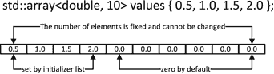
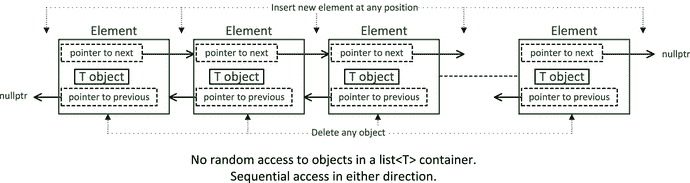

# 2.使用序列容器

Electronic supplementary material The online version of this chapter (doi:[10.​1007/​978-1-4842-0004-9_​2](http://dx.doi.org/10.1007/978-1-4842-0004-9_2)) contains supplementary material, which is available to authorized users.

本章介绍了你可能最常用的基本容器——序列容器。在里面，你会学到以下内容:

*   序列容器的特征
*   如何在序列容器中获取和使用迭代器
*   如何使用`array`容器
*   一个`vector`容器的能力是什么
*   一个`deque`容器的特征和能力以及它与一个`vector`容器的不同之处
*   一个`list`容器如何构造它所包含的数据元素，它的优点和缺点是什么
*   一个`forward_list`容器和一个`list`容器有什么不同，以及你什么时候会使用它
*   如何定义自己的迭代器

## 序列容器

序列容器以线性顺序存储元素。元素之间没有秩序。这些元素按照你存储它们的顺序排列。有五种标准序列容器，每种都有不同的特征:

*   一个`array<T,N>`容器是一系列固定长度`N`的`T`类型的对象。您不能添加或删除元素。
*   一个`vector<T>`容器是一个可变长度的类型为`T`的对象序列，它会在需要时自动增长。您只能在序列的末尾有效地添加或删除元素。
*   一个`deque<T>`容器是一个自动增长的可变长度序列。您可以在序列的两端有效地添加或删除元素。
*   一个`list<T>`容器是一个由类型为`T`的对象组成的变量序列，组织成一个双向链表。您可以在序列中的任何位置有效地添加或删除元素。与前三个容器相比，访问序列内部的任意元素相对较慢，因为必须从第一个元素或最后一个元素开始，并在列表中移动，直到到达所需的元素。
*   一个`forward_list<T>`是一个可变长度的类型为`T`的对象序列，被组织成一个单链表。这比列表容器更快，需要的内存更少，但是序列内部的元素只能从第一个元素开始访问。

图 [2-1](#Fig1) 显示了可用的序列容器以及它们之间的差异。

图 2-1。

The standard sequence containers

图 [2-1](#Fig1) 中所示的每种集装箱的操作都是可以有效执行的操作。正如您将看到的，在某些情况下，其他操作也是可能的，但这些操作会慢得多。

### 容器之间通用的函数成员

我将在本章的剩余部分详细解释如何使用每个序列容器。序列容器有许多共同的函数成员，它们在每个容器中的行为是相同的。我将在一个容器的上下文中描述每个成员，而不是重复详细描述这些成员在每种类型的容器中做什么。表 [2-1](#Tab1) 显示了`array`、`vector`和`deque`容器的函数成员，以及两个或更多容器实现同一个函数成员的情况。

表 2-1。

Function members of `array`, `vector`, and `deque` containers

<colgroup><col> <col> <col> <col></colgroup> 
| 功能成员 | 数组 | 向量 | deqo〔t0〕 |
| --- | --- | --- | --- |
| `begin()`–返回开始迭代器。 | 是 | 是 | 是 |
| `end() –`返回结束迭代器。 | 是 | 是 | 是 |
| `rbegin()`–返回反向开始迭代器。 | 是 | 是 | 是 |
| `rend() –`返回反向结束迭代器。 | 是 | 是 | 是 |
| `cbegin()`–返回`const` begin 迭代器。 | 是 | 是 | 是 |
| `cend() –`返回`const`结束迭代器。 | 是 | 是 | 是 |
| `crbegin()`–返回`const`反向开始迭代器。 | 是 | 是 | 是 |
| `crend()`–返回`const`反向结束迭代器。 | 是 | 是 | 是 |
| `assign()`–用一组新的元素替换内容。 | - | 是 | 是 |
| `operator=()`–用相同类型的另一个容器的副本，或者从初始化列表中替换元素。 | 是 | 是 | 是 |
| `size()`–返回元素的实际数量。 | 是 | 是 | 是 |
| `max_size()`–返回元素的最大数量。 | 是 | 是 | 是 |
| `capacity()`–返回分配内存的元素数量。 | - | 是 | - |
| `empty()`–如果没有元素，则返回`true`。 | 是 | 是 | 是 |
| `resize()`–改变元素的实际数量。 | - | 是 | 是 |
| `shrink_to_fit()`–将内存减少到实际元素数量所需的内存。 | - | 是 | 是 |
| `front()`–返回对第一个元素的引用。 | 是 | 是 | 是 |
| `back()`–返回对最后一个元素的引用。 | 是 | 是 | 是 |
| `operator –`访问索引处的元素。 | 是 | 是 | 是 |
| `at()`–通过边界检查访问索引参数处的元素。 | 是 | 是 | 是 |
| `push_back() –`在序列末尾追加一个元素。 | - | 是 | 是 |
| `insert() -`在指定位置插入一个或多个元素。 | - | 是 | 是 |
| `emplace() –`在指定位置创建一个元素。 | - | 是 | 是 |
| `emplace_back() –`在序列的末尾创建一个元素。 | - | 是 | 是 |
| `pop_back() –`删除序列末尾的元素。 | - | 是 | 是 |
| `erase() –`删除一个元素或一系列元素。 | - | 是 | 是 |
| `clear() –`删除所有元素，因此大小为 0。 | - | 是 | 是 |
| `swap() –`交换两个容器中的所有元素。 | 是 | 是 | 是 |
| 返回包含元素的内部数组的指针。 | 是 | 是 | - |

列中没有`'Yes'`意味着没有为该容器定义函数。你不需要记住这张桌子。这里仅供参考。当您进一步了解容器如何构造元素时，您会本能地知道哪些功能对于给定的容器是不可用的。

将元素组织成链表的容器在内部组织上与表 [2-1](#Tab1) 中的容器有很大不同。尽管`list`和`forward_list`容器彼此非常相似。一个`forward_list`拥有一个`list`容器拥有的大部分功能成员。`forward_list`中缺少的基本上是那些需要向后遍历序列的，所以没有反向迭代器。作为参考，表 [2-2](#Tab2) 显示了`list`和`forward_list`容器的功能成员。

表 2-2。

Function members of `list` and `forward_list` containers

<colgroup><col> <col> <col></colgroup> 
| 功能成员 | 列表 | 转发 _ 列表 |
| --- | --- | --- |
| `begin()`–返回开始迭代器。 | 是 | 是 |
| `end() –`返回结束迭代器。 | 是 | 是 |
| `rbegin()`–返回反向开始迭代器。 | 是 | – |
| `rend() –`返回反向结束迭代器。 | 是 | -– |
| `cbegin()`–返回`const` begin 迭代器。 | 是 | 是 |
| `before_begin() –`返回指向第一个元素之前的迭代器。 | – | 是 |
| `cbefore_begin()`–返回指向第一个元素之前的`const`迭代器。 | - | 是 |
| `cend()`–返回`const`结束迭代器。 | 是 | 是 |
| `crbegin()`–返回`const`反向开始迭代器。 | 是 | - |
| `crend()`–返回`const`反向结束迭代器。 | 是 | - |
| `assign()`–用一组新的元素替换内容。 | 是 | 是 |
| `operator=()`–用相同类型的另一个容器的副本，或者从初始化列表中替换元素。 | 是 | 是 |
| `size()`–返回元素的实际数量。 | 是 | - |
| `max_size()`–返回元素的最大数量。 | 是 | 是 |
| `resize()`–改变元素的数量。 | 是 | 是 |
| `empty()`–如果没有元素，则返回`true`。 | 是 | 是 |
| `front()`–返回对第一个元素的引用。 | 是 | 是 |
| `back()`–返回对最后一个元素的引用。 | 是 | – |
| `push_back()`–在序列末尾追加一个元素。 | 是 | – |
| `push_front()`–在序列的开头插入一个元素。 | 是 | 是 |
| `emplace()`–在指定位置之前创建一个元素。 | 是 | – |
| `emplace_after()`–在指定位置后创建一个元素。 | – | 是 |
| `emplace_back()`–在序列的末尾创建一个元素。 | 是 | – |
| `emplace_front()`–在序列的开头创建一个元素。 | 是 | 是 |
| `insert() –`在指定位置前插入一个或多个元素。 | 是 | – |
| `insert_after()`–在指定位置后插入一个或多个元素。 | – | 是 |
| `pop_back()`–删除序列末尾的元素。 | 是 | – |
| `pop_front()`–删除序列开头的元素。 | 是 | 是 |
| `reverse()`–反转元素的顺序。 | 是 | 是 |
| `erase()`–删除指定位置的元素或删除一系列元素。 | 是 | – |
| `erase_after()`–删除指定位置后的元素或删除一系列元素。 | – | 是 |
| `remove() -`删除与参数匹配的元素。 | 是 | 是 |
| `remove_if()`–删除一元谓词参数返回 true 的元素。 | 是 | 是 |
| `unique()`–删除连续的重复项。 | 是 | 是 |
| `clear()`–删除所有元素，因此大小为 0。 | 是 | 是 |
| `swap()`–交换两个容器中的所有元素。 | 是 | 是 |
| `sort()`–对元素进行排序。 | 是 | 是 |
| `merge()`–将此容器与另一个容器合并–两者都必须排序。 | 是 | 是 |
| 将另一个相同类型列表中的元素移动到指定位置之前。 | 是 | – |
| `splice_after()`–将另一个相同类型列表中的元素移动到指定位置之后。 | - | 是 |

所有序列容器拥有的`max_size()`函数成员返回可以存储的元素的最大可能数量；这通常是一个非常大的数字，通常是 232–1，所以很少需要调用这个函数。

## 使用数组<t>容器</t>

`array<T,N>`模板定义了等同于标准数组的容器类型。这是一个由`T`类型的`N`元素组成的固定序列，所以除了指定元素的类型和数量略有不同之外，它就像一个常规数组。显然，您不能添加或删除元素。模板实例中的元素存储在标准数组中。`array`与标准数组相比，容器的开销很小，但提供了两个优势:如果使用`at()`，可以检测到试图访问索引超出合法范围的元素，并且容器知道它有多少个元素，这意味着数组容器可以作为参数传递给函数，而不需要单独指定元素的数量。您必须在源文件中包含`array`头才能使用容器类型。它非常容易使用——下面是如何创建由 100 个类型为`double`的元素组成的`array<>`:

`std::array<double, 100> data;`

当您定义一个`array`容器而没有为元素指定初始值时，元素不会被初始化，但是您可以将元素类型默认初始化为零或其等价物，如下所示:

`std::array<double, 100> data {};`

使用这个语句，`data`容器中的所有元素都将是`0.0`。参数`N`的规范必须是一个常量表达式，并且容器中的元素数量不能改变。当然，您可以在创建一个`array`容器的实例时初始化元素，就像普通数组一样:

`std::array<double, 10> values {0.5, 1.0, 1.5, 2.0};   // 5th and subsequent elements are 0.0`

初始化列表中的四个值用于初始化前四个元素；后续元素将为零。这如图 [2-2](#Fig2) 所示。

图 2-2。

Creating an `array<T,N>` container

您可以通过调用`array`对象的`fill()`函数成员将所有元素设置为某个给定值。例如:

`values.fill(3.1415926);                               // Set all elements to pi`

`fill()`函数将所有元素设置为您作为参数传递的值。

### 访问元素

您可以像访问标准数组一样，使用方括号中的索引在表达式中访问和使用`array`容器中的元素，例如:

`values[4] = values[3] + 2.0*values[1];`

第五个元素被设置为表达式的值，该值是赋值的右操作数。像这样使用索引不会进行边界检查；使用超出范围的索引值来访问或存储数据将不会被检测到。要检查超出范围的索引值，可以使用`at()`函数成员:

`values.at(4) = values.at(3) + 2.0*values.at(1);`

这与前面的语句相同，只是如果`at()`的参数表示超出范围的索引值，将抛出`std::out_of_range`异常。总是使用`at()`,除非你确定索引不可能超出范围。问题显然是为什么`operator`实现不做边界检查。答案是性能；每次访问元素时验证索引值会带来开销；当不可能出现超出范围的索引值时，您希望避免开销。

一个`array`对象的`size()`函数返回类型为`size_t`的元素数量，因此您可以像这样对`values`数组中的元素求和:

`double total {};`

`for(size_t i {} ; i < values.size() ; ++i)`

`{`

`total += values[i];`

`}`

与标准数组相比，`size()`函数的存在提供了一个优势，即`array`容器知道它包含多少元素；接收数组容器作为参数的函数可以调用`size()`成员来获得元素的数量。您不必调用`size()`成员来决定一个`array`容器是否没有元素。如果容器没有元素，`empty()`成员返回`true`:

`if(values.empty())`

`std::cout << "The container has no elements.\n";`

`else`

`std::cout << "The container has " << values.size() <<  " elements.\n";`

然而，很难想象一个`array`容器怎么会没有元素，因为元素的数量在创建时是固定的，不能改变。创建空数组容器实例的唯一方法是将第二个模板参数指定为零——这种情况不太可能发生。然而，调用`empty()`的相同机制适用于其他容器，其中元素的数量可以变化，元素可以被删除，因此它提供了一致的操作。

您可以对任何使迭代器可用的容器使用基于范围的`for`循环，这样您可以更简单地对`values`容器中的元素求和:

`double total {};`

`for(auto&#x0026;& value : values)`

`total += value;`

当然，这也可以用作为参数传递给函数的容器来完成。

一个`array`容器的`front()`和`back()`函数成员分别返回对第一个和最后一个元素的引用。还有返回`&front()`的`data()`函数成员，它是存储元素的底层标准数组的地址。你不太可能经常需要这个设施。

有一个函数模板供`get<n>()`辅助函数从数组容器中访问第`n`个元素；例如，模板参数的参数必须是可以在编译时计算的常量表达式，因此它不能是循环变量。被访问的元素是模板参数，它在编译时被检查。`get<n>()`模板提供了一种无需运行时检查就能访问具有确定索引值的元素的方法。你可以这样使用它:

`std::array<std::string, 5> words {"one", "two", "three", "four", "five"};`

`std::cout << std::get<3>(words) << std::endl;  // Output words[3]`

`std::cout << std::get<6>(words) << std::endl;  // Compiler error message!`

这里有一个例子，用你到目前为止学到的一些东西演示了`array`容器的作用:

`// Ex2_01.cpp`

`/*`

`Using array<T,N> to create a Body Mass Index (BMI) table`

`BMI = weight/(height*height)`

`weight is in kilograms, height is in meters`

`*/`

`#include <iostream>                              // For standard streams`

`#include <iomanip>                               // For stream manipulators`

`#include <array>                                 // For array<T,N>`

`int main()`

`{`

`const unsigned int min_wt {100U};              // Minimum weight in table in lbs`

`const unsigned int max_wt {250U};              // Maximum weight in table in lbs`

`const unsigned int wt_step {10U};              // Weight increment`

`const size_t wt_count {1 + (max_wt - min_wt) / wt_step};`

`const unsigned int min_ht {48U};               // Minimum height in table in inches`

`const unsigned int max_ht {84U};               // Maximum height in table in inches`

`const unsigned int ht_step {2U};               // Height increment`

`const size_t ht_count { 1 + (max_ht - min_ht) / ht_step };`

`const double lbs_per_kg {2.20462};             // Conversion factor lbs to kg`

`const double ins_per_m {39.3701};              // Conversion factor ins to m`

`std::array<unsigned int, wt_count> weight_lbs;`

`std::array<unsigned int, ht_count> height_ins;`

`// Create weights from 100lbs in steps of 10lbs`

`for (size_t i{}, w{ min_wt } ; i < wt_count ; w += wt_step, ++i)`

`{`

`weight_lbs.at(i) = w;`

`}`

`// Create heights from 48 inches in steps of 2 inches`

`unsigned int h{ min_ht };`

`for(auto& height : height_ins)`

`{`

`height = h;`

`h += ht_step;`

`}`

`// Output table headings`

`std::cout << std::setw(7) << " |";`

`for (const auto& w : weight_lbs)`

`std::cout << std::setw(5) << w << "  |";`

`std::cout << std::endl;`

`// Output line below headings`

`for (size_t i{1} ; i < wt_count ; ++i)`

`std::cout << "---------";`

`std::cout << std::endl;`

`double bmi {};                                 // Stores BMI`

`unsigned int feet {};                          // Whole feet for output`

`unsigned int inches {};                        // Whole inches for output`

`const unsigned int inches_per_foot {12U};`

`for (const auto& h : height_ins)`

`{`

`feet = h / inches_per_foot;`

`inches = h % inches_per_foot;`

`std::cout <<  std::setw(2) << feet << "'" << std::setw(2) << inches << "\"" << "|";`

`std::cout << std::fixed << std::setprecision(1);`

`for (const auto& w : weight_lbs)`

`{`

`bmi = h / ins_per_m;`

`bmi = (w / lbs_per_kg) / (bmi*bmi);`

`std::cout << std::setw(2) << " " << bmi << " |";`

`}`

`std::cout << std::endl;`

`}`

`// Output line below table`

`for (size_t i {1} ; i < wt_count ; ++i)`

`std::cout << "---------";`

`std::cout << "\nBMI from 18.5 to 24.9 is normal" << std::endl;`

`}`

我没有展示书中示例的输出，因为它占据了相当大的空间。定义了两组四个`const`变量，它们与身体质量指数表中包含的体重和身高范围相关。重量和高度存储在具有类型为`unsigned int`的元素的`array`容器中，因为根据定义，所有的重量和高度都是整数且非负的。容器在`for`循环中用适当的值初始化。第一个循环演示了`at()`函数，但是您可以在这里安全地使用`weight_lbs[i]`。接下来的两个`for`循环输出表格的列标题和一行将标题与表格的其余部分分开。表格是使用嵌套的基于范围的`for`循环创建的。外部循环遍历高度，并以英尺和英寸为单位输出最左边一列的高度。内部循环迭代权重，并输出当前高度的一行身体质量指数值。

### 对数组容器使用迭代器

`array`模板定义了`begin()`和`end()`成员，它们分别返回指向第一个元素和最后一个元素之后的随机访问迭代器。正如你在[第一章](01.html)中看到的，随机访问迭代器是最有能力的，所以所有的操作都可以用它们来完成。您可以使用显式迭代器对设置`height_ins`容器中的值的循环进行编码:

`unsigned int h {min_ht};`

`auto first = height_ins.begin();      // Iterator pointing to 1st element`

`auto last = height_ins.end();         // Iterator pointing to 1 past last element`

`while (first != last)`

`{`

`*first++ = h;                       // Store h in current element and increment iterator`

`h += ht_step;`

`}`

迭代器对象由`array`对象的`begin()`和`end()`成员函数返回。使用`auto`省去了担心迭代器的实际类型——但是如果你想知道的话——在这种情况下它们是`std::array<unsigned int,19>::iterator`类型，这意味着`iterator`类型是在`array<T,N>`类型中定义的。您可以看到迭代器对象的使用方式与常规指针相同——在元素中存储了值之后，后缀`++`操作符增加了`first`。当`first`等于`end`时，所有元素已被设置，循环结束。

正如我在《T4》第一章中所说，最好使用全局`begin()`和`end()`函数来获取容器的迭代器，因为它们是通用的，所以`first`和`last`可以这样定义:

`auto first = std::begin(height_ins);  // Iterator pointing to 1st element`

`auto last = std::end(height_ins);     // Iterator pointing to 1 past last element`

请记住，虽然迭代器指向容器中的特定元素，但它们不保留容器本身的任何信息；没有办法从迭代器判断它是指向`array`容器还是`vector`容器中的元素。让迭代器标识容器中的一系列元素引入了对它们应用算法的可能性，那么有没有什么算法可以用在`Ex2_01.cpp`中呢？在`algorithm`头中定义的`generate()`函数模板提供了一种用函数对象计算的值初始化范围的方法，这是一种可能性。我们可以像这样重写前面初始化`height_ins`容器的代码片段:

`unsigned int height {};               // Stores the current height initializing value`

`std::generate(std::begin(height_ins), std::end(height_ins),`

`[height, &min_ht, &ht_step]()mutable`

`{ return height += height == 0 ? min_ht : ht_step; });`

设置容器元素的值现在减少到两条语句，并且不需要显式循环。第一条语句定义了一个变量来保存元素的初始化器。`generate()`函数的前两个参数是 begin 和 end 迭代器，它们定义了由作为第三个参数传递的函数设置值的范围。这是一个 lambda 表达式。`min_ht`和`ht_step`变量通过引用在 lambda 中被捕获，而`mutable`关键字使 lambda 能够更新通过值捕获的`height`的本地副本的值。在 return 语句中，lambda 第一次执行时，本地`height`副本被设置为`min_ht`，并在后续调用中递增`ht_step`。lambda 表达式中由 value 捕获的变量的本地副本的值从 lambda 的一次执行保留到下一次执行，这使得这种机制能够按照我们想要的方式工作。

假设您想用连续递增的值初始化一个数组容器。在`numeric`头中有一个`iota()`函数模板。下面是它的使用方法:

`std::array<double, 10> values;`

`std::iota(std::begin(values), std::end(values), 10.0);  // Set values elements to 10.0 to 19.0`

前两个参数是定义要设置的元素范围的迭代器。第三个参数是范围中第一个元素的值。后续元素值通过应用增量运算符生成。`iota()`函数不限于处理数值。要设置的元素范围可以是支持`operator++()`的任何类型。

Note

不要忘记算法是独立于容器类型的。它们处理任何具有所需类型迭代器的容器中的元素。`generate()`和`iota()`函数模板只需要前向迭代器，所以定义任何容器范围的迭代器都可以工作。

一个`array`容器定义了返回`const`迭代器的`cbegin()`和`cend()`函数成员；当你只想访问元素而不想修改它们时，你应该使用`const`迭代器。与非`const`迭代器一样，最好使用全局`cbegin()`和`cend()`函数来获得它们。`rbegin()`和`rend()`函数——全局和成员——返回反向迭代器，分别指向最后一个元素和第一个元素之前的一个元素；返回`const`反向迭代器的函数有`crbegin()`和`crend()`。使用反向迭代器以逆序处理元素。例如:

`std::array<double, 5> these {1.0, 2.0, 3.0, 4.0, 5.0};`

`double sum {};`

`auto start = std::rbegin(these);`

`auto finish = std::rend(these);`

`while(start != finish)`

`sum += *(start++);`

`std::cout << "The sum of elements in reverse order is " << sum << std::endl;`

元素在循环中求和，从最后一个元素开始。`finish`迭代器指向第一个元素之前的 1，所以循环在第一个元素被添加到`sum`之后结束。对反向迭代器应用 increment 操作符会将它指向的内容向常规正向迭代器的相反方向移动。你可以在这里使用一个`for`循环:

`for(auto iter = std::rbegin(these); iter != std::rend(these); ++iter)`

`sum += *iter;`

因为数组容器实例有固定数量的元素，所以插入迭代器不适用；插入迭代器用于向容器中添加新元素。

### 比较数组容器

您可以使用任何比较操作符来比较两个完整的`array<T,N>`容器，只要容器大小相同，存储的元素类型相同，并且该类型支持比较操作。例如:

`std::array<double,4> these {1.0, 2.0, 3.0, 4.0};`

`std::array<double,4> those {1.0, 2.0, 3.0, 4.0};`

`std::array<double,4> them  {1.0, 3.0, 3.0, 2.0};`

`if (these == those) std::cout << "these and those are equal."    << std::endl;`

`if (those != them)  std::cout << "those and them are not equal." << std::endl;`

`if (those < them)   std::cout << "those are less than them."     << std::endl;`

`if (them > those)   std::cout << "them are greater than those."  << std::endl;`

容器是逐元素比较的。对于`==`的`true`结果，所有对应元素对必须相等。对于不等式，对于一个`true`结果，至少有一对相应的元素必须是不同的。对于所有其他比较，第一对不同的元素产生结果。这基本上是字典中单词排序的方式，其中两个单词中不同的第一对对应字母决定了它们的顺序。代码片段中的所有比较都是`true`，所以当它执行时，所有四个消息都将被输出。

与标准数组不同，您可以将一个`array`容器分配给另一个容器，只要它们都存储相同数量的相同类型的元素。例如:

`them = those;       // Copy all elements of those to them`

赋值左边的数组容器中的元素被赋值右边的容器中的元素覆盖。

## 使用向量<t>容器</t>

`vector<T>`容器是类型为`T`的元素的序列容器。它就像一个`array<T,N>`容器，只是它的大小可以自动增长以容纳任意数量的元素；因此只需要类型参数`T`——不需要带有`vector`的`N`模板参数。一旦超过`vector`的当前容量，就会自动为更多元件分配额外空间。只有在容器的末尾才能有效地添加或删除元素。容器是数组的一个非常有用和灵活的替代品。大多数情况下，您可以将`vector`用作存储序列而不是数组的标准工具。只要您意识到扩展`vector`的容量或者从序列内部添加或删除元素的开销，您的代码在大多数情况下不会明显变慢。要使用`vector`容器模板，您必须在源文件中包含`vector`头。

### 创建向量<t>容器</t>

下面是创建一个`vector`容器来存储类型`double`的值的例子:

`std::vector<double> values;`

它没有元素，也没有为元素分配空间，所以当您添加第一个数据项时，内存将被动态分配。您可以通过调用容器对象的`reserve()`来增加容量:

`values.reserve(20);                    // Memory for up to 20 elements`

这将容器中分配的内存设置为至少容纳 20 个元素。如果当前容量已经大于或等于 20，则该语句不起任何作用。注意，调用`reserve()`不会创建任何元素。此时,`values`容器仍然没有元素，但是在分配更多内存之前，最多可以添加 20 个元素。调用`reserve()`不会影响任何现有元素。但是，如果调用增加了内存，任何现有的迭代器，比如 begin 和 end 迭代器，都将失效，因此您必须重新创建它们。这是因为随着容量的增加，元素可能会被复制或移动到新的存储位置。

创建`vector`的另一个选项是使用初始化列表来指定初始值以及元素的数量:

`std::vector<unsigned int> primes {2u, 3u, 5u, 7u, 11u, 13u, 17u, 19u};`

`primes vector`容器将由八个元素创建，初始值在初始化列表中。

分配内存在时间上是相对昂贵的，所以你不希望它发生得比必要的更频繁。一个`vector`将使用一种算法来增加容量，该算法依赖于通常是对数的实现。这可能会在早期导致一些非常小的内存分配，但是随着`vector`的扩展，内存分配会增加。您可以创建一个定义了初始数量元素的`vector`，如下所示:

`std::vector<double> values(20);    // Capacity is 20 double values and there are 20 elements`

这个容器从创建的 20 个元素开始，默认情况下用零初始化。创建一个`vector`容器是一个好主意，它的元素数量将最小化需要分配额外空间的次数。

Caution

20 左右的括号，即元素的数量，在上面的语句中是必不可少的。这里不能用大括号。如果您编写以下定义，结果会大不相同:

`std::vector<double> values {20};        // There is one element initialized to 20`

这个`vector`没有 20 个元素；它包含一个初始化为 20 的元素。添加更多元素将导致分配额外的内存。

如果不喜欢将零作为元素的默认值，可以指定一个适用于所有元素的值:

`std::vector<long> numbers(20, 99L);    // Size is 20 long values - all initialized with 99`

第二个参数指定所有元素的初始值，因此所有 20 个元素都是`99L`。指定`vector`中元素数量的第一个参数不必是常量表达式。它可能是运行时执行的表达式的结果，也可能是从键盘读入的结果。

当您用另一个容器中类型为`T`的元素创建一个`vector<T>`容器时，您可以初始化它。使用一对迭代器来指定要用作初始值的元素范围。这里有一个例子:

`std::array<std::string, 5> words {"one", "two", "three", "four", "five"};`

`std::vector<std::string> words_copy {std::begin(words), std::end(words)};`

将使用来自`words`数组容器的元素初始化`words_copy`向量。如果您使用移动迭代器来指定`words_copy`的初始化范围，那么元素将从`words`数组中移出。你可以这样做:

`std::vector<std::string> words_copy {std::make_move_iterator(std::begin(words)),`

`std::make_move_iterator(std::end(words))};`

`words_copy`向量将像以前一样被初始化。因为元素是被移动而不是复制的，`words`数组现在将包含代表空字符串`""`的`string`对象。

### 向量的容量和大小

一个`vector`的容量是它在不分配更多内存的情况下可以存储的元素数量；这些元素可能存在，也可能不存在。一个`vector`的大小是它实际包含的元素的数量，也就是存储了值的元素的数量。图 [2-3](#Fig3) 说明了这一点。

图 2-3。

The size and capacity of a `vector`

显然一个`vector`容器的大小不能超过它的容量。当大小等于容量时，添加一个元素将导致分配更多的内存。您可以通过调用`vector`对象的`size()`或`capacity()`函数来获得`vector`的大小和容量。这些值作为由您的实现定义的无符号整数类型的整数返回。例如:

`std::vector<size_t> primes { 2, 3, 5, 7, 11, 13, 17, 19, 23, 29, 31, 37, 41, 43, 47 };`

`std::cout << "The size is " << primes.size() << std::endl;`

`std::cout << "The capacity is " << primes.capacity() << std::endl;`

输出语句将给出大小和容量的值 14，如初始化列表所确定的。但是，如果您使用`push_back()`函数添加一个元素，并再次输出大小和容量，则大小将为`15`，容量将为`28`。当大小等于容量时，增加容量的增量由依赖于实现的算法确定；一些实施方案将现有容量翻倍。

您可能想在一个变量中存储一个`vector`的大小或容量。一个`vector<T>`对象的大小或容量类型是`vector<T>::size_type`，这意味着`size_type`是在编译器从类模板生成的`vector<T>`类中定义的。因此，对于`primes`向量，大小值将是类型`vector<size_t>::size_type`。在大多数情况下，通过在定义变量时使用`auto`关键字，可以避免担心这些细节，例如:

`auto nElements = primes.size();        // Store the number of elements`

记住，你必须将`=`和`auto`一起使用——而不是一个初始化列表；否则将无法正确确定类型。存储大小的一个常见原因是使用索引迭代`vector`中的元素。您也可以使用基于范围的`for`循环和`vector`:

`for(auto& prime : primes)`

`prime *= 2;                          // Double each element value`

您在前面看到，您可以为一个`vector`调用`reserve()`来增加它的容量；元素的数量不变。调用`resize()`函数成员会改变`vector`的大小，这也可能增加容量。`resize()`有几个品种，例如:

`std::vector<int> values {1,2,3};       // 1 2 3           : size is 3`

`values.resize(5);                      // 1 2 3 0 0       : size is 5`

`values.resize(7, 99);                  // 1 2 3 0 0 99 99 : size is 7`

`values.resize(6);                      // 1 2 3 0 0 99    : size is 6`

第一个`resize()`调用将大小更改为参数指定的元素数，因此它附加了两个用类型的默认值初始化的元素。如果添加元素导致超出当前容量，容量将自动增加。第二个`resize()`调用将大小增加到第一个参数指定的值，并用第二个参数指定的值初始化新元素。第三次调用将`values`容器的大小更改为 6，这小于当前的大小。当需要减小尺寸时，多余的元素被移除，就好像容器的`pop_back()`被重复调用一样，我将在本章稍后解释这一点。缩小一艘`vector`号的大小并不影响它目前的容量。

### 访问元素

您可以使用方括号之间的索引来设置现有元素的值，或者只是在表达式中使用其当前值。例如:

`std::vector<double> values(20);             // Container with 20 elements created`

`values[0] = 3.14159;                        // Pi`

`values[1] = 5.0;                            // Radius of a circle`

`values[2] = 2.0*values[0]*values[1];        // Circumference of a circle`

就像标准数组一样，`vector`的索引值从 0 开始。您总是可以使用方括号之间的索引来引用现有的元素，但是您不能通过这种方式创建新元素——您必须使用`push_back()`、`insert()`、`emplace()`或`emplace_back()`。像这样索引 a `vector`时，不会检查索引值。您可以访问数组范围之外的内存，并使用方括号之间的索引将值存储在这些位置。`vector`对象提供了对参数进行边界检查的`at()`函数，就像一个`array`容器一样，所以只要索引有可能超出合法范围，就使用`at()`函数来引用元素。

`vector`的`front()`和`back()`函数成员返回对序列中第一个和最后一个元素的引用。例如:

`std::cout << values.front() << std::endl;        // Outputs 3.14159`

因为`front()`和`back()`函数成员返回引用，所以它们可以出现在赋值的左边:

`values.front() = 2.71828;                        // 1st element changed to 2.71828`

`data()`函数成员返回一个指向数组的指针，该数组在`vector`内部用来存储元素。例如:

`auto pData = values.data();`

`pData`将是类型`double*`，通常`data()`为`vector<T>`容器返回类型`T*`的值。您需要有一个非常好的理由来使用这个功能。

### 对向量容器使用迭代器

如您所料，`vector`容器有完整的函数成员，这些成员返回其元素的迭代器，包括`const`和非`const`迭代器以及反向迭代器。`vector`的迭代器是随机访问迭代器，当然，您也可以使用全局函数来获得它们。一个`vector`有一个`push_back()`函数成员，所以你可以使用一个`back_insert_iterator`向它添加新元素。你会从第 1 章的[中想起，你可以通过调用全局`back_inserter()`函数来获得一个反向插入迭代器。一个`front_insert_iterator`不会与一个`vector`容器一起工作，因为它需要一个`push_front()`函数成员，而一个`vector`容器没有定义它。](01.html)

我可以通过展示如何使用`copy()`算法添加元素来演示如何将反向插入器迭代器应用于`vector`。`copy()`算法将元素从迭代器指定的范围(作为前两个参数提供)复制到迭代器指定的目的地(作为第三个参数)。前两个参数只需要是输入迭代器，所以任何类型的迭代器都可以接受；显然，第三个参数必须是输出迭代器。这里有一个例子:

`std::vector<double> data {32.5, 30.1, 36.3, 40.0, 39.2};`

`std::cout << "Enter additional data values separated by spaces or Ctrl+Z to end:"`

`<< std::endl;`

`std::copy(std::istream_iterator<double>(std::cin), std::istream_iterator<double>(),`

`std::back_inserter(data));`

`std::copy(std::begin(data), std::end(data), std::ostream_iterator<double>(std::cout, " "));`

创建`data`容器时，元素被设置为初始化列表中的值。对`copy()`的第一次调用有一个`istream_iterator`对象作为第一个参数，它从标准输入流中读取类型`double`的值。第二个参数实际上是流迭代器的结束迭代器，当识别出流的结尾时,`istream_iterator`将拥有这个值；当您从键盘输入`Ctrl+Z`时，这与`cin`一起发生。`copy()`的第三个参数是读取值的目的地，这是由`back_inserter()`函数返回的`data`的`back_insert_iterator`。因此，从`cin`读取的值作为新元素附加到`data`的末尾。最后一条语句调用`copy()`将`data`中的所有元素复制到`cout`；这是通过将目的地指定为`ostream_iterator`对象来实现的。让我们尝试一个使用迭代器和`vector`容器的完整例子:

`// Ex2_02.cpp`

`// Sorting strings in a vector container`

`#include <iostream>                         // For standard streams`

`#include <string>                           // For string types`

`#include <algorithm>                        // For swap() and copy() functions`

`#include <vector>                           // For vector (and iterators)`

`using std::string;`

`using std::vector;`

`int main()`

`{`

`vector<string> words;                     // Stores words to be sorted`

`words.reserve(10);                        // Allocate some space for elements`

`std::cout << "Enter words separated by spaces. Enter Ctrl+Z on a separate line to end:"`

`<< std::endl;`

`std::copy(std::istream_iterator<string> {std::cin}, std::istream_iterator<string> {},`

`std::back_inserter(words));`

`std::cout << "Starting sort." << std::endl;`

`bool out_of_order {false};                // true when values are not in order`

`auto last = std::end(words);`

`while (true)`

`{`

`for (auto first = std::begin(words) + 1; first != last; ++first)`

`{`

`if (*(first - 1) > *first)`

`{ // Out of order so swap them`

`std::swap(*first, *(first - 1));`

`out_of_order = true;`

`}`

`}`

`if (!out_of_order)                      // If they are in order (no swaps necessary)...`

`break;                                // ...we are done...`

`out_of_order = false;                   // ...otherwise, go round again.`

`}`

`// Output the sorted vector`

`std::cout << "your words in ascending sequence:" << std::endl;`

`std::copy(std::begin(words), std::end(words),`

`std::ostream_iterator<string> {std::cout, " "});`

`std::cout << std::endl;`

`// Create a new vector by moving elements from words vector`

`vector<string> words_copy {std::make_move_iterator(std::begin(words)),`

`std::make_move_iterator(std::end(words)) };`

`std::cout << "\nAfter moving elements from words, words_copy contains:" << std::endl;`

`std::copy(std::begin(words_copy), std::end(words_copy),`

`std::ostream_iterator<string> {std::cout, " "});`

`std::cout << std::endl;`

`// See what’s happened to elements in words vector...`

`std::cout << "\nwords vector has " << words.size() << " elements\n";`

`if (words.front().empty())`

`std::cout << "First element is empty string object." << std::endl;`

`std::cout << "First element is \"" << words.front() <<  "\"" << std::endl;`

`}`

以下是一些输出示例:

`Enter words separated by spaces. Enter Ctrl+Z on a separate line to end:`

`one two three four five six seven eight`

`^Z`

`Starting sort.`

`your words in ascending sequence:`

`eight five four one seven six three two`

`After moving elements from words, words_copy contains:`

`eight five four one seven six three two`

`words vector has 8 elements`

`First element is empty string object.`

`First element is ""`

这个程序使用流迭代器将标准输入流中的单词作为`string`对象读入到`vector`容器中。可以输入任意数量的单词。必要时容器会自动膨胀。调用容器的`reserve()`为这里的 10 个元素分配内存。总是粗略地分配内存或可能需要的元素数量是一个好主意；这将最小化小增量分配空间的开销。`back_inserter()`创建一个`back_insert_iterator`，它调用容器的`push_back()`成员来添加每个`string`对象作为一个新元素。

`copy()`算法的前两个参数是输入流迭代器，第二个是流尾迭代器。当从键盘输入`Ctrl+Z`时，流迭代器将与此匹配，这对应于文件流的文件尾(`EOF`)。

对`vector`中的元素进行排序的代码演示了迭代器的使用。你将在本书的后面看到有一个`sort()`算法可以用一条语句完成这项工作。这里的排序方法是一个简单的冒泡排序，它重复遍历要排序的元素。在每一遍中，如果相邻的元素没有按顺序排列，它们将被交换。由`algorithm`头中的模板定义的`swap()`函数将有效地交换任何类型的元素。如果完整地遍历了所有不需要交换的元素，则这些元素按升序排列。外部循环是一个由迭代器控制的`for`循环。`first`的初始值是`begin(words)+1`，它是一个迭代器，指向`vector`中的第二个元素。从第二个元素开始确保在比较连续的元素时使用`first-1`总是合法的。当`first`递增以匹配对应于`end(words)`的迭代器时，每次循环结束。

通过使用`copy()`算法将元素传输到输出流迭代器来显示`words`向量的排序内容。要传输的范围由`begin()`和`end()`返回的迭代器指定，因此所有的元素都将被输出。`ostream_iterator`构造函数的参数是数据要去的流和每个输出值后面要写的分隔符字符串。

`main()`中的最后一段代码演示了如何使用移动迭代器以及对被移动的源元素的影响。您可以从输出中看到，在操作之后，`words`中的元素以包含空字符串的`string`对象结束；移动元素留下了对应于无参数`string`构造函数创建的对象。不过一般来说，移动一个类对象元素会使该元素处于不确定状态，所以不应该使用它。

`main()`中进行排序的代码并不真正依赖于存储元素的容器。它只要求要排序的数据由支持排序方法所用操作的迭代器指定。如果我暂时忽略 STL 有一个比我能想到的任何东西都好得多的`sort()`函数模板，我可以定义我们自己的函数模板来对满足排序要求的任何类型的元素进行排序:

`template<typename RandomIter>`

`void bubble_sort(RandomIter start, RandomIter last)`

`{`

`std::cout << "Starting sort." << std::endl;`

`bool out_of_order {false};                // true when values are not in order`

`while (true)`

`{`

`for (auto first = start + 1; first != last; ++first)`

`{`

`if (*(first - 1) > *first)`

`{ // Out of order so swap them`

`std::swap(*first, *(first - 1));`

`out_of_order = true;`

`}`

`}`

`if (!out_of_order)                      // If they are in order (no swaps necessary)...`

`break;                                // ...we are done...`

`out_of_order = false;                   // ...otherwise, go round again.`

`}`

`}`

模板类型参数是迭代器类型。由于`for`循环中迭代器上的算术运算，`bubble_sort()`算法需要随机访问迭代器。这个算法将对任何可以提供随机访问迭代器的容器的内容进行排序；这包括标准数组和`string`对象。如果在前面的例子中在`main()`之前插入模板的代码，可以用下面的语句替换`main()`中对`words`向量进行排序的代码:

`bubble_sort(std::begin(words), std::end(words));  // Sort the words array`

为只使用迭代器就能实现的操作定义函数模板，使得它们的使用非常灵活。您可以定义在某个范围上操作的任何算法都可以类似地创建。使用`bubble_sort()`模板的完整程序在代码下载中被命名为`Ex2_02A`。

### 向向量容器中添加新元素

请记住，向容器添加元素的唯一方法是调用函数成员。非成员函数不能在不调用容器的函数成员的情况下添加或删除元素；这意味着容器对象必须以某种方式可以从函数中访问，以允许这样做——迭代器是不够的。

#### 追加元素

您可以使用容器对象的`push_back()`函数将元素添加到序列的末尾。例如:

`std::vector<double> values;`

`values.push_back(3.1415926);           // Add an element to the end of the vector`

`push_back()`函数在现有元素的末尾添加一个新元素，该元素的值作为参数传递——在本例中为`3.1415926`。由于这里没有现有的元素，这将是第一个；如果没有为容器调用`reserve()`，这将导致内存被分配。有第二个版本的`push_back()`带有一个右值引用参数。这为添加元素提供了移动操作。例如:

`std::vector<std::string> words;`

`words.push_back(string("adiabatic"));  // Move string("adiabatic") into the vector`

`push_back()`的参数在这里是一个临时对象，所以它将调用带有右值引用参数的版本。当然，您可以将操作写成:

`words.push_back("adiabatic");          // Move string("adiabatic") into the vector`

编译器将安排用`"adiabatic"`作为初始值创建`string`对象参数，该对象将像以前一样被移入`vector`。

有一种更好的方法来添加新元素。`emplace_back()`成员比`push_back()`更有效率。这个片段说明了为什么:

`std::vector<std::string> words;`

`words.push_back(std::string("facetious"));      // Calls string constructor & moves the string object`

`words.emplace_back("abstemious");               // Calls string constructor to create element in place`

`emplace_back()`函数的参数是构造函数将对象追加到容器中所需的参数。通过使用您提供的一个或多个参数调用对象类型的构造函数，`emplace_back()`成员在容器中就地创建对象，从而消除了在这种情况下`push_back()`将执行的对象移动操作。您可以在`emplace_back()`成员调用中指定对象构造函数所需的任意多个参数。这里有一个关于`emplace_back()`的例子:

`std::string str {"alleged"};`

`words.emplace_back(str, 2, 3);       // Create string object corresponding to "leg" in place`

`emplace()`函数将调用`string`构造函数，该构造函数接受指定的三个参数，以创建追加到`words`序列中的对象。这个构造函数创建一个`string`对象，包含以索引 2 处的字符开始的`str`的三个字符的子串。

#### 插入元素

您可以使用`emplace()`函数成员在`vector`序列的内部插入一个新元素。对象是就地创建的，而不是在单独的步骤中创建对象，然后将其作为参数传递。`emplace()`的第一个参数是一个迭代器，它指定了创建对象的位置。对象将被插入到迭代器指定的元素之前。第二个和任何后续参数被传递给要插入的元素的构造函数。例如:

`std::vector<std::string> words {"first", "second"};`

`// Inserts string(5, 'A') as 2nd element`

`auto iter = words.emplace(++std::begin(words), 5, 'A');`

`// Inserts string("&&&&") as 3rd element`

`words.emplace(++iter, "&&&&");`

执行这些语句后，`vector`元素将成为以下对象的`string`:

`"first" "AAAAA" "&&&&" "second"`

对于创建要插入的对象的构造函数调用，您可以根据需要向第一个参数后面的`emplace()`提供任意多的参数。上面代码片段中对`emplace()`成员的第一次调用创建了从`string(5, 'A')`构造函数调用得到的`string`对象。`emplace()`函数返回一个指向被插入元素的迭代器，在下面的语句中使用这个迭代器来插入另一个对象，该对象位于被插入的前一个对象之后。

`insert()`函数成员可以在`vector`中插入一个或多个元素。第一个参数总是指向插入点的`const`或非`const`迭代器。一个或多个元素被直接插入到第一个参数指向的元素之前，除非它是一个反向迭代器，在这种情况下，元素被直接插入到插入点之后。你被`insert()`成员的选择宠坏了，所以我会用单独的语句来说明每一种可能性。我将首先定义一个`vector`，随后的`insert()`函数调用列表将依次应用到这个函数:

`std::vector<std::string> words {"one", "three", "eight"};          // Vector with 3 elements`

对于`words`的`insert()`成员，您可以选择的选项有:

Insert a single element that is specified by the second argument: `auto iter = words.insert(++std::begin(words), "two");`  

在这个例子中，通过递增由`begin()`返回的迭代器来指定插入点。这对应于第二个元素，因此新元素将作为新的第二个元素插入到它之前。从第二个到最后一个的原始元素都将被移动一个位置，以便为新元素腾出空间。有两个插入单个对象的`insert()`重载，一个带有类型为`const T&`的第二个参数，另一个带有类型为`T&&`的第二个参数——一个右值引用。因为上面的第二个参数是一个临时对象，所以将调用这些重载中的第二个，并将移动临时对象，而不是复制它。

执行该语句后，`words`向量包含代表以下内容的`string`元素:

`"one" "two" "three" "eight"`

返回的迭代器指向插入的元素`string("two")`。注意，这个`insert()`调用不如使用相同参数调用`emplace()`有效。通过`insert()`调用，执行构造函数调用`string("two")`来创建对象，然后将该对象作为第二个参数传递。对于`emplace()`,第二个参数用于在容器中构建`string`对象。

Insert a sequence of elements that is specified by iterators that are the second and third arguments: `std::string more[] {"five", "six", "seven"};      // Array elements to be inserted` `iter = words.insert(--std::end(words), std::begin(more), std::end(more));`  

第二条语句中的插入点是通过递减`end()`返回的迭代器获得的。这对应于最后一个元素，因此新元素将在此之前插入。执行这条语句后，`words`向量包含的`string`对象为:

`"one" "two" "three" "five" "six" "seven" "eight"`

返回的迭代器指向插入的第一个元素`"five"`。

Insert an element at the end of the `vector`: `iter = words.insert(std::end(words), "ten");`  

插入点在最后一个元素之后，因此新元素将追加到最后一个元素之后。执行此语句后，`words`向量包含用于以下目的的`string`对象:

`"one" "two" "three" "five" "six" "seven" "eight" "ten"`

返回的迭代器指向插入的元素`"ten"`。这与上面第 1 点的过载相同；这只是说明了当第一个参数不是指向一个元素，而是指向最后一个元素之后的一个元素时，它是有效的。

Insert multiples of a single element at the insertion point. The second argument is the number of times the object specified by the third argument is to be inserted: `iter = words.insert(std::cend(words)-1, 2, "nine");`  

插入点是最后一个元素，因此新元素的两个副本`string("nine")`将被插入到最后一个元素之前。执行这条语句后，`words`向量包含了用于以下目的的`string`对象:

`"one" "two" "three" "five" "six" "seven" "eight" "nine" "nine" "ten"`

返回的迭代器指向插入的第一个元素`"nine"`。注意，例子中的第一个参数是一个`const`迭代器，只是为了说明一个`const`迭代器也可以工作。

Insert elements specified by an initializer list at the insertion point. The second argument is the initializer list of elements to be inserted: `iter = words.insert(std::end(words), {std::string {"twelve"},`                                       `std::string {"thirteen"}});`  

插入点在最后一个元素之后，所以初始化列表中的元素被追加。执行此语句后，`words`向量包含用于以下目的的`string`对象:

`"one" "two" "three" "five" "six" "seven" "eight" "nine" "nine" "ten" "twelve" "thirteen"`

返回的迭代器指向插入的第一个元素，`"twelve."`初始化列表中的值必须匹配容器元素的类型。类型为`T`的初始值设定项列表属于类型`std::initializer_list<T>`，所以这里的列表属于类型`std::initializer_list<std::string>`。在前面的`insert()`调用中，文字作为参数出现，参数类型是`std::string`，因此文字将被用作初始化传递给函数的`string`对象的值。

请记住，除了在`vector`末尾的所有插入都会产生开销。插入点之后的所有元素都必须被混洗，以便为新元素腾出空间。当然，如果插入后的元素数量大于容量，就需要分配更多的内存，这会进一步增加开销。

`vector`的`insert()`成员希望您使用标准迭代器来指定插入点；反向迭代器不会被接受——它不会被编译。当你想找到一个给定对象在一个序列中最后一次出现的位置，并在它旁边插入一个新元素时，就需要使用反向迭代器。反向迭代器的`base()`函数成员会有所帮助。这里有一个例子:

`std::vector<std::string> str {"one", "two", "one", "three"};`

`auto riter = std::find(std::rbegin(str), std::rend(str), "one");`

`str.insert(riter.base(), "five");`

`find()`算法在前两个参数指定的范围内搜索与第三个参数匹配的第一个元素，所以它在寻找`string("one")`。它返回一个你用来指定范围的迭代器。结果将是一个反向迭代器，指向找到的元素，如果没有找到，则指向第一个元素`rend(str)`之前的元素。使用反向迭代器意味着搜索找到最后一个匹配的元素；使用标准迭代器可以找到第一个匹配项，如果没有找到，则返回`end(str)`。调用`riter`的`base()`函数成员，反向返回对应于`iter`之前位置的标准迭代器，即朝向序列的末尾。由于`riter`将指向包含`"one", riter.base()`的第三个元素，将指向包含`"three"`的第四个元素。使用`riter.base()`作为`insert()`的第一个参数会导致`"five"`被插入到该位置之前，也就是在`riter`指向的元素之后。执行这些语句后，`str`将包含这五个`string`元素:

`"one", "two", "one", "five", "three"`

如果您希望插入在由`find()`返回的位置之前，您可以将`insert()`的第一个参数指定为`iter.base()-1`。

### 删除元素

正如我所说的，您只能通过调用容器对象的函数成员来从容器中删除元素。您可以通过调用`clear()`成员来移除`vector`对象中的所有元素。例如:

`std::vector<int> data(100, 99);        // Contains 100 elements initialized to 99`

`data.clear();                          // Remove all elements`

第一条语句创建了一个包含 100 个类型为`int`的元素的`vector`对象，因此大小为`100`，容量为`100`；所有的元素都被初始化为`99`。第二条语句删除了所有元素，因此大小为`0`；容量未因操作而改变，因此仍为`100`。

您可以通过调用`pop_back()`函数来删除`vector`对象中的最后一个元素。例如:

`std::vector<int> data(100, 99);        // Contains 100 elements initialized to 99`

`data.pop_back();                       // Remove the last element`

第二条语句删除了最后一个元素，因此`data`的大小将是`99`，容量保留为`100`。

只要您不关心元素的顺序，能够删除最后一个元素就提供了一种移除任何元素的方法，而无需将元素混在一起。假设您想从 vector 中删除第二个元素`data`。你可以这样做:

`std::swap(std::begin(data)+1, std::end(data)-1); // Interchange 2nd element with the last`

`data.pop_back();                                 // Remove the last element`

第一条语句调用在`algorithm`头和`utility`头中定义的`swap()`模板函数。这交换了第二个和最后一个元素。然后调用`pop_back()`移除最后一个元素，也就是第二个元素，从而将其从容器中删除。

Note

一个`vector`容器有一个`swap()`函数成员。这将把调用该函数的容器中的元素与作为参数传递的`vector`容器中的元素进行交换。显然，两个`vector`容器必须存储相同类型的元素。全局`swap()`函数也将交换作为参数传递的两个`vector`容器的元素。

如果您不需要容器中的额外容量——例如，因为您不会添加更多的元素，您可以通过调用`shrink_to_fit()`成员来消除它:

`data.shrink_to_fit();                     // Reduce the capacity to that needed for elements`

这是否有效取决于你的 STL 的实现。如果它真的工作了，任何还在的`vector`的迭代器可能会失效，所以最好在这个操作之后获得新的迭代器。

您可以调用`vector`的`erase()`函数成员来删除一个或多个元素。要删除单个元素，需要提供单个迭代器参数，例如:

`auto iter = data.erase(std::begin(data)+1);      // Delete the second element`

删除元素后，`vector`的大小将减少 1；产能不变。返回的迭代器指向被移除元素后面的元素。这里的值将对应于表达式`std::begin(data)+1`；如果它是被移除的最后一个元素，那么返回的迭代器将是`std::end(data)`。

要消除一个元素序列，需要提供两个迭代器参数来定义要删除的元素范围。例如:

`// Delete the 2nd and 3rd elements`

`auto iter = data.erase(std::begin(data)+1, std::begin(data)+3);`

不要忘记——范围规范中的第二个迭代器指向范围中最后一个元素之后的一个迭代器。这将擦除位置`std::begin(data)+1`和`std::begin(data)+2`处的元素。返回的迭代器指向被删除元素之后的元素，所以如果最后一个元素被删除，它将是`std::begin(data)+1`或`std::end(data)`。

由在`algorithm`头中定义的模板产生的`remove()`算法从匹配特定值的范围中删除元素。这里有一个例子:

`std::vector<std::string> words { "one", "none", "some", "all", "none", "most", "many"};`

`auto iter = std::remove(std::begin(words), std::end(words), "none");`

第二条语句从前两个参数指定的范围中删除第三个参数`remove()`的所有出现，该参数将是`string("none")`。移除元素有点误导。`remove()`是一个全局函数，所以它不能从容器中删除元素。`remove()`删除元素的方式类似于从字符串中删除空格的过程——通过从右边复制元素来覆盖匹配第三个参数的元素。图 [2-4](#Fig4) 说明了这是如何工作的。

图 2-4。

How the remove( ) algorithm works

如果您在`remove()`操作之后输出`words`中的元素，那么只会显示前五个元素。然而，通过调用`size()`为`vector`返回的值仍然是 7，所以最后两个元素仍然存在，但是被空的`string`对象所取代。为了去掉多余的元素，你必须调用`vector`的`erase()`成员，而`remove()`返回的迭代器可以用来做这件事:

`words.erase(iter, std::end(words));              // Remove surplus elements`

这被称为删除习惯用法。迭代器`iter`指向删除后最后一个元素之后的一个元素，因此它标识了要删除的范围中的第一个元素。要删除的范围的终点由`std::end(words)`给出。当然，您可以删除这些元素，然后在一条语句中删除末尾不需要的元素:

`words.erase(std::remove(std::begin(words), std::end(words), "none"), std::end(words));`

`remove()`算法返回的迭代器成为`erase()`的第一个参数；`erase()`的第二个参数是指向容器中最后一个元素之外的迭代器。

了解如何为一个`vector`容器分配额外的容量，将会让您了解产生开销的频率，以及可以分配的内存量。这里有一个例子可以让你深入了解这一点:

`// Ex2_03.cpp`

`// Understanding how capacity is increased in a vector container`

`#include <iostream>                             // For standard streams`

`#include <vector>                               // For vector container`

`int main()`

`{`

`std::vector <size_t> sizes;                    // Record numbers of elements`

`std::vector <size_t> capacities;               // and corresponding capacities`

`size_t el_incr {10};                           // Increment to initial element count`

`size_t incr_count {4 * el_incr};               // Number of increments to element count`

`for (size_t n_elements {}; n_elements < incr_count; n_elements += el_incr)`

`{`

`std::vector<int> values(n_elements);`

`std::cout << "\nAppending to a vector with " << n_elements << " initial elements:\n";`

`sizes.push_back(values.size());`

`size_t space {values.capacity()};`

`capacities.push_back(space);`

`// Append elements to obtain capacity increases`

`size_t count {};                             // Counts capacity increases`

`size_t n_increases {10};`

`while (count < n_increases)`

`{`

`values.push_back(22);                      // Append a new element`

`if (space < values.capacity())             // Capacity increased...`

`{                                          // ...so record size and capacity`

`space = values.capacity();`

`capacities.push_back(space);`

`sizes.push_back(values.size());`

`++count;`

`}`

`}`

`// Show sizes & capacities when increments occur`

`std::cout << "Size/Capacity: ";`

`for (size_t i {}; i < sizes.size(); ++i)`

`std::cout << sizes.at(i) << "/" << capacities.at(i) << "  ";`

`std::cout << std::endl;`

`sizes.clear();                               // Remove all elements`

`capacities.clear();                          // Remove all elements`

`}`

`}`

本例中的操作非常简单。元素被追加到一个`vector`容器中，直到容量必须增加，在这种情况下，该点的大小和容量被记录在`sizes`和`capacities`容器中。对于具有不同初始元素计数的容器，重复这一过程。用我的编译器，我得到了这样的输出:

`Appending to a vector with 0 initial elements:`

`Size/Capacity: 0/0  1/1  2/2  3/3  4/4  5/6  7/9  10/13  14/19  20/28  29/42`

`Appending to a vector with 10 initial elements:`

`Size/Capacity: 10/10  11/15  16/22  23/33  34/49  50/73  74/109  110/163  164/244  245/366  367/549`

`Appending to a vector with 20 initial elements:`

`Size/Capacity: 20/20  21/30  31/45  46/67  68/100  101/150  151/225  226/337  338/505  506/757  758/1135`

`Appending to a vector with 30 initial elements:`

`Size/Capacity: 30/30  31/45  46/67  68/100  101/150  151/225  226/337  338/505  506/757  758/1135  1136/1702`

编译器的输出可能会有所不同，这取决于用来增加`vector`容量的算法。您可以从第一组输出中看到，当您从空的`vector`开始时，分配更多内存的需求非常频繁，因为容量增量很小——开始时只有一个元素的内存。另一组输出显示容量增量与容器的大小有关。每次分配都是针对当前元素数量的额外 50%。这意味着在选择初始大小时，如果可以的话，需要多加小心。

假设您最初创建了一个容量为 1000 个元素的`vector`，实际上您存储了 1001 个元素。您将拥有 499 个元素的过剩容量。如果元素是数值或不占用太多空间的对象，这并不重要。另一方面，如果对象很大，比如说每个对象 10 千字节，那么你的程序将会分配几乎 5 兆字节的内存，而这些内存并没有被使用。因此，您可以推断，稍微高估一点`vector`的初始大小总是更好，而不是低估它。

当然，您可以自己管理额外内存的分配。如果您比较大小和容量，您可以在必要时通过调用容器的`reserve()`来增加内存。例如:

`std::vector <size_t> junk {1, 2, 3};`

`for(size_t i {} ; i<1000 ; ++i)`

`{`

`if(junk.size() == junk.capacity())            // When the size has reached the capacity...`

`junk.reserve(junk.size()*13/10);            // ...increase the capacity`

`junk.push_back(i);`

`}`

这里的容量增加最多为 30%，而不是默认的 50%。容量增量不必是当前大小的百分比。例如，您可以将`reserve()`的参数指定为`junk.capacity()+10`，以使容量增加 10 个元素，而不管当前大小。不要忘记，当`reserve()`增加容量时，容器的现有迭代器不再有效。

### 向量<bool>容器</bool>

`vector<bool>`是`vector<T>`模板的专门化，它为`bool`类型的元素提供了更有效的内存使用。这是如何实现的由实现定义，但是通常`bool`元素被存储为单个比特。如果没有专门化，`vector`中的`bool`元素通常每个占用一个字节，但也可能更多——这是一个实现选择。`bool`值的序列不一定存储在连续的内存位置，所以没有`data()`函数成员。`vector<bool>`专门化的一些函数成员的操作与通用模板实例略有不同。`bool`当值被打包为一个字中的位时，它们是不可直接寻址的，因此来自`front()`和`back()`的返回值不是`bool&`引用，而是对代表序列中第一个和最后一个值的代理对象的引用。

当您想要处理`bool`值并知道您想要存储多少值时，在`bitset`头中定义的`bitset<N>`类模板是一个比`vector<bool>`更好的选择。模板参数是位数。这不是一个容器——例如，没有迭代器，但是一个`bitset`实例提供了一系列`vector<bool>`没有的位集操作。因为他们的应用程序更专业，所以我不会进一步讨论`vector<bool>`或`bitset<N>`。

## 使用 deque <t>容器</t>

一个`deque<T>`是在`deque`头中定义的容器模板，它创建了被组织为类型为`T`的元素的双端队列的容器。与`vector`容器相比，它的优势在于您可以在序列的开头和结尾有效地添加或删除对象，因此当您需要这种能力时，您可以选择这种类型的容器。每当应用程序涉及先进先出事务处理时，您都会使用`deque`容器。诸如处理数据库事务或模拟超市结账队列的应用程序可以使用`deque`容器。

### 创建队列容器

如果使用默认构造函数创建一个`deque`容器，该容器没有元素，因此添加第一个元素将导致分配内存:

`std::deque<int> a_deque;         // A deque container with no elements`

您创建一个具有给定数量元素的`deque`容器，其方式基本上与`vector`相同:

`std::deque<int> my_deque(10);    // A deque container with 10 elements`

一个名为`my_deque`的`deque`容器存储了`int`类型的元素，如图 [2-5](#Fig5) 所示；在这个容器中，奇整数被存储在元素中。

图 2-5。

An example of a deque container

当您创建一个具有指定数量元素的`deque`时，每个元素都将是所存储类型的默认值，因此之前对`my_deque`的定义最初将包含所有元素 0。如果创建一个具有给定数量的`string`元素的`deque`，每个元素将通过调用`string()`构造函数来初始化。

你也可以创建一个`deque`并使用初始化列表初始化它:

`std::deque<std::string> words { "one", "none", "some", "all", "none", "most", "many" };`

这个容器将有七个使用初始化列表中的文字创建的字符串元素。当然，您可以将初始化列表中的对象指定为`string("one")`、`string("none")`等。

还有一个用于`deque`容器的复制构造函数，它创建一个现有容器的副本:

`std::deque<std::string> words_copy { words };         // Makes a copy of the words container`

当你创建一个`deque`时，你也可以使用一个由两个迭代器标识的范围来初始化它:

`std::deque<std::string> words_part { std::begin(words), std::begin(words) + 5 };`

这个容器将有五个元素与`words`容器的前五个元素相同。当然，初始值的范围可以来自任何种类的容器——不一定是`deque`。一个`deque`提供了随机访问迭代器，你可以像获得一个`vector`容器一样获得一个`deque`容器的`const`和非`const`迭代器以及反向迭代器。

### 访问元素

您可以使用下标操作符访问`deque`容器中的元素。这个操作类似于`vector`,所以没有对下标的边界检查。一个`deque`容器中的元素是一个序列，但是以不同于`vector`的方式存储在内部。元素的组织方式导致一个`deque`容器的大小总是等于它的容量。因此，没有定义`capacity`()函数成员——一个`deque`只有一个`size`()成员，它将当前大小作为成员类型`size_type`的无符号整数返回。与`vector`相比，较慢的操作也是`deque`容器不同内部组织的结果。

您可以使用下标操作符访问元素，但是索引不进行边界检查。要使用经过边界检查的索引来访问元素，可以使用`at()`成员函数，就像使用`vector`一样:

`std::cout << words.at(2) << std::endl;           // Output the third element in words`

该参数必须是类型为`size_t`的值，因此不能小于 0。如果`at()`的参数不在范围内，当它大于`words.size()-1`时，就会抛出`std::out_of_range`异常。

`front()`和`back()`函数成员也以与`vector`相同的方式工作，然而，`deque`没有`data()`成员函数，因为元素不是作为数组存储的。一个`deque`容器提供了与`vector`相同的三种`resize()`函数成员，它们的操作完全相同。

### 添加和删除元素

一个`deque`容器提供了与一个`vector`容器相同的`push_back()`和`pop_back()`成员，用于在序列末尾添加和删除单个元素，它们以相同的方式工作。一个`deque`容器也有`push_front()`和`pop_front()`功能成员，用于序列开始时的类似操作。例如:

`std::deque<int> numbers {2, 3, 4};`

`numbers.push_front(11);            // numbers contains 11 2 3 4`

`numbers.push_back(12);             // numbers contains 11 2 3 4 12`

`numbers.pop_front();               // numbers contains 2 3 4 12`

除了一个`vector`提供的`emplace_back()`成员外，`deque`还有一个`emplace_front()`成员，用于在序列开始时创建一个新元素。与`vector`一样，你可以使用`emplace()`或`insert()`在`deque`的内部添加或删除元素；该过程相对较慢，因为它总是需要移动现有的元素。

我为一个`vector`描述的所有`insert()`函数成员也可用于一个`deque`容器。在`deque`的任何地方插入元素都会使`deque`的所有现有迭代器失效，因此您必须重新创建它们。`deque`的`erase()`成员也以与`vector`相同的方式工作。为`deque`容器调用`clear()`会移除所有元素。

### 替换队列容器的内容

`deque`的`assign()`函数成员替换所有现有元素。有三个版本；新内容可以由初始化列表指定，新内容可以是由迭代器指定的范围，或者新内容可以是指定对象的多个副本。下面是如何用初始化列表指定的元素替换`deque`容器的内容:

`std::deque<std::string> words {"one", "two", "three", "four"};`

`auto init_list = {std::string{"seven"}, std::string{"eight"}, std::string{"nine"}};`

`words.assign(init_list);`

最后一条语句用`init_list`中的`string`对象替换了`words`中的元素。注意，在这里你不能把文字放在初始化列表中。如果这样做，那么`init_list`的类型将被推导为`initializer_list<const char*>`，而`assign()`需要一个类型为`initializer_list<string>`的参数，所以代码不会被编译。当然，不必单独定义`init_list`。你可以调用`assign()`并在参数中定义初始化列表，就像这样:

`words.assign({"seven", "eight", "nine"});`

因为`words`的`assign()`成员需要一个`initializer_list<string>`类型的参数，编译器将安排使用文字创建一个这种类型的初始化列表。要将一系列元素分配给一个`deque`容器，需要提供两个迭代器参数:

`std::vector<std::string> wordset {"this", "that", "these", "those"};`

`words.assign(std::begin(wordset)+1, --std::end(wordset));  // Assigns "that" and "these"`

函数只需要输入迭代器，所以任何种类的迭代器都可以。最后一种可能性是用对象的重复来替换内容:

`words.assign(8, "eight");                       // Assign eight instances of string("eight")`

第一个参数是第二个参数的实例数，用于替换容器的当前内容。

`vector`容器提供了相同的一组`assign()`函数成员，因此您可以用一组新的成员替换`vector`中的元素。

您也可以使用赋值操作符来替换赋值左边的`deque`容器的内容。赋值的右操作数必须是相同类型的容器，或者是初始值设定项列表。这个操作也由`vector`容器支持。下面的例子演示了如何给一个`deque`分配一组新的元素；

`std::deque<std::string> words {"one", "two", "three", "four"};`

`std::deque<std::string> other_words;`

`other_words = words;                             // other_words same contents as words`

`words = {"seven", "eight", "nine"};              // words contents replaced`

在执行这些语句后，`other_words`将包含与`words`中的原始序列相同的元素，而`words`将包含从初始化列表中的文字创建的`string`对象。分配后，容器的大小将反映分配的元素数量。将一组新的元素分配给`vector`(来自相同类型的`vector`或初始化列表)将导致`vector`的容量与新的大小相同。

下面是一个使用`deque`容器的完整例子:

`// Ex2_04.cpp`

`// Using a deque container`

`#include <iostream>                              // For standard streams`

`#include <algorithm>                             // For copy()`

`#include <deque>                                 // For deque container`

`#include <string>                                // For string classes`

`#include <iterator>                              // For front_insert_iterator & stream iterators`

`using std::string;`

`int main()`

`{`

`std::deque<string> names;`

`std::cout << "Enter first names separated by spaces. Enter Ctrl+Z on a new line to end:\n";`

`std::copy(std::istream_iterator<string> {std::cin}, std::istream_iterator<string> {},`

`std::front_inserter(names));`

`std::cout << "\nIn reverse order, the names you entered are:\n";`

`std::copy(std::begin(names), std::end(names), std::ostream_iterator<string>{std::cout, "  "});`

`std::cout << std::endl;`

`}`

以下是一些示例输出:

`Enter first names separated by spaces. Enter Ctrl+Z on a new line to end:`

`Fred Jack Jim George Mary Zoe Rosie`

`^Z`

`In reverse order, the names you entered are:`

`Rosie  Zoe  Mary  George  Jim  Jack  Fred`

这个程序读取一系列任意长度的字符串，并将它们存储在`names`容器中。对于`front_inserter()`函数返回的`names`容器，`copy()`算法通过将`istream_iterator<string>`迭代器获得的序列复制到`front_insert_iterator`来执行输入。`copy()`的第一个参数是输入的开始迭代器，第二个参数是相应的结束迭代器。当你在键盘上输入`Ctrl+Z`时，输入迭代器将对应结束迭代器；如果数据是从文件流中读取的，那么当到达`EOF`时就会产生结束迭代器。我们可以使用一个`front_insert_iterator`，因为一个`deque`容器有一个`push_front()`成员，它将一个元素添加到序列的开头；`front_insert_iterator`的工作方式是调用容器的`push_front()`来添加每个元素，因此它适用于任何有`push_front()`成员的容器。

输出也是通过调用`copy()`算法产生的。前两个参数是迭代器，标识要复制到第三个参数标识的目的地的元素范围。前两个参数是`deque`容器的开始和结束迭代器，因此所有元素都被复制。目的地是一个接受`string`对象并将它们写入标准输出流的`ostream_iterator`。

## 使用列表<t>容器</t>

在`list`头中定义的`list<T>`容器模板实现了一个类型为`T`的对象的双向链表。这比`vector`或`deque`容器有优势，你可以在固定时间内在序列中的已知位置插入或删除元素。这个优势是使用`list`容器而不是`vector`或`deque`容器的主要动机。缺点是你不能通过元素在序列中的位置直接访问它——换句话说，没有元素的索引。要访问列表中的内部元素，必须从一个元素遍历到下一个元素，通常从第一个或最后一个元素开始。图 [2-6](#Fig6) 显示了列表容器中的元素在概念上是如何构成的。

图 2-6。

Organization of elements in a `list<T>` container

一个`list<T>`容器中的每个`T`对象通常封装在一个内部节点对象中，该对象维护指向`list`中的前一个节点和下一个节点的指针。这些指针将一个链中的节点连接在一起，并允许通过简单地跟随指针从任何位置以任何方向遍历元素链。指向第一个元素的前一个元素的指针将是`nullptr`，因为没有元素，而指向最后一个元素的下一个指针也将是`nullptr`。这些使得链的末端能够被检测到。一个`list<T>`实例记录指向第一个和最后一个节点的指针。这使得可以访问任一端的对象，并允许从任一端开始按顺序检索整个元素列表。

用与其他序列容器相同的方式获得一个`list`容器的迭代器。因为不能随机访问`list`中的元素，所以得到的迭代器是双向迭代器。用一个`list`参数调用`begin()`会返回一个指向第一个元素的迭代器；通过调用`end()`,你得到的迭代器指向最后一个元素之后的一个元素，因此整个元素范围的指定方式与其他序列容器完全相同。您还可以通过调用`rbegin()`、`rend()`、`crbegin()`、`crend()`、`cbegin(),`和`cend()`来获得反向迭代器和`const`迭代器，就像您在其他容器中看到的那样。

### 创建列表容器

一个`list`容器的构造函数的范围类似于一个`vector`或者一个`deque`容器。该语句创建一个空列表:

`std::list<std::string> words;`

您还可以使用给定数量的默认元素创建一个列表:

`std::list<std::string> sayings {20};             // A list of 20 empty strings`

元素的数量由构造函数的参数指定，每个元素都是通过调用存储的元素类型的默认构造函数来创建的，所以元素是通过在这里调用`string()`来创建的。

下面是如何创建包含给定数量的相同元素的列表:

`std::list<double> values(50, 3.14149265);`

这会创建一个包含 50 个类型为`double`的值的列表，每个值都等于π的值。注意这里的括号；你不能使用初始化列表——如果你使用`{50, 3.14159265}`,`list`将只包含两个元素。

列表容器有一个复制构造函数，因此您可以创建现有列表容器的副本:

`std::list<double> save_values {values};          // Duplicate of values`

您还可以构造一个列表，用您以通常方式指定的另一个序列中的元素初始化——通过 begin 和 end 迭代器:

`std::list<double> samples {++cbegin(values), -cend(values)};`

这从`values`列表的内容中创建了一个`list`，省略了第一个和最后一个元素。因为由`list`的`begin()`和`end()`函数返回的迭代器是双向的，所以不能加减整数值。修改双向迭代器的唯一方法是使用递增或递减运算符。当然，上面语句中初始化列表中的迭代器可以代表任何容器中的一个范围，而不仅仅是另一个`list`。

您可以通过调用`size()`成员来获得`list`容器中的元素数量。你也可以通过调用它的`resize()`函数来改变元素的数量。如果`resize()`的参数小于元素数，元素将从末尾删除；如果参数更大，将使用存储的元素类型的默认构造函数添加元素。

### 添加元素

通过调用`push_front()`成员，可以将元素添加到`list`的开头。为一个`list`对象调用`push_back()`会在`list`的末尾添加一个元素。在这两种情况下，参数都是要添加的对象。例如:

`std::list<std::string> names {"Jane", "Jim", "Jules", "Janet"};`

`names.push_front("Ian");               // Add string("Ian") to the front of the list`

`names.push_back("Kitty");              // Append string("Kitty") to the end of the list`

这两个函数都有右值引用参数版本，它们将移动实参，而不是将其复制到新元素中。这些显然比带有左值引用参数的版本更有效。然而，`emplace_front()`和`emplace_back()`成员做得更好:

`names.emplace_front("Ian");        // Create string("Ian") in place at the front of the list`

`names.emplace_back("Kitty");       // Create string("Kitty") in place at the end of the list`

这些成员的参数是构造函数的参数，该构造函数将被调用以就地创建元素。这些消除了右值版本的`push_front()`和`push_back()`必须执行的移动操作的需要。

您可以使用`insert()`函数成员向`list`的内部添加元素，它有三个版本，就像其他序列容器一样。第一个版本在迭代器指定的位置插入一个新元素:

`std::list<int> data(10, 55);                     // List of 10 elements with value 55`

`data.insert(++begin(data), 66);                  // Insert 66 as the second element`

`insert()`的第一个参数是指定插入点的迭代器，第二个参数是要插入的元素。递增由`begin()`返回的双向迭代器使其指向第二个元素。执行此操作后，`list`的内容将会是:

`55 66 55 55 55 55 55 55 55 55 55`

`list`现在包含 11 个元素。插入元素不需要移动任何现有的元素。在创建新元素之后，这个过程只需要适当地设置 4 个指针。第一个元素的下一个指针被更改为指向新元素；来自原始第二元素的先前指针被改变为指向新元素；新元素的前一个指针将被设置为指向第一个元素，其下一个指针将指向序列中第二个原始元素。与在`vector`或`deque`中插入相比，这个过程非常快，并且无论新元素插入到哪里，都将花费相同的时间。

您可以在给定位置插入同一元素的多个副本:

`auto iter = begin(data);`

`std::advance(iter, 9);                           // Increase iter by 9`

`data.insert(iter, 3, 88);                        // Insert 3 copies of 88 starting at the 10th`

`iter`将属于`list<int>::iterator`类型。`insert()`函数的第一个参数是指定插入位置的迭代器，第二个参数是要插入的元素数量，第三个参数是要重复插入的元素。为了到达第十个元素，使用在`iterator`头中定义的全局`advance()`函数将迭代器递增 9。只能递增或递减双向迭代器；不能只加 9，所以`advance()`函数会在循环中递增迭代器。在执行了前面的片段之后，`list`的内容将会是:

`55 66 55 55 55 55 55 55 55 88 88 88 55 55`

现在`list`包含了 14 个元素。下面是如何将一系列元素插入到`data`列表中的方法:

`std::vector<int> numbers(10, 5);         // Vector of 10 elements with value 5`

`data.insert(--(--end(data)), cbegin(numbers), cend(numbers));`

`insert()`的第一个参数是指向`data`中倒数第二个元素位置的迭代器。要插入的来自`numbers`的序列是由`insert()`函数的第二个和第三个参数指定的，所以这将把来自`vector`的所有元素插入到`list`，从`data`中的倒数第二个元素位置开始。执行此命令后，`data`将包含:

`55 66 55 55 55 55 55 55 55 88 88 88 5 5 5 5 5 5 5 5 5 5 55 55`

`list`现在包含 24 个元素。在倒数第二个元素位置插入来自`numbers`的元素会将`list`中的最后两个元素向右移动。尽管如此，任何指向最后两个元素的迭代器，或者结束迭代器，都不会失效。指向`list`中元素的迭代器只有在删除它所指向的元素时才会失效。

有三个函数将在`list`容器中就地构造元素:`emplace()`在迭代器指定的位置构造元素；`emplace_front()`在第一个元素之前的`list`开头构造一个元素；而`emplace_back()`在最后构造一个元素，跟在最后一个元素后面。下面是一些使用它们的例子:

`std::list<std::string> names {"Jane", "Jim", "Jules", "Janet"};`

`names.emplace_back("Ann");`

`std::string name("Alan");`

`names.emplace_back(std::move(name));`

`names.emplace_front("Hugo");`

`names.emplace(++begin(names), "Hannah");`

第四行代码使用`std::move()`函数将对`name`的右值引用传递给`emplace_back()`函数。执行该操作后，`name`将为空，因为内容将被移动到`list`。执行这些语句后，`names`将包含元素:

`"Hugo" "Hannah" "Jane" "Jim" "Jules" "Janet" "Ann" "Alan"`

### 移除元素

一个`list`容器的`clear()`和`erase()`函数成员以相同的方式工作，并具有与前一个序列容器相同的效果。一个`list`容器的`remove()`成员删除匹配参数的元素。例如:

`std::list<int> numbers { 2, 5, 2, 3, 6, 7, 8, 2, 9};`

`numbers.remove(2);                                    // List is now 5 3 6 7 8 9`

第二条语句从`numbers`中删除所有出现的值 2。

`remove_if()`函数成员希望您将一元谓词作为参数传递。一元谓词接受元素类型的单个参数或对元素类型的`const`引用，并返回一个`bool`值。谓词返回`true`的所有元素都将被删除。例如:

`numbers.remove_if({return n%2 == 0;});       // Remove even numbers. Result 5 3 7 9`

这里的参数是一个 lambda 表达式，但也可以是一个函数对象。

`unique()`函数成员很有趣。它删除连续的重复元素，只留下两个或多个重复元素中的第一个。例如:

`std::list<std::string> words {"one", "two", "two", "two", "three", "four", "four"};`

`words.unique();                                   // Now contains "one" "two" "three" "four"`

这个版本的`unique()`使用`==`操作符来比较连续的元素。您可以在对元素排序后应用`unique()`,以确保从序列中移除所有重复的元素。

重载`unique()`接受二元谓词作为参数，谓词返回`true`的元素被视为相等。这提供了一个非常灵活的平等概念。您可以将具有相同长度的字符串视为相等，或者可以将具有相同首字母的字符串视为相等。谓词可以有不同类型的参数，只要对`list`的迭代器解引用的结果可以隐式地转换为这两种类型。

### 排序和合并元素

在`algorithm`头中定义的`sort()`函数模板需要随机访问迭代器。一个`list`容器不提供随机访问迭代器，只提供双向迭代器，所以你不能对一个`list`中的元素应用`sort()`算法。然而，并没有全部丢失，因为`list`模板定义了它自己的`sort()`函数成员。它有两个版本:不带参数的`sort()`成员将`list`元素按升序排序，第二个版本接受 function 对象或 lambda 表达式作为参数，定义用于比较两个`list`元素的`predicate`。一个`predicate`只是一个接受一个或多个参数并返回一个`bool`值的函数。有参数的`list`容器的`sort()`成员需要一个二元谓词作为参数，这意味着谓词有两个参数。一些算法期望一元谓词，它有一个参数。

下面是一个使用谓词作为参数调用列表的`sort()`成员的示例:

`names.sort(std::greater<std::string>());        // Names in descending sequence`

这使用了在`functional`头中定义的`greater<T>`模板。该模板定义了一个函数对象，用于比较`T`类型的对象；如果第一个参数大于第二个参数,`operator()()`函数成员返回`true`。`functional`头定义了大量定义谓词的模板，您将在本书的后面看到更多。执行排序后，`list`元素将是:

`"Jules" "Jim" "Janet" "Jane" "Hugo" "Hannah" "Ann" "Alan"`

所以`list`中的名字现在是降序排列的。有一个透明版本的`greater<T>`谓词，您可以这样使用:

`names.sort(std::greater<>());                    // Function object uses perfect forwarding`

透明函数对象接受任何类型的参数，并使用完全转发来避免不必要的复制。因此，它会更快，因为要比较的参数将被移动，而不是复制。

当然，必要时可以传递自己的函数对象来定义对一个`list`进行排序的谓词。但是对于自定义对象来说，这并不总是必要的。如果你只是为你的类定义了`operator>()`，那么你可以继续使用`std::greater<>`。当您想要类型的默认比较之外的东西时，可能会需要 function 对象。例如，假设您想要对`names`列表中的元素进行排序，但是不是对`string`对象进行标准的大于号比较，而是想要具有相同初始字符的字符串按长度排序。您可以将该类定义为:

`// Order strings by length when the initial letters are the same`

`class my_greater`

`{`

`public:`

`bool operator()(const std::string& s1, const std::string& s2)`

`{`

`if (s1[0] == s2[0])`

`return s1.length() > s2.length();`

`else`

`return s1 > s2;`

`}`

`};`

您可以用它来排序`names`容器的原始内容:

`names.sort(my_greater());                       // Sort using my_greater`

执行完这个之后，`list`将包含:

`"Jules" "Janet" "Jane" "Jim" "Hannah" "Hugo" "Alan" "Ann"`

这与之前对`string`对象使用标准比较的结果明显不同。首字母相同的名字现在按长度降序排列。当然，如果不需要重用`my_greater`谓词，可以使用 lambda 表达式来获得相同的结果。下面是实现这一点的语句:

`names.sort(`

`{ if (s1[0] == s2[0])`

`return s1.length() > s2.length();`

`else`

`return s1 > s2;`

`});`

这与前面的语句完全相同。

`list`的`merge()`函数成员期望另一个`list`容器作为具有相同类型元素的参数。两个容器中的元素必须按升序排列。参数`list`中的元素与当前`list`中的元素合并。例如:

`std::list<int> my_values {2, 4, 6, 14};`

`std::list<int> your_values{ -2, 1, 7, 10};`

`my_values.merge(your_values);                    // my_values contains: -2 1 2 4 6 7 10 14`

`your_values.empty();                             // Returns true`

元素从`your_values`转移到`my_values`，没有复制，所以操作后`your_values`将不包含任何元素。元素的转移是通过改变`list`中每个节点的指针来实现的，这是将它们链接到当前容器中适当位置的元素的参数。`list`节点完全停留在它们在内存中的位置；只是链接它们的指针发生了变化。在合并过程中，使用`operator<()`比较两个容器中的元素。`merge()`函数的重载有第二个参数，您可以为其提供一个将在合并操作中使用的比较函数。例如:

`std::list<std::string> my_words {"three", "six", "eight"};`

`std::list<std::string> your_words {"seven", "four", "nine"};`

`auto comp_str = { return s1[0]<s2[0]; };`

`my_words.sort(comp_str);                      // "eight" "six" "three"`

`your_words.sort(comp_str);                    // "four" "nine" "seven"`

`my_words.merge(your_words, comp_str);         // "eight" "four" "nine" "six" "seven" "three"`

这里的`string`对象的比较函数是由一个只考虑第一个字符的 lambda 表达式定义的。效果是在合并的`list`中，`"six"`在`"seven"`之前。如果在上面的代码中没有参数就调用了`merge()`，那么`"seven"`将在`"six"`之前，这是正常的排序顺序。

`list`容器的`splice()`成员有几个重载。这个函数从当前容器中的一个特定位置转移参数`list`中的元素。您可以从源容器中转移单个元素、一系列元素或所有元素。以下是如何拼接单个元素的示例:

`std::list<std::string> my_words {"three", "six", "eight"};`

`std::list<std::string> your_words {"seven", "four", "nine"};`

`my_words.splice(++std::begin(my_words), your_words, ++std::begin(your_words));`

第一个参数是一个迭代器，指向目标容器中的一个位置。第二个参数是元素的源，第三个参数是指向源`list`中的元素的指针，该元素将在第一个参数指示的位置之前拼接到目标中。执行此操作后，容器的内容将是:

`your_words: "seven," "nine"`

`my_words: "three," "four," "six," "eight"`

当您想要从源`list`拼接一个范围时，第三和第四个参数定义它。例如:

`your_words.splice(++std::begin(your_words), my_words, ++std::begin(my_words,`

`std::end(my_words));`

这将从第二个元素拼接到`your_words`中第二个元素之前的`my_words`的末端。给定两个列表的状态如上，结果将是:

`your_words` : `"seven"`，`"four"`，`"six"`，`"eight", "nine"`

`my_words` : `"three"`

现在，您可以使用以下语句将所有元素从`your_words`拼接到`my_words`:

`my_words.splice(std::begin(my_words), your_words);`

`your_words`中的所有元素都被转移到第一个元素`"three"`之前的`my_words`。在此之后，`your_words`将成为`empty()`。即使`your_words`为空，您仍然可以将元素拼接到其中:

`your_words.splice(std::end(your_words), my_words);`

现在`my_words`是空的，而`your_words`拥有所有的元素。第一个参数可以是`std::begin(your_words)`,因为当容器为空时，它也返回结束迭代器。

### 访问元素

`list`的`front()`和`back()`函数成员分别返回对第一个或最后一个元素的引用；为空的`list`调用这两个函数的效果是不确定的，所以不要这样做。要访问`list`内部的元素，您可以使用迭代器并递增或递减它，以获得您想要的元素。如您所见，`begin()`和`end()`分别返回指向第一个元素或最后一个元素之后的双向迭代器。`rbegin()`和`rend()`函数返回双向迭代器，允许您以相反的顺序遍历元素。您可以使用基于范围的`for`循环和`list`，这样当您想要处理所有元素时就不必使用迭代器:

`std::list<std::string> names {"Jane", "Jim", "Jules", "Janet"};`

`names.emplace_back("Ann");`

`std::string name("Alan");`

`names.emplace_back(std::move(name));`

`names.emplace_front("Hugo");`

`names.emplace(++begin(names), "Hannah");`

`for(const auto& name : names)`

`std::cout << name << std::endl;`

循环变量`name`是一个引用，它将依次引用每个`list`元素，因此循环将输出字符串，每个字符串在单独的一行上。

让我们尝试一下我们在示例中看到的一些内容。这个例子从键盘上读取谚语并将它们存储在一个`list`容器中:

`// Ex2_05.cpp`

`// Working with a list`

`#include <iostream>`

`#include <list>`

`#include <string>`

`#include <functional>`

`using std::list;`

`using std::string;`

`// List a range of elements`

`template<typename Iter>`

`void list_elements(Iter begin, Iter end)`

`{`

`while (begin != end)`

`std::cout << *begin++ << std::endl;`

`}`

`int main()`

`{`

`std::list<string> proverbs;`

`// Read the proverbs`

`std::cout << "Enter a few proverbs and enter an empty line to end:" << std::endl;`

`string proverb;`

`while (getline(std::cin, proverb, '\n'), !proverb.empty())`

`proverbs.push_front(proverb);`

`std::cout << "Go on, just one more:" << std::endl;`

`getline(std::cin, proverb, '\n');`

`proverbs.emplace_back(proverb);`

`std::cout << "The elements in the list in reverse order are:" << std::endl;`

`list_elements(std::rbegin(proverbs), std::rend(proverbs));`

`proverbs.sort();                               // Sort the proverbs in ascending sequence`

`std::cout << "\nYour proverbs in ascending sequence are:" << std::endl;`

`list_elements(std::begin(proverbs), std::end(proverbs));`

`proverbs.sort(std::greater<>());               // Sort the proverbs in descending sequence`

`std::cout << "\nYour proverbs in descending sequence:" << std::endl;`

`list_elements(std::begin(proverbs), std::end(proverbs));`

`}`

以下是一些输出的示例:

`Enter a few proverbs and enter an empty line to end:`

`A nod is a good as a wink to a blind horse.`

`Many a mickle makes a muckle.`

`A wise man stands on the hole in his carpet.`

`Least said, soonest mended.`

`Go on, just one more:`

`A rolling stone gathers no moss.`

`The elements in the list in reverse order are:`

`A rolling stone gathers no moss.`

`A nod is a good as a wink to a blind horse.`

`Many a mickle makes a muckle.`

`A wise man stands on the hole in his carpet.`

`Least said, soonest mended.`

`Your proverbs in ascending sequence are:`

`A nod is a good as a wink to a blind horse.`

`A rolling stone gathers no moss.`

`A wise man stands on the hole in his carpet.`

`Least said, soonest mended.`

`Many a mickle makes a muckle.`

`Your proverbs in descending sequence:`

`Many a mickle makes a muckle.`

`Least said, soonest mended.`

`A wise man stands on the hole in his carpet.`

`A rolling stone gathers no moss.`

`A nod is a good as a wink to a blind horse.`

输入是一系列包含空格的谚语，因此我们使用了`getline()`函数。每个谚语都被读为一行，并通过调用`proverbs`容器的`push_front()`来添加为一个新的`list`元素。额外要求一句谚语只是为了锻炼一下`emplace_back()`成员。输出由位于`main()`定义之前的`list_elements()`函数模板产生。该模板将从任何支持输出迭代器的容器中输出支持流插入操作符的任何类型的元素。代码展示了使用正向迭代器和反向迭代器的函数模板。

对`proverbs`的`sort()`成员的第一次调用没有参数，所以默认情况下元素按升序排序。第二个`sort()`调用将`greater`谓词作为参数传递；这个模板在`functional`头中定义，还有其他几个标准谓词，您将在本书后面遇到。`greater<>()`表达式定义了一个使用`operator>()`比较对象的函数对象，并推导出模板类型参数。其效果是`list`元素按降序排序。其他定义谓词的对象包括`greater_equal<>()`、`less<>()`和`less_equal<>()`，这些对象可能对使用`sort()`很有帮助；这些名称表明了比较的内容。示例的输出显示一切都按预期运行。

## 使用 forward_list <t>容器</t>

一个`forward_list`容器在一个单向链表中存储对象。在`forward_list`标题中定义了`forward_list`的模板。一个`forward_list`和一个`list`容器之间的主要区别是你不能向后遍历前者中的元素；你只能从第一个走到最后一个。一个`forward_list`的单链性质暗示了其他的结果。首先，没有反向迭代器可用。您只能为一个`forward_list`获得`const`或非`const`前向迭代器，并且这些迭代器不能递减，只能递增。第二，没有`back()`成员返回对最后一个元素的引用；正好有一个`front()`成员。第三，由于到达序列末尾的唯一方法是递增指向前一个元素的迭代器，因此操作`push_back()`、`pop_back(),`和`emplace_back()`不可用。假设您对应用程序中的这些限制感到满意，`forward_list`在操作上将比`list`容器更快，并且需要更少的内存。

一个`forward_list`容器的构造函数的范围与一个`list`容器的相同。`forward_list`的迭代器是前向迭代器。没有`size()`成员，不能从一个前向迭代器中减去另一个，但是可以使用`iterator`头中定义的`distance()`函数获得前向列表中的元素数量。例如:

`std::forward_list<std::string> my_words {"three", "six", "eight"};`

`auto count = std::distance(std::begin(my_words), std::end(my_words)); // Result is 3`

`distance()`的参数指定了一个范围，所以第一个参数是 begin 迭代器，第二个参数是 end 迭代器。当你需要增加一个以上的前向迭代器时，`iterator`头文件中的`advance()`函数会很有用。这里有一个例子:

`std::forward_list<int> data {10, 21, 43, 87, 175, 351};`

`auto iter = std::begin(data);`

`size_t n {3};`

`std::advance(iter, n);`

`std::cout << "The " << n+1 << "th element is " << *iter << std::endl;  // Outputs 87`

这里没有魔法。`advance()`函数将递增一个前向迭代器所需的次数。这省去了你编写循环代码的麻烦。你需要记住，这个函数增加了作为第一个参数的迭代器，但没有返回它——返回类型为`void`。

因为`forward_list`中的链接只是向前的，所以插入新元素和拼接来自另一个容器的元素必须发生在一个元素之后，而不像在`list`容器中，这些操作在一个元素之前应用。因此，`forward_list`容器有`splice_after()`和`insert_after()`成员，代替了`list`容器的`splice()`和`insert()`成员；顾名思义，元素被拼接或插入到列表中的指定位置之后。当您需要在`forward_list`的开头插入或拼接元素时，这些操作仍然存在问题；不能在任何元素之前插入或拼接元素，这适用于第一个元素。这个困难通过使用返回指向第一个元素前一个元素的`const`和非`const`迭代器的`cbefore_begin()`和`before_begin()`函数成员解决了。您可以使用这些迭代器在开头插入或拼接元素，例如:

`std::forward_list<std::string> my_words {"three", "six", "eight"};`

`std::forward_list<std::string> your_words {"seven", "four", "nine"};`

`my_words.splice_after(my_words.before_begin(), your_words, ++std::begin(your_words));`

该操作的效果是将`your_words`的最后一个元素拼接到`my_words`的开头，这样`my_words`将包含`string`对象:`"nine", "three", "six", "eight",`和`your_words`将剩下两个`string`元素，`"seven"`和`"four"`。

还有另一个版本的`splice_after()`将一系列元素从一个`forward_list<T>`容器拼接到另一个容器:

`my_words.splice_after(my_words.before_begin(), your_words,`

`++std::begin(your_words), std::end(your_words));`

最后两个参数是迭代器，指定了第二个参数指定的`forward_list<T>`容器中的元素范围。范围中的元素(不包括第一个)被移动到当前容器中由第一个参数指定的位置。因此，在假设初始容器状态之后，`my_words`将包含`"four", "nine", "three", "six", "eight",`，而`your_words`将只包含`"seven"`。

另一个版本的`splice_after()`将把所有元素从一个`forward_list<T>`容器拼接到另一个容器:

`my_words.splice_after(my_words.before_begin(), your_words);`

这会将所有元素从`your_words`移动到`my_words`中第一个参数指定的位置。

`forward_list`容器具有与`list`相同的`sort()`和`merge()`成员。它们还有`remove()`、`remove_if()`和`unique()`操作，所有这些操作也与`list`操作相同。我们可以尝试一个例子来展示一个正在运行的`forward_list`容器。这一次，容器将存储代表矩形框的类型为`Box`的对象。下面是`Box`类的头文件内容:

`// Box.h`

`// Defines the Box class for Ex2_06`

`#ifndef BOX_H`

`#define BOX_H`

`#include <iostream>                              // For standard streams`

`#include <utility>                               // For comparison operator templates`

`using namespace std::rel_ops;                    // Comparison operator template namespace`

`class Box`

`{`

`private:`

`size_t length {};`

`size_t width {};`

`size_t height {};`

`public:`

`explicit Box(size_t l=1, size_t w=1, size_t h=1) : length {l}, width {w}, height {h} {}`

`double volume() const { return length*width*height; }`

`bool operator<(const Box& box) { return volume() < box.volume(); }`

`bool operator==(const Box& box) { return length == box.length && width == box.width`

`&& height == box.height; }`

`friend std::istream& operator>>(std::istream& in, Box& box);`

`friend std::ostream& operator<<(std::ostream& out, const Box& box);`

`};`

`inline std::istream&#x0026; operator>>(std::istream& in, Box& box)`

`{`

`std::cout << "Enter box length, width, & height separated by spaces - Ctrl+Z to end: ";`

`size_t value;`

`in >> value;`

`if (in.eof()) return in;`

`box.length = value;`

`in >> value;`

`box.width = value;`

`in >> value;`

`box.height = value;`

`return in;`

`}`

`inline std::ostream&#x0026; operator<<(std::ostream&#x0026; out, const Box& box)`

`{`

`out << "Box(" << box.length << "," << box.width << "," << box.height << ")  ";`

`return out;`

`}`

`#endif`

`utility`头中的`std::relops`名称空间包含比较运算符的模板。如果您为一个类定义了`operator<()`和`operator==()`，模板将在需要时创建其余的。`Box`类有三个`private`成员定义了完整的盒子尺寸。构造函数参数的默认值提供了一个无参数的构造函数，这是在容器中存储`Box`对象所必需的；未初始化的元素是通过调用存储的元素类型的默认构造函数创建的。两个内嵌的`friend`函数重载了流的提取和插入操作符，这显然包括标准的 I/O 流。在读取每组三个输入值中的第一个值后，`operator>>()`函数通过调用流对象的`eof()`成员来检查是否到达了`EOF`。当您输入`Ctrl+Z`时，或者通过从文件输入流中读取文件结束标记，为标准输入流设置`EOF`。当这种情况发生时，输入结束，流对象返回，`EOF`状态将保持设置，因此可以被调用程序检测到。

下面是将`Box`对象存储在`forward_list`容器中的程序:

`// Ex2_06.cpp`

`// Working with a forward list`

`#include <algorithm>                             // For copy()`

`#include <iostream>                              // For standard streams`

`#include <forward_list>                          // For forward_list container`

`#include <iterator>                              // For stream iterators`

`#include "Box.h"`

`// List a range of elements`

`template<typename Iter>`

`void list_elements(Iter begin, Iter end)`

`{`

`size_t perline {6};                            // Maximum items per line`

`size_t count {};                               // Item count`

`while (begin != end)`

`{`

`std::cout << *begin++;`

`if (++count % perline == 0)`

`{`

`std::cout << "\n";`

`}`

`}`

`std::cout << std::endl;`

`}`

`int main()`

`{`

`std::forward_list<Box> boxes;`

`std::copy(std::istream_iterator<Box>(std::cin), std::istream_iterator<Box>(),`

`std::front_inserter(boxes));`

`boxes.sort();                                    // Sort the boxes`

`std::cout << "\nAfter sorting the sequence is:\n";`

`// Just to show that we can with Box objects - use an ostream iterator`

`std::copy(std::begin(boxes), std::end(boxes), std::ostream_iterator<Box>(std::cout, " "));`

`std::cout << std::endl;`

`// Insert more boxes`

`std::forward_list<Box> more_boxes {Box {3, 3, 3}, Box {5, 5, 5}, Box {4, 4, 4}, Box {2, 2, 2}};`

`boxes.insert_after(boxes.before_begin(), std::begin(more_boxes), std::end(more_boxes));`

`std::cout << "After inserting more boxes the sequence is:\n";`

`list_elements(std::begin(boxes), std::end(boxes));`

`boxes.sort();                                    // Sort the boxes`

`std::cout << std::endl;`

`std::cout << "The sorted sequence is now:\n";`

`list_elements(std::begin(boxes), std::end(boxes));`

`more_boxes.sort();`

`boxes.merge(more_boxes);                         // Merge more_boxes`

`std::cout << "After merging more_boxes the sequence is:\n";`

`list_elements(std::begin(boxes), std::end(boxes));`

`boxes.unique();`

`std::cout << "After removing successive duplicates the sequence is:\n";`

`list_elements(std::begin(boxes), std::end(boxes));`

`// Eliminate the small ones`

`const double max_v {30.0};`

`boxes.remove_if([max_v](const Box& box){ return box.volume() < max_v; });`

`std::cout << "After removing those with volume less than 30 the sorted sequence is:\n";`

`list_elements(std::begin(boxes), std::end(boxes));`

`}`

下面是一个输出示例:

`Enter box length, width, & height separated by spaces - Ctrl+Z to end: 4 4 5`

`Enter box length, width, & height separated by spaces - Ctrl+Z to end: 6 5 7`

`Enter box length, width, & height separated by spaces - Ctrl+Z to end: 2 2 3`

`Enter box length, width, & height separated by spaces - Ctrl+Z to end: 1 2 3`

`Enter box length, width, & height separated by spaces - Ctrl+Z to end: 3 3 4`

`Enter box length, width, & height separated by spaces - Ctrl+Z to end: 3 3 3`

`Enter box length, width, & height separated by spaces - Ctrl+Z to end: ^Z`

`After sorting the sequence is:`

`Box(1,2,3)   Box(2,2,3)   Box(3,3,3)   Box(3,3,4)   Box(4,4,5)   Box(6,5,7)`

`After inserting more boxes the sequence is:`

`Box(3,3,3)  Box(5,5,5)  Box(4,4,4)  Box(2,2,2)  Box(1,2,3)  Box(2,2,3)`

`Box(3,3,3)  Box(3,3,4)  Box(4,4,5)  Box(6,5,7)`

`The sorted sequence is now:`

`Box(1,2,3)  Box(2,2,2)  Box(2,2,3)  Box(3,3,3)  Box(3,3,3)  Box(3,3,4)`

`Box(4,4,4)  Box(4,4,5)  Box(5,5,5)  Box(6,5,7)`

`After merging more_boxes the sequence is:`

`Box(1,2,3)  Box(2,2,2)  Box(2,2,2)  Box(2,2,3)  Box(3,3,3)  Box(3,3,3)`

`Box(3,3,3)  Box(3,3,4)  Box(4,4,4)  Box(4,4,4)  Box(4,4,5)  Box(5,5,5)`

`Box(5,5,5)  Box(6,5,7)`

`After removing successive duplicates the sequence is:`

`Box(1,2,3)  Box(2,2,2)  Box(2,2,3)  Box(3,3,3)  Box(3,3,4)  Box(4,4,4)`

`Box(4,4,5)  Box(5,5,5)  Box(6,5,7)`

`After removing those with volume less than 30 the sorted sequence is:`

`Box(3,3,4)  Box(4,4,4)  Box(4,4,5)  Box(5,5,5)  Box(6,5,7)`

`list_elements()`函数模板输出由开始和结束迭代器指定的一系列对象，每行六个。这在`main()`中用于输出`forward_list`的内容。`main()`中的第一个动作是从`cin`中读取一系列`Box`物体的尺寸。这是通过调用`copy()`算法来完成的，使用一个`istream_iterator<Box>`对象作为数据源，使用`forward_list`对象的`front_inserter`作为数据的目的地。`istream_iterator`将调用`Box.h`中定义的`operator>>()`函数来读取`Box`对象。一个`front_inserter`调用一个容器的`push_front()`成员，所以这对一个`forward_list`有效。

在对`boxes`容器中的元素进行排序后，我们使用`copy()`算法输出`Box`对象，将元素转移到`ostream_iterator<Box>`对象，只是为了说明我们可以这样做。这个迭代器将调用在`Box.h`中定义的`operator<<()`函数。这里的限制是我们无法控制每行的输出数量。在剩下的代码中，`list_elements()`模板的一个实例用于输出。

接下来,`more_boxes`容器的内容——也就是另一个`forward_list`——被插入到`boxes`容器的开头。这是通过调用`boxes`的`insert_after()`成员来实现的，插入位置由`before_begin()`成员返回的迭代器指定。

接下来的操作是对盒子进行排序，然后将`more_boxes`的内容合并到`boxes`中。在调用`merge()`之前，必须对两个容器进行排序，因为只有当两个容器的内容都是升序时，该操作才有效。这显然会导致`more_boxes`元素的副本出现在`boxes`中，因为副本已经被插入。调用`boxes`的`unique()`成员可以消除一个元素的连续重复。最后一个操作是调用`boxes`的`remove_if()`成员从容器中删除元素。要删除的元素由作为参数传递的一元谓词决定。这里是一个 lambda 表达式，为体积小于`max_v`的元素返回`true`；`max_v`是通过值从外部范围捕获的，因此可以在外部范围中设置不同的值。输出显示所有操作都按预期运行。

## 定义你自己的迭代器

你不需要理解本书其余部分的内容，所以不要陷入其中——如果你觉得很难，跳过它，继续阅读第三章。然而，本节将提供对 STL 迭代器架构的深入了解，以及对模板能力的评价。迭代器是对任何定义序列的类类型的强大补充。它们允许将算法应用于类实例包含的对象。可能会出现这样的情况，没有一个标准的 STL 容器是您真正需要的，在这种情况下，您需要定义自己的容器类型。你的容器类可能需要迭代器。理解是什么让一个定义迭代器的类被 STL 接受，也会让你对 STL 的幕后工作有所了解。

### STL 迭代器要求

STL 对定义迭代器的类类型提出了特殊的要求。这是为了确保所有接受迭代器的算法都能按预期工作。这些算法既不知道也不关心哪种容器存放了要处理的数据，但是它们关心传递给它们的迭代器的特征，以识别要处理的数据。不同的算法需要不同能力的迭代器。你在第一章中看到了这些迭代器类别:输入、输出、正向、双向和随机访问迭代器。在需要能力较弱的迭代器的地方，你总是可以使用能力较强的迭代器。

定义算法的模板需要确定传递给它的迭代器类型的类别，以使算法能够验证迭代器的能力是否足够。知道它的迭代器参数的类别也为算法提供了利用任何超过最小值的功能的可能性，以使操作更有效。一般来说，要做到这一点，迭代器的能力必须以一种标准化的方式来识别。不同的迭代器类别意味着迭代器类必须定义不同的函数成员集。您已经看到迭代器类别在功能上是累积的，这显然会反映在每个类别的函数成员集中。在此之前，让我们看看函数模板如何使用迭代器。

#### 使用 STL 迭代器的一个问题

定义具有迭代器参数的函数模板时出现的一个问题是，您并不总是知道模板定义中需要使用的所有类型。考虑以下带有迭代器参数的交换函数模板；模板类型参数指定迭代器类型:

`template <typename Iter> void my_swap(Iter a, Iter b)`

`{`

`tmp = *a;                                 // error -- variable tmp undeclared`

`*a = *b;`

`*b = tmp;`

`}`

这个函数模板的实例旨在交换迭代器参数`a`和`b`所指向的对象。`tmp`应该是什么类型？你无法知道——你知道迭代器指向的是哪种类型的对象，但是你不知道那是什么，因为直到创建了模板的一个实例才确定。在不知道变量类型的情况下，如何定义变量？当然，你可以在这里使用`auto`，但是有些情况下你也想知道迭代器的值类型和差类型。

还有其他机制可以确定迭代器参数所指向的值的类型。一种可能是坚持每个可被`my_swap()`使用的迭代器类型都应该包含一个类型别名的`public`定义，`value_` `type`，比如迭代器指向的对象类型。在这种情况下，您可以使用迭代器类中的`value_type`别名来指定`my_swap()`函数模板中`tmp`的类型——如下所示:

`template <typename Iter> void my_swap(Iter a, Iter b)`

`{`

`typename Iter::value_type tmp = *a;       // Better - but has limitations...`

`*a = *b;`

`*b = tmp;`

`}`

因为`value_type`别名是在`Iter`类中定义的，所以可以通过用类名限定`value_type`来引用它。这对于定义了`value_type`别名的类类型的迭代器来说很好。然而，STL 算法处理指针和迭代器；如果`Iter`是一个普通的指针类型，比如`int*,`或者甚至是`Box*`，其中`Box`是一个类类型——那么这种方法就不起作用。你不能写`int*::value_type`或者`Box*::value_type`，因为指针类型不是可以包含类型别名定义的类。STL 非常优雅地解决了这个问题和其他相关问题——使用模板——还有什么！

### STL 方法

在`iterator`标题中定义了`iterator_traits`模板类型。该模板为迭代器类型的特征定义了一组标准的类型别名。这是解决前一节所述困难的关键，并使算法能够处理迭代器和普通指针。`iterator_traits`模板定义如下:

`template<class Iterator>`

`struct iterator_traits`

`{`

`typedef typename Iterator::difference_type   difference_type;`

`typedef typename Iterator::value_type        value_type;`

`typedef typename Iterator::pointer           pointer;`

`typedef typename Iterator::reference         reference;`

`typedef typename Iterator::iterator_category iterator_category;`

`};`

我相信你记得一个`struct`本质上和一个类是一样的，除了默认情况下它的成员是`public`。在这个`struct`模板中没有数据成员或函数成员。`iterator_traits`模板的主体只包含类型别名的定义。这些别名是以`Iterator`为类型参数的模板。它定义了模板中类型别名之间的映射—`difference_type`、`value_type`等等——以及用于创建迭代器模板实例的类型——对应于`Iterator`的类型参数。因此对于一个具体的类`Boggle`，`iterator_traits<Boggle>`实例将`difference_type`定义为`Boggle::difference_type`的别名，`value_type`定义为`Boggle::value_type`的别名，以此类推。

那么这对于解决不知道模板定义中的类型是什么的问题有什么帮助呢？首先，假设您定义了一个迭代器类型`MyIterator`，它包含了以下类型别名的定义:

*   `difference_type`–类型为`MyIterator`的两个迭代器之间的差异所产生的值的类型。
*   `value_type`–类型为`MyIterator`的迭代器所指向的值类型。
*   `pointer`–类型为`MyIterator`的迭代器所代表的指针类型。
*   `reference`–由* `MyIterator`产生的参考类型。
*   `iterator_category`–你在[第一章](01.html)中看到的迭代器类别标签类类型之一:即必须是`input_iterator_tag`、`output_iterator_tag`、`forward_iterator_tag`、`bidirectional_iterator_tag`或`random_access_iterator_tag`类型之一。

符合 STL 要求的迭代器类必须定义所有这些类型别名，尽管对于输出迭代器，除了`iterator_category`别名之外的所有别名都可以定义为`void`。这是因为输出迭代器指向对象的目的地，而不是对象。这组别名提供了您可能想知道的关于迭代器的一切。

当您使用迭代器作为参数定义函数模板时，您可以使用标准的类型别名，这些别名是`iterator_traits`模板在您的模板中定义的类型。因此，`MyIterator`类型的迭代器所代表的指针类型总是可以被称为`std::iterator_traits<MyIterator>::pointer`，因为它等价于`MyIterator::pointer`。当您需要指定一个`MyIterator`迭代器指向的`value`的类型时，您编写`std::iterator_traits<MyIterator>::value_type`，它将映射到`MyIterator::value_type`。我们可以在`my_swap()`模板中应用`iterator_traits`模板类型别名来指定`tmp`的类型，如下所示:

`template <typename Iter>`

`void my_swap(Iter a, Iter b)`

`{`

`typename std::iterator_traits<Iter>::value_type tmp = *a;`

`*a = *b;`

`*b = tmp;`

`}`

这将`tmp`的类型指定为来自`iterator_traits`模板的`value_type`别名。当用`Iter`模板参数实例化`my_swap()`模板时，`tmp`的类型将是迭代器指向的类型，`Iter::value_type`。

为了弄清楚发生了什么以及这是如何解决问题的，让我们考虑一个`my_swap()`模板实例的具体情况。假设一个程序包含以下代码:

`std::vector<std::string> words {"one", "two", "three"};`

`my_swap(std::begin(words), std::begin(words)+1); // Swap first two elements`

当编译器遇到`my_swap()`调用时，它会根据调用中的参数创建一个函数模板的实例。这些是模板类型的迭代器。在`my_swap()`模板的主体中，编译器必须处理`tmp`的定义。编译器知道`my_swap()`模板的类型参数是`iterator<std::string>`，所以将它插入模板后，`tmp`的定义将是:

`typename std::iterator_traits< iterator<std::string> >::value_type tmp = *a;`

`tmp`的类型现在是`iterator_traits`模板实例的成员。为了弄清楚这到底意味着什么，编译器必须使用出现在`my_swap()`函数中`tmp`的类型规范中的类型参数来实例化`iterator_traits`模板。下面是编译器将创建的`iterator_traits`模板的实例:

`struct iterator_traits`

`{`

`typedef typename iterator<std::string>::difference_type   difference_type;`

`typedef typename iterator<std::string>::value_type        value_type;`

`typedef typename iterator<std::string>::pointer           pointer;`

`typedef typename iterator<std::string>::reference         reference;`

`typedef typename iterator<std::string>::iterator_category iterator_category;`

`};`

由此，编译器确定`tmp`的类型`iterator_traits<iterator<std::string>>::value_type`是另一个别名，即`iterator<std::string>::value_type`的别名。就像所有的 STL 迭代器类型一样，从迭代器的模板创建的`iterator<std::string>`类型的定义将包含一个`value_type`的定义，如下所示:

`typedef std::string     value_type;`

编译器现在从`iterator_traits`实例中知道`iterator_traits<iterator<std::string>>::value_type`是`iterator<std::string>::value_type`的别名，并且从`iterator<std::string>`类定义中知道`iterator<std::string>::value_type`是`std::string`的别名。通过遍历实际类型的别名，编译器将推断出`my_swap()`函数中`tmp`的定义是:

`std::string tmp = *a;`

很简单，不是吗！

不断提醒自己模板不是代码是很重要的——它是编译器用来创建代码的配方。`iterator_traits`模板只包含类型别名，因此不会产生可执行代码。编译器在创建最终将被编译的 C++代码的过程中使用它。被编译的代码将不包含任何`iterator_traits`模板的痕迹；它唯一的用途是在创建 C++代码的过程中。

这仍然留下了指针的问题。`iterator_traits`模板如何解决允许算法接受指针和迭代器的问题？`iterator_traits`模板具有为类型`T*`和`const T*`定义的专门化。例如，当模板类型参数是指针类型`T*`时，专门化被定义为:

`template<class T>`

`struct iterator_traits<T*>`

`{`

`typedef ptrdiff_t                  difference_type;`

`typedef T                          value_type;`

`typedef T*                         pointer;`

`typedef T&&#x00A0;                        reference;`

`typedef random_access_iterator_tag iterator_category;`

`};`

当模板类型参数是指针类型时，它定义了对应于别名的类型。对于类型为`T*`的指针，`value_type`别名总是`T`；如果你使用一个类型为`Box*`的指针作为`my_swap()`的参数，那么`value_type`的别名就是`Box`，所以`tmp`也将是那个类型。随机访问迭代器类别所需的所有操作都适用于指针，因此对于指针来说,`iterator_category`别名总是等同于类型`std::random_access_iterator_tag`。因此，`iterators_traits`模板的工作方式取决于模板类型参数是指针还是迭代器类类型。当模板类型参数是指针时，将选择指针的`iterators_traits`模板的专门化；否则它将是标准模板定义。

#### 使用迭代器模板

STL 定义了`iterator`模板来帮助您在自己的迭代器类中包含所需的类型别名。`iterator`是一个`struct`的模板，它定义了来自`iterator_traits`模板的五个类型别名:

`template<class Category, class T, class Difference = ptrdiff_t, class Pointer = T*,`

`class Reference = T&>`

`struct iterator`

`{`

`typedef T          value_type;`

`typedef Difference difference_type;`

`typedef Pointer    pointer;`

`typedef Reference  reference;`

`typedef Category   iterator_category`

`};`

这个模板定义了 STL 需要迭代器的所有类型。例如，如果你有一个未知的模板参数`Iter`，当你需要声明一个指针指向迭代器解引用时提供的类型时，你可以写`Iter::pointer`。`iterator_category`的值必须是我在[第 1 章](01.html)中介绍的类别标签类的固定集合之一。当你定义一个表示迭代器的类时，你可以使用`iterator`模板的一个实例作为基类，这将添加你的类需要的类型别名。例如:

`class My_Iterator : public std::iterator<std::random_access_iterator_tag, int>`

`{`

`// Members of the iterator class...`

`};`

它负责定义 STL 对迭代器要求的所有类型。模板的第一个参数将这个迭代器的类型指定为完全随机访问迭代器。第二个参数是迭代器指向的对象类型。`iterator`的最后三个模板参数将是默认值，所以第三个参数是两个迭代器之间差异的类型，将是`ptrdiff_t`。第四个参数是指向一个对象的指针的类型，所以这将是`int*`。最后，最后一个模板参数指定了引用的类型，它将是`int&`。当然，迭代器类型不做任何事情；所有成员仍然需要定义。

#### STL 迭代器成员函数要求

STL 定义了一组迭代器类型必须支持的函数成员，这取决于它的类别。如果你把他们分成小组会有帮助。第一组是所有迭代器都需要的，包括一些所有迭代器类都需要的重要函数:默认构造函数、复制构造函数和赋值操作符。根据经验，如果您需要为迭代器类编写这些函数中的任何一个，那么您也应该编写一个显式析构函数。该组中类型`Iterator`的全套功能为:

`Iterator();                              // Default constructor`

`Iterator(const Iterator& y);             // Copy constructor`

`∼Iterator();                             // Destructor`

`Iterator& operator=(const Iterator& y);  // Assignment operator`

STL 需要一个随机访问迭代器类的一整套等式和关系操作符。事实上，通过使用由`utility`标准库头文件提供的一些函数模板，您可以只定义两个:

`bool operator==(const Iterator& y) const;`

`bool operator<(const Iterator& y)  const;`

这里假设您有一个用于`utility`头的`#include`指令和一个用于`std` :: `relops`名称空间的`using`指令:

`#include <utility>`

`using namespace std::rel_ops;`

如果您为一个类定义了`operator==()`和`operator<()`，那么在`std`命名空间中声明的`rel_ops`命名空间包含函数模板，这些模板使用您的操作符函数在必要时为`!=`、`>`、`>=`、`and <=`生成操作符函数。所以用`using`指令激活`std::rel_ops`可以省去显式定义这四个操作符的工作。如果您定义了将由`std::rel_ops`名称空间中的模板生成的任何操作符函数，那么您的实现将优先于名称空间中的模板可能创建的那些函数。`operator<()`功能特殊。这就是所谓的排序关系。它在搜索和比较算法中很重要。

函数测试两个容器或对象是否有相同的内容。这有一个有趣的方面。你可能认为对于任何一对操作数，`x`和`y`，表达式`(x<y || y<x || x==y)`必须总是计算为`true`，因为三个组成表达式中必须有一个是`true`。事实上，并不一定要这样。很清楚，如果`x==y`是`true`，那么`x<y`和`y<x`都不可能是`true`。你可以确定的一件事是，相同的元素不能不同。然而，如果`x!=y`你一定不能假设`x<y`或`y<x`中的一个是`true`。当表达式`(!(x<y))&&(!(y<x))`为`true`时，元素`x`和`y`被说成是不等价的，简单来说就是你在排序时没有偏好。一个常见的例子是在对字符串排序时，忽略了大小写。在不区分大小写的基础上，字符串`"A123"`和`"a123"`是不等价的(都不属于第一个)，但是它们不相同，也不相等。

迭代器类必须定义的其他操作由其类别决定。你在第 1 章中看到了每个类别特有的操作，当然它们是累积的，随机访问迭代器支持完整的集合。

让我们看看一个工作示例中迭代器类型的简单定义。我们将定义一个类模板，它表示一个数值类型的值的范围，并且可以创建指定该范围的开始和结束迭代器。迭代器也将是模板类型，两个模板将在同一个头文件`Numeric_Range.h`中定义。下面是`Numeric_Range<T>`模板的定义:

`template <typename T> class Numeric_Iterator;  // Template type declaration`

`// Defines a numeric range`

`template<typename T>`

`class Numeric_Range`

`{`

`static_assert(std::is_integral<T>::value || std::is_floating_point<T>::value,`

`"Numeric_Range type argument must be numeric.");`

`friend class Numeric_Iterator <T>;`

`private:`

`T start;                                     // First value in the range`

`T step;                                      // Increment between successive values`

`size_t count;                                // Number of values in the range`

`public:`

`explicit Numeric_Range(T first=0, T incr=1, size_t n=2) :`

`start {first}, step {incr}, count {n}{}`

`// Return the begin iterator for the range`

`Numeric_Iterator<T> begin(){ return Numeric_Iterator<T>(*this); }`

`// Return the end iterator for the range`

`Numeric_Iterator<T> end()`

`{`

`Numeric_Iterator<T> end_iter(*this);`

`end_iter.value = start + count*step;       // End iterator value is one step over the last`

`return end_iter;`

`}`

`};`

`T`的类型参数是范围中值的类型，因此它必须是数值类型。如果第一个参数是`false`，模板主体中的`static_assert()`将产生一个编译时错误消息，包括作为第二个参数的字符串，这将在`T`不是整数或浮点类型时发生。我在这里使用的谓词模板是在`type_traits`头中定义的，还有大量用于模板类型参数的编译时类型检查的其他谓词。这个构造函数有三个参数的默认值，所以它也是默认的无参数构造函数。这些参数是初始值、从一个值到下一个值的增量以及范围内值的数量。因此，默认值用两个值定义了一个范围:0 和 1。当需要时，编译器提供的复制构造函数就足够了。

另外两个函数成员创建并返回范围的开始和结束迭代器。结束迭代器的`value`成员比范围中的最后一个值多一个增量。end 迭代器是通过修改 begin 迭代器使其具有 end 迭代器的适当值来创建的。模板定义之前的`Numeric_Iterator<T>`模板类型的声明是必要的，因为迭代器类型的模板尚未定义。将`Numeric_Iterator<T>`模板指定为该模板的`friend`，以允许迭代器模板的实例访问`Numeric_Range<T>`的`private`成员。`Numeric_Range<T>`模板也需要成为`Numeric_Iterator<T>`模板的朋友，因为定义范围的模板的`end()`成员访问迭代器模板的`private`成员，

迭代器的模板类型定义如下:

`// Iterator class template - it’s a forward iterator`

`template<typename T>`

`class Numeric_Iterator : public std::iterator <std::forward_iterator_tag, T>`

`{`

`friend class Numeric_Range <T>;`

`private:`

`Numeric_Range<T>& range;                       // Reference to the range for this iterator`

`T value;                                       // Value pointed to`

`public:`

`explicit Numeric_Iterator(Numeric_Range<T>& a_range) :`

`range {a_range}, value {a_range.start} {}`

`// Assignment operator`

`Numeric_Iterator& operator=(const Numeric_Iterator& src)`

`{`

`range = src.range;`

`value = src.value;`

`}`

`// Dereference an iterator`

`T& operator*()`

`{`

`// When the value is one step more than the last, it’s an end iterator`

`if (value == static_cast<T>(range.start + range.count*range.step))`

`{`

`throw std::logic_error("Cannot dereference an end iterator.");`

`}`

`return value;`

`}`

`// Prefix increment operator`

`Numeric_Iterator& operator++()`

`{`

`// When the value is one step more than the last, it’s an end iterator`

`if (value == static_cast<T>(range.start + range.count*range.step))`

`{`

`throw std::logic_error("Cannot increment an end iterator.");`

`}`

`value += range.step;                         // Increment the value by the range step`

`return *this;`

`}`

`// Postfix increment operator`

`Numeric_Iterator operator++(int)`

`{`

`// When the value is one step more than the last, it’s an end iterator`

`if (value == static_cast<T>(range.start + range.count*range.step))`

`{`

`throw std::logic_error("Cannot increment an end iterator.");`

`}`

`auto temp = *this;`

`value += range.step;                         // Increment the value by the range step`

`return temp;                                 // The iterator before it’s incremented`

`}`

`// Comparisons`

`bool operator<(const Numeric_Iterator& iter) const { return value < iter.value; }`

`bool operator==(const Numeric_Iterator& iter) const { return value == iter.value; }`

`bool operator!=(const Numeric_Iterator& iter) const { return value != iter.value; }`

`bool operator>(const Numeric_Iterator& iter) const { return value > iter.value; }`

`bool operator<=(const Numeric_Iterator& iter) const { *this < iter || *this == iter; }`

`bool operator>=(const Numeric_Iterator& iter) const { *this > iter || *this == iter; }`

`};`

它看起来有很多代码，但是非常简单。一个迭代器有一个成员，它存储了一个对与之相关的`Numeric_Range`对象的引用。它还存储它所指向的范围内的值。迭代器的构造函数的参数是对 range 对象的引用。构造函数用参数初始化`range`引用成员，并将`value`成员设置为范围的`start`值。其他成员定义解引用操作符、前缀和后缀增量操作符以及一组比较操作符。取消引用或递增一个范围的结束迭代器是非法的，因此如果操作数是结束迭代器，递增运算符函数和取消引用运算符函数将引发异常；这由比范围中的最后一个值多一个增量的`value`成员来指示。为了简单起见，我选择抛出一个标准的异常对象。

`Numeric_Range.h`标题的完整内容将是:

`// Numeric_Range.h for Ex2_07`

`// Defines class templates for a range and iterators for the range`

`#ifndef NUMERIC_RANGE_H`

`#define NUMERIC_RANGE_H`

`#include <exception>                             // For standard exception types`

`#include <Iterator>                              // For iterator type`

`#include <type_traits>                           // For compile-time type checking`

`template <typename T> class Numeric_Iterator;    // Template type declaration`

`// Template to define a numeric range, as above...`

`// Template to define a numeric range iterator, as above...`

`#endif`

以下程序将试用`Numeric_Range`模板:

`// Ex2_07.cpp`

`// Exercising the Numeric_Range template`

`#include <algorithm>                             // For copy()`

`#include <numeric>                               // For accumulate()`

`#include <iostream>                              // For standard streams`

`#include <vector>                                // For vector container`

`#include "Numeric_Range.h"                       // For Numeric_Range<T> & Numeric_Iterator<T>`

`int main()`

`{`

`Numeric_Range<double> range {1.5, 0.5, 5};`

`auto first = range.begin();`

`auto last = range.end();`

`std::copy(first, last, std::ostream_Iterator<double>(std::cout, "  "));`

`std::cout << "\nSum = " << std::accumulate(std::begin(range), std::end(range), 0.0) << std::endl;`

`// Initializing a container from a Numeric_Range`

`Numeric_Range<long> numbers {15L, 4L, 10};`

`std::vector<long> data {std::begin(numbers), std::end(numbers)};`

`std::cout << "\nValues in vector are:\n";`

`std::copy(std::begin(data), std::end(data), std::ostream_Iterator<long>(std::cout, "  "));`

`std::cout << std::endl;`

`// List the values in a range`

`std::cout << "\nThe values in the numbers range are:\n";`

`for (auto n : numbers)`

`std::cout << n << " ";`

`std::cout << std::endl;`

`}`

该示例的输出是:

`1.5  2  2.5  3  3.5`

`Sum = 12.5`

`Values in vector are:`

`15  19  23  27  31  35  39  43  47  51`

`The values in the numbers range are:`

`15 19 23 27 31 35 39 43 47 51`

这首先创建了一个`Numeric_Range`实例，它有五个类型为`double`的值，从`1.5`开始，递增`0.5`。在`copy()`算法中使用范围迭代器将值复制到`ostream_iterator`。这表明迭代器是算法可以接受的。第二个`Numeric_Range`实例有 10 个类型为`long`的值。这个范围的开始和结束迭代器在向量容器的初始化列表中使用。然后使用`copy()`算法输出矢量元素。最后，为了展示它的工作原理，在一个基于范围的`for`循环中输出范围内的值。输出证实了`Numeric_Range`模板成功地创建了整数和浮点范围，并且我们确实成功地定义了一个适用于 STL 的迭代器类型。

## 摘要

这一章是关于序列容器的，因为它们是最灵活的，所以你可能会用得最多。它们没有对包含的数据项进行基本的排序，但是允许你以任何你想要的方式进行排序。您在本章中学到的更重要的内容包括:

*   一个`array<T,N>`容器存储固定数量的`T`类型的`N`元素。它可以像常规数组一样使用，但与常规数组相比，它的优势在于数组容器知道它的大小，因此它可以作为参数传递给函数，而不需要第二个参数来指定数组元素的数量。它还提供了通过调用元素的`at()`函数成员来检查用于访问元素的索引的可能性。与常规数组相比，使用数组容器增加的开销很少。
*   一个`vector<T>`容器存储任意数量的`T`类型的元素。一个`vector`容器会自动增长以容纳你想要的任意多的元素。
*   您可以在一个`vector`的末尾有效地添加或删除元素；添加或删除序列内部的元素会比较慢，因为需要移动元素。
*   您可以使用索引访问`vector`容器中的任何元素，就像数组一样，或者您可以调用它的`at()`函数成员来检查所使用的索引。尽管与常规数组相比，`vector`的开销很小，但在大多数情况下，您不会注意到这一点。
*   一个`deque<T>`容器存储任意数量的类型为`T`的元素作为一个双端队列。您可以像访问`vector`一样访问`deque`容器中的元素。
*   您可以有效地在`deque`容器的前面或后面添加或删除元素；在序列内部添加或删除元素会很慢。
*   `array`、`vector,`和`deque`容器提供了`const`和非`const`随机访问迭代器和反向迭代器。
*   一个`list<T>`容器将类型为`T`的元素存储为一个双向链表。可以在列表容器中的任何地方有效地添加或删除元素。
*   只有从序列的开头或结尾开始遍历列表，才能访问`list`容器内部的元素。
*   一个`list`容器提供双向迭代器。
*   一个`forward_list<T>`容器将类型为`T`的元素存储在一个单向链表中，该链表只能从第一个元素开始向前遍历。一个`forward_list`集装箱比一个`list`集装箱更快更紧凑。
*   一个`forward_list`容器提供了前向迭代器。
*   由`algorithm`头中的模板定义的`copy()`算法将一系列元素复制到另一个迭代器指定的目的地。
*   您可以使用流迭代器和`copy()`算法从输入流中读取数据并将其复制到容器中，或者将数据从容器写入输出流。
*   在`algorithm`头中定义的`sort()`函数模板对随机访问迭代器指定的一系列元素进行排序。默认情况下，元素可以按升序排序，或者按二元谓词确定的顺序排序，该谓词作为参数提供给`sort()`。
*   `list`和`forward_list`容器为排序元素提供了一个`sort()`函数成员。

Exercises

这里有几个练习来测试你对本章主题的记忆程度。如果你卡住了，回头看看这一章寻求帮助。如果之后你仍然停滞不前，你可以从 Apress 网站( [`http://www.apress.com/9781484200056`](http://www.apress.com/9781484200056) )下载解决方案，但这真的应该是最后的手段。

The Fibonacci series is the sequence of integers 0, 1, 1, 2, 3, 5, 8, 13, 21 … where each integer after the first two is the sum of the two preceding integers. Write a program that uses a lambda expression to initialize an `array<T,N>` container with 50 values from the Fibonacci series. Use a global function in the program to output the elements in the container 8 to a line.   Write a program to read an arbitrary number of city names from the keyboard and store them as `std::string` objects in a `vector<T>` container. Sort the city names in ascending sequence and list them several to each line, each in a fixed field width that will accommodate the longest city name. Output the names grouped by their initial letter with each group separated from the next by an empty line..   Repeat the previous exercise using a `list<T>` container, and devise a way to use an input stream iterator to read the city names, even when they consist of two or more names such as `"New York"` and are stored as such. (Obviously, the input must use an alternative to a space character in a name.)   Extend the previous example to transfer the contents of the `list` container to a `deque<T>` container using a front inserter. Sort the contents of the `deque` container, and output the city names using an output stream iterator.