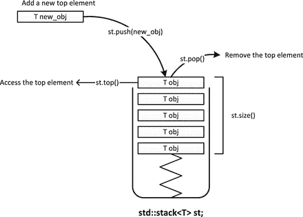
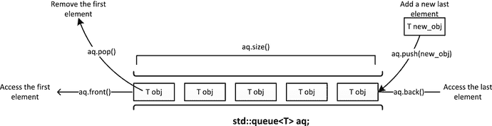
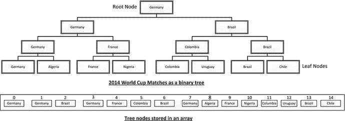
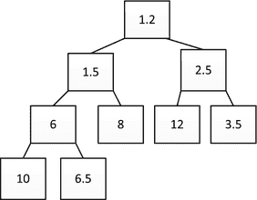
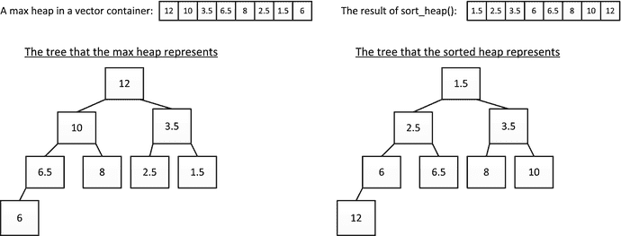

# 3.容器适配器

Electronic supplementary material The online version of this chapter (doi:[10.​1007/​978-1-4842-0004-9_​3](http://dx.doi.org/10.1007/978-1-4842-0004-9_3)) contains supplementary material, which is available to authorized users.

本章解释了你在前一章看到的 STL 提供的容器的一些变体。这些为您在特定环境中使用的序列容器定义了更简单的接口。您还将看到更多关于如何在容器中存储指针的内容。在本章中，您将学习:

*   什么是容器适配器。
*   如何定义一个堆栈，何时以及如何使用它。
*   如何定义和使用队列？
*   如何创建和使用优先级队列，以及它与队列有何不同。
*   什么是堆，如何创建和使用堆，以及堆与优先级队列的关系。
*   在容器中存储指针的好处，尤其是智能指针。

## 什么是容器适配器？

容器适配器是一个类模板，它包装了您在上一章中学习的一个序列容器，以定义另一个提供不同功能的序列容器。它们被称为适配器类，因为它们调整容器的现有接口以提供不同的功能。有三种容器适配器:

*   一个`stack<T>`容器是一个适配器类模板，默认包装一个`deque<T>`容器来实现一个下推栈，这是一种后进先出(`LIFO`)的存储机制。在`stack`头中定义了`stack<T>`模板。
*   一个`queue<T>`容器是一个适配器类模板，默认包装一个`deque<T>`容器实现一个队列，这是先进先出(`FIFO`)的存储机制。如果满足某些条件，您可以指定替代的基础容器。在`queue`头中定义了`queue<T>`模板。
*   一个`priority_queue<T>`容器是一个适配器类模板，它包装了一个`vector<T>`容器来实现一个队列，这个队列对元素进行排序，使得最大的元素总是在最前面。在`queue`头中也定义了`priority_queue<T>`模板。

适配器类根据底层序列容器上的操作来实现它们的操作，这显然可以由您自己来完成。它们提供的优势是其公共接口的简单性和使用它们的代码的可读性。我们将更详细地探索这些容器适配器可以做什么。

## 创建和使用堆栈<t>容器适配器</t>

`stack<T>`容器适配器中的数据是以 LIFO 为基础组织的，类似于自助餐厅中的下沉板栈或箱子中的一堆书；只有栈顶的对象是可访问的。图 [3-1](#Fig1) 显示了一个概念性的`stack`容器及其基本操作。只有顶部元素是可访问的；堆栈中较低位置的元素只能通过移除其上的元素来访问。

图 3-1。

Basic stack container operations

`stack`容器的应用范围很广。例如，你的编辑器中的撤销机制很可能使用堆栈来记录连续的更改；撤消操作反转最后一个操作，该操作将是堆栈顶部的操作。编译器使用堆栈来解析算术表达式，当然，编译后的 C++代码在堆栈中记录函数调用。下面是如何定义一个存储字符串对象的`stack`容器:

`std::stack<std::string> words;`

`stack`容器适配器的模板有两个参数。第一个是存储的对象的类型，第二个是底层容器的类型。默认情况下，`stack<T>`的底层序列容器是一个`deque<T>`容器，所以模板类型实际上是`stack<typename T, typename Container=deque<T>>`。通过指定第二个模板类型参数，可以为支持操作`back()`、`push_back()`、`pop_back()`、`empty()`和`size()`的下属容器使用任何容器类型。下面是如何定义使用`list<T>`容器的`stack`:

`std::stack<std::string, std::list<std::string>> fruit;`

当你创建一个`stack`时，你不能用初始化列表中的对象初始化它，但是你可以创建它，使它包含另一个容器中元素的副本，只要另一个容器与底层容器的类型相同。例如:

`std::list<double> values {1.414, 3.14159265, 2.71828};`

`std::stack<double, std::list<double>> my_stack (values);`

第二条语句创建了`my_stack`，因此它包含了来自`values`的元素的副本。你不能在这里使用带有`stack`构造函数的初始化列表；您必须使用括号。如果您没有在第二个`stack`模板类型参数中将底层容器类型指定为列表，它将是一个`deque`，因此您将不能使用`list`的内容来初始化堆栈；只接受一个`deque`。

`stack<T>`模板定义了一个复制构造函数，因此您可以复制一个现有的`stack`容器:

`std::stack<double, std::list<double>> copy_stack {my_stack};`

`copy_stack`将是`my_stack`的副本。如你所见，当你调用复制构造函数时，你可以使用初始化列表；当然也可以用括号。

### 堆栈操作

`stack`是一种简单的存储机制，与其他序列容器相比，它提供的操作相对较少。下面是一个`stack`容器提供的一整套操作:

*   `top()`返回一个类型为`T&`的引用到栈顶的元素。如果堆栈为空，则返回值是未定义的。
*   `push(const T& obj)`将`obj`的副本推到堆栈顶部。这是通过调用底层容器的`push_back()`成员来完成的。
*   `push(T&& obj)`通过移动将`obj`推到堆栈顶部。这是通过调用具有右值引用参数的底层容器的`push_back()`成员来完成的。
*   删除堆栈顶部的元素。
*   `size()`返回堆栈中元素的数量。
*   如果堆栈中没有元素，则返回 true。
*   `emplace()`使用传递给`emplace()`的参数调用`T`构造函数，在`stack<T>`的顶部创建一个对象。
*   `swap(stack<T> & other_stack)`将当前`stack`的元素与自变量的元素交换。该参数必须包含与当前`stack`相同类型的元素。还有一个针对`stack`对象的全局`swap()`函数模板的专门化，它做同样的事情。

`stack<T>`模板还定义了`operator=()`的复制和移动版本，这样你就可以将一个`stack`对象分配给另一个。对于`stack`对象有一整套比较操作符。通过按字典顺序比较底层容器的相应元素来执行比较。词典式比较是一种用于在词典中对单词进行排序的比较。比较相应的元素，直到一个元素与另一个不相同。比较这些第一非匹配元素的结果是字典式比较的结果。如果一个堆栈包含的元素比另一个多，并且匹配元素对相等，则包含更多元素的堆栈较大。

我们可以在一个实现简单计算器的程序中尝试使用`stack`容器的操作。该计划将支持基本的操作，加，减，乘，除，加上指数运算；相应的运算符有+、-、*、/和^.幂运算由在`cmath`头中定义的`pow()`函数提供。表达式将被读取为单行上的字符串，可以包含空格。在分析字符串和执行它包含的操作之前，我们将使用`remove()`算法消除输入表达式中的空格。

我们将定义下面的函数来提供一个表示运算符优先级的值:

`inline size_t precedence(const char op)`

`{`

`if (op == '+' || op == '-')`

`return 1;`

`if (op == '*' || op == '/')`

`return 2;`

`if (op == '^')`

`return 3;`

`throw std::runtime_error {string{"invalid operator: "} + op};`

`}`

`+`和`-`为最低优先级，其次是`*`和`/`为次高优先级，`^`为最高优先级。运算符优先级将决定包含两个或更多运算符的表达式的执行顺序。如果参数不是支持的操作符之一，抛出一个`runtime_error`异常对象。异常对象的构造函数的`string`参数可以通过调用对象的`what()`在`catch`块中检索。

程序将通过从左到右扫描来分析输入表达式，并将操作符存储在一个`stack`容器`operators`中，将相应的操作数存储在另一个`stack`容器`operands`中。所有的操作符都需要两个操作数，所以执行一个操作需要访问位于`operators`堆栈顶部的操作符，然后从`operands`堆栈中检索顶部的两个元素作为操作数。执行操作将由以下函数执行:

`double execute(std::stack<char>& ops, std::stack<double>& operands)`

`{`

`double result {};`

`double rhs {operands.top()};                          // Get rhs...`

`operands.pop();                                       // ...and delete from stack`

`double lhs {operands.top()};                          // Get lhs...`

`operands.pop();                                       // ...and delete from stack`

`switch (ops.top())                                    // Execute current op`

`{`

`case '+':`

`result = lhs + rhs;`

`break;`

`case '-':`

`result = lhs - rhs;`

`break;`

`case '*':`

`result = lhs * rhs;`

`break;`

`case '/':`

`result = lhs / rhs;`

`break;`

`case '^':`

`result = std::pow(lhs, rhs);`

`break;`

`default:`

`throw std::runtime_error {string{"invalid operator: "} + ops.top()};`

`}`

`ops.pop();                                     // Delete op just executed`

`operands.push(result);`

`return result;`

`}`

参数是对两个`stack`容器的引用。通过调用操作数容器的`top()`来获得操作数。`top()`函数只访问顶层元素；要访问下一个元素，您必须调用`pop()`来删除顶部的元素。注意在`stack`中操作数的顺序是相反的，所以第一个被访问的操作数是操作的右操作数。来自`operators`容器顶部的元素在选择操作的`switch`中使用。如果没有一个 case 语句适用，则会引发一个异常，指示该运算符无效。

以下是完整程序的代码:

`// Ex3_01.cpp`

`// A simple calculator using stack containers`

`#include <cmath>                                 // For pow() function`

`#include <iostream>                              // For standard streams`

`#include <stack>                                 // For stack<T> container`

`#include <algorithm>                             // For remove()`

`#include <stdexcepT>                             // For runtime_error exception`

`#include <string>                                // For string class`

`using std::string;`

`// Code for the precedence() function goes here...`

`// Code for the execute() function goes here...`

`int main()`

`{`

`std::stack<double> operands;                   // Push-down stack of operands`

`std::stack<char> operators;                    // Push-down stack of operators`

`string exp;                                    // Expression to be evaluated`

`std::cout << " An arithmetic expression can include the operators +, -, *, /,"`

< < "`and ^ for exponentiation."`

`<< std::endl;`

`try`

`{`

`while (true)`

`{`

`std::cout << "Enter an arithmetic expression and press Enter"`

<

< < STD::end；

`std::getline(std::cin, exp, '\n');`

`if (exp.empty()) break;`

`// Remove spaces`

`exp.erase(std::remove(std::begin(exp), std::end(exp), ' '), std::end(exp));`

`size_t index {};                              // Index to expression string`

`// Every expression must start with a numerical operand`

`operands.push(std::stod(exp, &index));            // Push the first (lhs) operand on the stack`

`while (true)`

`{`

`operators.push(exp[index++]);                 // Push the operator on to the stack`

`// Get rhs operand`

`size_t i {};                                // Index to substring`

`operands.push(std::stod(exp.substr(index), &i)); // Push rhs operand`

`index += i;                                 // Increment expression index`

`if (index == exp.length())                  // If we are at end of exp...`

`{`

`while (!operators.empty())                // ...execute outstanding ops`

`execute(operators, operands);`

`break;`

`}`

`// If we reach here, there’s another op...`

`// If there’s a previous op of equal or higher precedence execute it`

`while (!operators.empty() && precedence(exp[index]) <= precedence(operators.top()))`

`execute(operators, operands);             //  Execute previous op.`

`}`

`std::cout << "result = " << operands.top() << std::endl;`

`}`

`}`

`catch (const std::exception& e)`

`{`

`std::cerr << e.what() << std::endl;`

`}`

`std::cout << "Calculator ending..." << std::endl;`

`}`

`while`循环位于`try`块中，以捕捉任何可能抛出的异常。`catch`块将异常对象的`what()`成员返回的字符串写入标准错误流。所有的动作都发生在一个无限的`while`循环中，该循环通过输入一个空字符串来终止。使用`remove()`算法从非空输入字符串中删除空格。`remove()`不删除元素，因为它不能；它只是将元素混在一起，覆盖那些要删除的元素。为了去掉留在`exp`字符串中的多余元素，用两个迭代器作为参数调用它的`erase()`成员。第一个是`remove()`返回的迭代器，它将指向字符串中最后一个有效字符之后的字符；第二个迭代器是原始状态下字符串的结束迭代器。这两个迭代器指定的范围内的元素将被删除。

每个操作数通过调用在`string`头中定义的`stod()`函数以浮点值的形式获得。这将把字符序列从作为第一个参数的`string`转换成类型为`double`的值。该函数采用最大长度的字符序列，从字符串中的第一个字符开始，表示有效的浮点值。第二个参数是一个整型变量的指针，在这个变量中，`stod()`将存储第一个字符的索引，这个字符不是字符串中数字的一部分。`string`头还定义了返回一个`float`值的`stof()`和返回一个`long double`值的`stold()`。

因为所有运算符都需要两个操作数，所以有效的输入字符串将始终采用操作数 op 操作数 op 操作数等形式，序列中的第一个和最后一个操作数以及每对操作数之间的运算符。因为有效的输入表达式总是以操作数开始，所以在执行嵌套的不定`while`循环分析输入之前，提取第一个操作数。在循环中，输入字符串后面的操作符被推送到`operators`堆栈中。在验证没有到达字符串末尾之后，从`exp`中提取第二个操作数。这一次，`stod()`的第一个参数是从`index`开始的`exp`的子串，它对应于被压入`operators`堆栈的操作符后面的字符。不在值字符串中的第一个字符的索引存储在`i`中。因为`i`是相对于`index`的，所以我们把它的值加到`index`上来设置`index`指向操作数后面的下一个操作符(或者如果操作数是`exp`中的最后一个，则指向字符串末尾以外的一个)。

当`index`的值比`exp`中的最后一个字符大 1 时，执行`operators`容器中剩余的所有操作符。如果还没有到达字符串的末尾，并且`operators`容器不为空，我们将比较`exp`中下一个操作符和`operators`栈顶操作符的优先级。如果位于堆栈顶部的运算符优先级高于或等于下一个运算符，则必须首先执行堆栈中的运算符。否则，当前位于堆栈顶部的操作符不会被执行，字符串中的下一个操作符将在下一个循环迭代器开始时被推送到堆栈上。通过这种方式，表达式的计算适当考虑了运算符的优先级。

以下是一些输出示例:

`An arithmetic expression can include the operators +, -, *, /, and ^ for exponentiation.`

`Enter an arithmetic expression and press Enter - enter an empty line to end:`

`2^0.5`

`result = 1.41421`

`Enter an arithmetic expression and press Enter - enter an empty line to end:`

`2.5e2 + 1.5e1*4 - 1000`

`result = -690`

`Enter an arithmetic expression and press Enter - enter an empty line to end:`

`3*4*5 + 4*5*6 + 5*6*7`

`result = 390`

`Enter an arithmetic expression and press Enter - enter an empty line to end:`

`1/2 + 1/3 +1/4`

`result = 1.08333`

`Enter an arithmetic expression and press Enter - enter an empty line to end:`

`Calculator ending...`

输出显示计算器工作正常。它还显示了`stod()`函数可以转换用各种符号表示数字的字符串。当然，如果示例支持包含括号的表达式就更好了，但是我将把它留给您来完成。你知道会这样，是吗？

## 创建和使用队列<t>容器适配器</t>

只有`queue<T>`容器适配器中的第一个和最后一个元素是可访问的。您只能在`queue`的后面添加新元素，并且只能从前面删除元素。许多应用程序可以使用`queue`。一个`queue`容器可以用来表示超市收银台的队列，或者一系列等待服务器处理的数据库事务。任何需要在 FIFO 基础上处理的序列都是`queue`容器适配器的候选对象。图 [3-2](#Fig2) 显示了一个队列及其基本操作。

图 3-2。

A queue container

创建`queue`的选项类似于创建`stack`的选项。下面是如何创建一个存储`string`对象的`queue`:

`std::queue<std::string> words;`

还有一个复制构造函数:

`std::queue<std::string> copy_words {words};      // A duplicate of words`

像`stack<T>`一样，`queue<T>`适配器类默认包装一个`deque<T>`容器，但是您可以指定另一个容器作为第二个模板类型参数:

`std::queue<std::string, std::lisT<std::string>> words;`

底层容器类型必须提供操作`front()`、`back()`、`push_back()`、`pop_front()`、`empty()`和`size()`。

### 队列操作

`queue`的一些函数成员与`stack`的相似，但在某些情况下工作方式略有不同:

*   `front()`返回对`queue`中第一个元素的引用。如果队列是`const`，则返回一个`const`引用。如果`queue`为空，则返回值是未定义的。
*   `back()`返回对`queue`中最后一个元素的引用。如果队列是`const`，则返回一个`const`引用。如果`queue`为空，则返回值是未定义的。
*   `push(const T& obj)`将`obj`的副本附加到`queue`的末尾。这是通过调用底层容器的`push_back()`成员来完成的。
*   `push(T&& obj)`通过移动将`obj`附加到`queue`的末尾。这是通过调用具有右值引用参数的底层容器的`push_back()`成员来完成的。
*   `pop()`删除`queue`中的第一个元素。
*   `size()`返回`queue`中元素的个数。
*   如果`queue`中没有元素，则`empty()`返回 true。
*   在调用`T`构造函数时，`emplace()`使用传递给`emplace()`的参数在`queue`后面创建一个对象。
*   `swap(queue<T> &other_q)`将当前`queue`的元素与自变量的元素交换。该参数必须包含与当前`queue`相同类型的元素。还有一个针对`queue`对象的全局`swap()`函数模板的专门化，它也做同样的事情。

`queue<T>`模板定义了`operator=()`的复制和移动版本。有一整套用于`queue`对象的比较操作符，这些操作符存储相同类型的元素，其工作方式与用于`stack`对象的操作符相同。

就像`stack`一样，`queue`没有迭代器。访问元素的唯一方法是遍历内容，在遍历的过程中删除第一个元素。例如:

`std::deque<double> values {1.5, 2.5, 3.5, 4.5};`

`std::queue<double> numbers(values);`

`while (!numbers.empty())                        // List the queue contents...`

`{`

`std ::cout << numbers.front() << " ";         // Output the 1st element`

`numbers.pop();                                // Delete the 1st element`

`}`

`std::cout << std::endl;`

列出数字内容的循环必须由`empty()`返回的值控制。调用`empty()`确保我们不会为空队列调用`front()`。如这个代码片段所示，要访问一个`queue`中的所有元素，您必须删除它们。如果需要保留这些元素，必须将它们复制到另一个容器中。如果这种操作是必要的，很可能你应该使用其他东西而不是`queue`。

### 队列容器的实际应用

让我们一起来看一个使用`queue`容器的例子。这个程序将通过模拟一个超市的运作，向 a `queue`的实际应用倾斜一点。结账队伍的长度是超市运营中的一个关键因素。它会影响商店能够接待的顾客数量，尤其是因为长长的队伍会让顾客望而却步。同样的排队问题出现在许多不同的情况下——例如，医院的床位数量会严重影响急诊设施的运作。我们的超市模拟将是一个简单的模型，具有有限的灵活性。

我们可以在一个标题中定义一个类，`Customer.h`,它代表一个足以满足模拟需求的客户:

`// Defines a customer by their time to checkout`

`#ifndef CUSTOMER_H`

`#define CUSTOMER_H`

`class Customer`

`{`

`private:`

`size_t service_t {};                           // Time to checkout`

`public:`

`explicit Customer(size_t st = 10) :service_t {st}{}`

`// Decrement time remaining to checkout`

`Customer& time_decrement()`

`{`

`if(service_t > 0)`

`--service_t;`

`return *this;`

`}`

`bool done() const { return service_t == 0; }`

`};`

`#endif`

唯一的数据成员`service_t`记录结账顾客购物所需的分钟时间。这将因客户而异。每当过了一分钟，就会调用`time_decrement()`函数，因此该函数将递减`service_t`值，以便它反映直到客户被处理的时间。当`service_t`值为零时，`done()`成员返回`true`。

每个超市的收银台都会有一群等待服务的顾客。在`Checkout.h`中定义结账位置的类是:

`// Supermarket checkout - maintains and processes customers in a queue`

`#ifndef CHECKOUT_H`

`#define CHECKOUT_H`

`#include <queue>                                 // For queue container`

`#include "Customer.h"`

`class Checkout`

`{`

`private:`

`std::queue<Customer> customers;                // The queue waiting to checkout`

`public:`

`void add(const Customer& customer) { customers.push(customer); }`

`size_t qlength() const { return customers.size(); }`

`// Increment the time by one minute`

`void time_increment()`

`{ // There are customers waiting...`

`if (!customers.empty())`

`{ // There are customers waiting...`

`if (customers.front().time_decrement().done()) // If the customer is done...`

`customers.pop();                             // ...remove from the queue`

`}`

`};`

`bool operator<(const CheckouT& other) const { return qlength() < other.qlength(); }`

`bool operator>(const CheckouT& other) const { return qlength() > other.qlength(); }`

`};`

`#endif`

这应该是不言自明的。唯一的成员是等待签出的`Customer`对象的`queue`容器。`add()`成员向`queue`添加一个新客户。只处理第一个`queue`元素。每过一分钟，`Checkout`对象的`time_increment()`成员将被调用，它将调用第一个`Customer`对象的`time_decrement()`成员来递减剩余服务时间，然后调用其`done()`成员。如果`Customer`对象的`done()`返回`true`，则该客户已经被处理，因此从队列中删除。`Checkout`对象的比较运算符比较队列长度。

我们将需要一个随机数生成能力来进行模拟，所以我将从`random`头中使用一个非常简单的工具，而不详细解释它；我将在本书的后面详细介绍`random`头所提供的功能。该程序将使用`uniform_int_distribution<>`类型的实例。顾名思义，它定义了一个均匀分布，整数值均匀分布在最小值和最大值之间。在均匀分布中，该范围内的所有值都具有相同的可能性。您可以使用以下语句定义 10 到 100 之间的分布:

`std::uniform_int_distribution<> d {10, 100};`

这只是定义了一个分布对象`d`，它指定了值如何在范围内分布。为了获得该范围内的随机数，我们需要一个随机数引擎，我们可以将它传递给函数调用操作符`d`，它将返回随机整数。在`random`头中定义了几个随机数引擎。这里我们将使用最简单的，我们可以这样定义:

`std::random_device random_number_engine;`

为了在分布定义的范围内产生一个随机值，`d`，我们可以写出:

`auto value = d(random_number_engine);            // Calls operator()() for d`

存储在`value`中的值将是由`d`定义的分布中的一个整数。

包含模拟器完整程序的源文件如下所示:

`// Ex3_02.cpp`

`// Simulating a supermarket with multiple checkouts`

`#include <iostream>                              // For standard streams`

`#include <iomanip>                               // For stream manipulators`

`#include <vector>                                // For vector container`

`#include <string>                                // For string class`

`#include <numeric>                               // For accumulate()`

`#include <algorithm>                             // For min_element & max_element`

`#include <random>                                // For random number generation`

`#include "Customer.h"`

`#include "Checkout.h"`

`using std::string;`

`using distribution = std::uniform_int_distribution<>;`

`// Output histogram of service times`

`void histogram(const std::vector<inT>& v, int min)`

`{`

`string bar (60, '*');                          // Row of asterisks for bar`

`for (size_t i {}; i < v.size(); ++i)`

`{`

`std::cout << std::setw(3) << i+min << " "    // Service time is index + min`

`<< std::setw(4) << v[i] << " "             // Output no. of occurrences`

`<< bar.substr(0, v[i])                     // ...and that no. of asterisks`

`<< (v[i] > static_casT<inT>(bar.size()) ? "..." : "")`

`<< std::endl;`

`}`

`}`

`int main()`

`{`

`std::random_device random_n;`

`// Setup minimum & maximum checkout periods - times in minutes`

`int service_t_min {2}, service_t_max {15};`

`distribution service_t_d {service_t_min, service_t_max};`

`// Setup minimum & maximum number of customers at store opening`

`int min_customers {15}, max_customers {20};`

`distribution n_1st_customers_d {min_customers, max_customers};`

`// Setup minimum & maximum intervals between customer arrivals`

`int min_arr_interval {1}, max_arr_interval {5};`

`distribution arrival_interval_d {min_arr_interval, max_arr_interval};`

`size_t n_checkouts {};`

`std::cout << "Enter the number of checkouts in the supermarket: ";`

`std::cin >> n_checkouts;`

`if(!n_checkouts)`

`{`

`std::cout << "Number of checkouts must be greater than 0\. Setting to 1." << std::endl;`

`n_checkouts = 1;`

`}`

`std::vector<CheckouT> checkouts {n_checkouts};`

`std::vector<inT> service_times(service_t_max-service_t_min+1);`

`// Add customers waiting when store opens`

`int count {n_1st_customers_d(random_n)};`

`std::cout << "Customers waiting at store opening: " << count << std::endl;`

`int added {};`

`int service_t {};`

`while (added++ < count)`

`{`

`service_t = service_t_d(random_n);`

`std::min_element(std::begin(checkouts), std::end(checkouts))->add(Customer(service_t));`

`++service_times[service_t - service_t_min];`

`}`

`size_t time {};                                  // Stores time elapsed`

`const size_t total_time {600};                   // Duration of simulation - minutes`

`size_t longest_q {};                             // Stores longest checkout queue length`

`// Period until next customer arrives`

`int new_cust_interval {arrival_interval_d(random_n)};`

`// Run store simulation for period of total_time minutes`

`while (time < total_time)                        // Simulation loops over time`

`{`

`++time;                                        // Increment by 1 minute`

`// New customer arrives when arrival interval is zero`

`if (--new_cust_interval == 0)`

`{`

`service_t = service_t_d(random_n);           // Random customer service time`

`std::min_element(std::begin(checkouts), std::end(checkouts))->add(Customer(service_t));`

`++service_times[service_t - service_t_min];  // Record service time`

`// Update record of the longest queue occurring`

`for (auto & checkout : checkouts)`

`longest_q = std::max(longest_q, checkout.qlength());`

`new_cust_interval = arrival_interval_d(random_n);`

`}`

`// Update the time in the checkouts - serving the 1st customer in each queue`

`for (auto & checkout : checkouts)`

`checkout.time_increment();`

`}`

`std::cout << "Maximum queue length = " << longest_q << std::endl;`

`std::cout << "\nHistogram of service times:\n";`

`histogram(service_times, service_t_min);`

`std::cout << "\nTotal number of customers today: "`

`<< std::accumulate(std::begin(service_times), std::end(service_times), 0)`

`<< std::endl;`

`}`

`using`指令是为了节省打字和简化代码。客户服务时间的发生率记录在一个`vector`容器中。服务时间值用于索引`vector`元素，每次通过减去服务时间范围内的最小值来递增，这使得最低服务时间的出现次数被记录在`vector`的第一个元素中。`histogram()`函数以水平条形图的形式生成该范围内每个服务时间出现次数的直方图。

唯一的输入是结帐数量。我选择 600 分钟作为模拟的持续时间，但是你也可以安排输入这个，以及其他参数。`main()`函数为客户服务时间、商店开门时在门口等待的客户数量以及客户到达的时间间隔创建分布对象。言下之意，客户一次到一个；您可以很容易地扩展该程序，使每次到达的顾客数量在一个范围内随机变化。

顾客总是被分配到排队最短的收银台。通过调用返回一个范围内最小元素的`min_element()`算法，找到具有最短队列的`Checkout`对象。它使用`<`操作符来比较元素，但是该算法的另一个版本有第三个参数来指定比较函数。在时间模拟开始之前，商店开门时在门口等候的顾客的初始序列被添加到`Checkout`对象中，并且服务时间记录被更新。

模拟都在一个`while`循环中。每次迭代时，`time`增加一分钟。下一个客户`new_cust_interval`到达的时间周期在每次迭代中递减，当它达到零时，一个新的客户以新的随机服务时间被创建并附加到具有最短队列的`Checkout`对象上。此时`longest_q`变量也被更新，因为新的最长队列只能作为添加新客户的结果出现。

接下来，调用每个`Checkout`对象的`time_increment()`函数，以推进每个队列中第一个客户的处理。循环继续，直到时间达到存储在`total_time`中的值。

以下是一些输出示例:

`Enter the number of checkouts in the supermarket: 3`

`Customers waiting at store opening: 18`

`Maximum queue length = 7`

`Histogram of service times:`

`2   16 ****************`

`3   20 ********************`

`4   13 *************`

`5   16 ****************`

`6   16 ****************`

`7   12 ************`

`8   11 ***********`

`9   14 **************`

`10   10 **********`

`11   20 ********************`

`12   15 ***************`

`13   15 ***************`

`14   14 **************`

`15   14 **************`

`Total number of customers today: 206`

这有三个结账处。当我在两个收银台运行时，最长的队列长度增加到了 42——长到足以失去顾客。为了让模拟更加真实，你还可以做更多的事情。例如，均匀分布并不典型，顾客经常成群结队地到来。您还可以添加员工喝咖啡休息的效果，或者一名员工因感冒而咳嗽和打喷嚏的效果，这可能会鼓励一些客户避免结账。

## 使用 priority_queue <t>容器适配器</t>

不出所料，`priority_queue`容器适配器定义了一个队列，其中的元素是有序的；优先级最高的元素(默认情况下是最大的元素)将位于队列的最前面。因为它是一个队列，所以只有第一个元素是可访问的，这意味着具有最高优先级的元素总是首先被处理。如何定义“优先”完全取决于你。如果`priority_queue`正在记录到达医院的事故和紧急设施的病人，病人情况的严重性将是优先的。如果要素是银行中的经常账户交易，借方很可能优先于贷方。

一个`priority_queue`的模板有三个参数，其中两个有默认实参；第一个是存储的对象的类型，第二个是用于存储元素的底层容器，第三个是 function 对象类型，它定义了确定元素顺序的谓词。因此，模板类型为:

`template`

`<typename T, typename Container=std::vector<T>, typename Compare=std::less<T>> class priority_queue`

如您所见，默认情况下，`priority_queue`实例包装了`vector`容器。在`functional`头中定义的`less<T>`函数对象类型是默认的排序谓词，这决定了容器中最大的对象将在最前面。functional header 还定义了`greater<T>`，您可以将它指定为最后一个模板参数，以便对元素进行排序，使最小的元素位于最前面。当然，如果指定最后一个模板参数，则必须提供另外两个模板类型参数。

图 [3-3](#Fig3) 中显示元素的方式反映了它们将被检索的顺序，这不一定是它们在`vector`中的排序方式，尽管它可能是。当我讨论堆的时候，我会解释为什么会这样。

图 3-3。

A `priority_queue` container

### 创建优先级队列

您可以像这样创建一个空的优先级队列:

`std::priority_queue<std::string> words;`

还可以用一系列适当类型的对象初始化优先级队列。例如:

`std::string wrds[] {"one", "two", "three", "four"};`

`std::priority_queue<std::string> words {std::begin(wrds), std::end(wrds)}; // "two" "three" "one "four"`

该范围可以是来自任何源的序列，并且元素不需要排序。范围内的元素将在优先级队列中适当排序。

复制构造函数创建一个相同类型的现有`priority_queue`对象的副本——特别是，一个具有相同模板类型参数集的对象。例如:

`std::priority_queue<std::string> copy_words {words};           // copy of words`

还有一个带有右值引用参数的复制构造函数，它将移动 argument 对象。

当您希望以相反的方式对内容进行排序，将最小的对象放在优先级队列的前面时，您必须提供所有三个模板类型参数:

`std::string wrds[] {"one", "two", "three", "four"};`

`std::priority_queue<std::string, std::vector<std::string>, std::greater<std::string>>`

`words1 {std::begin(wrds), std::end(wrds)};     // "four" "one" "three "two"`

这创建了一个优先级队列，使用`operator>()`函数来比较范围内的`string`对象，因此它们的顺序与上面的`words`优先级队列中的顺序相反。

优先级队列可以使用任何容器来存储具有函数成员`front()`、`push_back()`、`pop_back()`、`size()`和`empty()`的元素。这包括一个`deque`容器，因此您可以使用它作为替代:

`std::string wrds[] {"one", "two", "three", "four"};`

`std::priority_queue<std::string, std::deque<std::string>> words {std::begin(wrds), std::end(wrds)};`

`words`优先级队列将来自`wrds`数组的`string`对象存储在一个带有默认比较谓词的`deque`容器中，因此它们的顺序与上面的`words1`相同。`priority_queue`构造函数将创建一个由第二个类型参数指定的类型的序列容器来保存元素，这将是`priority_queue`对象的内部。

您还可以创建一个`vector`或`deque`容器，并将其指定为初始化`priority_queue`的元素源。下面是如何创建一个使用来自`vector`容器的元素副本作为初始值集的`priority_queue`:

`std::vector<inT> values{21, 22, 12, 3, 24, 54, 56};`

`std::priority_queue<inT> numbers {std::less<inT>(), values};`

`priority_queue`构造函数的参数是用于排序元素的函数对象和提供初始元素集的容器。向量中元素的副本将使用函数对象在优先级队列中排序。`values`中的元素将按照它们原来的顺序，但是优先级队列中的元素将按照顺序:`56 54  24  22  21  12  3`。优先级队列用来存储元素的容器对于优先级队列来说是私有的，所以与内容交互的唯一方式是调用`priority_queue`对象的函数成员。作为第一个构造函数参数的函数对象的类型必须与指定为`Compare`模板类型参数的类型相同，默认情况下是`less<T>`。如果要使用不同类型的函数对象，必须指定所有模板类型参数。例如:

`std::priority_queue<int, std::vector<inT>, std::greater<inT>>`

`numbers1 {std::greater<inT>(), values};`

第三个类型参数是比较对象的类型。如果您需要指定这一点，您还必须指定前两个——元素类型和基础容器的类型。

### 优先级队列的操作

操作`priority_queue`需要的操作范围有限:

*   `push(const T& obj)`将`obj`的一个副本按顺序推入容器中的适当位置，这通常涉及到一个排序操作。
*   `push(T&& obj)`将`obj`移动到容器中序列中适当的位置，这通常涉及到一个排序操作。
*   `emplace(T constructor args...)`通过调用带有传递参数的构造函数，在序列中的适当位置构造一个`T`对象。这通常需要排序操作来保持优先级顺序。
*   返回优先级队列中第一个对象的引用。
*   `pop()`删除第一个元素。
*   `size()`返回队列中对象的数量。
*   如果队列为空，则返回 true。
*   将此队列的元素与变元的元素互换，变元必须包含相同类型的对象。

为`priority_queue`实现赋值操作符，以将作为右操作数的对象的元素赋给作为左操作数的对象；定义了赋值操作符的复制和移动版本。注意，没有为`priority_queue`容器定义比较操作符。显然，添加新元素通常会非常慢，因为排序可能是维持顺序所必需的。在后面关于堆的章节中，我会多说一点关于`priority_queue`的内部操作。

以下是如何记录从键盘输入到`priority_queue`中的数据的示例:

`std::priority_queue<std::string> words;`

`std::string word;`

`std::cout << "Enter words separated by spaces, enter Ctrl+Z on a separate line to end:\n";`

`while (true)`

`{`

`if ((std::cin >> word).eof())`

`break;`

`words.push(word);`

`}`

输入`Ctrl+Z`设置输入流中文件状态的结束，因此这用于结束输入循环。一个`istream`对象的`operator>>()`成员返回该对象，因此我们可以调用`eof()`来使用`if`条件中的表达式测试`cin`的状态。输入的单词将被排序，最大的单词在`words`队列的最前面——输入被自动排序。

`priority_queue`没有迭代器。如果您想要访问所有的元素——例如列出或复制它们——您将清空队列；一个`queue`和一个`priority_queue`有相同的限制。如果您想在这样的操作之后保留它，您将需要首先复制它，但是如果是这种情况，您可能应该使用不同类型的容器。你可以这样列出上面单词优先级队列的内容:

`std::priority_queue<std::string> words_copy {words};  // A copy for output`

`while (!words_copy.empty())`

`{`

`std::cout << words_copy.top() << " ";`

`words_copy.pop();`

`}`

`std::cout << std::endl;`

这首先制作了一个`words`的副本，因为仅仅输出`words`就会删除内容。在输出了`top()`返回的元素后，我们通过调用`pop()`移除它，使下一个元素可访问。在循环条件中调用`empty()`会在所有元素都被移除后结束循环。您可以使用表达式`words_copy.size()`来控制循环何时结束，因为返回值将被隐式转换为`bool`，所以当`size()`返回`0`时，结果是`false`。

如果`words`的输入为:

`one two three four five six seven`

`^Z`

输出将是:

`two three six seven one four five`

当然，如果你需要不止一次地输出一个`priority_queue`的内容，在函数中输出会更好。你可以说得更一般一点，就像这样:

`template<typename T>`

`void list_pq(std::priority_queue<T> pq, size_t count = 5)`

`{`

`size_t n{count};`

`while (!pq.empty())`

`{`

`std::cout << pq.top() << " ";`

`pq.pop();`

`if (--n) continue;`

`std::cout << std::endl;`

`n = count;`

`}`

`std::cout << std::endl;`

`}`

参数是通过值传递的，因此这将处理优先级队列的一个副本。它是一个模板，适用于任何实现了输出到`ostream`对象的`operator<<()`的类型。如果省略第二个参数，默认情况下输出值为每行 5 个。当然，您可以定义一个类似的函数模板来处理`queue`容器适配器对象。

您可以像这样使用`priority_queue`的`emplace()`函数成员:

`words.emplace("nine");`

作为参数的`string`文字将被用作调用`string`类构造函数的参数，以在容器中就地创建对象。这比这个语句要有效得多:

`words.push("nine");`

在这里，编译器将插入一个`string`构造函数调用来创建从`string`文字到`push()`的参数，然后用这个临时的`string`对象作为参数调用`push()`。然后，`push()`函数将调用`string`类复制构造函数来创建添加到容器中的对象。

我们可以将一些代码片段组合成一个完整的程序:

`// Ex3_03.cpp`

`// Exercising a priority queue container adapter`

`#include <iostream>                              // For standard streams`

`#include <queue>                                 // For priority_queue<T>`

`#include <string>                                // For string class`

`using std::string;`

`// List contents of a priority queue`

`template<typename T>`

`void list_pq(std::priority_queue<T> pq, size_t count = 5)`

`{`

`size_t n {count};`

`while (!pq.empty())`

`{`

`std::cout << pq.top() << " ";`

`pq.pop();`

`if (--n) continue;`

`std::cout << std::endl;`

`n = count;`

`}`

`std::cout << std::endl;`

`}`

`int main()`

`{`

`std::priority_queue<std::string> words;`

`std::string word;`

`std::cout << "Enter words separated by spaces, enter Ctrl+Z on a separate line to end:\n";`

`while (true)`

`{`

`if ((std::cin >> word).eof())`

`break;`

`words.push(word);`

`}`

`std::cout << "You entered " << words.size() << " words." << std::endl;`

`list_pq(words);`

`}`

以下是一些示例输出:

`Enter words separated by spaces, enter Ctrl+Z on a separate line to end:`

`one two three four five six seven eight nine ten eleven twelve`

`^Z`

`You entered 12 words:`

`two twelve three ten six`

`seven one nine four five`

`eleven eight`

`list_pq<T>()`函数模板实例的输出显示输入被优先级队列排序。

## 很

堆不是容器，但它是数据的一种特殊组织。堆通常存储在序列容器中。堆很重要，因为它们会出现在许多不同的计算机进程中。为了理解什么是堆，你首先需要有一个什么是树的概念，所以我将首先解释什么是树数据结构。

树是元素或节点的分层排列。每个节点都有一个键，它是存储在节点中的对象——就像链表中的一个节点。父节点是具有一个或多个子节点的节点。一般来说，父节点可以有任意数量的子节点，树中的父节点不必有相同数量的子节点。没有子节点的节点称为叶节点。父节点的键与其子节点的键之间通常存在某种关系。一棵树总是有一个根节点，这个根节点是树的基础，所有的子节点都可以从这个根节点到达。

图 [3-4](#Fig4) 显示了 2014 年世界杯足球赛决赛结果的树。德国总体赢了，所以是根节点；它在决赛中击败了巴西，所以它的子节点是它自己和巴西。每个父节点最多有两个子节点的树称为二叉树。图 [3-4](#Fig4) 中的树是一个完整的二叉树，因为每个父节点都有两个子节点。任意树中的父节点需要指针来标识子节点。一个完整的二叉树可以存储为一个数组或其他序列，如`vector`，而不需要指向子节点的指针，因为每一层的节点数是已知的。如果将树中的每一层编号为`n`，从根节点开始为 0 层，每一层包含`2` `n` 节点。图 [3-4](#Fig4) 显示了世界杯比赛树中的节点如何存储在一个数组中；每个节点上面的整数是索引值。根节点存储为第一个数组元素，后面是它的两个子节点。这些子节点的子节点对按顺序出现在下一个节点，依此类推，直到叶节点。存储在数组中索引`n`处的节点的父节点的索引总是`(n-1)/2`的整数结果。如果数组元素的索引从 1 开始，那么索引为`n`的节点的父节点的索引的表达式甚至更简单，即`n/2`的整数值。

图 3-4。

Example of a binary tree

我现在可以定义一个堆:堆是一个完整的二叉树，其中每个节点相对于其子节点是有序的。父节点要么总是大于或等于其子节点，这种情况称为最大堆，要么总是小于或等于其子节点，这种情况称为最小堆。注意，给定父节点的子节点在堆中不一定相对于彼此排序。

### 创建堆

您需要处理堆的函数是由`algorithm`头中的模板定义的。`max_heap()`函数将在随机访问迭代器定义的范围内重新排列元素，使它们形成一个堆。为此，它默认使用`<`操作符，这会产生一个最大堆。这里有一个例子:

`std::vector<double> numbers { 2.5, 10.0, 3.5, 6.5, 8.0, 12.0, 1.5, 6.0 };`

`std::make_heap(std::begin(numbers), std::end(numbers)); // Result: 12 10 3.5 6.5 8 2.5 1.5 6`

在执行了`make_heap()`调用后，`vector`中的元素将如注释所示。这意味着如图 [3-5](#Fig5) 所示的结构。

图 3-5。

The tree that a heap represents

根节点是 12，10 和 3.5 是子节点。值为 10 的元素的子节点是 6.5 和 8，值为 3.5 的元素的子节点是 2.5 和 1.5。值为 6.5 的元素有一个叶节点作为值为 6 的子节点。

一个`priority_queue`就是一堆！在幕后，`priority_queue`的一个实例创建了一个堆。这就是为什么图 [3-3](#Fig3) 没有反映元素在底层容器中的排列方式。在堆中，在所有连续的元素对之间不一定应用相同的比较关系。图 [3-5](#Fig5) 所示堆中的前三个元素是降序排列的，但是第四个元素比第三个元素大。那么，为什么 STL 既有用于堆的`priority_queue`的功能，又有创建堆的能力，尤其是因为你可以使用堆作为优先级队列？

嗯，`priority_queue`比堆更有优势；要素顺序是自动维护的。你不能打乱一个`priority_queue`的有序状态，因为除了第一个元素，你不能直接访问任何其他元素。如果您想要的只是一个优先队列，这是一个很大的优势。

另一方面，使用`make_heap()`创建的堆比使用`priority_queue`有一些优势:

*   您可以访问堆中的任何元素，不仅仅是最大的元素，因为这些元素存储在一个容器中，比如您拥有的一个`vector`中。这确实有可能意外打乱元素的顺序，但是您总是可以通过调用`make_heap()`来恢复它。
*   您可以在任何具有随机访问迭代器的序列容器中创建一个堆。这包括您定义的普通数组、`string`对象或容器。这意味着您可以在任何需要的时候将这样一个序列容器中的元素排列成一个堆，并且如果需要的话可以重复排列。您甚至可以将元素的子集安排成一个堆。
*   如果使用维护堆顺序的堆函数，可以将堆用作优先级队列。

还有另一个版本的`make_heap()`,它有第三个参数，您可以为它提供一个比较函数，用于对堆进行排序。通过指定一个定义大于号操作符的函数，您将创建一个最小堆。为此，您可以使用来自`functional`头的谓词。例如:

`std::vector<double> numbers {2.5, 10.0, 3.5, 6.5, 8.0, 12.0, 1.5, 6.0};`

`std::make_heap(std::begin(numbers), std::end(numbers),`

`std::greater<>()); // Result: 1.5 6 2.5 6.5 8 12 3.5` `10`

您可以为`greater`指定模板类型参数。这里带有空尖括号的版本推导出了类型参数和返回类型。使用`make_heap()`函数在容器中创建了一个堆之后，您可以对其应用一系列操作，所以接下来让我们来看看这些操作。

### 堆操作

因为堆不是容器，而是容器中元素的特定组织，所以只能通过 begin 迭代器和 end 迭代器将堆标识为一个范围。这意味着您可以在一个容器中创建一个元素子序列堆。创建了一个堆之后，你肯定会想要添加元素。`algorithm`中的`push_heap()`模板函数可以做到这一点，但是乍一看，它的方式似乎有点奇怪。要将一个元素添加到一个堆中，首先要通过对序列有效的任何方法将该元素添加到序列中。然后，调用`push_heap()`将最后一个元素——您添加的元素——插入序列中的正确位置，以保持堆的排列。例如:

`std::vector<double> numbers { 2.5, 10.0, 3.5, 6.5, 8.0, 12.0, 1.5, 6.0};`

`std::make_heap(std::begin(numbers), std::end(numbers)); // Result: 12 10 3.5 6.5 8 2.5 1.5 6`

`numbers.push_back(11);                                  // Result: 12 10 3.5 6.5 8 2.5 1.5 6 11`

`std::push_heap(std::begin(numbers), std::end(numbers)); // Result: 12 11 3.5 10 8 2.5 1.5 6 6.5`

注释显示了每个操作对`numbers`中元素的影响。向堆中添加元素的过程必须这样进行。只能通过调用函数成员向容器中添加新元素——接收迭代器指定范围的函数没有添加元素的机制。是`push_back()`将元素添加到序列的末尾，`push_heap()`恢复堆的顺序。通过调用`push_heap()`,您发出信号表明您已经将一个元素添加到一个堆中，这可能打乱了堆的顺序。因此，`push_heap()`函数假定最后一个元素是新的，并重新排列序列中的元素以维护堆。从结果中可以看出，在这种情况下，重要的重排是必要的。您还会注意到，虽然序列是一个堆，但元素并不完全是降序排列的。这清楚地表明，虽然优先级队列是一个堆，但是堆中元素的顺序不一定与优先级队列中的顺序相同。

当然，如果您使用自己的比较函数创建堆，那么您必须使用与`push_heap()`相同的比较函数:

`std::vector<double> numbers {2.5, 10.0, 3.5, 6.5, 8.0, 12.0, 1.5, 6.0};`

`std::make_heap(std::begin(numbers), std::end(numbers),`

`std::greater<>()); // Result: 1.5 6 2.5 6.5 8 12 3.5 10`

`numbers.push_back(1.2);                                  // Result: 1.5 6 2.5 6.5 8 12 3.5 10 1.2`

`std::push_heap(std::begin(numbers), std::end(numbers),`

`std::greater<>()); // Result: 1.2 1.5 2.5 6 8 12 3.5 10 6.5`

如果不将第三个参数指定为与第三个参数相同，代码将无法正常工作。评论中显示的结果与 6.5 last 看起来有点奇怪，但图 [3-6](#Fig6) 中显示的堆树会澄清这一点。

图 3-6。

A heap of floating-point values

从树中可以明显看出，6.5 是 6 的子节点，而不是 10 的子节点，所以堆的组织是应该的。

移除最大的元素有点类似于向堆中添加元素，但是事情发生的方式正好相反。首先调用`pop_heap()`，然后从容器中移除最大的元素，就像这样:

`std::vector<double> numbers {2.5, 10.0, 3.5, 6.5, 8.0, 12.0, 1.5, 6.0};`

`std::make_heap(std::begin(numbers), std::end(numbers)); // Result: 12 10 3.5 6.5 8 2.5 1.5 6`

`std::pop_heap(std::begin(numbers), std::end(numbers));  // Result: 10 8 3.5 6.5 6 2.5 1.5 12`

`numbers.pop_back();                                     // Result: 10 8 3.5 6.5 6 2.5 1.5`

`pop_heap()`函数将第一个元素放在最后，然后确保其余的元素仍然表示一个堆。然后调用`vector`的`pop_back()`成员来删除最后一个元素。

如果您使用自己的比较函数和`make_heap()`创建了堆，那么您还必须将该函数作为第三个参数提供给`pop_heap()`:

`std::vector<double> numbers {2.5, 10.0, 3.5, 6.5, 8.0, 12.0, 1.5, 6.0};`

`std::make_heap(std::begin(numbers), std::end(numbers),`

`std::greater<>()); // Result: 1.5 6 2.5 6.5 8 12 3.5` `10`

`std::pop_heap(std::begin(numbers), std::end(numbers),`

`std::greater<>());  // Result: 2.5 6 3.5 6.5 8 12 10 1.5`

`numbers.pop_back();                                     // Result: 2.5 6 3.5 6.5 8 12 10`

从注释中显示的操作结果来看，您需要为`pop_heap()`提供比较器的原因显而易见。该函数不只是将第一个元素与最后一个元素交换；它还对从`begin(numbers)`到`end(numbers)-1`范围内的元素进行重新排序，以保持堆的顺序。为了正确地做到这一点，`pop_heap()`必须使用与`make_heap()`相同的比较函数。

因为您可以对存储堆的容器做一些事情来打乱堆，所以 STL 提供了一种检查序列是否仍然是堆的方法:

`if (std::is_heap(std::begin(numbers), std::end(numbers)))`

`std::cout << "Great! We still have a heap.\n";`

`else`

`std::cout << "Oh bother! We messed up the heap.\n";`

如果范围是堆，`is_heap()`函数返回`true`。当然，这里是使用默认比较谓词`less<>`的实例来检查顺序。如果堆是使用`greater<>`的实例创建的，结果将是错误的。在这种情况下，为了得到正确的结果，你必须使用表达式`std::is_heap(std::begin(numbers),std::end(numbers),std::greater<>())`。

另一个检查工具是检查一个部分是堆的范围。例如:

`std::vector<double> numbers {2.5, 10.0, 3.5, 6.5, 8.0, 12.0, 1.5, 6.0};`

`std::make_heap(std::begin(numbers), std::end(numbers),`

`std::greater<>());  // Result: 1.5 6 2.5 6.5 8 12 3.5 10`

`std::pop_heap(std::begin(numbers),  std::end(numbers),`

`std::greater<>());  // Result: 2.5 6 3.5 6.5 8 12 10 1.5`

`auto iter = std::is_heap_until(std::begin(numbers), std::end(numbers), std::greater<>());`

`if(iter != std::end(numbers))`

`std::cout << "numbers is a heap up to " << *iter << std::endl;`

`is_heap_until()`函数返回一个迭代器，该迭代器指向范围中不按堆顺序排列的第一个元素。这个片段将输出最后一个元素`1.5`的值，因为它不在`pop_heap()`调用之后的堆序列中。如果整个范围是一个堆，那么函数返回结束迭代器，因此`if`语句是必要的，以确保您不会试图解引用结束迭代器。如果范围包含的元素少于两个，也将返回结束迭代器。还有第二个版本的`is_heap_until()`，带有两个参数，将使用默认谓词`less<>`。

STL 提供的最后一个操作是`sort_heap()`，它对一个假定为堆的范围进行排序。如果它不是堆，那么在运行时会崩溃。带有两个参数(对应于定义范围的迭代器)的函数版本假设该范围是一个最大堆(即，使用一个`less<>`的实例进行排列),并将元素按升序排序。结果当然不会是最大堆。下面是一个使用它的例子:

`std::vector<double> numbers {2.5, 10.0, 3.5, 6.5, 8.0, 12.0, 1.5, 6.0};`

`std::make_heap(std::begin(numbers), std::end(numbers));  // Result: 12 10 3.5 6.5 8 2.5 1.5 6`

`std::sort_heap(std::begin(numbers), std::end(numbers));  // Result: 1.5 2.5 3.5 6 6.5 8 10` `12`

排序操作的结果显然不可能是最大堆，但它是最小堆，如图 [3-7](#Fig7) 中的树所示。虽然堆不一定是完全有序的，但是任何完全有序的序列都是堆。

图 3-7。

A min heap resulting from sorting a max heap

第二个版本的`sort_heap()`有第三个参数，您可以为其提供用于创建堆的谓词。如果您用来创建堆的谓词是`greater<>`，那么它是一个 min 堆，结果将是元素按降序排序。结果不能是最小堆。这里有一个片段可以说明这一点:

`std::vector<double> numbers {2.5, 10.0, 3.5, 6.5, 8.0, 12.0, 1.5, 6.0};`

`std::make_heap(std::begin(numbers), std::end(numbers),`

`std::greater<>()); // Result: 1.5 6 2.5 6.5 8 12 3.5 10`

`std::sort_heap(std::begin(numbers), std::end(numbers),`

`std::greater<>()); // Result: 12 10 8 6.5 6 3.5 2.5 1.5`

正如最后一行中的注释所示,`sort_heap()`在最小堆上的结果是最大堆。

您知道`algorithm`头定义了一个`sort()`函数的模板，您可以用它来对堆进行排序，那么为什么会有一个`sort_heap()`函数呢？`sort_heap()`函数使用一种特殊的排序算法，不可思议的巧合是这种算法被称为堆排序。这首先创建一个堆，然后利用数据是部分有序的这一事实对数据进行排序；`sort_heap()`假设堆存在，所以它只做第二位。利用堆的部分排序可能会使排序更快，尽管情况并不总是如此。

在一个例子中，我们可以使用堆作为优先级队列，它是`Ex3_03.cpp`的变体:

`// Ex3_04.cpp`

`// Using a heap as a priority queue`

`#include <iostream>                              // For standard streams`

`#include <iomanip>                               // For  stream manipulators`

`#include <algorithm>                             // For heap support functions`

`#include <string>                                // For string class`

`#include <deque>                                 // For deque container`

`using std::string;`

`// List a deque of words`

`void show(const std::deque<string>& words, size_t count = 5)`

`{`

`if(words.empty()) return;                      // Ensure deque has elements`

`// Find length of longest string`

`auto max_len = std::max_element(std::begin(words), std::end(words),`

``

`{return s1.size() < s2.size(); })->size();`

`// Output the words`

`size_t n {count};`

`for(const auto& word : words)`

`{`

`std::cout << std::setw(max_len + 1) << word << " ";`

`if(--n) continue;`

`std::cout << std::endl;`

`n = count;`

`}`

`std::cout << std::endl;`

`}`

`int main()`

`{`

`std::deque<string> words;`

`std::string word;`

`std::cout << "Enter words separated by spaces, enter Ctrl+Z on a separate line to end:\n";`

`while (true)`

`{`

`if ((std::cin >> word).eof())`

`{`

`std::cin.clear();`

`break;`

`}`

`words.push_back(word);`

`}`

`std::cout << "The words in the list are:" << std::endl;`

`show(words);`

`std::make_heap(std::begin(words), std::end(words));`

`std::cout << "\nAfter making a heap, the words in the list are:" << std::endl;`

`show(words);`

`std::cout << "\nYou entered " << words.size() << " words. Enter some more:" << std::endl;`

`while (true)`

`{`

`if ((std::cin >> word).eof())`

`{`

`std::cin.clear();`

`break;`

`}`

`words.push_back(word);`

`std::push_heap(std::begin(words), std::end(words));`

`}`

`std::cout << "\nThe words in the list are now:" << std::endl;`

`show(words);`

`}`

以下是一些输出示例:

`Enter words separated by spaces, enter Ctrl+Z on a separate line to end:`

`one two three four five six seven`

`^Z`

`The words in the list are:`

`one    two  three   four   five`

`six  seven`

`After making a heap, the words in the list are:`

`two    one  three   four   five`

`six  seven`

`You entered 7 words. Enter some more:`

`eight nine ten twelve fifteen ninety forty fifty-three`

`^` `Z`

`The words in the list are now:`

`two       twelve        three         nine          ten`

`six        seven        eighT&#x00A0;        four         five`

`one      fifteen       ninety        forty  fifty-three`

这个例子在一个`deque`容器中创建了一个堆，只是为了与众不同；一辆`vector`也可以。`show()`函数是一个助手，它列出了`deque<string>`容器中的单词。对于简洁的输出，单词以比最大单词长度大 1 的固定字段宽度呈现。计算最大长度的语句使用在`algorithm`头中定义的`max_element()`函数模板的一个实例。该函数返回一个迭代器，该迭代器指向使用您提供的比较函数获得的范围中的最大元素。前两个参数是指定范围的迭代器。第三个参数是要使用的比较，在本例中是一个 lambda 表达式。

注意，`max_element()`函数需要定义一个小于操作来寻找最大元素，而不是大于。比较函数的形式应该是:

`bool comp(const T1& a, const T2& b);`

在大多数情况下，第一个参数的类型与第二个参数的类型相同，但通常类型可以不同。唯一的附带条件是范围中的元素必须可以隐式转换为类型`T1`和`T2`。参数不需要指定为`const`，但是这样做是个好主意。在任何情况下，比较函数都不能改变传递给它的参数。

lambda 表达式只返回字符串参数的`size()`成员的值的比较结果。`max_element()`返回的迭代器将指向最长的字符串，因此它被用来调用`size()`成员以在`max_len`中记录它的长度。

按照您之前看到的方式从`cin`开始朗读单词。这里调用`cin`的`clear()`成员来清除进入`Ctrl+Z`时设置的`EOF`状态。如果您不调用`clear()`,`EOF`状态将保持不变，因此您将无法在`main()`中以同样的方式从标准输入流中获得输入。

在读取一个单词序列后，通过调用`make_heap()`将`deque`容器的内容排列成一个堆。然后我们读取更多的单词，但是这一次通过在每个单词被添加到容器后调用`push_heap()`来保持堆的顺序。`push_heap()`期望新元素被添加到容器的末尾；如果你使用`push_front()`，程序会崩溃，因为堆是无效的。输出显示，它一切正常。

当然，您可以在每个输入单词后使用`push_heap()`，在这种情况下，您不需要调用`make_heap()`。这个例子说明了在您的控制下底层容器如何使您能够访问整个序列并保留它，而不必像使用`priority_queue`容器适配器那样复制它。

## 在容器中存储指针

通常情况下，将指针存储在容器中比存储在对象中更好，而且大多数时候智能指针比原始指针更好。这有几个原因:

*   在容器中存储指针意味着指针被复制，而不是它们指向的对象。复制指针通常比复制对象快得多。
*   通过在容器中存储指针，可以获得多态行为。一个定义为存储指向基本类型元素的指针的容器也可以存储指向派生类型对象的指针。当您需要处理具有公共基类的任意对象序列时，这是一个非常有用的功能。这种应用的一个常见示例是处理要显示的一系列对象，如直线、曲线和几何形状。
*   对指针容器的内容进行排序将比对对象进行排序更快；只需要移动指针，而不需要移动对象。
*   存储智能指针比存储原始指针更安全，因为空闲存储中的对象在不再被引用时会被自动删除。您不必担心可能的内存泄漏。默认情况下，不指向任何东西的智能指针是`nullptr`。

众所周知，智能指针主要有两种类型:`unique_ptr<T>`和`shared_ptr<T>`。一个`unique_ptr`对它所指向的任何对象拥有独占的所有权，而一个`shared_ptr`允许多个指向同一个对象的指针存在。还有一种`weak_ptr<T>`类型，这是一种智能指针，总是从`shared_ptr<T>`创建，用于避免`shared_ptr` s 可能出现的循环引用所导致的问题。通过将`unique_ptr<T>`类型的指针移动到容器中，可以将它们存储在容器中。例如，这可以编译:

`std::vector<std::unique_ptr<std::string>> words;`

`words.push_back(std::make_unique<std::string>("one"));`

`words.push_back(std::make_unique<std::string>("two"));`

`vector`存储类型为`unique_ptr<string>`的智能指针。`make_unique<T>()`函数创建对象和智能指针，并返回后者。因为结果是一个临时的`unique_ptr<string>`对象，调用带有右值引用参数的`push_back()`函数，所以不需要复制。添加一个`unique_ptr`对象的另一种方法是创建一个本地`unique_ptr`变量，并使用`std::move()`将其移动到容器中。但是，任何需要复制容器元素的后续操作都将失败。只能有一个。如果你必须能够复制元素，那么`shared_ptr`对象是你的不二选择；否则使用`unique_ptr`对象。

### 在序列容器中存储指针

我将首先解释在容器中使用原始指针可能遇到的问题，然后继续使用智能指针——这是推荐的方法。这里有一段代码从标准输入流中读取单词，并将指向`string`对象的指针存储在`vector`容器的空闲存储区中:

`std::vector<std::string*> words;`

`std::string word;`

`std::cout << "Enter words separated by spaces, enter Ctrl+Z on a separate line to end:\n";`

`while (true)`

`{`

`if ((std::cin >> word).eof())`

`{`

`std::cin.clear();`

`break;`

`}`

`words.push_back(new std::string {word});       // Create object and store its address`

`}`

作为`push_back()`的参数的表达式在自由存储中创建了一个`string`对象，因此`push_back()`的参数是该对象的地址。下面是如何列出`words`向量的内容；

`for (auto& w : words)`

`std::cout << w << " ";`

`std::cout << std::endl;`

如果您想使用迭代器来访问容器元素，输出字符串的代码如下所示:

`for (auto iter = std::begin(words); iter != std::end(words); ++iter)`

`std::cout << **iter << " ";`

`std::cout << std::endl;`

`iter`是一个迭代器，您必须解引用它才能访问它所指向的元素。该元素是一个指针，因此您必须取消对它的引用才能获得字符串对象；因此有了`**iter`这个说法。

在擦除指针元素以释放空闲存储内存时，您必须小心。如果不这样做，在指针被删除后，你将无法释放内存，除非你复制了指针。这是容器中原始指针内存泄漏的一个常见来源。下面是使用`words`向量时可能发生的情况:

`for (auto iter = std::begin(words); iter != std::end(words) ; )`

`{`

`if (**iter == "one")`

`words.erase(iter);                         // Memory leak!`

`else`

`++iter;`

`}`

这删除了一个指针，但是它所指向的内存仍然存在。每当删除原始指针元素时，首先释放内存:

`for (auto iter = std::begin(words); iter != std::end(words) ; )`

`{`

`if (**iter == "one")`

`{`

`delete *iter;                              // Release the memory...`

`words.erase(iter);                         // ...then delete the pointer`

`}`

`else`

`++iter;`

`}`

在`vector`超出范围之前，您必须记得从自由存储中删除`string`对象。有一种方法可以做到这一点:

`for (auto& w : words)`

`delete w;                                    // Delete the string pointed to`

`words.clear();                                 // Delete all the elements from the vector`

使用索引访问指针，所以只需使用删除操作符来删除`string`对象。当循环结束时，`vector`中的所有元素都是无效指针，所以不要让`vector`处于这种状态是很重要的。调用`clear()`会删除所有元素，所以为向量调用`size()`现在会返回 0。当然，您可以使用迭代器，在这种情况下，循环将是:

`for (auto iter = std::begin(words); iter != std::end(words); ++iter)`

`delete *iter;`

如果你存储智能指针，就不需要担心在免费存储中释放内存。智能指针会解决这个问题。下面是读取字符串并将`shared_ptr<string>`对象存储在`vector`中的代码片段:

`std::vector<std::shared_ptr<std::string>> words;`

`std::string word;`

`std::cout << "Enter words separated by spaces, enter Ctrl+Z on a separate line to end:\n";`

`while (true)`

`{`

`if ((std::cin >> word).eof())`

`{`

`std::cin.clear();`

`break;`

`}`

`words.push_back(std::make_shared<string>(word));    // Create smart pointer to string & store it`

`}`

这和原始指针版本没有太大区别。`vector`模板的类型参数现在是`std::shared_ptr<std::string>`，而`push_back()`的参数调用`make_shared()`，这在自由存储中创建了`string`对象和指向它的智能指针；然后，该函数返回智能指针。因为智能指针是由自变量表达式创建的，所以将调用带有右值引用参数的版本`push_back()`，这将把指针移动到容器中。

模板类型参数可能有点麻烦，但是您总是可以使用 using 指令来简化代码的外观。例如:

`using PString = std::shared_ptr<std::string>;`

这样，您可以像这样定义`vector`容器:

`std::vector<PString> words;`

通过智能指针元素访问字符串与使用原始指针完全相同。输出`words`内容的两个早期片段与智能指针一样工作良好。当然，没有必要从免费存储中删除字符串对象；智能指针会解决这个问题。执行`words.clear()`会删除所有元素，因此将调用智能指针的析构函数；这也将释放为它们所指向的对象分配的内存。

为了防止`vector`容器过于频繁地为元素分配额外的内存，创建`vector`，然后调用`reserve()`来分配初始内存量。例如:

`std::vector<std::shared_ptr<std::string>> words;`

`words.reserve(100);                              // Space for 100 smart pointers`

这比用预定义数量的元素创建`vector`要好，因为这样做时，每个元素都将通过调用`shared_ptr<string>`构造函数来创建。这没什么大不了的，但是没有必要产生不必要的开销，即使开销很小。通常，每个智能指针所需的空间会比它所指向的对象所需的空间少很多，所以你可以用`reserve()`慷慨地分配空间。

存储`shared_ptr<T>`对象允许指针的副本存在于容器之外。如果你不需要这个功能，你应该使用`unique_ptr<T>`对象。下面是如何与`words`向量一起工作的:

`std::vector<std::unique_ptr<std::string>> words;`

`std::string word;`

`std::cout << "Enter words separated by spaces, enter Ctrl+Z on a separate line to end:\n";`

`while (true)`

`{`

`if ((std::cin >> word).eof())`

`{`

`std::cin.clear();`

`break;`

`}`

`words.push_back(std::make_unique<string>(word));    // Create smart pointer to string & store it`

`}`

在代码中用“unique”代替“shared ”,本质上是一样的。

从本章前面的`Ex3_02`中，我们可以看到如何使用智能指针来实现超市结账模拟。在这个版本中，`Customer`类的定义将是相同的，但是`Checkout`类的定义可以使用智能指针，所以这将会改变，我们也可以在`main()`中使用它们。不需要指针的副本，所以我们可以从头到尾使用`unique_ptr<T>`。下面是`Checkout.h`头文件的新内容:

`// Supermarket checkout - using smart pointers to customers in a queue`

`#ifndef CHECKOUT_H`

`#define CHECKOUT_H`

`#include <queue>                                  // For queue container`

`#include <memory>                                 // For smart pointers`

`#include "Customer.h"`

`using PCustomer = std::unique_ptr<Customer>;`

`class Checkout`

`{`

`private:`

`std::queue<PCustomer> customers;                // The queue waiting to checkout`

`public:`

`void add(PCustomer&& customer) { customers.push(std::move(customer)); }`

`size_t qlength() const { return customers.size(); }`

`// Increment the time by one minute`

`void time_increment()`

`{`

`if (customers.front()->time_decrement().done())  // If the customer is done...`

`customers.pop();                            // ...remove from the queue`

`};`

`bool operator<(const CheckouT& other) const { return qlength() < other.qlength(); }`

`bool operator>(const CheckouT& other) const { return qlength() < other.qlength(); }`

`};`

`#endif`

我们需要指令包含`memory`头，以使智能指针类型的模板可用。记录顾客在收银台排队的`queue`容器存储了`PCustomer`元素。`PCustomer`被一个`using`指令定义为`std::unique_ptr<Customer>`的别名，这节省了大量的输入。`PCustomer`对象不能被复制，所以`add()`的参数是一个右值引用，当函数被调用时，参数被移入容器。对于作为唯一指针的元素，它必须一直移动；当然，参数不能是`const`。在类定义中不需要其他的改变，所以使用`unique_ptr`所需要的改变是非常适度的。

下面是使用`unique_ptr`实现超市模拟的`main()`程序:

`// Ex3_05.cpp`

`// Using smart pointer to simulate supermarket checkouts`

`#include <iostream>                              // For standard streams`

`#include <iomanip>                               // For stream manipulators`

`#include <vector>                                // For vector container`

`#include <string>                                // For string class`

`#include <numeric>                               // For accumulate()`

`#include <algorithm>                             // For min_element & max_element`

`#include <random>                                // For random number generation`

`#include <memory>                                // For smart pointers`

`#include "Checkout.h"`

`#include "Customer.h"`

`using std::string;`

`using distribution = std::uniform_int_distribution<>;`

`using PCheckout = std::unique_ptr<CheckouT>;`

`// Output histogram of service times`

`void histogram(const std::vector<inT>& v, int min)`

`{`

`string bar (60, '*');                          // Row of asterisks for bar`

`for (size_t i {}; i < v.size(); ++i)`

`{`

`std::cout << std::setw(3) << i+min << " "    // Service time is index + min`

`<< std::setw(4) << v[i] << " "             // Output no. of occurrences`

`<< bar.substr(0, v[i])                     // ...and that no. of asterisks`

`<< (v[i] > static_casT<inT>(bar.size()) ? "..." : "")`

`<< std::endl;`

`}`

`}`

`int main()`

`{`

`std::random_device random_n;`

`// Setup minimum & maximum checkout periods - times in minutes`

`int service_t_min {2}, service_t_max {15};`

`std::uniform_int_distribution<> service_t_d {service_t_min, service_t_max};`

`// Setup minimum & maximum number of customers at store opening`

`int min_customers {15}, max_customers {20};`

`distribution n_1st_customers_d {min_customers, max_customers};`

`// Setup minimum & maximum intervals between customer arrivals`

`int min_arr_interval {1}, max_arr_interval {5};`

`distribution arrival_interval_d {min_arr_interval, max_arr_interval};`

`size_t n_checkouts {};`

`std::cout << "Enter the number of checkouts in the supermarket: ";`

`std::cin >> n_checkouts;`

`if(!n_checkouts)`

`{`

`std::cout << "Number of checkouts must be greater than 0\. Setting to 1." << std::endl;`

`n_checkouts = 1;`

`}`

`std::vector<PCheckouT> checkouts;`

`checkouts.reserve(n_checkouts);                // Reserve memory for pointers`

`// Create the checkouts`

`for (size_t i {}; i < n_checkouts; ++i)`

`checkouts.push_back(std::make_unique<CheckouT>());`

`std::vector<inT> service_times(service_t_max-service_t_min+1);`

`// Add customers waiting when store opens`

`int count {n_1st_customers_d(random_n)};`

`std::cout << "Customers waiting at store opening: " << count << std::endl;`

`int added {};`

`int service_t {};`

`// Define comparison lambda for pointers to checkouts`

`auto comp = { return *pc1 < *pc2; };`

`while (added++ < count)`

`{`

`service_t = service_t_d(random_n);`

`auto iter = std::min_element(std::begin(checkouts), std::end(checkouts), comp);`

`(*iter)->add(std::make_unique<Customer>(service_t));`

`++service_times[service_t - service_t_min];`

`}`

`size_t time {};                                // Stores time elapsed`

`const size_t total_time {600};                 // Duration of simulation - minutes`

`size_t longest_q {};                           // Stores longest checkout queue length`

`// Period until next customer arrives`

`int new_cust_interval {arrival_interval_d(random_n)};`

`// Run store simulation for period of total_time minutes`

`while (time < total_time)                      // Simulation loops over time`

`{`

`++time;                                      // Increment by 1 minute`

`// New customer arrives when arrival interval is zero`

`if (--new_cust_interval == 0)`

`{`

`service_t = service_t_d(random_n);         // Random customer service time`

`(*std::min_element(std::begin(checkouts),`

`std::end(checkouts), comp))->add(std::make_unique<Customer>(service_t));`

`++service_times[service_t - service_t_min];  // Record service time`

`// Update record of the longest queue length`

`for (auto& pcheckout : checkouts)`

`longest_q = std::max(longest_q, pcheckout->qlength());`

`new_cust_interval = arrival_interval_d(random_n);`

`}`

`// Update the time in the checkouts - serving the 1st customer in each queue`

`for (auto& pcheckout : checkouts)`

`pcheckout->time_increment();`

`}`

`std::cout << "Maximum queue length = " << longest_q << std::endl;`

`std::cout << "\nHistogram of service times:\n";`

`histogram(service_times, service_t_min);`

`std::cout << "\nTotal number of customers today: "`

`<< std::accumulate(std::begin(service_times), std::end(service_times), 0)`

`<< std::endl;`

`}`

`vector`容器现在存储指向`Checkout`对象的唯一指针。`vector`的迭代器指向一个指向`Checkout`对象的指针——一个`unique_ptr<CheckouT>`对象——所以要调用迭代器识别的`Checkout`对象的函数成员，您必须解引用迭代器，然后使用间接成员选择操作符来调用函数。您可以在`main()`中更改的几个语句中看到这一点。默认情况下，`min_element()`算法对迭代器指向的元素使用`<`操作符来确定结果。默认情况下会比较智能指针，这不会产生正确的结果。我们需要向`min_element()`提供第三个参数来指定它应该使用的比较。这是由名为`comp`的 lambda 表达式定义的；之所以这样命名，是因为我们想不止一次地使用它。这个 lambda 解引用智能指针参数来访问`Checkout`对象，然后使用`Checkout`类的`operator<()`成员来比较它们。所有的`Checkout`和`Customer`对象都是在自由商店中创建的。智能指针负责为它们释放内存。该版本模拟程序的输出与原始版本的输出相同。您可以在示例中使用`shared_ptr<T>`,但是执行起来会比较慢。`unique_ptr<T>`就执行时间和内存而言，对象在原始指针上的开销最小。

### 将指针存储在优先级队列中

我现在将集中讨论智能指针。存储原始指针本质上是一样的，只是您要负责删除它们所指向的对象。当你创建一个`priority_queue`或者一个堆时，一个排序关系是必要的，它决定了元素的顺序。当存储原始指针或智能指针时，您总是需要提供要使用的比较函数。如果你不这样做，指针将被比较，而不是他们指向的对象，这几乎肯定不是你想要的。让&‘2019；让我们考虑如何定义一个`priority_queue`来存储指向免费存储中的`string`对象的指针。我将假设以下指令在后续部分都有效，以保持代码片段中语句的长度合理:

`using std::string;`

`using std::shared_ptr;`

`using std::unique_ptr;`

我们需要定义一个函数对象来比较类型为`shared_ptr<string>`的指针所指向的对象。我将这样定义比较:

`auto comp = `

`{ return *wp1 < *wp2; };`

这将`comp`定义为比较两个智能指针指向的元素的 lambda 表达式。命名 lambda 的原因是我们可以将其类型指定为`priority_queue`模板的类型参数。下面是优先级队列的定义:

`std::priority_queue<shared_ptr<string>, std::vector<shared_ptr<string>>, decltype(comp)>`

`words1 {comp};`

第一个模板类型参数是存储的元素的类型，第二个是用于存储元素的容器的类型，第三个是用于比较元素的函数对象的类型。我们必须指定第三个模板类型参数，因为 lambda 表达式的类型将不同于默认的比较类型`std::less<T>`。

您仍然可以指定一个外部容器来初始化包含指针的`priority_queue`:

`std::vector<shared_ptr<string>> init {std::make_shared<string>("one"),`

`std::make_shared<string>("two"),`

`std::make_shared<string>("three"),`

`std::make_shared<string>("four")};`

`std::priority_queue<shared_ptr<string>, std::vector<shared_ptr<string>>, decltype(comp)>`

`words(comp, init);`

`init`向量具有通过调用`make_shared<string>()`创建的初始值。优先级队列构造函数的参数是定义如何比较元素的对象，以及作为初始化元素源的容器。复制`vector`中的智能指针并用于初始化`words`优先级队列。当然，用另一个容器中的元素初始化优先级队列意味着不能使用`unique_ptr<string>`元素——它们必须是`shared_ptr<string>`。

如果不需要保留初始的元素集，可以调用`priority_queue`对象的`emplace()`成员在容器中创建它们:

`std::priority_queue<shared_ptr<string>, std::vector<shared_ptr<string>>, decltype(comp)>`

`words1 {comp};`

`words1.emplace(new string {"one"});`

`words1.emplace(new string {"two"});`

`words1.emplace(new string {"three"});`

`words1.emplace(new string {"five"});`

`words1`的`emplace()`成员将调用存储对象类型的构造函数，这将是`shared_ptr<string>`构造函数。这个构造函数的参数是一个`string`对象的地址，这个对象是在自由存储中创建的，这个自由存储是由作为`emplace()`参数的表达式产生的。这个片段将存储指向优先级队列中的`string`对象的四个指针，这些指针指向包含`"two," "three," "one," "five"`的对象。优先级队列中元素的顺序由本节前面定义的`comp`决定。

当然，如果您不想保留初始的元素集，您可以将`unique_ptr<string>`元素存储在优先级队列中。例如:

`auto ucomp = `

`{ return *wp1 < *wp2; };`

`std::priority_queue<std::unique_ptr<string>, std::vector<std::unique_ptr<string>>,`

`decltype(ucomp)> words2 {ucomp};`

定义比较的 lambda 表达式现在接受对`unique_ptr<string>`对象的引用。我们必须为优先级队列指定所有三个模板类型参数，因为我们需要指定比较器类型。第二个模板类型参数现在可以是`deque<string>`，这是使用的默认容器类型。您仍然可以使用`emplace()`将元素添加到优先级队列中:

`words2.emplace(new string{"one"});`

`words2.emplace(new string {"two"});`

`words2.emplace(new string {"three"});`

`words2.emplace(new string {"five"});`

或者，您可以使用`push()`:

`words2.push(std::make_unique<string>("one"));`

`words2.push(std::make_unique<string>("two"));`

`words2.push(std::make_unique<string>("three"));`

`words2.push(std::make_unique<string>("five"));`

由`make_unique<string>()`返回的对象将被移动到容器中，因为带有右值引用参数的`push()`版本将被自动选择。

### 指针堆

在创建指针堆时，需要提供一个比较对象的函数指针。这里有一个如何做到这一点的例子:

`std::vector<shared_ptr<string>> words`

`{ std::make_shared<string>("one"), std::make_shared<string>("two"),`

`std::make_shared<string>("three"), std::make_shared<string>("four") };`

`std::make_heap(std::begin(words), std::end(words),`

`{ return *wp1 < *wp2; });`

`make_heap()`的第三个参数是定义比较函数的 lambda 表达式。它只是通过取消智能指针的引用来比较字符串对象。`make_heap()`函数的模板有一个函数对象类型的参数。与`priority_queue`容器适配器的类模板不同，模板参数没有默认实参值，因此编译器将从函数调用中的第三个实参推断出函数对象的类型。如果此函数模板的第三个类型参数指定了默认类型，则必须指定类型参数，这在优先级队列模板的情况下是必要的。

您必须提供与在函数`push_heap()`、`pop_heap()`、`is_heap()`和`is_heap_until()`的任何调用中使用`make_heap()`作为最后一个参数相同的比较函数。当然，您可以使用一个命名的 lambda 表达式来实现这一点。如果您调用`sort_heap()`，您还需要提供一个比较函数。

### 基类指针的容器

您可以将指向派生类对象的指针存储在用基类类型的元素定义的任何容器或容器适配器中。这将使您能够获得容器元素所指向的对象的多态行为。我们将需要一个基类和一个派生类来探索各种可能性，所以让我们从恢复上一章中的`Ex2_06`中的`Box`类开始，并对它做一点修改。下面是类的定义:

`class Box`

`{`

`protected:`

`size_t length {};`

`size_t width {};`

`size_t height {};`

`public:`

`explicit Box(size_t l=1, size_t w=1, size_t h=1) : length {l}, width {w}, height {h} {}`

`virtual ∼Box() = default;`

`virtual double volume() const;                 // Volume of a box`

`// Comparison operators for Box object`

`bool operator<(const Box& box) const;`

`bool operator==(const Box& box) const;`

`// Stream input and output`

`virtual std::istream& read(std::istream& in);`

`virtual std::ostream& write(std::ostream& out) const;`

`};`

我们将从`Box`派生一个`Carton`类，因此数据成员是`protected`，析构函数被指定为`virtual`。这在这里并不重要，但是将基类中的析构函数声明为`virtual`是一个好习惯；这导致了最小的开销，并且防止了为派生类调用错误的析构函数的可能性。执行流 I/O 的成员`volume()`和两个成员`read()`和`write()`是虚拟的，因此必要时可以在派生类中重写它们。

`volume()`函数可以这样定义为`Box.h`文件中的`inline`:

`inline double Box::volume() const { return length*width*height; }`

比较功能也可以是`inline`:

`// Less-than operator`

`inline bool Box::operator<(const Box& box) const`

`{ return volume() < box.volume(); }`

`//Equality comparion operator`

`inline bool Box::operator==(const Box& box) const`

`{`

`return length == box.length && width == box.width && height == box.height;`

`}`

小于运算符函数比较操作数的大小，而相等运算符函数比较数据成员的值。我们还可以为`Box`对象的流提取和插入操作符定义重载，如`Box.h`中的`inline`:

`// Stream extraction operator`

`inline std::istream& operator>>(std::istream& in, Box& box)`

`{`

`return box.read(in);`

`}`

`// Stream insertion operator`

`inline std::ostream& operator<<(std::ostream& out, Box& box)`

`{`

`return box.write(out);`

`}`

这些操作符函数各自调用适当的函数成员`read()`或`write()`来执行操作。成员函数是`virtual`，所以如果它们在派生类中被重定义，这些操作符函数中的任何一个都将调用作为第二个参数传递的对象类型的版本`read()`或`write()`。

`Box.h`的完整内容是这样的:

`// Box.h`

`// Defines the Box class that will be a base for the Carton class`

`#ifndef BOX_H`

`#define BOX_H`

`#include <iostream>                              // For standard streams`

`#include <istream>                               // For stream classes`

`#include <utility>                               // For comparison operator templates`

`using namespace std::rel_ops;                    // Comparison operator template namespace`

`// Definition for the Box class as above...`

`// Definitions for inline functions as above...`

`#endif`

`read()`和`write()`函数成员可以放在单独的源文件`Box.cpp`中，该文件将包含以下内容:

`// Box.cpp`

`// Function members of the Box class`

`#include <iostream>`

`#include "Box.h"`

`// Read a Box object from a stream`

`std::istream& Box::read(std::istream& in)`

`{`

`size_t value {};`

`if ((in >> value).eof())`

`return in;`

`length = value;`

`in >> width >> height;`

`return in;`

`}`

`// Write a Box object to a stream`

`std::ostream& Box::write(std::ostream& out) const`

`{`

`out << typeid(*this).name() << "(" << length << "," << width << "," << height << ")";`

`return out;`

`}`

它们以一种简单的方式被定义。请注意，当读取文件结束时，`read()`会将`EOF`指示器留在`istream`对象中；如你所知，这是从键盘读取`Ctrl+Z`(或从文件读取`EOF`)的结果，所以你可以用它来检测`Box`对象尺寸序列输入的结束。`write()`函数将对象的尺寸写在类型名后面的括号中。当前对象的类型名是通过调用`type_info`对象的`name()`成员获得的，该对象是应用`typeid`运算符的结果。因此，输出中将标识出写出的每个对象的特定类型。

派生类`Carton`的定义将放在`Carton.h`头文件中，该头文件将包含以下内容:

`// Carton.h`

`#ifndef CARTON_H`

`#define CARTON_H`

`#include "Box.h"`

`class  Carton :public Box`

`{`

`public:`

`explicit Carton(size_t l = 1, size_t w = 1, size_t h = 1) : Box {l, w, h}{}`

`double volume() const override {return 0.85*Box::volume(); }`

`};`

`#endif`

没什么大不了的。唯一的覆盖是针对返回常规`Box`对象 85%体积的`volume()`成员。显然`Carton`有更厚的侧面或者更多的内部包装，但是最重要的是它的体积将不同于相同尺寸的`Box`，所以我们将知道基类`volume()`成员的覆盖何时被调用。

下面是一个在容器中存储指向这些类型对象的指针的程序:

`// Ex3_06.cpp`

`// Storing derived class objects in a container of base pointers`

`#include <iostream>                              // For standard streams`

`#include <memory>                                // For smart pointers`

`#include <vector>                                // For the vector container`

`#include "Box.h"`

`#include "Carton.h"`

`using std::unique_ptr;`

`using std::make_unique;`

`int main()`

`{`

`std::vector<unique_ptr<Box>> boxes;`

`boxes.push_back(make_unique<Box>(1, 2, 3));`

`boxes.push_back(make_unique<Carton>(1, 2, 3));`

`boxes.push_back(make_unique<Carton>(4, 5, 6));`

`boxes.push_back(make_unique<Box>(4, 5, 6));`

`for(auto&& ptr : boxes)`

`std::cout << *ptr << " volume is " << ptr->volume() << std::endl;`

`}`

这个不需要过多解释。`vector`存储类型为`std::unique_ptr<Box>`的元素，因此我们可以存储指向`Box`对象的智能指针，或者指向将`Box`作为直接或间接基类的任何类型的对象的智能指针。通过调用其`push_back()`成员——在本例中是右值引用参数版本——,`boxes`容器中填充了指向`Box`和`Carton`对象混合的智能指针。`using`指令使代码更具可读性。在基于范围的`for`循环中输出`vector`中元素指向的每个对象的详细信息。在`for`循环中为`ptr`推导出的类型将是一个右值。

输出如下:

`class Box(1,2,3) volume is 6`

`class Carton(1,2,3) volume is 5.1`

`class Carton(4,5,6) volume is 102`

`class Box(4,5,6) volume is 120`

输出显示我们得到了对`volume()`函数成员的多态调用。`operator<<()`函数重载显示了正确的类类型，所以`write()`函数调用也是多态的。显然，当您需要处理层次结构中各种类型的元素时，智能指针提供了很多优势。通过将指向基类的智能指针存储在容器中，可以自动获得多态行为。您还可以自动释放自由存储内存。这适用于任何类型的容器或容器适配器。

### 将算法应用于一系列指针

算法处理由范围指定的数据。当范围与存储指针的容器相关时，范围中的迭代器指向指针。因此，您必须定义一个算法可能需要的函数对象来考虑这一点。到目前为止，我们只看到了一些算法，但是让我们用一些例子来看看其中的含义。

默认情况下，`numeric`头中定义的`accumulate()`算法使用`operator+()`对一系列元素求和。第二个版本的`accumulate()`有四个参数——前两个参数是范围的开始和结束迭代器，后两个参数是操作的初始值，还有一个 function 对象，它定义了在运行累加和每个元素之间依次应用的二元操作。您可以使用这个版本来提供默认操作的替代方案，如果范围包含指针，那么您必须使用这个版本来获得有效的结果。下面是如何使用`accumulate()`来连接矢量中由`shared_ptr<string>`对象指向的`string`对象:

`using word_ptr = std::shared_ptr<std::string>;`

`std::vector<word_ptr> words {std::make_shared<string>("one"), std::make_shared<string>("two"),`

`std::make_shared<string>("three"), std::make_shared<string>("four")};`

`auto str = std::accumulate(std::begin(words), std::end(words), string {""},`

`->string {return s + *pw + " "; });`

`accumulate()`的第四个参数是要应用的二元运算，这是一个 lambda 表达式。`accumulate()`函数将收到的第三个参数作为第一个参数传递给二元函数。它将解引用该范围内的迭代器的结果作为第二个参数传递给函数。因此，lambda 的第一个参数必须是第三个参数的类型，第二个参数必须是范围内迭代器指向的元素的类型。存储在`str`中的结果将是字符串`"one two three four"`。

您需要考虑到元素是应用谓词的容器的函数成员的指针。`list`和`forward_list`容器具有的`remove_if()`函数就是一个例子:

`std::lisT<word_ptr> wrds {std::make_shared<string>("one"), std::make_shared<string>("two"),`

`std::make_shared<string>("three"), std::make_shared<string>("four")};`

`wrds.remove_if({ return (*pw)[0] == 't'; });`

当字符串中的第一个字符是`'t'`时，传递给`remove_if()`的 lambda 表达式将返回`true`。这将从列表中删除`"two"`和`"three"`。lambda 的参数将是一个指向`string`对象的智能指针，因此有必要取消对它的引用来访问字符串。

## 摘要

容器适配器模板提供了标准序列容器的专用接口；用于存储元素的容器只能通过适配器类提供的接口来访问。当您需要这些容器适配器提供的功能时，请选择其中一个，因为它们的接口很简单，并且比您自己用标准容器实现相同的功能更容易使用。使用来自`algorithm`头的函数模板在标准序列中创建堆的能力提供了与`priority_queue`容器适配器相同的功能，但是增加了访问存储元素的容器的灵活性。本章涵盖的要点包括:

*   `stack<T>`容器适配器模板实现了下推堆栈，这是一种 LIFO 检索机制。可以定义一个`stack<T>`实例，使其使用一个`vector<T>`、`deque<T>`或`lisT<T>`作为内部存储元素的容器。
*   `queue<T>`容器适配器模板实现了一个队列，它提供了一个 FIFO 检索机制。可以定义一个`queue<T>`实例，以便它使用一个`deque<T>`或一个`lisT<T>`作为内部存储元素的容器。
*   `priority_queue<T>`容器适配器模板实现了一个优先级队列，其中优先级最高的元素总是下一个可以被检索的元素。您可以定义一个`priority_queue<T>`实例，以便它使用一个`vector<T>`或一个`deque<T>`作为存储元素的容器。
*   堆是一个二叉树，其中的节点是部分有序的，并且始终具有相同的顺序；树中的每个父节点要么大于或等于其子节点(最大堆)，要么小于或等于其子节点(最小堆)。
*   函数模板在随机访问迭代器指定的范围内创建一堆元素。默认情况下会创建一个最大堆，但是您可以提供一个 function 对象来定义元素的比较，以确定堆的顺序。堆操作由`push_heap()`和`pop_heap()`支持，它们在添加一个元素或从范围中删除第一个元素后保持堆的顺序。
*   您可以将指针存储在容器中。使用智能指针可以确保在不再需要对象时从空闲存储中正确删除它们。
*   您必须为存储指针的容器提供算法所需的比较或其他操作的函数对象。

ExercisesWrite a program to store an arbitrary number of words entered from the keyboard in a `deque<string>` container. Copy the words to a `lisT<string>` container, sort the contents of the list in ascending sequence, and output the result.   Write a program that uses a `stack<T>` container adapter instance to reverse the sequence of letters in a sentence that is entered from the keyboard on a single line. The program should output the result and indicate whether or not the original sentence is a palindrome. (A palindrome is a sentence that can be read the same when reversed – if you ignore spaces and punctuation. For example: “Are we not drawn onward to a new era?”).   Write a program to use a `priority_queue` container adapter instance to present an arbitrary number of words entered from the keyboard in descending alphabetical sequence.   Repeat Exercise 1 but with the words created in the free store and referenced by smart pointers in the containers.   Repeat Exercise 3 but with smart pointers to words stored in the `priority_queue` container adapter.   Write a program to output an arbitrary number of words entered from the keyboard in descending alphabetical sequence. The process should store smart pointers to the words in a `vector` container in which you create a heap.