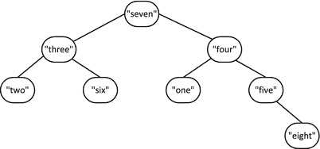

# 5.使用集合

Electronic supplementary material The online version of this chapter (doi:[10.​1007/​978-1-4842-0004-9_​5](http://dx.doi.org/10.1007/978-1-4842-0004-9_5)) contains supplementary material, which is available to authorized users.

本章是关于使用集合的。集合是一个简单的数学概念，其含义是直观的——具有某些共同特征的事物的集合。STL 中有两个关于集合的概念，它们都与集合的数学思想有关。集合可以是由两个迭代器定义的范围内的一系列对象。器械包也是一种具有特定特征的容器。集合容器是关联容器，其中的对象是它们自己的关键点。在本章中，您将学习以下内容:

*   STL 提供了哪些`set`容器。
*   不同类型的`set`容器可用的功能。
*   可以应用于`set`容器的操作。
*   如何创建和使用`set`容器。
*   可以应用于由范围定义的对象集的操作。

## 了解集合容器

除了没有单独的键之外，set 容器与 map 容器非常相似。有四个定义集合的模板，其中两个默认存储按`less<T>`排序的元素，另外两个使用元素的哈希值存储元素。有序集合的模板在`set`头中定义，无序集合的模板在`unordered_set`头中定义。因此，存储在有序集容器中的对象必须支持比较，无序集中的对象必须是可以散列的类型。

定义集合容器的模板有:

*   容器存储类型为`T`的对象，并且对象必须是唯一的。默认情况下，使用一个`less<T>`对象对容器中的元素进行排序和比较。等价，而不是相等，用于确定对象何时相同。
*   容器以与`set<T>`容器相同的方式存储`T`类型的对象，但是可以存储重复的对象。
*   容器存储类型为`T`的对象，对象在容器中必须是唯一的。使用从对象生成的哈希值在容器中定位元素。默认情况下，使用`equal_to<T>`对象比较元素是否相等。
*   容器以与`unordered_set<T>`容器相同的方式存储`T`类型的对象，但是可以存储重复的对象。

有序和无序关联容器可以获得的迭代器种类是不同的。对于有序容器，可以获得正向和反向迭代器，但是对于无序容器，只能获得正向迭代器。

如果你以前没有遇到过`set`容器，你可能想知道容器到底有什么用，在哪里检索一个对象，你提供相同的对象。如果已经有了对象，为什么还需要检索它呢？也许令人惊讶的是，set 容器有许多用途。

集合是在涉及事物集合的应用程序中存储数据的候选者，其中确定特定集合的成员是感兴趣的。在学术机构中处理班级的应用程序就是一个例子。每个类可以由一个单独的`set`容器来表示，该容器存储学生。一个`set`容器可能是合适的，因为一个类中不能有重复的学生；显然，两个学生可以有一个共同的名字，但是代表他们的对象应该是唯一的。你可以很容易地发现某个学生是否注册了某个特定的课程。您还可以确定给定学生注册的所有课程。

通常，当存储了大量元素并且存在随机插入和检索操作时，无序集在操作上比有序集更快。从一组有序的`n`元素中检索元素与`log n`成比例。从无序集合中检索元素平均来说是恒定的，并且与元素的数量无关，尽管实际的性能会受到哈希操作的有效性和元素内部组织的不利影响。

对象的存储位置取决于有序集合的比较函数和无序集合的散列函数。您可以对存储相同对象的不同集合使用不同的比较函数或不同的散列函数。一个简单的例子是考虑一个代表雇员的`Person`类类型，该类封装了个人的许多不同方面。该类可以包括人员 ID、部门、姓名、年龄、地址、性别、电话号码、工资级别等等。然后，您可以创建几个集合，以各种方式对个人进行分类。您可以选择在一个集合中比较或散列工作部门，在另一个集合中比较或散列工资等级。这将允许您访问给定工资级别的员工或给定部门的员工。这些集合不一定需要存储`Person`对象的副本。您可以在免费商店中创建`Person`对象，并在容器中存储智能指针。在本章的后面，你会看到一些这样做的例子。我假设在这一章中有一个针对`std::string`的`using`指令来最小化语句中的行溢出。

## 使用集合<t>容器</t>

一个`set<T>`容器中元素的内部组织通常与一个`map<K,T>`容器相同——一个平衡的二叉树。考虑这个`set`容器定义，它用初始化列表指定的内容创建容器:

`std::set<int> numbers {8, 7, 6, 5, 4, 3, 2, 1};`

因为默认的比较将是`less<int>`，所以元素将在容器中以升序排列。内部二叉树将类似于图 [5-1](#Fig1) 所示。通过执行以下语句，您可以看到元素是按升序排列的:

图 5-1。

Balanced binary tree of integers ordered by less<int>

`std::copy(std::begin(numbers), std::end(numbers), std::ostream_iterator<int> {std::cout, " "});`

`copy()`算法将前两个参数指定的范围复制到第三个参数指定的目的地，在本例中是一个输出流迭代器。该语句将以升序输出从 1 到 8 的整数。

当然，您可以为元素提供不同的比较函数对象:

`std::set<std::string, std::greater<string>> words`

`{"one", "two", "three", "four", "five", "six", "seven", "eight"};`

该容器中的元素将按降序排列，因此容器中的树将类似于图 [5-2](#Fig2) 。

图 5-2。

Balanced binary tree of strings ordered by `greater<string>`

您可以使用来自某个范围的元素创建一个`set`容器，并选择性地指定比较:

`std::set<string> words2 {std::begin(words), std::end(words)};`

`std::set<string, std::greater<string>> words3 {++std::begin(words2), std::end(words2)};`

第一条语句定义了`words2`来包含来自`words`容器的元素的副本，这些元素按照默认比较排序——一个`less<string>`实例。第二条语句定义`words3`包含来自`words2`的所有元素的副本，除了第一个。这个容器是使用一个`greater<string>`实例订购的。

`set<T>`模板还定义了复制和移动构造函数。提供 move 构造函数很重要，因为它允许函数中本地定义的`set`容器被有效地返回——无需复制。编译器可以识别你何时返回一个本地的`set`容器，该容器将在函数结束时被销毁，并将使用 move 构造函数返回它。在本章的后面你会看到一个使用它的例子。

### 添加和删除元素

一个`set`没有`at()`成员或者`operator`实现，但是除此之外`set`容器提供的操作很大程度上反映了`map`容器的操作。为了给一个`set`添加一个元素，您有`insert()`、`emplace()`和`emplace_hint()`函数成员。下面是一些使用`insert()`的例子:

`std::set<string, std::greater<string>> words {"one", "two", "three"};`

`auto pr1 = words.insert("four");      // pr1.first points to new element. pr1.second is true`

`auto pr2 = words.insert("two");       // Element is NOT inserted - pr2.first points to the`

`// existing element and pr.second is false`

`auto iter3 = words.insert(pr.first, "seven"); // iter3 points to new element just before "four"`

`words.insert({"five", "six"});              // Insert list of elements - no return value`

`string wrds[] {"eight", "nine", "ten"};`

`words.insert(std::begin(wrds), std::end(wrds)); // Inserts range - no return value`

插入单个元素返回一个`pair<iterator,bool>`对象，插入带提示的单个元素只是返回一个迭代器。在一个范围或初始化列表中插入多个元素不返回任何内容。在语句中，`insert()`的参数是一个初始化列表，列表中的值是字符串文字，将用于创建类型为`string`的对象。

这里有几个在`set`中就地创建元素的例子:

`std::set<std::pair<string,string>> names;`

`auto pr = names.emplace("Lisa", "Carr");  // pr.first points to new element. pr.second is true`

`auto iter = names.emplace_hint(pr.first, "Joe", "King");`

这和你见过的`map`是一样的。成员`emplace()`返回一个`pair<iterator,bool>`对象，成员`emplace_hint()`返回一个迭代器。前者的参数直接传递给元素的构造函数，以便就地创建元素。`emplace_hint()`的第一个参数是迭代器，它提示元素可能的位置，随后的参数传递给元素构造函数。

函数成员删除集合中的所有元素。成员可以从迭代器指定的位置删除一个元素或者一个匹配对象的元素。例如:

`std::set<int> numbers {2, 4, 6, 8, 10, 12, 14};`

`auto iter = numbers.erase(++std::begin(numbers));`

`// Removes the 2nd element - 4\. iter points to 6`

`auto n = numbers.erase(12);                          // Returns no. of elements removed - 1`

`n = numbers.erase(13);                               // Returns no. of elements removed - 0`

`numbers.clear();                                     // Removes all elements`

`erase()`成员还可以删除一系列元素:

`std::set<int> numbers {2, 4, 6, 8, 10, 12, 14};`

`auto iter1 = std::begin(numbers);                         // iter1 points to 1st element`

`advance(iter1, 5);                                        // Points to 6th element - 12`

`auto iter = numbers.erase(++std::begin(numbers), iter1);`

`// Remove 2nd to 5th inclusive. iter points to 12`

如果一个集合不包含任何元素，`empty()`成员返回`true`，而`size()`成员返回它包含的元素数量。如果您担心在一个`set`中不能存储尽可能多的对象，您可以调用返回最大可能数量元素的`max_size()`成员，通常是很多。

### 访问元素

`set`容器的`find()`成员返回一个迭代器，当参数存在时，它指向与参数匹配的元素；如果对象不在集合中，则返回结束迭代器。例如:

`std::set<string> words {"one", "two", "three", "four", "five"};`

`auto iter = words.find("one");                       // iter points to "one"`

`iter = words.find(string{"two"});                    // iter points to "two"`

`iter = words.find("six");                            // iter is std::end(words)`

调用`set`的`count()`成员会返回给定键的元素数量，该键只能是`0`或`1`，因为元素在`set`容器中必须是唯一的。`set`容器模板还定义了`equal_range()`、`lower_bound(),`和`upper_bound()`成员，很大程度上是为了与`multiset`容器保持一致，在那里它们更有用。

### 使用集合

是时候看看`set`容器的作用了。我们可以组合一个使用`vector`、`set`和`map`容器的例子，并引入另一个有用的算法。该示例将一组学生分配到多个课程科目中。每个学生都必须学习规定的最少数量的科目。特定科目的学生可以存储在一个`set`容器中，因为一个学生在给定的课程中不能出现超过一次。这个例子效率不会很高。会有很多学生的拷贝，这在这个例子中并不重要，但是如果代表学生的对象非常大，并且有很多学生，这就很重要了。在本章的后面，您将了解如何消除对象的复制。图 [5-3](#Fig3) 展示了该示例如何工作的基本概念。

图 5-3。

Operations in the example using set containers to represent course groups

示例中定义类型别名的`using`指令:

`using std::string;`

`using Distribution = std::uniform_int_distribution<size_t>;`

`using Subject = string;                           // A course subject`

`using Subjects = std::vector<Subject>;            // A vector of subjects`

`using Group = std::set<Student> ;                 // A student group for a subject`

`using Students = std::vector<Student>;            // All the students`

`using Course = std::pair<Subject, Group>;         // A pair representing a course`

`using Courses = std::map<Subject, Group>;         // The container for courses`

这些别名并不重要，但是它们使代码不那么混乱。`Distribution`别名是你在[第 4 章](04.html)中遇到的类型。这种类型定义了正态统计分布，并将用于生成随机数。

首先，我们可以定义一个代表学生的类。学生是简单的灵魂，所以我们可以用一种简单的方式在`Student.h`头中定义类，就像这样:

`#ifndef STUDENT_H`

`#define STUDENT_H`

`#include <string>                                                     // For string class`

`#include <ostream>                                                    // For output streams`

`class Student`

`{`

`private:`

`std::string first {};`

`std::string second {};`

`public:`

`Student(const std::string& name1, const std::string& name2) : first (name1), second (name2){}`

`// Move constructor`

`Student(Student&& student) : first(std::move(student.first)), second(std::move(student.second)){}`

`Student(const Student& student) :                    first(student.first), second(student.second){}   // Copy constructor`

`Student() {}                                                        // Default constructor`

`// Less-than operator`

`bool operator<(const Student& student) const`

`{`

`return second < student.second || (second == student.second && first < student.first);`

`}`

`friend std::ostream& operator<<(std::ostream& out, const Student& student);`

`};`

`// Insertion operator overload`

`inline std::ostream& operator<<(std::ostream& out, const Student& student)`

`{`

`out << student.first + " " + student.second;`

`return out;`

`}`

`#endif`

只有两个数据成员存储学生的名和姓。`Student`对象最初存储在一个`vector`容器中，因此定义了默认的构造函数。有一个复制构造函数和一个移动构造函数，后者是为了避免在适当的时候复制对象。定义小于运算符是因为学生将被存储在代表不同科目课程的`set`容器中。还有一个`friend`函数，它重载流插入操作符来帮助输出。

#### 创造学生

该程序将需要合理数量的学生，因此为了避免从键盘上费力地输入他们，我们将通过创建名和名的所有组合来合成一个由`Student`对象组成的`vector`:

`Students create_students()`

`{`

`Students students;`

`string first_names[] {"Ann", "Jim", "Eve", "Dan", "Ted"};`

`string second_names[] {"Smith", "Jones", "Howe", "Watt", "Beck"};`

`for(const auto& first : first_names)`

`{`

`for(const auto& second : second_names)`

`{`

`students.emplace_back(first, second);`

`}`

`}`

`return students;`

`}`

有一个`using`指令将`Students`定义为`Student`对象的`vector`的别名。该函数使用两个数组中所有可能的名称组合在本地`students`容器中创建`Student`对象。外层循环遍历名字，内层循环将每个第二个名字附加到给定的名字上。因此，我们最终会有 25 名不同的学生。我们可以像这样调用函数来创建学生:

`Students students = create_students();`

一个`vector`容器有一个移动构造函数，所以编译器会安排移动返回的本地`students`对象，而不是复制它。上面的语句将调用`vector<Student>`的移动赋值操作符来移动`create_students()`返回的值，因此不会复制`vector`或其元素。学生的类型在这里是显式的，但是您可以使用`auto`让编译器从`create_students()`的返回类型中推导出它。

#### 为一个科目创建一组学生

该示例将随机选择学生，并为他们随机挑选课程，因此将需要一个随机数引擎。为了使它在整个计划中可用，我们可以在全球范围内创建它:

`static std::default_random_engine gen_value;`

在`random`标题中定义了`default_random_engine`类型，以及`uniform_int_distribution`类型。分布对象是一个函数对象，为了用该分布生成一个随机数，您将一个随机引擎对象传递给分布对象的`operator()()`成员。我们可以在一个函数中利用这一点，为给定的科目创建一组随机的学生:

`Group make_group(const Students& students, size_t group_size,                                                          const Distribution& choose_student)`

`{`

`Group group;                                             // The group of students for a subject`

`// Select students for the subject group`

`// Insert a random student into the group until there are group_size students in it`

`while(group.size() < group_size)`

`{`

`group.insert(students[choose_student(gen_value)]);`

`}`

`return group;`

`}`

第一个参数是`Student`对象的`vector`，第二个参数是组中需要的学生数量，最后一个参数是用于随机选择学生的索引值的分布。`group`是`Student`对象的`set`容器。该函数通过调用其`insert()`成员，将从作为第一个参数传递的`vector`中随机选择的学生插入到本地`set`容器`group`中。不需要检查插入是否成功。如果容器中已经存在一个新对象，则`insert()`成员不会插入该对象。来自`students`容器的随机选择可能选择已经存储在`group`容器中的学生，但是循环将继续下一次迭代，尝试另一个随机选择，直到添加了`group_size`学生。当函数结束时，返回的本地`group`对象将被移动，而不是复制，就像前面的函数一样。

#### 创建主题和课程

课程科目的定义如下:

`Subjects subjects {"Biology", "Physics",  "Chemistry",  "Mathematics", "Astronomy",`

`"Drama",   "Politics", "Philosophy", "Economics"};`

`Subjects`是`vector<Subject>`的别名，`Subject`是类型`string`的别名，所以`subjects`是`string`对象的`vector`。我们将把课程存储在一个`map<Subject,Group>`容器中，所以每个课程的键将是来自`subjects`容器的一个唯一的`Subject`对象。`map<Subject,Group>`类型定义了别名`Courses`，因此我们可以像这样定义所有课程的容器:

`Courses courses;                                 // All the courses with subject keys`

需要确定每个学生需要学习的最少科目数。当我们生成学习某个主题的学生集合时，我们还会对该主题的小组规模设置一些初始约束:

`size_t min_subjects {4};                           // Minimum number of Subjects per student`

`size_t min_group {min_subjects};                   // Minimum no. of students per course`

`size_t max_group {(students.size()*min_subjects)/subjects.size()};`

`// Max initial students per course`

我选择了一个任意值 4 作为要研究的最少人数，并使一组中最少的学生人数相同。如果所有学生都学习最小数量的科目，并且学生在组中平均分布，则科目组的最大规模也可以任意设置为组中的平均数。您可以试验这些参数，看看它们如何影响学生到科目组的分配。

我们将需要定义分布的函数对象，以便为分配到一个主题组的学生数量选择一个随机值，并随机选择学生:

`Distribution group_size {min_group, max_group};       // Distribution for students per course`

`Distribution choose_student {0, students.size() - 1}; // Random student selector`

`group_size`对象将产生从`min_group`到`max_group`的数字。类似地，`choose_student`分布将生成有效的索引值，用于从学生的`vector`中进行选择。

我们将希望随机选择学生参加的课程，因此我们也需要一个`Distribution`对象:

`Distribution choose_course {0, subjects.size() - 1};  // Random course selector`

这将生成随机索引值，以便从`subjects`容器中选择课程。

#### 为学生注册课程

在`main()`中用代表课程的元素填充`courses`容器的代码只是一个`for`循环，循环体是一条语句:

`for(const auto& subject : subjects)`

`courses.emplace(subject, make_group(students, group_size(gen_value), choose_student));`

诚然，作为循环体的语句做了很多工作。为 courses 容器调用`emplace()`会在适当的位置创建一个元素。每个元素必须是一个`pair<Subject, Group>`对象，因此`emplace()`的参数必须是一个`Subject`对象和一个`Group`对象，由`emplace()`函数传递给`pair`构造函数。第一个参数由循环变量`subject`提供，因为循环遍历所有主题。第二个参数是前面看到的`make_group()`函数返回的`Group`对象。`make_group()`的第一个参数是学生的`vector`；第二个是通过将`gen_value`引擎传递给`group_size`函数对象产生的组大小的随机值；第三个参数是用于选择学生的分布。

#### 检查学生的课程

当上面的循环创建了所有的课程后，我们必须检查是否有学生没有履行注册最低数量课程的义务。下面的循环将做到这一点，如果他们没有尽到责任，就为他们注册额外的课程:

`for(const auto& student : students)`

`{ // Verify the minimum number of Subjects has been met`

`// Count how many Subjects the student is on`

`size_t course_count = std::count_if(std::begin(courses), std::end(courses),`

`[&student](const Course& course) { return course.second.count(student); });`

`if(course_count >= min_subjects) continue;          // On to the next student`

`// Minimum no. of Subjects not signed up for`

`size_t additional {min_subjects - course_count};      // Additional no. of Subjects needed`

`if(!course_count)                                     // If none have been chosen...`

`std::cout << student << " is work-shy, having signed up for NO Subjects!\n";`

`else                                                  // Some have - but E for effort`

`std::cout << student << " is only signed up for " << course_count << " Subjects!\n";`

`std::cout << "Registering " << student << " for " << additional`

`<< " more course" << (additional > 1 ? "s" : "") << ".\n\n";`

`// Register for additional Subjects up to the minimum`

`while(course_count < min_subjects)`

`if((courses.find(subjects[choose_course(gen_value)])->second.insert(student)).` `second) ++course_count;`

`}`

外部循环遍历`vector`中的`Student`对象。`count_if()`算法用于确定每个学生注册的课程数量。该算法计算由前两个参数指定的范围内的元素数量，函数将这两个参数作为第三个参数传递并返回`true`。这里的前两个参数指定了`courses`容器中元素的范围，因此迭代器指向`pair<Subject,Group>`对象。`count_if()`的第三个参数必须是返回`bool`值的一元函数，或者是可以隐式转换为类型`bool`的值。参数的类型必须是通过取消引用范围内的迭代器而得到的。这里是一个 lambda 表达式，它返回表达式的值`course.second.count(student). course`是一个类型为`pair<Subject,Group>`的对象，所以表达式首先选择`course`对象的`second`成员。`second`成员是一个`Group`对象，类型为`set<Student>`，因此表达式调用保存学生的 set 容器的`count()`成员。由于`set`容器中不允许有重复的元素，所以`count()`成员只能在`student`存在时返回`1`，否则返回`0`。幸运的是，这些值可以隐式地分别转换为`true`和`false`，因此只要`student`处于当前过程中，`count_if()`就会增加计数。

我们为任何没有注册所需科目数量的学生输出一条合适的消息，并执行嵌套的`while`循环，为学生注册新课程，直到满足最低要求。这是另一个用单个语句体完成大量工作的循环。本质上，这个语句是一个`if`语句，当前学生每成功注册一门课程，这个语句就会增加`course_count`。通过调用其`find()`成员从`courses`容器中选择一个课程，该成员返回一个迭代器，该迭代器指向与作为参数的键相对应的元素，如果没有找到键，则返回结束迭代器。我们使用所有可能的`Subject`键创建了课程，所以后一种情况不会发生——如果发生了，我们会知道，因为程序会崩溃。使用由`choose_course`分布产生的指数值从`subjects`中随机选择一个新的球场。`find()`返回的`pair`元素的`second`成员是包含课程中的学生的`Group`，因此用`student`参数调用其`insert()`成员会将学生添加到组中，如果他们还不在`set`中的话。总是有可能学生已经在选择的课程上，在这种情况下，`insert()`返回的`pair`对象的`second`成员将是`false`，在这种情况下`course_count`不会递增，循环将继续尝试随机选择的另一门课程。当前学生的课程数量达到最小值`min_subjects`时，循环结束。

#### 输出课程

为了允许使用另一种 STL 算法输出课程，我们将在一个`List_Course.h`头文件中定义以下函数对象类型:

`// List_Course.h`

`// Function object to output the students in a group for Ex5_01`

`#ifndef LIST_COURSE_H`

`#define LIST_COURSE_H`

`#include <iostream>                              // For standard streams`

`#include <string>                                // For string class`

`#include <set>                                   // For set container`

`#include <algorithm>                             // For copy()`

`#include <iterator>                              // For ostream_iterator`

`#include "Student.h"`

`using Subject = std::string;                     // A course subject`

`using Group = std::set<Student>;                 // A student group for a subject`

`using Course = std::pair<Subject, Group>;        // A pair representing a course`

`class List_Course`

`{`

`public:`

`void operator()(const Course& course)`

`{`

`std::cout << "\n\n" << course.first << "  " << course.second.size() << " students:\n  ";`

`std::copy(std::begin(course.second), std::end(course.second), std::ostream_iterator<Student>(std::cout, "  "));`

`}`

`};`

`#endif`

`List_Course`类的`operator()()`成员的参数是对一个`Course`对象的引用，该对象的类型是`pair<string,set<Student>>`。该函数输出课程主题，当然是`course`的`first`成员，以及该课程的学生人数，这是通过调用`pair`的`second`成员的`size()`成员获得的。课程中的学生由`copy()`算法列出。当然，前两个参数是由`course`的`second`成员标识的`set<Student>`容器的开始和结束迭代器。`Student`对象的范围被复制到由`copy()`的第三个参数指定的目的地，它是一个`ostream_iterator<Student>`对象。该对象将调用范围内每个`Student`对象的`operator<<()`成员，将学生输出到`cout`，后跟几个空格。

我们可以在`main()`中使用`List_Course`的一个实例，在一条语句中输出所有的课程，就像这样:

`std::for_each(std::begin(courses), std::end(courses), List_Course());`

`for_each()`算法将第三个参数指定的函数对象应用于前两个参数指定的范围内的每个元素。前两个参数定义了对应于所有课程的范围，因此将使用后续课程作为参数来调用`List_Courses()()`。结果将是每门课程的所有学生都被写到`cout`。

当然，定义`List_Course`函数对象类型并不重要。您可以使用 lambda 表达式作为`for_each()`算法的第三个参数:

`std::for_each(std::begin(courses), std::end(courses),`

`{`

`std::cout << "\n\n" << course.first << "  " << course.second.size() << " students:\n  ";`

`std::copy(std::begin(course.second), std::end(course.second),`

`std::ostream_iterator<Student>(std::cout, "  "));`

`});`

我为这个例子定义了`List_Course`类型，只是为了演示如何操作，但是除非在一个程序中不止一次需要 function 对象，否则使用 lambda 表达式会更简单、更容易。

#### 完整的程序

包含`main()`的源文件的内容将是:

`// Ex5_01.cpp`

`// Registering students on Subjects`

`#include <iostream>                              // For standard streams`

`#include <string>                                // For string class`

`#include <map>                                   // For map container`

`#include <set>                                   // For set container`

`#include <vector>                                // For vector container`

`#include <random>                                // For random number generation`

`#include <algorithm>                             // For for_each(), count_if()`

`#include "Student.h"`

`#include "List_Course.h"`

`using std::string;`

`using Distribution = std::uniform_int_Distribution<size_t>;`

`using Subject = string;                          // A course subject`

`using Subjects = std::vector<Subject>;           // A vector of subjects`

`using Group = std::set<Student>;                 // A student group for a subject`

`using Students = std::vector<Student>;           // All the students`

`using Course = std::pair<Subject, Group>;        // A pair representing a course`

`using Courses = std::map<Subject, Group>;        // The container for courses`

`static std::default_random_engine gen_value;`

`// create_students() helper function definition goes here...`

`// make_group () helper function definition goes here...`

`int main()`

`{`

`Students students = create_students();`

`Subjects subjects {"Biology", "Physics", "Chemistry", "Mathematics", "Astronomy",`

`"Drama", "Politics", "Philosophy", "Economics"};`

`Courses courses;                                     // All the courses with subject keys`

`size_t min_subjects {4};                         // Minimum number of Subjects per student`

`size_t min_group {min_subjects};                 // Minimum no. of students per course`

`// Maximum initial``students`T2】

`size_t max_group {(students.size()*min_subjects)/subjects.size()};`

`// Create groups of students for each subject`

`Distribution group_size {min_group, max_group};    // Distribution for students per course`

`Distribution choose_student {0, students.size() - 1}; // Random student selector`

`for(const auto& subject : subjects)`

`courses.emplace(subject, make_group(students, group_size(gen_value), choose_student));`

`Distribution choose_course {0, subjects.size() - 1};  // Random course selector`

`// Every student must attend a minimum number of Subjects...`

`// ...but students being students we must check...`

`for(const auto& student : students)`

`{ // Verify the minimum number of Subjects has been met`

`// Count how many Subjects the student is on`

`size_t course_count = std::count_if(std::begin(courses), std::end(courses),`

`[&student](const Course& course)`

`{  return course.second.count(student); });`

`if(course_count >= min_subjects) continue;          // On to the next student`

`// Minimum no. of Subjects not signed up for`

`size_t additional {min_subjects - course_count};    // Additional no. of Subjects needed`

`if(!course_count)                                   // If none have been chosen...`

`std::cout << student << " is work-shy, having signed up for NO Subjects!\n";`

`else                                                // Some have - but E for effort`

`std::cout << student << "` `is only signed up for " << course_count << " Subjects!\n";`

`std::cout << "Registering " << student << " for " << additional`

`<< " more course" << (additional > 1 ? "s" : "") << ".\n\n";`

`// Register for additional Subjects up to the minimum`

`while(course_count < min_subjects)`

`if((courses.find(subjects[choose_course(gen_value)])->second.insert(student)).second) ++course_count;`

`}`

`// Output the students attending each course`

`std::for_each(std::begin(courses), std::end(courses), List_Course());`

`std::cout << std::endl;`

`}`

我不会在书中列出所有的输出，因为这本书篇幅很长，但是下面是我得到的一些输出片段:

`Ann Smith is only signed up for 1 Subjects!`

`Registering Ann Smith for 3 more courses.`

`Ann Watt is only signed up for 2 Subjects!`

`Registering Ann Watt for 2 more courses.`

`Ann Beck is only signed up for 3 Subjects!`

`Registering Ann Beck for 1 more course.`

`Jim Smith is work-shy, having signed up for NO Subjects!`

`Registering Jim Smith for 4 more courses.`

`...`

`Ted Beck is work-shy, having signed up for NO Subjects!`

`Registering Ted Beck for 4 more courses.`

`Astronomy  9 students:`

`Dan Beck  Ted Beck  Eve Howe  Ann Jones  Dan Jones  Eve Jones  Ted Smith  Ann Watt  Dan Watt`

`Biology  14 students:`

`Ann Beck  Dan Beck  Jim Beck  Ann Howe  Dan Howe  Jim Howe  Dan Jones  Ted Jones  Dan Smith  Eve Smith`

`Ann Watt  Eve Watt  Jim Watt  Ted Watt`

`Chemistry  10 students:`

`Eve Beck  Dan Howe  Ann Jones  Eve Jones  Ted Jones  Dan Smith  Jim Smith  Ann Watt  Dan Watt  Jim Watt`

`...`

`Physics  15 students:`

`Ann Beck  Dan Beck  Eve Beck  Jim Beck  Eve Howe  Ted Howe  Ann Jones  Jim Jones  Ann Smith  Eve Smith`

`Ted Smith  Dan Watt  Eve Watt  Jim Watt  Ted Watt`

`Politics  12 students:`

`Eve Beck  Jim Howe  Ted Howe  Dan Jones  Eve Jones  Jim Jones  Ann Smith  Dan Smith  Eve Smith  Jim Smith`

`Dan Watt  Ted Watt`

### 集合迭代器

容器成员可以返回的迭代器是双向迭代器。这些迭代器的类型由`set<T>`模板中的别名定义来定义。您可以从`set`中获得的迭代器类型的别名是`iterator`、`reverse_iterator`、`const_iterator`和`const_reverse_iterator`，这些名称表明了它们是什么。例如，`begin()`和`end()`成员返回类型`iterator.`的迭代器，`set`容器也有返回类型`reverse_iterator`迭代器的`rbegin()`和`rend()`成员，以及返回类型`const_iterator`迭代器的`cbegin()`和`cend()`成员。最后，`crbegin()`和`crend()`成员返回类型`const_reverse_iterator`的迭代器。

然而，`set`容器的迭代器类型的别名有些误导。一个`set<T>`容器的函数成员返回的所有迭代器都指向一个`const T`元素。因此，`iterator`迭代器指向一个`const`元素，就像`reverse_iterator`迭代器和其他类型一样。这意味着您不能修改元素。如果你想改变一个`set`容器中的元素，你必须首先删除它，然后插入修改后的版本。

仔细想想，这也不是没有道理。`set`中的对象是它们自己的键，通过比较来确定对象在容器中的位置。如果要修改元素，可能会使元素的顺序无效，从而中断后续的访问操作。当您必须能够修改对象，并且仍然将它们分组在一个或多个`set`容器中时，仍然有一种方法可以做到这一点。您将指向对象的指针存储在一个`set`容器中——最好是智能指针。当你使用`set`容器时，你通常会存储`shared_ptr<T>`或`weak_ptr<T>`对象。在`set`容器中存储`unique_ptr<T>`对象没有多大意义。您永远无法直接检索元素，因为容器中不存在与`unique_ptr<T>`对象匹配的独立键。

### 在集合容器中存储指针

如果您想要对对象进行的更改可能会改变指向您已存储在`set`中的那些对象的指针的顺序，指针的比较函数不得依赖于对象。大多数时候，您不会关心`set`中元素的特定顺序，只关心给定的元素是否在容器中。在这种情况下，您可以使用应用于指针的比较函数对象，而不用考虑指针指向的对象。比较容器中智能指针的推荐选项是使用在`memory`头中定义的`owner_less<T>`函数对象类型的实例。

`owner_less<T>`模板为`shared_ptr`和/或`weak_ptr`对象的小于比较定义函数对象类型；换句话说，它允许`weak_ptr`对象与`shared_ptr`对象进行比较，反之亦然，也允许两个`weak_ptr`或`shared_ptr`对象进行比较。一个`owner_less<T>`实例通过调用智能指针的`owner_before()`函数成员到`T`来实现比较，这提供了与另一个智能指针的小于比较。`shared_ptr<T>`和`weak_ptr<T>`模板都定义了这个成员函数。当这个智能指针小于作为参数的智能指针时，`owner_before<T>()`实例返回`true`，否则返回`false`。这种比较基于指针所拥有的对象的地址，并且当两个指针指向同一个对象时，允许确定等价性。

在`shared_ptr<T>`类模板中定义`owner_before()`实例的函数模板的原型如下所示:

*   `template<typename X> bool owner_before(const std::shared_ptr<X>& other) const;`
*   `template<typename X> bool owner_before(const std::weak_ptr<X>& other) const;`

`weak_ptr<T>`类模板类似地定义了成员。请注意，模板类型参数与类模板的类型参数不同。这意味着，除了比较指向同一类型对象的指针之外，还可以比较指向不同类型对象的指针；换句话说，`shared_ptr<T1>`对象可以比作`shared_ptr<T2>`对象或`weak_ptr<T2>`对象。这意味着指针所指向的可能与它所拥有的不同。

所有权方面对于`shared_ptr<T>`对象可能很重要。这个话题对于这本书来说有点超前，不过还是危险地生活吧。一个`shared_ptr<T>`可以共享一个对象的所有权，但是指向一个它不拥有的不同对象；换句话说，共享指针包含的地址不是它所拥有的对象的地址。这种`shared_ptr`的一个用途是指向它所拥有的对象的成员。如图 [5-4](#Fig4) 所示。

图 5-4。

A shared pointer that points to a different object from the object it owns

用于创建图 [5-4](#Fig4) 中`pname`的构造函数称为别名构造函数。第一个参数是另一个`shared_ptr`对象，它拥有`pname`也将拥有的对象。第二个参数是一个原始指针，这个指针将被存储在`pname`中。第二个参数指向的对象不归`pname`所有或管理。但是，`pname`可以用来访问这个对象，它恰好是`Person`对象的一个数据成员。在这个例子中，`pname`拥有的对象是`Person`对象。它指向该对象的一个成员。

销毁图 [5-4](#Fig4) 中的`pperson`指针不会导致它所拥有的`Person`对象被销毁，因为它仍然属于`pname`指针。已经创建了指针`pname`来提供对`Person`对象的`name`成员的访问。`*pperson`指的是`Person`对象，因为`pperson`包含了它共享所有权的对象的地址。`*pname`指的是`Person`对象的`name`成员，因为`pname`包含该成员的地址，并且它也拥有`Person`对象的所有权。这使您能够继续使用`pname`，即使周围没有包含`Person`对象地址的`shared_ptr<Person>`指针。只有当所有拥有该对象所有权的`shared_ptr`对象都被销毁时，`Person`对象才会被销毁。如果没有别名构造函数提供的功能，就无法保证存储在`pname`中的指针的有效性。

#### 在 set 容器中存储智能指针的示例

为了展示如何在`set`容器中存储智能指针，我将把`Ex5_01`重构为`Ex5_02`。在`students`向量中的元素和在`set`容器中的元素代表不同学科的学生群体，它们将是智能指针。我可以在`set`容器中使用`shared_ptr<Student>`对象，但是我将只为学生的`vector`使用`shared_ptr<Student>`元素，并在`set`容器中使用`weak_ptr<Student>`对象来展示这涉及到什么。请注意，当您存储`weak_ptr<T>`对象时，您需要确保只要您在使用`weak_ptr<T>`对象，它们所依赖的`shared_ptr<T>`对象就会继续存在。当然，你总是可以通过调用`weak_ptr<T>`对象的`expired()`成员来检测与一个`weak_ptr<T>`关联的`shared_ptr<T>`对象是否仍然存在；当`shared_ptr<T>`对象被删除时，返回`true`。

我必须做的第一件事是重新定义在`Ex5_02.cpp`中使用的类型别名，以适应智能指针:

`using std::string;`

`using Distribution = std::uniform_int_Distribution<size_t>;`

`using Subject = string;                                               // A course subject`

`using Subjects = std::vector<Subject>;                                // A vector of subjects`

`using Group =                                                         // Group for a subject`

`std::set<std::weak_ptr<Student>, std::owner_less<std::weak_ptr<Student>>>;`

`using Students = std::vector<std::shared_ptr<Student>>;               // All the students`

`using Course = std::pair<Subject, Group>;                             // Represents a course`

`using Courses = std::map<Subject, Group>;                             // The courses`

只有`Group`和`Students`别名需要更改。一个`Group`现在是一个包含`weak_ptr<Student>`对象的`set`，这些元素将使用一个`owner_less<weak_ptr<Student>>`实例进行比较。这将允许集合中的元素与类型为`vector<shared_ptr<Student>>`的`Students`容器中的元素进行比较。如果两个指针拥有相同的对象，`set`中的一个元素将匹配`vector`中的一个元素。

##### 创建 shared_ptr 元素的向量

`Student`类可以保持在`Ex5_01,`中的状态，在`create_students()`函数中只需要修改一条语句:

`Students create_students()`

`{`

`Students students;`

`string first_names[] {"Ann", "Jim", "Eve", "Dan", "Ted"};`

`string second_names[] {"Smith", "Jones", "Howe", "Watt", "Beck"};`

`for(const auto& first : first_names)`

`for(const auto& second : second_names)`

`{`

`students.emplace_back(std::make_shared<Student>(first, second));`

`}`

`return students;`

`}`

现在，`emplace_back()`的参数是一个由`make_shared<Student>()`返回的`shared_ptr<Student>`对象。因为它是临时的，所以这个指针将由`emplace_back()`转发给`shared_ptr<Student>`移动构造函数，以在`vector`中创建元素。

令人惊讶的是，`make_group()`函数根本不需要改变。所有必要的更改都由类型别名负责。

##### 输出由 weak_ptr 引用的对象

虽然`List_Course`函数对象类型确实需要改变:

`using Subject = std::string;                                 // A course subject`

`using Group =                                               // A group for a subject`

`std::set<std::weak_ptr<Student>, std::owner_less<std::weak_ptr<Student>>>;`

`using Course = std::pair<Subject, Group>;                    // A pair representing a course`

`class List_Course`

`{`

`public:`

`void operator()(const Course& course)`

`{`

`std::cout << "\n\n" << course.first << "  " << course.second.size() << " students:\n  ";`

`std::copy(std::begin(course.second), std::end(course.second),`

`std::ostream_iterator<std::weak_ptr<Student>>(std::cout, "  "));`

`}`

`};`

`inline std::ostream& operator<<(std::ostream& out, const std::weak_ptr<Student>& wss)`

`{`

`out << *wss.lock();`

`return out;`

`}`

必须在头文件中复制对`Ex5_02.cpp`中的`Group`别名定义的更改。第一个变化是函数调用操作符函数的定义。`ostream_iterator`模板类型参数必须改为`weak_ptr<Student>`。这需要为`weak_ptr<Student>`对象重载插入操作符。要将一个`Student`对象写到流中，指针需要被解引用。不能解引用 a`weak_ptr<T>`；您必须首先获得一个拥有相同对象的`shared_ptr<T>`，然后取消对它的引用。为`weak_ptr<Student>`对象调用`lock()`会返回一个`shared_ptr<Student>`对象，该对象拥有`weak_ptr`引用的对象，并且可以被解引用。在本例中，我们有理由确信`Student`对象将仍然存在，但通常情况下可能不是这样。如果由一个`weak_ptr`引用的对象因为所有拥有的`shared_ptr`对象都被销毁而被销毁，调用`weak_ptr`的`lock()`将返回一个包含`nullptr`的`shared_ptr`。在可能发生这种情况的地方，您必须检查`nullptr`以避免崩溃。

类型别名已经处理了`main(),`中所需的大部分更改，但是您还需要取消引用`student`变量，以便在循环中输出它，该循环迭代`students`容器中的`Student`对象，因此:

`if(!course_count)                                      // If none have been chosen...`

`std::cout << *student << " is work-shy, having signed up for NO Subjects!\n";`

`else                                                   // Some have - but E for effort`

`std::cout << *student << " is only signed up for " << course_count << " Subjects!\n";`

`std::cout << "Registering " << *student << " for " << additional`

`<< " more course" << (additional > 1 ? "s" : "") << ".\n\n";`

完整的程序在[第 5 章](05.html)的`Ex5_02`文件夹下的代码下载中。如果您运行这个程序，您应该得到类似于`Ex5_01`的输出。

##### 在地图容器中使用智能指针作为键

`Ex5_02`还有另一个可以改变的方面——当前所有课程的`map`容器中的键都是来自`subjects`向量的`string`对象的副本。如果键是智能指针，代码需要如何改变？

`Subject`别名需要更改，为了方便起见，我为`std::make_shared`添加了一个`using`声明。`Courses`别名的定义也将不同:

`using std::make_shared;`

`using Subject = std::shared_ptr<string>;                        // A course subject`

`using Courses = std::map<Subject, Group, std::owner_less<Subject>>; //  The container for courses`

关键字现在是`shared_ptr<string>`指针，因此用于比较关键字的函数对象类型现在是`owner_less<shared_ptr<string>>`。显然，`main()`中主题的`vector`的定义也将改变:

`Subjects subjects { make_shared<string>("Biology"),   make_shared<string>("Physics"),`

`make_shared<string>("Chemistry"), make_shared<string>("Mathematics"),`

`make_shared<string>("Astronomy"), make_shared<string>("Drama"),`

`make_shared<string>("Politics"),  make_shared<string>("Philosophy"),`

`make_shared<string>("Economics") };`

`vector`中的元素现在是智能指针。

对`List_Course`的`operator()()`成员的定义必须考虑到这样一个事实，即`map`中课程的关键字现在是一个指针:

`void operator()(const Course& course)`

`{`

`std::cout << "\n\n" << *course.first << "  " << course.second.size() << " students:\n  ";`

`std::copy(std::begin(course.second), std::end(course.second),`

`std::ostream_iterator<std::weak_ptr<Student>>(std::cout, "  "));`

`}`

唯一的变化是`*`去引用`course`的第一个成员，这是关键。没有必要对`main()`做更多的修改——它像以前一样工作，产生与以前版本相似的输出，但是有一些微妙的不同。我可以通过扩展一点功能来揭示它。

##### 比较智能指针的问题是

假设不是在`main()`结束时输出所有课程，而是提供从键盘输入一个主题的能力，然后显示正在学习该主题的学生。首先，我们可以为课程主题提供一个提示，以确保输入了正确的课程:

`std::cout << "Course subjects are:\n  ";`

`for(const auto& p : subjects)`

`std::cout  << *p << "  ";`

`std::cout << "\n\n";`

现在，我们可以定义一个循环，从键盘上读取一个主题，并逐项列出给定课程的学生:

`// Code that doesn’t work!`

`char answer {'Y'};`

`string subject {};`

`while(std::toupper(answer) == 'Y')`

`{`

`std::cout << "Enter a course subject to get the list of students: ";`

`std::cin >> subject;`

`auto iter = courses.find(make_shared<string>(subject));`

`if(iter == std::end(courses))`

`std::cout << subject << " not found!\n";`

`else`

`{`

`List_Course()(*iter);`

`std::cout << std::endl;`

`}`

`std::cout << "Do you want to see another subject(Y or N)? ";`

`std::cin >> answer;`

`}`

表面上看，这似乎是合理的。我们从输入中创建一个`shared_ptr<string>`对象，并使用它来搜索键。然而，这段代码没有找到一个主题。该程序可以列出所有的课程，但找不到任何科目的课程。为什么不呢？

答案就在存储课程的`map`中键的`owner_less<T>`比较函数对象中。只有当两个指针拥有同一个对象时，它们才匹配；指向相同对象的两个指针根本不是一回事，永远不会相等。基于主题检索课程的唯一方法是访问指向该主题的原始智能指针，或者它的克隆。下面是如何修改代码以适应这种情况:

`char answer {'Y'};`

`string subject {};`

`while(std::toupper(answer) == 'Y')`

`{`

`std::cout << "Enter a course subject to get the list of students: ";`

`std::cin >> subject;`

`auto iter = std::find_if(std::begin(subjects),`

`std::end(subjects),  // Find the pointer in subjects`

`[&subject](const Subject& psubj){ return subject == *psubj; });`

`if(iter == std::end(subjects))`

`std::cout << subject << " not found!\n";`

`else`

`{`

`List_Course()(*courses.find(*iter));`

`std::cout << std::endl;`

`}`

`std::cout << "Do you want to see another subject(Y or N)? ";`

`std::cin >> answer;`

`}`

`find_if()`算法返回一个迭代器，该迭代器指向由前两个参数指定的范围内的第一个元素，作为最后一个参数的函数对象返回`true`。如果没有，则返回您为该范围指定的最后一个迭代器。这里的范围包括了`subjects`向量中的所有元素，最后一个参数是一个 lambda 表达式，当范围中的元素的解引用结果与`subject`匹配时，该表达式返回`true`。如果迭代器不是`subjects`的结束迭代器，它指向`vector`中的一个`shared_ptr<Subject>`。解引用迭代器访问 subjects 中的元素，并将其传递给`courses`容器的`find()`成员。这将返回一个迭代器，该迭代器指向带有该键的`Course`对象，因此通过解引用`find()`返回的迭代器得到的`Course`对象将被传递给`List_Course`实例的函数调用操作符，以输出课程中的学生。这个版本的程序在代码下载中是 Ex5_03。

## 使用多集<t>容器</t>

一个`multiset<T>`容器就像一个`set<T>`，但是你可以存储重复的元素。这意味着你可以随时插入一个元素——只要它是可接受的类型。默认情况下，使用`less<T>`来比较元素，但是您可以指定一个不同的比较器，该比较器不能为相等返回`true`。例如:

`std::multiset<string, std::greater<string>> words{ {"dog", "cat", "mouse"},                                                                     std::greater<string>()};`

该语句定义了一个由`string`元素组成的`multiset`，这些元素使用一个`greater<string>`实例进行比较，该实例是构造函数的第二个参数。容器有三个初始元素，由初始化列表指定，它是第一个构造函数参数。就像集合一样，如果两个元素等价，那么它们就是匹配的——在带有比较运算符`comp`的多重集合中，如果表达式`!(a comp b)&&!(b comp a)`的计算结果为`true`，那么元素`a`和`b`就是等价的。一个`multiset`容器和一个`set,`容器有相同的函数成员，但是由于潜在的重复元素，它们中的一些行为不同。与`set`容器中的功能成员略有不同的功能成员有:

*   `insert()`总能成功。当插入单个元素时，返回的迭代器指向插入的元素。当插入一系列元素时，迭代器指向插入的最后一个元素。
*   `emplace()`和`emplace_hint()`总是成功，并且都返回指向新元素的迭代器。
*   返回一个迭代器，指向第一个与参数匹配的元素，如果没有匹配的元素，返回容器的结束迭代器。
*   `equal_range()`返回一个包含迭代器的`pair`对象，迭代器定义了匹配参数的元素范围。如果没有与参数匹配的元素，`pair`的`first`成员将是容器的结束迭代器；在这种情况下,`second`成员将是第一个大于参数的元素，或者是容器的结束迭代器(如果没有的话)。
*   返回一个迭代器，它指向第一个匹配参数的成员，如果没有成员，则返回容器的结束迭代器。迭代器与`equal_range()`返回的`pair`的`first`成员相同。
*   `upper_bound()`返回与`equal_range()`返回的`pair`的`second`成员相同的迭代器。
*   `count()`返回与参数匹配的元素数量。

我们可以使用一个`multiset`容器而不是一个`map`来实现你在示例`Ex4_02`中看到的文本中的词频分析:

`// Ex5_04.cpp`

`// Determining word frequency`

`#include <iostream>                               // For standard streams`

`#include <iomanip>                                // For stream manipulators`

`#include <string>                                 // For string class`

`#include <sstream>                                // For istringstream`

`#include <algorithm>                              // For replace_if() & for_each()`

`#include <set>                                    // For set container`

`#include <iterator>                               // For advance()`

`#include <cctype>                                 // For isalpha()`

`using std::string;`

`int main()`

`{`

`std::cout << "Enter some text and enter * to end:\n";`

`string text_in {};`

`std::getline(std::cin, text_in, '*');`

`// Replace non-alphabetic characters by a space`

`std::replace_if(std::begin(text_in), std::end(text_in),                                            { return !isalpha(ch); }, ' ');`

`std::istringstream text(text_in);             // Text input string as a stream`

`std::istream_iterator<string> begin(text);    // Stream iterator`

`std::istream_iterator<string> end;            // End stream iterator`

`std::multiset<string> words;                  // Container to store words`

`size_t max_len {};                            // Maximum word length`

`// Get the words, store in the container, and find maximum length`

`std::for_each(begin, end, [&max_len, &words](const string& word)`

`{  words.emplace(word);`

`max_len = std::max(max_len, word.length());`

`});`

`size_t per_line {4},                           // Outputs per line`

`count {};                               // No. of words output`

`for(auto iter = std::begin(words); iter != std::end(words); iter = words.upper_bound(*iter))`

`{`

`std::cout << std::left << std::setw(max_len + 1) << *iter`

`<< std::setw(3) << std::right << words.count(*iter) << "  ";`

`if(++count % per_line == 0)  std::cout << std::endl;`

`}`

`std::cout << std::endl;`

`}`

输入过程和从输入中删除非字母字符与`Ex4_02`中相同。通过`for_each()`函数从`istringstream`对象的文本中提取单词，并传递给 lambda 表达式，该表达式是`for_each(),`的最后一个参数，它在`multiset`容器中创建元素。文本中的每个单词都将被存储为一个单独的元素，因此容器中通常会有重复的内容。`for`循环遍历`multiset`容器`words`的迭代器，从指向第一个元素的 begin 迭代器开始。元素在容器中是有序的，所以所有等价的元素都在连续的位置。相同元素的数量是通过调用容器的成员`count()`获得的，其中`iter`指向的元素作为参数。在每次循环迭代结束时，`iter`被设置为`upper_bound()`返回的迭代器，它将是与当前元素不同的元素的迭代器。如果没有，那么`upper_bound()`将返回容器的结束迭代器，因此循环将结束。

因为元素在`multiset`中是有序的，所以您可以使用相同的字数来增加`for`循环中的迭代器，如下所示:

`size_t word_count {};                            // Number of identical words`

`for(auto iter = std::begin(words); iter != std::end(words);)`

`{`

`word_count = words.count(*iter);`

`std::cout << std::left << std::setw(max_len + 1) << *iter`

`<< std::setw(3) << std::right << word_count << "  ";`

`if(++count % per_line == 0)  std::cout << std::endl;`

`std::advance(iter, word_count);`

`}`

这是可行的，但原始循环更好。在这个版本中，循环结束的方式不太明显。在我看来,`Ex4_02`解决方案比`multiset`版本更优雅。以下是一些输出的示例:

`Enter some text and enter * to end:`

`He was saying godnight to his horse.`

`He was saying goodnight to his horse,`

`And as he was saying goodnight to his horse, he was saying goodnight to his horse.`

`"Goodnight horse, goodnight horse", he was saying goodnight to his horse.*`

`And         1  Goodnight   1  He          2  as          1`

`godnight    1  goodnight   5  he          3  his         5`

`horse       7  saying      5  to          5  was         5`

### 存储指向派生类对象的指针

您可能希望将指向派生类对象的指针存储在一个`set`或`multiset`容器中，您可以通过将元素类型指定为指向基类类型的指针来实现这一点。主要担心的是比较函数——它必须能够比较指向不同派生类类型的对象的基类指针。你通常可以毫无困难地安排这一点，你如何做取决于你是否对元素的顺序有什么特殊的要求。如果你不在乎元素排序的方式，你可以使用一个`owner_less<T>`实例，但是记住检索一个元素需要你使用一个指向同一个对象的指针，而不是一个等价的对象。让我们考虑一个例子。我将使用一个`multiset`，尽管不会存储重复的元素。但是，会有不同类型的元素。

假设我们想在一个容器中存储一个人拥有的宠物，其中宠物的类型由一个从基类`Pet`派生的类类型定义。这个类将在代码下载中的`Pet_Classes` `.h`头中这样定义:

`ussing std::string;`

`class Pet`

`{`

`protected:`

`string name {};`

`public:`

`virtual ∼Pet(){}                               // Virtual destructor for base class`

`const string& get_name() const { return name;  }`

`virtual bool operator<(const Pet& pet) const`

`{`

`auto result = std::strcmp(typeid(*this).name(), typeid(pet).name());`

`return (result < 0) || ((result == 0) && (name < pet.name));`

`}`

`friend std::ostream& operator<<(std::ostream& out, const Pet& pet);`

`};`

关于`Pet`类的`operator<()`成员的定义有几点需要注意。它被指定为`virtual`来获得派生类对象的多态行为。它使用了`typeid`操作符，该操作符产生了一个`type_info`对象，该对象封装了其操作数的类型。使用`typeid`需要包含`typeinfo`头。调用`type_info`对象的`name()`成员会返回一个 C 风格的字符串，这将是类型名称的实现定义的表示。在我的系统中，类的类型名以`"class "`为前缀，所以`name()`成员为类型为`My_Type`的对象返回`"class My_Type"`。在您的系统上可能有所不同。

使用在`cstring`头中定义的`strcmp()`来比较类型名字符串。如果第一个参数小于第二个参数，则该函数返回一个负整数，如果两个参数相等，则返回 0，否则返回一个正整数。`operator<()`函数返回两个表达式或运算的结果。如果第一个表达式是`true`，函数将总是返回`true`。当当前对象的类型名小于作为参数的对象的类型名时，就会出现这种情况。因此，对象主要是按类型排序的。当第一个表达式为 false 时，比较的结果将是第二个表达式的结果。只有当类型名字符串相等，并且比较的左操作数的`name`成员小于右操作数的`name`成员时，才会返回`true`。

返回表达式中相同类型名称的比较非常重要。您为一个`set`容器(或一个`map`)指定的比较必须强加一个严格的弱排序。在其他条件中，这要求如果`a < b`是`true`，那么`b < a`必须是`false`。如果不比较类型名是否相等，返回值的表达式将不会满足此条件。这可能会导致程序在容器中存储派生类对象时崩溃。很容易看出这是如何发生的。假设您将一个名为`"Tiddles"`的`Cat`对象`cat`与一个名为`"Rover."`的`Dog`对象`dog`进行比较，由于类型名称的原因，表达式`cat < dog`为`true`。表情`dog < cat`也是`true`因为爱称！两个物体同时有一个小于另一个，这肯定是个问题…

当然，除了使用`strcmp()`，您还可以将`type_info`的`name()`成员返回的空终止字符串转换为类型`string`，然后使用`<`操作符来比较它们。

输出流的插入操作符将在`Pet_Classes.h`头中定义，如下所示:

`inline std::ostream& operator<<(std::ostream& out, const Pet& pet)`

`{`

`return out << "A " <<`

`string {typeid(pet).name()}.erase(0,6) << " called " << pet.name;`

`}`

这会将类型名和昵称写入输出流。类型名称字符串的表达式首先将 C 样式的字符串转换为类型`string`，然后从字符串前面删除前六个字符`"class,"`。如果您的系统使用不同的类型名称表示，您需要修改这一点。

为了简单起见，我将只定义从`Pet`派生的三个类:`Cat`、`Dog`和`Mouse`。除了类型之外，它们的定义基本上是相同的。下面以`Dog`类为例:

`class Dog : public Pet`

`{`

`public:`

`Dog() = default;`

`Dog(const string& dog_name)`

`{`

`name = dog_name;`

`}`

`};`

这只是在构造函数中初始化继承的`name`成员。所有的派生类都将和 Pet 在同一个头文件中。

#### 定义容器

`multiset`容器将存储`shared_ptr<Pet>`对象。我将指定两个`using`声明来为此定义类型别名:

`using Pet_ptr = std::shared_ptr<Pet>;            // A smart pointer to a pet`

`using Pets = std::multiset<Pet_ptr>;             // A set of smart pointers to pets`

`Pet_ptr`别名简化了`multiset`容器类型的定义，而`Pets`别名将简化`map`容器类型的定义，该容器将存储以人名作为关键字的`multiset`容器。一个`Pets`容器可以存储指向`Pet`对象的指针，以及指向`Cat`、`Dog`或`Mouse`对象的指针。

`Pet_ptr`对象的`multiset`容器需要定义小于比较运算符:

`inline bool operator<(const Pet_ptr& p1, const Pet_ptr& p2)`

`{`

`return *p1 < *p2;`

`}`

这将解引用作为参数传递的指针，并将结果对象传递给派生类从`Pet`继承的虚拟`operator<()`函数成员。该函数将由默认的`less<Pet_ptr>`函数对象调用，该对象将应用于示例中的`multiset`容器。

还有两个更进一步的`using`声明会有所帮助:

`using std::string;`

`using Name = string;`

`Name`别名将使`map`容器中的键类型更加清晰。我将这样定义`main()`中的`map`:

`std::map<Name, Pets> peoples_pets;`

容器中的元素是`pair<Name, Pets>`对象，完全是类型`pair<string, multiset<shared_ptr<Pet>>`。后者对于一个元素所代表的信息要少得多。

#### 为示例定义 main()

从标准输入流中读取人名及其宠物将由一个助手函数完成:

`Pets get_pets(const Name& person)`

`{`

`Pets pets;`

`std::cout << "Enter " << person << "'s pets:\n";`

`char ch {};`

`Name name {};`

`while(true)`

`{`

`std::cin >> ch;`

`if(toupper(ch) == 'Q') break;`

`std::cin >> name;`

`switch(std::toupper(ch))`

`{`

`case 'C':`

`pets.insert(std::make_shared<Cat>(name));`

`break;`

`case 'D':`

`pets.insert(std::make_shared<Dog>(name));`

`break;`

`case 'M':`

`pets.insert(std::make_shared<Mouse>(name));`

`break;`

`default:`

`std::cout << "Invalid pet ID - try again.\n";`

`}`

`}`

`return pets;`

`}`

看起来代码很多，但是非常简单。首先创建一个类型为`Pets`的本地`multiset`容器。这个人的名字作为参数传递给函数，在提示中使用，这个人的宠物在不定的`while`循环中读取。宠物类型由首字母识别——`'C'`代表猫,`'D'`代表狗，依此类推。在`main()`中将会产生一个提示。键入字符后是宠物的名字，输入`'Q'`将结束当前人的输入。在`switch`语句中创建适当类型的`shared_ptr<T>`对象，并存储在`pets`容器中。当输入完成时，返回本地`pets`对象，这将通过移动操作返回。

该程序将在一个`Pets`容器中输出 pet，因此实现一个流插入操作符将是有用的:

`inline std::ostream& operator<<(std::ostream& out, const Pet_ptr& pet_ptr)`

`{`

`return out << " " << *pet_ptr;`

`}`

这将取消对智能指针的引用，并使用插入操作符将对象写入输出流`out`。因此，这将调用属于`Pet`类的`friend`的`operator<<()`函数。我将在另一个函数的定义中使用这个函数，从`map`容器中输出一个元素:

`void list_pets(const std::pair<Name, Pets>& pr)`

`{`

`std::cout << "\n" << pr.first << ":\n";`

`std::copy(std::begin(pr.second), std::end(pr.second),`

`std::ostream_iterator<Pet_ptr>(std::cout, "\n"));`

`}`

元素是一个`pair`对象，其中`first`成员是人的名字，`second`成员是包含指向他们宠物的指针的`multiset`容器。在将`pair`的第一个成员写入标准输出流之后，容器中的元素(即第二个成员)由`copy()`算法输出。`copy()`的前两个参数是迭代器，定义了要复制的对象的范围。复制操作的目的地由第三个参数指定，它是一个`ostream_iterator<Pet_ptr>`对象。这将调用将`Pet_ptr`作为第二个参数的类型的`operator<<()`函数，这将调用作为`Pet`类的`friend`的`operator<<()`函数。

`main()`函数的代码将在下载的`Ex5_05.cpp`中。以下是文件内容:

`// Ex5_05.cpp`

`// Storing pointers to derived class objects in a multiset container`

`#include <iostream>                              // For standard streams`

`#include <string>                                // For string class`

`#include <algorithm>                             // For copy() algorithm`

`#include <iterator>                              // For ostream_iterator`

`#include <map>                                   // For map container`

`#include <set>                                   // For multiset container`

`#include <memory>                                // For smart pointers`

`#include <cctype>                                // For toupper()`

`#include "Pet_Classes.h"`

`using std::string;`

`using Name = string;`

`using Pet_ptr = std::shared_ptr<Pet>;            // A smart pointer to a pet`

`using Pets = std::multiset <Pet_ptr>;            // A set of smart pointers to pets`

`// operator<() function to compare shared pointers to pets goes here...`

`// Stream insertion operator for pointers to pets goes here...`

`// get_pets() function to read in all the pets for a person goes here...`

`// list_pets() function to list the pets in a Pets container goes here...`

`int main()`

`{`

`std::map<Name, Pets> peoples_pets;             // The people and their pets`

`char answer {'Y'};`

`string name {};`

`std::cout << "You’ll enter a person’s name followed by their pets.\n"`

`<< "Pets can be identified by C for cat, D for dog, or M for mouse.\n"`

`<< "Enter the character to identify each pet type followed by the Pet&#x2019;s name.\n"`

`<< "Enter Q to end pet input for a person.\n";`

`while(std::toupper(answer) == 'Y')`

`{`

`std::cout << "Enter a name: ";`

`std::cin >> name;`

`peoples_pets.emplace(name, get_pets(name));`

`std::cout << "Another person(Y or N)? ";`

`std::cin >> answer;`

`}`

`// Output the pets for everyone`

`std::cout << "\nThe people and their pets are:\n";`

`for(const auto& pr : peoples_pets)`

`list_pets(pr);`

`}`

在`main()`中为人和他们的宠物定义了`map`容器后，会有一个解释输入过程的提示。所有的输入都由`while`循环管理。通过调用`emplace()`成员将元素添加到`people_pets`容器中，这将在适当的位置创建一个元素。第一个参数是名称，第二个参数是`get_pets()`返回的`multiset`容器。当输入完成时，人和他们的宠物由基于范围的`for`循环输出，该循环遍历`map`中的元素。每个人的输出是通过调用`list_pets()` helper 函数产生的，使用来自`map`容器的当前`pair`元素作为参数。

以下是一些输出的示例:

`You’ll enter a person’s name followed by their pets.`

`Pets can be identified by C for cat, D for dog, or M for mouse.`

`Enter the character to identify each pet type followed by the Pet&#x2019;s name.`

`Enter Q to end pet input for a person.`

`Enter a name: Jack`

`Enter Jack’s pets:`

`d Rover c Tom d Fang m Minnie m Jerry c Tiddles q`

`Another person(Y or N)? y`

`Enter a name: Jill`

`Enter Jill’s pets:`

`m Mickey d Lassie c Korky d Gnasher q`

`Another person(Y or N)? n`

`The people and their pets are:`

`Jack:`

`A Cat called Tiddles`

`A Cat called Tom`

`A Dog called Fang`

`A Dog called Rover`

`A Mouse called Jerry`

`A Mouse called Minnie`

`Jill:`

`A Cat called Korky`

`A Dog called Gnasher`

`A Dog called Lassie`

`A Mouse called Mickey`

这些宠物是按照宠物类型的升序排列的，这正是我们所希望的。输出还显示，我们成功地将指向各种派生类对象的智能指针存储在一个容器中，该容器具有“指向基的智能指针”类型的元素。

## unordered_set <t>容器</t>

在`unordered_set`头中定义了`unordered_set<T>`容器类型的模板。一个`unordered_set<T>`容器提供的功能与一个`unordered_map<T>`容器类似，但是你存储的对象充当它们自己的键。类型为`T`的对象使用它们的哈希值定位在容器中，所以必须存在一个`Hash<T>()`函数。不能在容器中存储重复的对象。元素必须是可以比较是否相等的类型，因为这是确定元素何时相同所必需的。像`unordered_map`一样，元素存储在散列表的桶中；存储元素的桶是基于其散列值来选择的。图 [5-5](#Fig5) 显示了`unordered_set`容器的概念性组织。

图 5-5。

Conceptual data organization in an unordered_set container

图 [5-5](#Fig5) 说明了两个不同对象`"Jack"`和`"Jock,"`的哈希值可能选择同一个桶的情况。有一个默认的桶数，但是当你创建一个容器时你可以改变它。请记住，正如您在`unordered_map`中看到的，桶数通常是 2 的幂，因为这样更容易从哈希值的许多位中选择桶。创建一个`unordered_set`的选项范围与你看到的`unordered_map`相似。以下是一些例子:

`std::unordered_set<string> things {16};                                  // 16 buckets`

`std::unordered_set<string> words {"one", "two", "three", "four"};        // Initializer list`

`std::unordered_set<string> some_words {++std::begin(words), std::end(words)};  // Range`

`std::unordered_set<string> copy_wrds {words};                            // Copy constructor`

模板参数有一个默认的类型参数，用于指示散列函数的类型。当存储必须为其提供哈希函数的对象时，需要为此指定模板类型参数以及构造函数中的函数参数。为了存储我为`Ex4_01`引入的`Name`类型的对象，`unordered_set<Name>`容器可以这样定义:

`std::unordered_set<Name, Hash_Name> names {8, Hash_Name()};     // 8 buckets & hash function`

第二个模板类型参数是散列`Name`对象的函数对象类型。第二个构造函数参数是 function 对象的一个实例。当你需要指定一个散列函数时，你必须指定一个桶计数，因为它是第一个构造函数参数。如果省略此构造函数的第二个参数，容器将使用您指定的类型的默认实例作为第二个模板类型参数。如果`Hash_Name`是一个函数对象类型，就不需要指定第二个构造函数参数。

您可以通过调用现有容器的`reserve()`成员来增加它的桶数。这可能需要一些时间，因为这将导致现有元素被重新散列，以便在新的存储桶集中分配它们。

最大负载系数是每个存储桶的平均元素数量所允许的最大值。默认情况下，最大装载因子是 1.0，就像一个`unordered_map`容器一样，但是也像`map`一样，你可以通过向`max_load_factor()`成员传递一个新的装载因子来改变它。例如:

`names.max_load_factor(8.0);                      // Max average no. of elements per bucket`

通过增加最大负载系数，您可以减少使用的存储桶数量，但是这会对访问元素的时间产生不利影响，因为您增加了访问元素涉及搜索存储桶的可能性。

没有`unordered_set`容器的`at()`函数成员，下标操作符也没有定义。除此之外，函数成员的范围与`unordered_map`相同。

### 添加元素

函数成员可以插入一个你作为参数传递的元素。在这种情况下，它返回一个包含迭代器的`pair`对象，加上一个指示插入是否成功的`bool`值。如果元素被插入，迭代器指向新元素，如果没有，它指向阻止插入的元素。您可以向`insert()`提供一个迭代器作为第一个参数，作为第二个参数插入位置的提示。在这种情况下，只返回一个迭代器；可以忽略该提示。还有另一个版本的`insert()`成员可以插入初始化列表中的元素，在这种情况下不返回任何内容。以下是一些说明性的陈述:

`auto pr = words.insert("ninety");             // Returns a pair - an iterator & a bool value`

`auto iter = words.insert(pr.first, "nine");   // 1st arg is a hint. Returns an iterator`

`words.insert({"ten", "seven", "six"});        // Inserting an initializer list`

当您调用`insert()`插入一系列元素时，不会返回任何内容:

`std::vector<string> more {"twenty", "thirty", "forty"};`

`words.insert(std::begin(more), std::end(more));  // Insert elements from the vector`

一个`unordered_set`的`emplace()`和`emplace_hint()`函数成员使您能够就地创建元素。正如您在其他`set`容器中看到的，`emplace()`的参数是要传递给构造函数来创建元素的参数，`emplace_hint()`的参数是迭代器，也就是提示，后面是创建元素的构造函数参数。例如:

`std::unordered_set<std::pair<string, string>, Hash_pair> names;`

`auto pr = names.emplace("Jack", "Jones");                    // Returns pair<iterator, bool>`

`auto iter = names.emplace_hint(pr.first, "John", "Smith");   // Returns an iterator`

容器中的元素是代表姓名的`pair`对象，其中每个姓名由两个代表一个人的名和姓的`string`对象组成。一个`unordered_set<T>`元素的默认散列函数是一个`hash<T>`类模板的实例。该模板具有为基本类型、指针和`string`对象定义的专门化。因为没有定义`hash<pair<string,string>>`模板专门化，所以有必要定义一个函数对象来散列元素，并在这里指定它的类型- `Hash_pair`,作为容器的第二个模板类型参数。对`emplace()`的调用将名字和名字作为参数传递给`pair`构造函数。`emplace_hint()`调用将指向先前插入元素的迭代器作为提示，这可能被忽略。后面的参数是针对`pair`构造函数的。用于散列存储在`names`容器中的`pair`对象的函数对象类型`Hash_pair`可以定义为:

`class Hash_pair`

`{`

`public:`

`size_t operator()(const std::pair<string, string>& pr)`

`{`

`return std::hash<string>()(pr.first + pr.second);`

`}`

`};`

这只是使用了在`string`头中定义的`hash<string>`函数对象的一个实例。它对连接一个`pair`对象的`first`和`second`成员产生的`string`进行散列，并将其作为一个`pair`元素的散列值返回。

### 检索元素

为一个`unordered_set()`调用`find()`返回一个迭代器。这个迭代器指向哈希值与参数值相匹配的元素，如果元素不存在，则指向容器的结束迭代器。例如:

`std::pair<string, string> person {"John", "Smith"};`

`if(names.find(person) != std::end(names))`

`std::cout << "We found " << person.first << " " << person.second << std::endl;`

`else`

`std::cout << "there’s no " << person.first << " " << person.second << std::endl;`

给定上一节代码中的容器，该代码片段将报告 John Smith 在场。如果不是这样，`find()`函数将返回容器的结束迭代器，第二个输出语句将执行。

一个`unordered_set`容器中的元素没有排序，所以没有`upper_bound()`或`lower_bound()`函数成员。成员`equal_range()`返回一个带有迭代器的`pair`对象，迭代器定义了一个包含所有匹配参数的元素的范围；带`unordered_set`的只能有一个。如果没有，两个迭代器都将是容器的结束迭代器。调用`count()`成员返回容器中参数出现的次数。这只能是带`unordered_set`的`0`或`1`。当你需要知道一个容器中总共有多少个元素时，你可以调用它的`size()`成员。如果容器中没有元素，`empty()`成员将返回`true`。

### 删除元素

调用`unordered_set`容器的`clear()`函数成员将删除其所有元素。`erase()`函数成员可以删除散列值与参数值相同的元素。另一个版本的`erase()`可以删除迭代器参数指向的元素。例如，以下是删除元素的一种不必要的冗长方法:

`std::pair<string, string> person {"John", "Smith"};`

`auto iter = names.find(person);`

`if(iter != std::end(names))`

`names.erase(iter);`

`erase()`的迭代器参数必须是指向容器中元素的有效且可取消引用的迭代器，所以确保它不是容器的结束迭代器是很重要的。这个版本的`erase()`返回一个迭代器，该迭代器指向被删除的元素之后的元素，如果最后一个元素被删除，这个迭代器将是结束迭代器。

删除`person`对象的简单而明智的方法是这样写:

`auto n = names.erase(person);`

这个版本的`erase()`返回被删除的元素的数量作为`size_t`。在这种情况下，它只能是`0`或`1`，但对于`unordered_multiset`集装箱，它可以大于`1`。显然，如果返回了`0`，那么这个元素就不存在了。

尽管我最初的例子没有用，但调用`erase()`删除迭代器指向的元素可能非常有用——例如，当您想要删除具有特定特征的元素时。假设您需要删除`names`容器中第二个名字以`'S'`开头的所有元素。这个循环可以做到:

`while(true)`

`{`

`auto iter = std::find_if(std::begin(names), std::end(names),`

`{ return pr.second[0] == 'S';});`

`if(iter == std::end(names))`

`break;`

`names.erase(iter);`

`}`

`find_if()`算法返回一个迭代器，该迭代器指向由前两个参数定义的范围中的第一个元素，作为第三个参数的谓词返回`true`。谓词的参数必须是从范围中取消引用迭代器所产生的类型的对象。这里的范围是`names`容器中的所有元素，它们是`pair<string,string>`对象，谓词是一个 lambda 表达式，当`pair`的`second`成员以`'S'`作为初始字符时，它返回`true`。当没有元素导致从 lambda 返回`true`时，算法将返回该范围的结束迭代器。

还有另一个版本的`erase()`删除了一系列元素。以下语句将从`names`中删除除第一个和最后一个元素之外的所有元素:

`auto iter = names.erase(++std::begin(names), --std::end(names));`

参数是定义要删除的元素范围的迭代器。该函数返回一个迭代器，指向最后一个被删除的元素之后的元素。

### 制作遗愿清单

您可以使用与您在`unordered_map`容器中看到的相同的函数来访问`unordered_set`容器中的桶。您可以通过迭代器访问存储在特定桶中的元素。使用传递给容器的`begin()`和`end()`成员的桶索引来选择特定的桶；这将返回 bucket 包含的元素范围的开始和结束迭代器。当需要`const`迭代器时，将桶索引传递给容器的`cbegin()`和`cend()`成员。`bucket_count()`成员返回桶的数量，因此您可以使用它来控制遍历容器中所有桶的循环。下面是如何在`names`容器中列出每个桶中的元素:

`for(size_t bucket_index {}; bucket_index < names.bucket_count(); ++bucket_index)`

`{`

`std::cout << "Bucket " << bucket_index << ":\n";`

`for(auto iter = names.begin(bucket_index); iter != names.end(bucket_index); ++iter)`

`{`

`std::cout << "  " << iter->first << " " << iter->second;`

`}`

`std::cout << std::endl;`

`}`

外部循环迭代桶索引值。内部循环遍历当前桶中的元素范围，并将`pair`对象的`first`和`second`成员写入标准输出流。

`bucket_size()`成员将返回一个桶中由 index 参数标识的元素数量。通过将对象作为参数传递给容器的`bucket()`成员，可以获得包含特定对象的桶的索引。如果您传递给`bucket()`的对象不在容器中，如果您将它添加到容器中，该函数将返回存储该对象的桶的索引。因此，`bucket()`成员无法让您了解对象是否真的存在。下面是如何列出来自`names`容器的元素以及它们的桶号:

`for(const auto& pr : names)`

`std::cout << pr.first << " " << pr.` `second << " is in bucket " << names.bucket(pr) << std::endl;`

调用`bucket()`返回参数的桶号。

Note

当然，不带参数调用`begin()`、`cbegin()`、`end(),`和`cend()`成员会返回容器元素对应的开始和结束迭代器。

## 使用 unordered_multiset <t>容器</t>

一个`unordered_multiset<T>`容器本质上类似于一个`unordered_set<T>`，除了你可以在容器中存储重复的`T`对象。我为一个`unordered_set`容器描述的所有函数成员都可以用于一个`unordered_multiset`，并且以同样的方式工作，除了重复的元素影响结果。例如，`count()`成员可以返回一个大于 1 的值，用一个对象作为参数调用`erase()`函数成员将删除散列值与参数散列值相同的所有元素，而不仅仅是单个元素。让我们来看一个展示`unordered_multiset`的工作示例。

示例`Ex5_06`将在`unordered_multiset`容器中存储我为`Ex4_01`定义的`Name`类的变体实例。这个容器将代表我所有朋友的记录，所以我知道在节日给谁寄贺卡。由于现今邮票的成本，为了经济利益，列表必须尽可能的短。下面是这个例子的`Name.h`头的内容:

`// Name.h for Ex5_06`

`// Defines a person’s name`

`#ifndef NAME_H`

`#define NAME_H`

`#include <string>                                // For string class`

`#include <ostream>                               // For output streams`

`#include <istream>                               // For input streams`

`using std::string;`

`class Name`

`{`

`private:`

`string first {};`

`string second {};`

`public:`

`Name(const string& name1, const string& name2) : first (name1), second (name2) {}`

`Name() = default;`

`const string& get_first() const  { return first; }`

`const string& get_second() const { return second; }`

`size_t get_length() const { return first.length() + second.length() + 1; }`

`// Less-than operator`

`bool operator<(const Name& name) const`

`{`

`return second < name.second || (second == name.second && first < name.first);`

`}`

`// Equality operator`

`bool operator==(const Name& name) const`

`{`

`return (second == name.second) && (first == name.first);`

`}`

`size_t hash() const { return std::hash<std::string>()(first+second); }`

`friend std::istream& operator>>(std::istream& in, Name& name);`

`friend std::ostream& operator<<(std::ostream& out, const Name& name);`

`};`

`// Extraction operator overload`

`inline std::istream& operator>>(std::istream& in, Name& name)`

`{`

`in >> name.first >> name.second;`

`return in;`

`}`

`// Insertion operator overload`

`inline std::ostream& operator<<(std::ostream& out, const Name& name)`

`{`

`out << name.first + " " + name.second;`

`return out;`

`}`

`#endif`

在`Ex4_01`版本上添加到`Name`类中的是数据成员的访问函数成员、返回名称总长度的成员、`operator==()`成员允许比较对象是否相等，以及`hash()`成员返回一个对象的哈希值作为两个成员名称连接的哈希值。容器类型要求进行相等性比较。`get_length()`成员只是一个很好地调整输出的使能器。length()成员返回两个名称的长度之和加一,“加一”考虑了输出中名称之间的空格。在`operator<<()`定义中，通过设置输出字段宽度，名称被连接用于输出，以允许名称在输出中对齐。使用多个`<<`操作符会使输出更有效，但是会阻止名称在输出中对齐。

容器类型将需要散列函数对象的类型，该散列函数对象散列要被存储的对象以被指定为模板类型参数。该函数对象类型将在`Hash_Name.h`头中定义如下:

`// Hash_Name.h`

`// Function object type to hash Name objects for Ex5_06`

`#ifndef HASH_NAME_H`

`#define HASH_NAME_H`

`#include "Name.h"`

`class Hash_Name`

`{`

`public:`

`size_t operator()(const Name& name) {  return name.hash();  }`

`};`

`#endif`

函数调用操作符函数只调用传递给它的`Name`对象的`hash()`成员。

我将从存储在`vector`容器中的第一个和第二个名字的序列中合成要存储在容器中的`Name`对象。在另一个助手函数中填充`unordered_multiset`容器会很方便，该函数将假设下面的类型别名定义有效:

`using Names = std::unordered_multiset<Name, Hash_Name>;`

第一个`unordered_multiset`模板类型参数是元素类型，第二个是散列元素的函数对象类型。下面是将在容器中创建元素的助手函数:

`void make_friends(Names& names)`

`{`

`// Names are duplicated to get duplicate elements`

`std::vector<string> first_names {"John", "John", "John", "Joan", "Joan", "Jim", "Jim", "Jean"};`

`std::vector<string> second_names {"Smith", "Jones", "Jones", "Hackenbush", "Szczygiel"};`

`for(const auto& name1 : first_names)`

`for(const auto& name2:second_names)`

`names.emplace(name1,name2);`

`}`

`Name`对象在嵌套循环中的`names`容器中就地创建。这将使用名字和姓氏的所有可能组合来创建对象。一些名字和名字是重复的，以确保我们创建和存储一些相同的元素。

该程序将列出容器中桶的内容，以显示哪些朋友共享一个桶，另一个助手函数将有所帮助:

`void list_buckets(const Names& names)`

`{`

`for(size_t n_bucket {} ; n_bucket < names.bucket_count(); ++n_bucket)`

`{`

`std::cout << "Bucket " << n_bucket << ":\n";`

`std::copy(names.begin(n_bucket), names.end(n_bucket), std::ostream_iterator<Name>(std::cout, "  "));`

`std::cout << std::endl;`

`}`

`}`

`for`循环迭代桶索引值。在每次循环迭代中，一个标识桶的标题行被写出，然后桶中的所有元素被`copy()`算法写出。`copy()`算法将每个迭代器指向的`Name`元素复制到`ostream_iterator`，后者将对象写入`cout`。用于将`Name`对象写入`ostream`对象的`operator<<()`函数的重载允许该操作进行。

包含`main()`的源文件将包含以下代码:

`// Ex5_06.cpp`

`// Using an unordered_multiset container`

`#include <iostream>                              // For standard streams`

`#include <iomanip>                               // For stream manipulators`

`#include <string>                                // For string class`

`#include <unordered_set>                         // For unordered_multiset containers`

`#include <algorithm>                             // For copy(), max(), find_if(), for_each()`

`#include "Name.h"`

`#include "Hash_Name.h"`

`using std::string;`

`using Names = std::unordered_multiset<Name, Hash_Name>;`

`// Code for make_friends(Names& names) goes here...`

`// Code for list_buckets() goes here...`

`int main()`

`{`

`Names pals {8};                                // 8 buckets`

`pals.max_load_factor(8.0);                     // Average no. of elements per bucket max`

`make_friends(pals);                            // Load up the container with Name objects`

`list_buckets(pals);                            // List the contents by bucket`

`// Report the number of John Smith’s that are pals`

`Name js {"John", "Smith"};`

`std::cout << "\nThere are " << pals.count(js) << " " << js << "'s.\n" << std::endl;`

`// Remove all the John Jones’s - we just don’t get on...`

`pals.erase(Name {"John", "Jones"});`

`// Get rid of the Hackenbushes - they never invite us...`

`while(true)`

`{`

`auto iter = std::find_if(std::begin(pals), std::end(pals),`

`{ return name.get_second() == "Hackenbush"; });`

`if(iter == std::end(pals))`

`break;`

`pals.erase(iter);`

`}`

`// List the friends we still have...`

`size_t max_length {};                            // Stores the maximum name length`

`std::for_each(std::begin(pals), std::end(pals),  // Find the maximum name length...`

`[&max_length](const Name name)` `{ max_length = std::max(max_length, name.get_length()); });`

`size_t count {};                                 // No. of names written out`

`size_t perline {6};                              // No. of names per line`

`for(const auto& pal : pals)`

`{`

`std::cout << std::setw(max_length+2) << std::left << pal;`

`if((++count % perline) == 0) std::cout << "\n";`

`}`

`std::cout << std::endl;`

`}`

容器被构造成最初有`8`个桶。如果超过最大装载系数，容器中的桶数将自动增加，因此通过`max_load_factor()`调用将最大装载系数设置为`8.0`以减少这种可能性。除了展示这个函数的作用之外，在这个例子中增加最大装载因子的想法是为了在列出存储桶时最小化输出的行数。使用默认的最大负载系数`1.0`，在我的系统上，桶的数量增加到`64`——这导致了大量的输出。实际上，像这样增加最大装载系数会显著降低操作速度，因为这将增加搜索铲斗的次数。这往往会抵消`unordered_multiset`相对于`multiset`的优势。

调用`make_friends()`使用第一个和第二个名字的所有组合在容器中创建`Name`元素。调用`list_buckets()`输出每个桶中的元素。然后程序通过调用容器的`count()`函数成员输出被称为`"John Smith"`的朋友数量。

一气之下，我删除了所有名为`"John Jones"`的朋友，将对应的`Name`对象传递给容器的`erase()`成员。想起没有一个哈肯布斯人邀请我喝杯咖啡，我决定他们也要被砍掉。这有点棘手，因为我们必须在容器中找到具有第二个名称的元素。`find_if()`算法通过返回指向第一个元素的迭代器来解决这个问题，第三个参数 lambda 表达式为第一个元素返回了`true`。`find_if()`返回的迭代器存储在`iter`中，它是在循环中使用`auto`定义的，因此类型被推导出来。如果需要在循环外引用`iter`，可以将其定义为类型`Name::iterator. iterator`是模板内定义的`unordered_multiset<Name>`容器中元素迭代器的类型别名。循环继续，直到`find_if()`返回容器的结束迭代器，表明没有元素是 Hackenbushes。最后，我们通过使用基于范围的`for`循环迭代容器中的元素，输出我们剩下的所有朋友。用作字段宽度的值由`for_each()`算法决定，用于将输出排列成列。该算法解引用由前两个参数指定的范围内的每个迭代器，并将结果传递给 lambda 表达式。这将最终在`max_length`中存储最大名称长度，这是通过 lambda 中的引用捕获的。

您可以使用`copy()`算法输出元素:

`std::copy(std::begin(pals), std::end(pals), std::ostream_iterator<Name>{std::cout, "\n"});`

这将每行输出一个元素，这需要很多行。唯一的另一种选择是在一行中输出它们，这在写入`cout`时也不是很令人满意。使用`copy()`输出对于写文件更有用。

下面是我的系统上的示例的输出:

`Bucket 0:`

`Joan Jones  Joan Jones  Joan Jones  Joan Jones`

`Bucket 1:`

`Joan Szczygiel  Joan Szczygiel`

`Bucket 2:`

`Jean Jones  Jean Jones  Jean Smith`

`Bucket 3:`

`Jim Szczygiel  Jim Szczygiel  Jim Hackenbush  Jim Hackenbush  John Jones  John Jones  John Jones  John Jones  John Jones  John Jones`

`Bucket 4:`

`Joan Smith  Joan Smith  John Hackenbush  John Hackenbush  John Hackenbush`

`Bucket 5:`

`Joan Hackenbush  Joan Hackenbush`

`Bucket 6:`

`Jim Jones  Jim Jones  Jim Jones  Jim Jones  Jim Smith  Jim Smith  John Szczygiel  John Szczygiel  John Szczygiel`

`Bucket 7:`

`Jean Szczygiel  Jean Hackenbush  John Smith  John Smith  John Smith`

`There are 3 John Smith’s.`

`Jean Szczygiel  John Smith    John Smith     John Smith      Jim Szczygiel   Jim Szczygiel`

`Joan Smith      Joan Smith    Jim Jones      Jim Jones       Jim Jones       Jim Jones`

`Jim Smith       Jim Smith     John Szczygiel John Szczygiel  John Szczygiel  Joan Jones`

`Joan Jones      Joan Jones    Joan Jones     Joan Szczygiel  Joan Szczygiel  Jean Jones`

`Jean Jones      Jean Smith`

在您的系统上，名称在存储桶之间的分布方式可能会有所不同。这取决于如何从选择桶的散列值中选择比特。每个桶包含一些元素，桶 3 包含 10 个元素。桶的数量不会增加，直到每个桶的平均值超过 8。当然，所有同名的朋友最终都在同一个桶中，因为他们有相同的哈希值。

## 集合运算

集合的数学概念非常类似于`set`容器——它是在某些方面相似的事物的集合。定义了集合上的二元运算，这些运算以各种方式组合两个集合的内容来产生另一个集合。图 [5-6](#Fig6) 说明了这些，并显示如下:

图 5-6。

Set operations

*   包含整数的集合`A`和`B`的两个例子。
*   集合`A`和`B`的并集是属于任一集合或两个集合的元素集合。
*   集合`A`和`B`的交集是两者共有的元素集合。
*   集合`A`和`B`之间的区别是当你从 A 中移除`A`和`B`共有的元素时得到的集合。
*   集合`A`和`B`之间的集合对称差是不在两个集合中的任一集合的元素集合。

图 [5-6](#Fig6) 中操作产生的元素以粗体显示。如果你以前没有遇到过这些操作，它们可能看起来有点抽象，但是它们非常有用。在`Ex5_01`中，我们给学生分配课程，每门课程的学生都存储在`set`中。学院的工作人员可能有兴趣找出哪些学生选择学习物理而没有报名参加数学课程。应用于这两门课程的差分运算将立即提供答案，稍后您将在一个示例中看到它是如何工作的。

STL 提供了几种算法来实现对对象集合的操作，包括图 [5-6](#Fig6) 中的四种二元运算。它们由`algorithm`标题中的模板定义。这些函数不一定涉及`set`容器，尽管它们可以。一组对象作为一个范围传递给这些算法——换句话说，由两个迭代器指定。代表集合的范围中的元素必须排序。默认情况下采用升序，但必要时可以更改。这部分是因为当对象被排序时，操作的执行性能是线性的。排序不包括在操作中，因为它会涉及在许多情况下不必要的排序。显然，对于来自容器类型(如`set`和`map`)的元素范围来说，无论如何都是有序的。集合运算的所有算法都要求两个集合以相同的方式排序，升序或降序。由实现这些操作的任何 STL 算法产生的对象集将是来自原始范围的对象的副本。

集合算法不能应用于无序关联容器中的元素，因为无序容器中的元素不能排序。排序需要对元素的随机访问迭代器，这在无序关联容器中是不可用的。但是，您可以将元素复制到另一种类型的容器中，比如一个`vector`，对`vector`元素进行排序，并对其应用集合操作。我将解释集合运算的每一种 STL 算法，然后在一个例子中展示其中的一些算法。

### set_union()算法

实现集合联合操作的第一个版本的`set_union()`函数模板需要五个参数:两个指定左操作数集合范围的迭代器，两个指定右操作数集合范围的迭代器，以及一个指定结果集合目的地的迭代器。这里有一个例子:

`std::vector<int> set1 {1, 2, 3, 4, 5, 6};`

`std::vector<int> set2 {4, 5, 6, 7, 8, 9};`

`std::vector<int> result;`

`std::set_union(std::begin(set1), std::end(set1), // Range for set that is left operand`

`std::begin(set2), std::end(set2), // Range for set that is right operand`

`std::back_inserter(result)); // Destination for the result: 1 2 3 4 5 6 7 8 9`

`set1`和`set2`中的初始值按升序排列。如果不是，那么在应用`set_union()`算法之前，有必要对`vector`容器进行分类。在[第 1 章](01.html)中您看到了在`iterator`头中定义的`back_inserter()`函数模板返回一个`back_inserter_iterator`对象，该对象调用作为参数传递的容器的`push_back()`。因此，由`set1`和`set2`中的元素的并集产生的元素将被存储在`result`向量中。union 操作产生的元素集将是容器中元素的副本，因此容器的原始内容不会受到操作的影响。

当然，你不需要存储结果；您可以使用流迭代器写出元素:

`std::set_union(std::begin(set1), std::end(set1), std::begin(set2), std::end(set2),`

`std::ostream_iterator<int> {std::cout, " "});`

这里，目的地是一个将结果传输到标准输出流的`ostream_iterator`。

`set_union()`函数模板的第二个版本接受第六个参数，这是一个函数对象，用于比较集合中的元素。这里有一个利用这种可能性的例子:

`std::set<int, std::greater<int>> set1 {1, 2, 3, 4, 5, 6}; // Contains 6 5 4 3 2 1`

`std::set<int, std::greater<int>> set2 {4, 5, 6, 7, 8, 9}; // Contains 9 8 7 6 5 4`

`std::set<int, std::greater<int>> result;                  // Elements in descending sequence`

`std::set_union(std::begin(set1), std::end(set1),std::begin(set2), std::end(set2),`

`std::inserter(result, std::begin(result)),        // Result destination: 9 8 7 6 5 4 3 2 1`

`std::greater<int>());       // Function object for comparing elements`

这次集合是`set`容器中的元素。使用类型为`greater<int>`的函数对象对元素进行排序，因此它们将按降序排列。`set_union()`的最后一个参数是`greater<int>`类型的一个实例，函数将用它来比较集合元素。结果的目的地是`result`容器的`inserter_iterator`，该容器将调用`insert()`成员来添加元素。您不能将`back_insert_iterator`与`set`容器一起使用，因为它没有`push_back()`函数成员。union 操作的结果将是两个集合中元素的降序副本。

两个版本的`set_union()`都返回一个迭代器，该迭代器指向被复制到目标的元素范围的末尾。如果目标是包含操作之前的元素的容器，这将非常有用。例如，如果目的地是一个`vector`容器，如果新元素是由`set_union()`使用`front_insert_iterator`插入的，那么由`set_union()`返回的迭代器将指向原始元素的第一个，或者如果您使用`back_inserter_iterator`则指向容器的结束迭代器。

### set_intersection()算法

除了产生两个集合的交集，而不是并集，`set_intersection()`算法的工作原理与`set_union()`算法相同。它有两个版本，都有和《T2》一样的论点。以下是一些说明其用法的陈述:

`std::set<string> words1 {"one", "two", "three", "four", "five", "six"};`

`std::set<string> words2 {"four", "five", "six", "seven", "eight", "nine"};`

`std::set<string> result;`

`std::set_intersection(std::begin(words1), std::end(words1),`

`std::begin(words2), std::end(words2),`

`std::inserter(result, std::begin(result)));`

`// Result: "five" "four" "six"`

默认情况下，`set`容器存储使用`less<string>`实例排序的`string`对象。来自两个容器的元素的交集将是两者共有的元素，这些元素存储在`result`容器中。当然，这些将按升序排列。`set_intersection()`算法返回一个迭代器，该迭代器指向插入到目标中的范围内最后一个元素之外的元素。

### set_difference()算法

产生两个集合的差的`set_difference()`算法也有两个版本，具有与`set_union()`相同的参数集合。下面是一个应用于来自`set`容器的元素的例子，这些元素按降序排列:

`std::set<string, std::greater<string>> words1 {"one", "two", "three", "four", "five", "six"};`

`std::set<string, std::greater<string>> words2 {"four", "five", "six", "seven", "eight", "nine"};`

`std::set<string, std::greater<string>> result;`

`std::set_difference(std::begin(words1), std::end(words1),`

`std::begin(words2), std::end(words2),`

`std::inserter(result, std::begin(result)),  // Result: "two" "three" "one"`

`std::greater<string>());          // Function object to compare elements`

这将调用带有第六个参数的算法版本，用于函数对象比较元素，因为来自`set`容器的范围是使用该参数排序的。通过从由来自`words1`的元素组成的第一组中移除`words1`和`words2`共有的元素来获得差异。产生的元素是来自`words1`的前三个元素，按降序排列。该算法还返回一个迭代器，该迭代器指向插入目标的范围中最后一个元素之外的元素。

### set _ symmetric _ difference()算法

`set_symmetric_difference()`算法遵循与前一组算法相同的模式。下面的一些陈述显示了它的工作原理:

`std::set<string> words1 {"one", "two", "three", "four", "five", "six"};`

`std::set<string> words2 {"four", "five", "six", "seven", "eight", "nine"};`

`std::set_symmetric_difference(std::begin(words1), std::end(words1),`

`std::begin(words2), std::end(words2),`

`std::ostream_iterator<string> {std::cout, " "});`

范围中的元素按默认的升序排列。集合对称差产生两个集合中的元素，不包括两个集合中的元素。定义结果集目的地的最后一个函数参数是一个`ostream_iterator`，因此元素将被写入`cout`，输出如下所示:

`eight nine one seven three two`

自然地，这些是在将`<`操作符应用到`string`对象后产生的序列中，因为默认的比较对象将是类型`less<string>`。

### includes()算法

`includes()`算法比较两组元素，如果第一组包含第二组的所有元素，则返回`true`。如果第二个集合为空，它也返回`true`。以下是一些例子:

`std::set<string> words1 {"one", "two", "three", "four", "five", "six"};`

`std::set<string> words2 {"four", "two", "seven"};`

`std::multiset<string> words3;`

`std::cout << std::boolalpha`

`<< std::includes(std::begin(words1), std::end(words1), std::begin(words2), std::end(words2))`

`<< std::endl;                          // Output: false`

`std::cout << std::boolalpha`

`<< std::includes(std::begin(words1), std::end(words1), std::begin(words2), std::begin(words2))`

`<< std::endl;                          // Output: true`

`std::set_union(std::begin(words1), std::end(words1), std::begin(words2), std::end(words2), std::inserter(words3, std::begin(words3)));`

`std::cout << std::boolalpha`

`<< std::includes(std::begin(words3), std::end(words3), std::begin(words2), std::end(words2))`

`<< std::endl;                          // Output: true`

有两个`string`元素的`set`容器，`words1`和`words2`，用初始化列表中的字符串初始化。第一个输出语句显示`false`，因为`words1`不包含出现在`words2`中的`string("seven")`元素。第二个输出语句显示`true`，因为指定第二个操作数的范围是空的——范围的开始迭代器和结束迭代器是相同的。`set_union()`函数调用使用`inserter_iterator`将集合的并集从`words1`和`words2`复制到`words3`。`words3`中的结果将包含`words2`中的所有元素，因此第三条输出语句将显示`true`。

当容器为`multiset` s 时，很容易对 union 操作会发生什么感到困惑。尽管`words3`是一个允许重复元素的`multiset`，但是`words1`和`words2`共有的元素在`words3`中不会重复。该语句将输出`words3`元素:

`std::copy(std::begin(words3), std::end(words3), std::ostream_iterator<string> {std::cout, " "});`

输出将是:

`five four one seven seven six three two`

这是因为 union 操作将只包含每个重复元素的一个副本。当然，如果`words1`和`words2`是各自具有重复单词的`multiset`容器，那么结果可能包括重复的元素:

`std::multiset<string> words1 {"one", "two", "nine", "nine", "one", "three", "four", "five", "six"};`

`std::multiset<string> words2 {"four", "two", "seven", "seven", "nine", "nine"};`

`std::multiset<string> words3;`

`"one"`在`words1`中重复，`"seven"`在`words2\. "nine"`中重复，在两个容器中都重复。你现在可以执行同样的`set_union()`调用:

`std::set_union(std::begin(words1), std::end(words1),`

`std::begin(words2), std::end(words2),`

`std::inserter(words3, std::begin(words3)));`

输出`words3`的内容将产生以下结果:

`five four nine nine one one seven seven six three two`

对于一个容器或另一个容器是唯一的重复元素会在联合的结果中重复，但是联合操作不会重复在两个容器中单独出现的元素。当然，当重复出现在两者中时，它们在结果中是重复的。

### 将操作付诸实施

我们可以看到 set 操作应用在代码下载中的扩展`Ex5_01`中，该扩展将是`Ex5_07`。新代码将被追加到`Ex5_01`中`main()`主体的末尾，所以我在这里只展示额外的代码。下面的代码可以发现哪些学生已经开始学习物理，但却因为没有学习数学而苦苦挣扎:

`auto physics = courses.find("Physics");`

`auto maths = courses.find("Mathematics");`

`if(physics == std::end(courses) || maths == std::end(courses))`

`throw std::invalid_argument {"Invalid course name."};`

`std::cout << "\nStudents studying physics but not maths are:\n";`

`std::set_difference(std::begin(physics->second), std::end(physics->second),`

`std::begin(maths->second), std::end(maths->second),`

`std::ostream_iterator < Student > {std::cout, "  "});`

`std::cout << std::endl;`

调用`courses`容器的`find()`成员会返回一个迭代器，该迭代器指向键与参数匹配的元素。如果没有匹配的键，函数将返回容器的结束迭代器，所以最好进行检查。这里，我们知道键是存在的，但是参数中的拼写错误会导致代码失败。如果发生这种情况，就会抛出一个标准异常，从而结束程序。`set_difference()`算法产生我们正在寻找的结果，在这种情况下，`Student`对象由`ostream_iterator`对象写入`cout`。当然，您可以将结果集存储在另一个容器中，如下面的代码所示。

下面的代码标识了正在做正确的事情的学生——学习数学和物理:

`std::vector<Student> phys_and_math;`

`std::cout << "\nStudents studying physics and maths are:\n";`

`std::set_intersection(std::begin(physics->second), std::end(physics->second),`

`std::begin(maths->second), std::end(maths->second),`

`std::back_inserter(phys_and_math));`

`std::copy(std::begin(phys_and_math), std::end(phys_and_math),`

`std::ostream_iterator <Student> {std::cout, "  "});`

`std::cout << std::endl;`

`set_intersection()`算法返回两个原始集合共有的元素集合，这就是我们想要的。产生的元素由`back_inserter()`函数为`phys_and_math`容器返回的`back_insert_iterator`插入到`vector`容器中。你可以用一个`front_insert_iterator`和一个`vector`容器。`vector`的内容由`copy()`算法输出。

只要将结果存储在某个地方，您还可以进一步组合集合操作产生的集合。以下是确定报名参加物理、数学和天文学的学生的方法:

`auto astronomy = courses.find("Astronomy");`

`if(astronomy == std::end(courses)) throw std::invalid_argument{"Invalid course name."};`

`std::cout << "\nStudents studying physics, maths, and astronomy are:\n";`

`std::set_intersection(std::begin(astronomy->second), std::end(astronomy->second),`

`std::begin(phys_and_math), std::end(phys_and_math),`

`std::ostream_iterator<Student>{std::cout, "  "});`

`std::cout << std::endl;`

这将使上一个操作中的集合与代表天文学课程的学生集合相交。这原来只是我系统上的一个学生。

接下来，我们可以发现学生要么学习戏剧，要么学习哲学，但不是两者都学:

`auto drama = courses.find("Drama");`

`auto philosophy = courses.find("Philosophy");`

`if(drama == std::end(courses) || philosophy == std::end(courses))`

`throw std::invalid_argument{"Invalid course name."};`

`Group act_or_think;                              // set container for result`

`std::cout << "\nStudents studying either drama or philosophy are:\n";`

`std::set_symmetric_difference(std::begin(drama->second), std::end(drama->second),`

`std::begin(philosophy->second), std::end(philosophy->second),`

`std::inserter(act_or_think, std::begin(act_or_think)));`

`std::copy(std::begin(act_or_think), std::end(act_or_think),`

`std::ostream_iterator<Student>{std::cout, "  "});`

`std::cout << std::endl;`

结果的容器是使用`Group`别名定义的，它对应于`set<Student>`类型。集合操作的结果可以放在任何可以通过迭代器插入元素的地方。`set_symmetric_difference()`算法完成了这里所要求的工作。因为结果的目的地是一个`set`容器，所以我们不能使用`back_insert_iterator`或`front_insert_iterator`。这里我们需要的是一个`insert_iterator`，它是通过调用`inserter()`函数创建的。`inserter()`的参数是容器对象和指向插入元素位置的迭代器。

在`Ex5_01`中代码的最后一个增加输出学生学习戏剧或哲学，或两者兼而有之:

`act_or_think.clear();                           // Empty the container to reuse it`

`std::cout << "\nStudents studying drama and/or philosophy are:\n";`

`std::set_union(std::begin(drama->second), std::end(drama->second),`

`std::begin(philosophy->second), std::end(philosophy->second),`

`std::inserter(act_or_think, std::begin(act_or_think)));`

`std::copy(std::begin(act_or_think), std::end(act_or_think),`

`std::ostream_iterator<Student>{std::cout, "  "});`

`std::cout << std::endl;`

这重用了`act_or_think`容器来存储这个操作的结果，因此调用它的`clear()`成员来删除现有的元素。`set_union()`算法生成出现在任一原始集合中的元素集合。输出由`copy()`算法以通常的方式产生。

## 摘要

`set`容器与相应的`map`容器具有相似的操作，但是通常它们的使用非常不同。您使用`map`容器来存储和检索与键相关联的对象。为名字寻找地址或电话号码就是一个典型的例子。`set`容器适用于处理对象集合时，其中给定集合的成员关系很重要。例如，当你需要知道一个特定的人是否在某个班级，或者某人是否同时在足球队和篮球队打球，或者某人是否是圣昆廷监狱的囚犯时，你可以使用`set`。

您在本章中学到的要点包括:

*   `set`容器使用对象本身作为键来存储对象。
*   一个`set<T>`容器按顺序存储类型`T`的唯一对象。默认情况下，使用`less<T>`对对象进行排序。
*   一个`multiset<T>`容器以与一个`set`容器相同的方式存储对象，但是对象不必是唯一的。
*   如果两个对象等价，则确定它们在`set`或`multiset`容器中是相同的。如果`a<b`是`false`而`b<a`是`false`，那么对象`a`和`b`是等价的。
*   一个`unordered_set<T>`容器存储类型为`T`的唯一对象，这些对象使用对象的哈希值来定位。
*   `unordered_multiset<T>`容器中的对象也使用对象的散列值来定位，但是对象不需要是唯一的。
*   无序集合容器通过使用`==`操作符比较两个对象来确定它们是相同的，所以类型`T`必须支持这个操作。
*   无序集合容器中的对象通常存储在哈希表的桶中。通常使用哈希值中的特定位序列为对象选择桶。
*   无序集合容器的加载因子是每个桶的平均元素数。
*   无序集合容器分配初始数量的桶。当超过集装箱的最大装载系数时，铲斗数量将自动增加。
*   STL 定义了实现集合运算的算法。二元集合运算是并集、交集、差集、对称差集和包含集。这些应用的元素组由范围定义。

ExercisesDefine a Card class to represent playing cards in a standard deck. Create a vector of Card objects that represents a complete deck of fifty-two cards. Deal the cards randomly into four set containers so that each represents a hand of thirteen cards in a game. Output the cards in the four set containers under the headings “North,” “South,” “East,” and “West”. (These are the usual denotations of hands at Bridge.) The output should be in the usual suit and value order – in card value order within suit sequence Clubs, Diamonds, Hearts, Spades.   Use an unordered_multiset container to store words from an arbitrary paragraph of text entered from the keyboard. Output the words and the frequency with which they occur within the text with six words on each output line.   Simulate throwing a pair of dice (with each face value from 1 to 6) and record the sum of the two dice in a multiset container for 1,000 throws of the pair. Obviously, the sum can be from 2 to 12\. Output the number of times each of the possible results occurs.   Define a vector container initialized with ten book titles of your choice. Create a multimap container where the keys are names and the objects are set containers with elements that are book titles. Allocate a random selection of four to six books to each person in the multimap. List the people in name order along with the books each has. Determine and record the pairs of names that have two books in common, three books in common, and so on, up to the unlikely six books in common. Output the pairs of names that have two or more books the same, along with the books each pair has in common. This output should be in ascending sequence of the number of shared books.