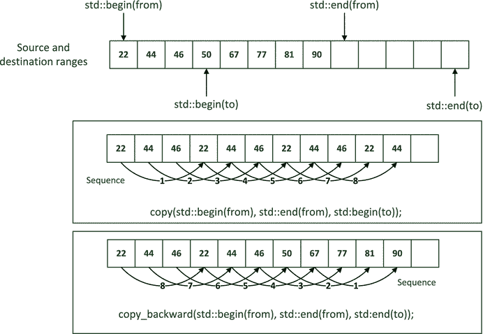
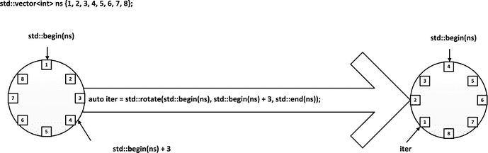
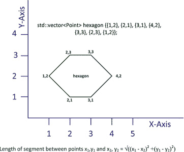

# 7.更多算法

Electronic supplementary material The online version of this chapter (doi:[10.​1007/​978-1-4842-0004-9_​7](http://dx.doi.org/10.1007/978-1-4842-0004-9_7)) contains supplementary material, which is available to authorized users.

本章描述了 STL 提供的更多算法。算法通常分为两组:改变应用范围的变异算法和非变异算法。我将在这一章中讨论算法，这些算法根据你能用它们做什么来分组，而不是根据它们是否改变事情。如果你知道一个算法是做什么的，那么它是否改变了它所应用的数据就显而易见了。在本章中，您将了解:

*   测试某个范围内元素属性的算法
*   计算给定属性范围内元素数量的算法
*   比较两个元素范围的算法
*   复制或移动范围的算法
*   设置或更改某个范围内的元素的算法

## 测试元素属性

在`algorithm`头中定义了三种算法，用于测试给定谓词在应用于一系列元素时何时返回`true`。这些算法的前两个参数是输入迭代器，它们定义了谓词应用的范围；第三个参数指定谓词。测试元素以查看谓词是否返回`true`可能看起来过于简单，但它仍然是一个强大的工具。例如，您可以测试是否有任何或所有学生通过了所有考试，或者是否所有学生都去上课了，或者是否没有绿色眼睛的`Person`物体，甚至是否每个`Dog`物体都有过辉煌的一天。谓词可以很简单，也可以很复杂。测试元素属性的三种算法是:

*   如果谓词为范围内的所有元素返回`true`，则`all_of()`算法返回`true`。
*   如果谓词为范围中的任何元素返回`true`，则`any_of()`算法返回`true`。
*   如果谓词对于范围内的所有元素都不返回`true`，则`none_of()`算法返回`true`。

不难想象这些是如何运作的。这里有一些代码来说明如何使用`none_of()`算法:

`std::vector<int> ages {22, 19, 46, 75, 54, 19, 27, 66, 61, 33, 22, 19};`

`int min_age{18};`

`std::cout << "There are "`

`<< (std::none_of(std::begin(ages), std::end(ages),`

`[min_age](int age) { return age < min_age; }) ? "no": "some")`

`<< " people under " << min_age << std::endl;`

谓词是一个 lambda 表达式，它将作为参数传递的`ages`中的元素与`min_age`的值进行比较。由`none_of()`返回的`bool`值用于选择包含在输出消息中的`"no"`或`"some"`。当`ages`中没有元素小于 min_age 时，`none_of()`算法返回`true`,因此在这种情况下选择`"no"`。当然，您可以使用`any_of()`来产生相同的结果:

`std::cout << "There are "`

`<< (std::any_of(std::begin(ages), std::end(ages),`

`[min_age](int age) { return age < min_age; }) ? "some": "no")`

`<< " people under " << min_age << std::endl;`

`any_of()`算法仅在一个或多个元素小于`min_age`时返回`true`。没有少于`min_age`的元素，所以这里也选择了`"no"`。

下面的代码片段展示了如何使用`all_of()`来测试`ages`容器中的元素:

`int good_age{100};`

`std::cout << (std::all_of(std::begin(ages), std::end(ages),`

`[good_age](int age) { return age < good_age; }) ? "None": "Some")`

`<< " of the people are centenarians." << std::endl;`

lambda 表达式将`ages`中的一个元素与`good_age`的值进行比较，后者是`100`。所有元素都小于`100`，因此`all_of()`将返回`true`，输出消息将正确报告没有记录任何百岁老人。

`count()`和`count_if()`算法告诉您在前两个参数指定的范围内有多少元素满足您用第三个参数指定的条件。`count()`算法返回等于第三个参数的元素个数。`count_if()`算法返回第三个参数谓词返回`true`的元素数量。下面的代码展示了应用于`ages`容器的这些功能:

`std::vector<int> ages {22, 19, 46, 75, 54, 19, 27, 66, 61, 33, 22, 19};`

`int the_age{19};`

`std::cout << "There are "`

`<< std::count(std::begin(ages), std::end(ages), the_age)`

`<< " people aged " << the_age << std::endl;`

`int max_age{60};`

`std::cout << "There are "`

`<< std::count_if(std::begin(ages), std::end(ages),`

`[max_age](int age) { return age > max_age; })`

`<< " people aged over " << max_age << std::endl;`

第一条输出语句使用`count()`算法来确定`ages`中等于`the_age`的元素数量。第二个输出语句使用`count_if()`来报告超过`max_age`值的元素数量。

当您想要了解某个元素范围的一般特征时——当您只想知道某个特征是否适用，或者有多少符合某个标准时，可以使用本节中的所有算法。当你想知道细节——范围中的哪些元素匹配——你可以使用在第 6 章中遇到的查找算法。

## 比较范围

可以用类似于比较字符串的方式来比较两个范围。如果两个范围长度相同，并且对应的元素对相等，则`equal()`算法返回`true`。`equal()`算法有四个版本，其中两个使用`==`操作符比较元素，另两个使用您作为参数提供的函数对象比较元素。所有指定范围的迭代器必须至少是输入迭代器。

使用`==`操作符比较两个范围的一个版本需要三个输入迭代器参数。前两个参数是第一个范围的开始和结束迭代器。第三个参数是第二个范围的 begin 迭代器。如果第二个范围包含的元素比第一个范围少，则结果是未定义的。使用`==`操作符的第二个版本需要四个参数:第一个范围的开始和结束迭代器，第二个范围的开始和结束迭代器。如果两个范围的长度不同，那么结果总是`false`。我将演示这两个版本，但是我建议您总是使用接受四个参数的`equal()`版本，因为它不会导致未定义的行为。下面是一个工作示例，展示了如何应用这些功能:

`// Ex7_01.cpp`

`// Using the equal() algorithm`

`#include <iostream>                                      // For standard streams`

`#include <vector>                                        // For vector container`

`#include <algorithm>                                     // For equal() algorithm`

`#include <iterator>                                      // For stream iterators`

`#include <string>                                        // For string class`

`using std::string;`

`int main()`

`{`

`std::vector<string> words1 {"one", "two", "three", "four", "five", "six", "seven", "eight", "nine"};`

`std::vector<string> words2 {"two", "three", "four", "five", "six", "seven", "eight", "nine", "ten"};`

`auto iter1 = std::begin(words1);`

`auto end_iter1 = std::end(words1);`

`auto iter2 = std::begin(words2);`

`auto end_iter2 = std::end(words2);`

`std::cout << "Container - words1:  ";`

`std::copy(iter1, end_iter1, std::ostream_iterator<string>{std::cout, " "});`

`std::cout << "\nContainer - words2:  ";`

`std::copy(iter2, end_iter2, std::ostream_iterator<string>{std::cout, " "});`

`std::cout << std::endl;`

`std::cout << "\n1\. Compare from words1[1] to end with words2:                              ";`

`std::cout << std::boolalpha << std::equal(iter1 + 1, end_iter1, iter2) << std::endl;`

`std::cout << "2\. Compare from words2[0] to second-to-last with words1:                   ";`

`std::cout << std::boolalpha << std::equal(iter2, end_iter2 - 1, iter1) << std::endl;`

`std::cout << "3\. Compare from words1[1] to words1[5] with words2:                        ";`

`std::cout << std::boolalpha << std::equal(iter1 + 1, iter1 + 6, iter2) << std::endl;`

`std::cout << "4\. Compare first 6 from words1 with first 6 in words2:                     ";`

`std::cout << std::boolalpha << std::equal(iter1, iter1 + 6, iter2, iter2 + 6) << std::endl;`

`std::cout << "5\. Compare all words1 with words2:                                         ";`

`std::cout << std::boolalpha << std::equal(iter1, end_iter1, iter2) << std::endl;`

`std::cout << "6\. Compare all of words1 with all of words2:                               ";`

`std::cout << std::boolalpha << std::equal(iter1, end_iter1, iter2, end_iter2) << std::endl;`

`std::cout << "7\. Compare from words1[1] to end with words2 from first to second-to-last: ";`

`std::cout << std::boolalpha`

`<< std::equal(iter1 + 1, end_iter1, iter2, end_iter2 - 1) << std::endl;`

`}`

输出将是:

`Container - words1:  one two three four five six seven eight nine`

`Container - words2:  two three four five six seven eight nine ten`

`1\. Compare from words1[1] to end``with`T2】

`2\. Compare from words2[0] to second-to-last with words1:                   false`

`3\. Compare from words1[1] to words1[5] with words2:                        true`

`4\. Compare first 6 from words1 with first 6 in words2:                     false`

`5\. Compare all words1 with words2:                                         false`

`6\. Compare all of words1 with all of words2:                               false`

`7\. Compare from words1[1] to end with words2 from first to second-to-last: true`

该示例比较了来自`words1`和`words2`容器的各种元素序列。`equal()`调用产生输出的原因是:

*   第一个输出产生`true`，因为从第二个到最后的`words1`元素匹配从第一个开始的`words2`元素。第二个范围中的元素数量比第一个范围中的数量多一个，但是第一个范围中的元素数量决定了要比较多少个对应的元素。
*   第二个输出产生`false`，因为有一个直接的不匹配；`words2`和`words1`中的第一个元素是不同的。
*   第三个语句显示`true`，因为从第二个开始的来自`words1`的五个元素与来自`words2`的前五个元素相同。
*   在第四条语句中，来自`words2`的元素范围由 begin 和 end 迭代器指定。范围长度相同，但第一个元素不同，因此结果是`false`。
*   在第五个语句中，两个范围中的第一个元素是直接不匹配的，所以结果是`false`。
*   第六个语句产生`false`，因为范围不同。该语句不同于前面的`equal()`调用，因为为第二个范围指定了结束迭代器。
*   第七个语句从第二个开始比较来自`words1`的元素，从第一个开始比较来自`words2`的相同数量的元素，所以输出是`true`。

当第二个范围被 begin 迭代器标识为`equal()`时，第二个范围中与第一个范围相比的元素数量由第一个范围的长度决定。第二个范围可以比第一个范围有更多的元素，并且`equal()`仍然可以返回`true`。当您为两个范围提供 begin 和 end 迭代器时，范围必须是相同的长度才能得到一个`true`结果。

虽然您可以使用`equal()`来比较两个相同类型容器的全部内容，但是最好使用容器的`operator==()`成员来完成这项工作。示例中的第六条输出语句可以写成:

`std::cout << std::boolalpha << (words1 == words2) << " ";             // false`

接受谓词作为附加参数的两个版本的`equal()`以相同的方式工作。谓词定义了元素之间相等的比较。下面的代码片段说明了它们的用法:

`std::vector<string> r1 {"three", "two", "ten"};`

`std::vector<string> r2 {"twelve", "ten", "twenty"};`

`std::cout << std::boolalpha`

`<< std::equal(std::begin(r1), std::end(r1), std::begin(r2),`

` { return s1[0] == s2[0]; })`

`<< std::endl;                                               // true`

`std::cout << std::boolalpha`

`<< std::equal(std::begin(r1), std::end(r1), std::begin(r2), std::end(r2),`

` { return s1[0] == s2[0]; })`

`<< std::endl;                                               // true`

第一次使用`equal()`仅通过 begin 迭代器指定第二个范围。谓词是一个 lambda 表达式，当`string`参数中的第一个字符相等时，它返回`true`。最后一条语句显示了完全指定两个范围并使用相同谓词的`equal()`算法。

你不应该使用`equal()`来比较无序的`map`或`set`容器中的元素范围。一个无序容器中给定元素集的顺序可能与存储在另一个无序容器中的相同元素集的顺序不同，因为元素在桶中的分配可能因容器而异。

### 查找范围不同的地方

`equal()`算法告诉你两个范围是否匹配。`mismatch()`算法告诉你两个范围是否匹配，如果不匹配，它们在哪里不同。四个版本的`mismatch()`和四个版本的`equal()`有相同的参数——有和没有第二个范围的结束迭代器，每个版本都有和没有一个函数对象的额外参数来定义比较。`mismatch()`算法返回一个包含两个迭代器的`pair`对象。`first`成员是来自前两个参数指定范围的迭代器，第二个成员是来自第二个范围的迭代器。当范围不匹配时，`pair`包含指向第一对不匹配元素的迭代器；因此，对象将是`pair<iter1 + n, iter2 + n>`，其中范围中索引`n`处的元素是第一个不匹配的元素。

当范围匹配时，`pair`成员取决于您使用的`mismatch()`版本和环境。`iter1`和`end_iter1`代表定义第一个范围的迭代器，`iter2`和`end_iter2`代表第二个范围的开始和结束迭代器，为匹配范围返回的`pair`的内容如下:

对于`mismatch(iter1, end_iter1, iter2)`:

*   返回`pair<end_iter1, (iter2 + (end_iter1 - iter1))>`，所以第二个成员是`iter2`加上第一个范围的长度。如果第二个范围比第一个范围短，则行为未定义。

`For mismatch(iter1, end_iter1, iter2, end_iter2)`:

*   当第一个范围比第二个范围长时，返回`pair<end_iter1, (iter2 + (end_iter1 - iter1))>`，所以`second`成员是`iter2`加上第一个范围的长度。
*   当第二个范围比第一个范围长时`pair<(iter1 + (end_iter2 - iter2)), end_iter2>`被返回，所以第一个成员是`iter1`加上第二个范围的长度。
*   当范围相同时，返回长度`pair<end_iter1, end_iter2>`。

这同样适用于您是否添加了为比较定义函数对象的参数。

下面是一个工作示例，展示了使用默认比较来比较是否相等的`mismatch()`:

`// Ex7_02.cpp`

`// Using the mismatch() algorithm`

`#include <iostream>                                      // For standard streams`

`#include <vector>                                        // For vector container`

`#include <algorithm>                                     // For equal() algorithm`

`#include <string>                                        // For string class`

`#include <iterator>                                      // For stream iterators`

`using std::string;`

`using word_iter = std::vector<string>::iterator;`

`int main()`

`{`

`std::vector<string> words1 {"one", "two", "three", "four", "five", "six", "seven", "eight", "nine"};`

`std::vector<string> words2 {"two", "three", "four", "five", "six", "eleven", "eight", "nine", "ten"};`

`auto iter1 = std::begin(words1);`

`auto end_iter1 = std::end(words1);`

`auto iter2 = std::begin(words2);`

`auto end_iter2 = std::end(words2);`

`// Lambda expression to output mismatch() result`

`auto print_match = `

`{`

`if(pr.first != end_iter)`

`std::cout << "\nFirst pair of words that differ are "`

`<< *pr.first << " and " << *pr.second << std::endl;`

`else`

`std::cout << "\nRanges are identical." << std::endl;`

`};`

`std::cout << "Container - words1:  ";`

`std::copy(iter1, end_iter1, std::ostream_iterator<string>{std::cout, " "});`

`std::cout << "\nContainer - words2:  ";`

`std::copy(iter2, end_iter2, std::ostream_iterator<string>{std::cout, " "});`

`std::cout << std::endl;`

`std::cout << "\nCompare from words1[1] to end with words2:";`

`print_match(std::mismatch(iter1 + 1, end_iter1, iter2), end_iter1);`

`std::cout << "\nCompare from words2[0] to second-to-last with words1:";`

`print_match(std::mismatch(iter2, end_iter2 - 1, iter1), end_iter2 - 1);`

`std::cout << "\nCompare from words1[1] to words1[5] with words2:";`

`print_match(std::mismatch(iter1 + 1, iter1 + 6, iter2), iter1 + 6);`

`std::cout << "\nCompare first 6 from words1 with first 6 in words2:";`

`print_match(std::mismatch(iter1, iter1 + 6, iter2, iter2 + 6), iter1 + 6);`

`std::cout << "\nCompare all words1 with words2:";`

`print_match(std::mismatch(iter1, end_iter1, iter2), end_iter1);`

`std::cout << "\nCompare all``of`T2】

`print_match(std::mismatch(iter2, end_iter2, iter1, end_iter1), end_iter2);`

`std::cout << "\nCompare from words1[1] to end with words2[0] to second-to-last:";`

`print_match(std::mismatch(iter1 + 1, end_iter1, iter2, end_iter2 - 1), end_iter1);`

`}`

注意，`words2`的内容与前面的例子略有不同。每次应用`mismatch()`的结果都是由定义为`print_match`的λ表达式生成的。参数是一对对象和一个`vector<string>`容器的迭代器。用于别名`word_iter`的`using`指令使得 lambda 的定义更加简单。`main()`中的代码使用不包含比较函数对象参数的版本对`mismatch()`进行了修改。当第二个范围仅由一个 begin 迭代器标识时，只需要它的元素数量至少与第一个匹配范围一样多，但可以更长。当完全指定第二个范围时，最短的范围决定了要比较多少个元素。

以下是输出结果:

`Container - words1:  one two three four five six seven eight nine`

`Container - words2:  two three four five six eleven eight nine ten`

`Compare from words1[1] to end with words2:`

`First pair of words that differ are seven and eleven`

`Compare from words2[0] to second-to-last with words1:`

`First pair of words that differ are two and one`

`Compare from words1[1] to words1[5] with words2:`

`Ranges are identical.`

`Compare first 6 from words1 with first 6 in words2:`

`First pair of words that differ are one and two`

`Compare all words1 with words2:`

`First pair of words that differ are one and two`

`Compare all of words2 with all of words1:`

`First pair of words that differ are two and one`

`Compare from words1[1] to end with words2[0] to second-to-last:`

`First pair of words that differ are seven and eleven`

输出显示了每次应用`mismatch()`的结果。

当您提供自己的比较对象时，您可以完全灵活地定义等式。例如:

`std::vector<string> range1 {"one", "three", "five", "ten"};`

`std::vector<string> range2 {"nine", "five", "eighteen", "seven"};`

`auto pr = std::mismatch(std::begin(range1), std::end(range1), std::begin(range2), std::end(range2),`

``

`{ return s1.back() == s2.back(); });`

`if(pr.first == std::end(range1) || pr.second == std::end(range2))`

`std::cout << "The ranges are identical." << std::endl;`

`else`

`std::cout << *pr.first << " is not equal to " << *pr.second << std::endl;`

当两个字符串的最后一个字母相等时，比较返回`true`,因此执行这段代码的输出将是:

`five is not equal to eighteen`

当然，这是正确的——而且根据比较函数，`"one"`等于`"nine"`，`"three"`等于`"five"`。

### 词典范围比较

两个字符串的字母顺序是通过比较相应的字符对获得的，从第一个字符开始。第一对不同的对应字符决定了哪个字符串先出现。字符串的顺序将是不同字符的顺序。如果字符串长度相同，并且所有字符都相等，则字符串相等。如果字符串长度不同，并且较短字符串中的字符序列与较长字符串中的初始序列相同，则较短字符串小于较长字符串。因此,“年龄”先于“美丽”,“平静”先于“风暴”同样显而易见的是，“先有鸡”而不是“先有蛋”

词典排序是对任何类型的对象序列的字母排序思想的推广。两个序列中的对应对象从第一个开始连续比较，前两个不同的对象决定序列的顺序。显然，序列中的对象必须具有可比性。`lexicographical_compare()`算法比较由 begin 和 end 迭代器定义的两个范围。前两个参数定义第一个范围，第三和第四个参数是第二个范围的开始和结束迭代器。默认情况下，`<`操作符用于比较元素，但是您可以在必要时提供一个实现小于比较的函数对象作为可选的第五个参数。如果第一个范围按字典顺序小于第二个范围，算法返回`true`，否则返回`false`。因此，错误的返回意味着第一个范围大于或等于第二个范围。这些范围是逐元素比较的。不同的第一对对应元素决定了范围的顺序。如果范围具有不同的长度，并且较短的范围匹配较长范围中的元素的初始序列，则较短的范围小于较长的范围。长度相同且对应元素相等的两个范围相等。空范围总是小于非空范围。下面是一个使用`lexicographical_compare()`的例子:

`std::vector<string> phrase1 {"the", "tigers", "of", "wrath"};`

`std::vector<string> phrase2 {"the", "horses", "of", "instruction"};`

`auto less = std::lexicographical_compare(std::begin(phrase1), std::end(phrase1),`

`std::begin(phrase2), std::end(phrase2));`

`std::copy(std::begin(phrase1), std::end(phrase1), std::ostream_iterator<string>{std::cout, " "});`

`std::cout << (less ? "are" : "are not") << " less than ";`

`std::copy(std::begin(phrase2), std::end(phrase2), std::ostream_iterator<string>{std::cout, " "});`

`std::cout << std::endl;`

因为范围中的第二个元素不同，并且`"tigers"`大于`"horses`，所以此代码将生成以下输出:

`the tigers of wrath are not less than the horses of instruction`

您可以向`lexicographical_compare()`调用添加一个参数，得到相反的结果:

`auto less = std::lexicographical_compare(std::begin(phrase1), std::end(phrase1),`

`std::begin(phrase2), std::end(phrase2),`

`{ return s1.length() < s2.length(); });`

该算法使用第三个参数 lambda 表达式来比较元素。这将比较范围内字符串的长度，因为`phrase1`中第四个元素的长度小于`phrase2`中相应元素的长度，`phrase1`小于`phrase2`。

### 范围的排列

如果你对这个术语不熟悉的话——排列就是一系列对象或值的一种排列。例如，`"ABC"`中字符的可能排列是:

`"ABC", "ACB", "BAC", "BCA", "CAB", and "CBA"`

三个不同的字符有六种可能的排列，数字是`3 × 2 × 1`的结果。一般来说，`n`不同的物体有`n!`种可能的排列，其中`n!`是`n × (n-1) × (n-2) × ... × 2 × 1`。很容易理解为什么会这样。使用`n`对象，您可以为序列中的第一个对象选择`n`。对于第一个对象的每个选择，序列中的第二个对象还有`n-1`个可供选择，因此前两个对象有`n × (n-1)`个可能的选择。选择了前两个之后，还剩下`n-2`来选择第三个，所以还有`n × (n-1) × (n-2)`个前三个的可能序列——以此类推，直到序列中的最后一个是霍布森的选择，因为只剩下一个。

如果一个值域包含相同的元素但顺序不同，那么它就是另一个值域的置换。`next_permutation()`算法生成一个范围的重排，它是所有可能排列的字典顺序中的下一个排列。默认情况下，它使用小于运算符来实现这一点。参数是定义范围的迭代器，当新的排列大于先前的元素排列时，函数返回一个`bool`值，即`true`，如果先前的排列是序列中最大的排列，则返回`false`，这样就创建了字典上最小的排列。

下面是如何创建包含四个整数的`vector`的排列:

`std::vector<int> range {1,2,3,4};`

`do`

`{`

`std::copy(std::begin(range), std::end(range), std::ostream_iterator<int> {std::cout, " "});`

`std::cout << std::endl;`

`} while(std::next_permutation(std::begin(range), std::end(range)));`

当`next_permutation()`返回`false`时，循环结束，表示排列到达最小值。这恰好创建了序列在该范围内的所有排列，但仅仅是因为初始排列`1 2 3 4`是可能排列集合中的第一个。确保创建所有排列的一种方法是使用`next_permutation()`获得最小值:

`std::vector<string> words {"one","two", "three", "four", "five", "six", "seven", "eight"};`

`while(std::next_permutation(std::begin(words), std::end(words)))     // Change to minimum`

`;`

`do`

`{`

`std::copy(std::begin(words), std::end(words), std::ostream_iterator<string> {std::cout, " "});`

`std::cout << std::endl;`

`} while(std::next_permutation(std::begin(words), std::end(words)));`

`words`中的初始序列不是最小排列序列，但是`while`循环继续，直到`words`包含最小值。do-while 循环然后输出完整的集合。如果您想执行这个片段，请记住它将产生`8!`，这是输出的`40,320`行，因此您可以考虑首先减少`words`中的元素数量。

元素序列的最小排列是当每个元素小于或等于后面的元素时，因此您可以使用`min_element()`算法返回一个指向某个范围内最小元素的迭代器，同时使用`iter_swap()`算法交换两个迭代器指向的元素以创建最小排列，如下所示:

`std::vector<string> words {"one","two", "three", "four", "five", "six", "seven", "eight"};`

`for (auto iter = std::begin(words); iter != std::end(words)-1 ;++iter)`

`std::iter_swap(iter, std::min_element(iter, std::end(words)));`

`for`循环从容器范围的第一个到倒数第二个遍历迭代器。作为 for 循环主体的语句将`iter`指向的元素与`min_element()`返回的迭代器指向的元素交换。这将最终产生最小排列，您可以将它用作`next_permutation()`生成所有排列的起点。

您可以在开始创建所有排列之前，通过创建原始容器的副本并更改`do-while`循环来避免达到最小排列的所有开销:

`std::vector<string> words {"one","two", "three", "four", "five", "six", "seven", "eight"};`

`auto words_copy = words;                              // Copy the original`

`do`

`{`

`std::copy(std::begin(words), std::end(words), std::ostream_iterator<string> {std::cout, " "});`

`std::cout << std::endl;`

`std::next_permutation(std::begin(words), std::end(words));`

`} while(words != words_copy);                           // Continue until back to the original`

该循环现在继续创建新的排列，直到到达原始排列。

下面是一个工作示例，它查找一个单词中所有字母的排列:

`// Ex7_03.cpp`

`// Finding rearrangements of the letters in a word`

`#include <iostream>                                   // For standard streams`

`#include <iterator>                                   // For iterators and begin() and end()`

`#include <string>                                     // For string class`

`#include <vector>                                     // For vector container`

`#include <algorithm>                                  // For next_permutation()`

`using std::string;`

`int main()`

`{`

`std::vector<string> words;`

`string word;`

`while(true)`

`{`

`std::cout << "\nEnter a word, or Ctrl+z to end: ";`

`if((std::cin >> word).eof()) break;`

`string word_copy {word};`

`do`

`{`

`words.push_back(word);`

`std::next_permutation(std::begin(word), std::end(word));`

`} while(word != word_copy);`

`size_t count{}, max{8};`

`for(const auto& wrd : words)`

`std::``cout`T2】

`std::cout << std::endl;`

`words.clear();                                         // Remove previous permutations`

`}`

`}`

它从标准输入流中读入一个单词到`word`，在`word_copy`中复制一份，然后将`word`中所有字母的排列存储到`words`容器中。程序继续处理单词，直到你输入`Ctrl+Z`。word 的副本用于决定何时存储所有排列。然后排列被写入标准输出流，8 个一行。我已经说过，排列的数目随着被排列的元素数目迅速增加，所以不要用长词来尝试这个。这个例子并不是很有用，但是我会在第 9 章的[中重新访问这个程序，其中介绍了更多使用 STL 文件的细节。在那里，可以读取一个包含大量英语单词的文件，并搜索这些单词来确定哪些排列是有效的单词。因此，程序找到原始单词的变位词并输出它们。](09.html)

您可以提供一个 function 对象作为第三个参数给`next_permutation()`，它定义了一个比较函数，作为缺省函数的替代。下面是如何使用这个版本通过比较最后几个字母来生成单词序列的排列:

`std::vector<string> words {"one", "two", "four", "eight"};`

`do`

`{`

`std::copy(std::begin(words), std::end(words), std::ostream_iterator<string> {std::cout, " "});`

`std::cout << std::endl;`

`} while(std::next_permutation(std::begin(words), std::end(words),`

`{return s1.back() < s2.back(); }));`

这段代码使用作为最后一个参数传递给`next_permutation()`的 lambda 表达式来生成`words`中元素的所有 24 种排列。

`next_permutation()`算法按升序字典顺序生成排列。当你想产生降序排列时，你可以使用`prev_permutation()`算法。这与`next_permutation()`有相同的两个版本，默认情况下使用`<`来比较元素。因为排列是按降序生成的，所以该算法在大多数情况下返回 true，并且当它创建的排列是最大排列时返回`false`。例如:

`std::vector<double> data {44.5, 22.0, 15.6, 1.5};`

`do`

`{`

`std::copy(std::begin(data), std::end(data), std::ostream_iterator<double> {std::cout, " "});`

`std::cout << std::endl;`

`} while(std::prev_permutation(std::begin(data), std::end(data)));`

该代码输出`data`中四个`double`值的所有二十四种排列，因为初始序列是最大值，而`prev_permutation()`仅在输入序列是最小值时返回`false`。

您可以使用`is_permutation()`算法测试一个序列是否是另一个序列的排列，如果是这种情况，该算法将返回`true`。下面是一些代码，展示了这个算法在 lambda 表达式中的应用:

`std::vector<double> data1 {44.5, 22.0, 15.6, 1.5};`

`std::vector<double> data2 {22.5, 44.5, 1.5, 15.6};`

`std::vector<double> data3 {1.5, 44.5, 15.6, 22.0};`

`auto test = `

`{`

`std::copy(std::begin(d1), std::end(d1), std::ostream_iterator<double> {std::cout, " "});`

`std::cout << (is_permutation(std::begin(d1), std::end(d1), std::begin(d2), std::end(d2)) ?`

`"is": "is not")`

`<< " a permutation of ";`

`std::copy(std::begin(d2), std::end(d2), std::ostream_iterator<double> {std::cout, " "});`

`std::cout << std::endl;`

`};`

`test(data1, data2);`

`test(data1, data3);`

`test(data3, data2);`

使用`auto`指定`test` lambda 的参数类型，这导致编译器将实际类型推断为`const std::vector<double>&`。使用`auto`来指定参数类型的 Lambda 表达式被称为泛型 lambda。`test`λ表达式使用`is_permutation()`来评估一个参数是否是另一个参数的排列。该算法的参数是两对迭代器，它们定义了要比较的范围。返回的`bool`值的参数用于选择两个可能的字符串之一进行输出。输出将是:

`44.5 22 15.6 1.5 is not a permutation of 22.5 44.5 1.5 15.6`

`44.5 22 15.6 1.5 is a permutation of 1.5 44.5 15.6 22`

`1.5 44.5 15.6 22 is not a permutation of 22.5 44.5 1.5 15.6`

还有另一个版本的`is_permutation()`允许第二个范围仅由 begin 迭代器指定。在这种情况下，第二个范围可以包含比第一个范围更多的元素，但是只考虑第一个范围包含的元素数量。但是，我建议您不要使用它，因为如果第二个范围包含的元素比第一个范围少，它会导致未定义的行为。我将展示一些使用它的代码。您可以向`data3`添加元素，元素的初始序列仍然表示`data1`的排列。例如:

`std::vector<double> data1 {44.5, 22.0, 15.6, 1.5};`

`std::vector<double> data3 {1.5, 44.5, 15.6, 22.0, 88.0, 999.0};`

`std::copy(std::begin(data1), std::end(data1), std::ostream_iterator<double> {std::cout, " "});`

`std::cout << (is_permutation(std::begin(data1), std::end(data1), std::begin(data3)) ?`

`"is": "is not")`

`<< " a permutation of ";`

`std::copy(std::begin(data3), std::end(data3), std::ostream_iterator<double> {std::cout, " "});`

`std::cout << std::endl;`

这将确认`data1`是`data3`的排列，因为只考虑了`data3`中的前四个元素。您可以在任一版本的`is_permutation()`中添加一个额外的参数来指定要使用的比较。

你可以使用`shuffle()`算法来创建一个范围的随机排列，但是我将把这个讨论推迟到第 8 章详细讨论 STL 提供的随机数生成能力。

## 复制范围

本节讨论复制区域的算法；但是不要忘记，当你想把一个容器中的全部内容转移到另一个容器时，你还有其他的可能性。容器定义了赋值操作符，该操作符将一个容器的全部内容复制到同类型的另一个容器中。也有一些容器的构造函数接受一个范围作为初始内容的来源。大多数情况下，本节中的算法用于复制容器中元素的子集。

你已经看到了许多`copy()`算法的应用，所以你知道它是如何工作的。它将元素从作为输入迭代器的前两个参数定义的源范围复制到从第三个参数(必须是输出迭代器)指定的位置开始的目标范围。你还有三种算法，它们提供的不仅仅是简单的复制过程。

### 复制一些元素

`copy_n()`算法将特定数量的元素从源复制到目的地。第一个参数是指向第一个源元素的输入迭代器，第二个参数是要复制的元素数量，第三个参数是指向目标中第一个位置的输出迭代器。该算法返回一个迭代器，该迭代器指向最后一个复制的元素之后的一个元素，或者如果第二个参数为零，则只返回第三个参数——输出迭代器。下面是一个使用它的例子:

`std::vector<string> names {"Al",   "Beth",   "Carol", "Dan",  "Eve",`

`"Fred", "George", "Harry", "Iain", "Joe"};`

`std::unordered_set<string> more_names {"Janet", "John"};`

`std::copy_n(std::begin(names) + 1, 3, std::inserter(more_names, std::begin(more_names)));`

`copy_n()`操作从第二个名字开始将三个元素从`names`容器复制到关联容器`more_names`。目的地由`inserter()`函数模板创建的`unordered_set`容器的`insert_iterator`对象指定。`insert_iterator`对象通过调用其`insert()`成员向容器中添加元素。

当然，`copy_n()`操作中的目的地可以是一个流迭代器:

`std::copy_n(std::begin(more_names), more_names.size()-1,`

`std::ostream_iterator<string> {std::cout, " "});`

这将输出`more_names`中除最后一个以外的所有元素。请注意，如果要复制的元素数量超过了可用的数量，您的程序将会陷入困境。如果元素数为零或负数，`copy_n()`算法什么也不做。

### 条件复制

`copy_if()`算法从一个谓词返回`true`的源范围中复制元素，因此您可以把它看作是一个过滤器。前两个参数是定义源范围的输入迭代器，第三个参数是指向目标范围中第一个位置的输出迭代器，第四个参数是谓词。返回一个输出迭代器，它指向最后一个被复制的元素之后的一个元素。这里有一个使用`copy_if()`的例子:

`std::vector<string> names {"Al",   "Beth",   "Carol", "Dan",  "Eve",`

`"Fred", "George", "Harry", "Iain", "Joe"};`

`std::unordered_set<string> more_names {"Jean", "John"};`

`size_t max_length{4};`

`std::copy_if(std::begin(names), std::end(names), std::inserter(more_names, std::begin(more_names)),`

`[max_length](const string& s){ return s.length() <= max_length; });`

这里的`copy_if()`操作只复制来自`names`的四个字符或更少的元素，因为这是第四个参数 lambda 表达式强加的条件。目的地是`unordered_set`集装箱`more_names`，它已经包含了两个四个字母的名字。与上一节一样，`insert_iterator`将符合条件的元素添加到关联容器中。如果您想证明它是有效的，您可以使用`copy()`算法列出`more_names`的内容:

`std::copy(std::begin(more_names), std::end(more_names), std::ostream_iterator<string> {std::cout, " "});`

`std::cout << std::endl;`

当然，`copy_if()`的目的地也可以是一个流迭代器:

`std::vector<string> names {"Al",   "Beth",   "Carol", "Dan",  "Eve",`

`"Fred", "George", "Harry", "Iain", "Joe"};`

`size_t max_length{4};`

`std::copy_if(std::begin(names), std::end(names), std::ostream_iterator<string> {std::cout, " "},`

`[max_length](const string& s) { return s.length() > max_length; });`

`std::cout << std::endl;`

这将把具有五个或更多字符的名称从`names`容器写入标准输出流。这将输出:

`Carol George Harry`

您可以使用输入流迭代器作为`copy_if()`算法的源代码，就像您可以使用其他需要输入迭代器的算法一样。这里有一个例子:

`std::unordered_set<string> names;`

`size_t max_length {4};`

`std::cout << "Enter names of less than 5 letters. Enter Ctrl+Z on a separate line to end:\n";`

`std::copy_if(std::istream_iterator<string>{std::cin}, std::istream_iterator<string>{}, std::inserter(names, std::begin(names)),`

`[max_length](const string& s) { return s.length() <= max_length; });`

`std::copy(std::begin(names), std::end(names), std::ostream_iterator<string> {std::cout, " "});`

`std::cout << std::endl;`

`names`容器是一个最初为空的`unordered_set`。`copy_if()`算法复制从标准输入流中读取的名字，但只限于四个或更少的字符。执行这段代码会产生以下输出:

`Enter names of less than 5 letters. Enter Ctrl+Z on a separate line to end:`

`Jim Bethany Jean Al Algernon Bill Adwina Ella Frederick Don`

`^Z`

`Ella Jim Jean Al Bill Don`

从`cin`中读取超过五个字母的名称，但将其丢弃，因为在这些情况下，第四个参数指定的谓词返回`false`。因此，输入的十个名字中只有六个存储在容器中。

### 逆序复制

不要被`copy_backward()`算法的名字误导了。它不会颠倒元素的顺序。它就像`copy()`算法一样复制，但是从最后一个元素开始，并返回到第一个元素。`copy_backward()`算法复制由前两个迭代器参数指定的范围。第三个参数是目标区域的结束迭代器，通过将源区域的最后一个元素复制到目标区域结束迭代器之前的元素，源区域被复制到目标区域，如图 [7-1](#Fig1) 所示。`copy_backward()`的三个参数都必须是双向迭代器，即可以递增或递减的迭代器。这意味着该算法只能应用于序列容器中的范围。

图 7-1。

How `copy_backward()` works

图 [7-1](#Fig1) 显示了如何将源范围`from`中的最后一个元素首先复制到目标范围`to`中的最后一个元素。从源位置向后穿过源范围的每个后续元素都被复制到目标位置上前一个元素之前的位置。在执行操作之前，目标中的元素必须存在，因此目标中的元素必须至少与源中的元素一样多，但也可以更多。`copy_backward()`算法返回一个迭代器，该迭代器指向最后一个被复制的元素，这将是该区域在新位置的开始迭代器。

您可能想知道`copy_backward()`与从第一个元素开始复制元素的常规`copy()`算法相比有什么优势。一个答案是当范围重叠时。您可以使用`copy()`将元素复制到左边的重叠目标区域——也就是说，复制到源区域中第一个元素之前的位置。如果您试图使用`copy()`将相同范围内的元素复制到右边，该操作将不起作用，因为仍要复制的元素将在被复制之前被覆盖。当你想向右复制时，你可以使用`copy_backward()`,只要目标区域的末端在源区域末端的右边。图 [7-2](#Fig2) 说明了在重叠范围之间向右复制时两种算法的区别。

图 7-2。

Copying overlapping ranges to the right

图 [7-2](#Fig2) 显示了将`copy()`和`copy_backward()`算法应用于右侧前三个位置的结果。很明显，当复制到右边时，`copy()`算法不能做你想要的，因为一些元素在被复制之前就被覆盖了。在这种情况下,`copy_backward()`算法确实做了你想做的事情。当在一个范围内向左复制时，情况正好相反- `copy()`有效，但`copy_backward()`无效。

这里有一些代码来说明`copy_backward()`的作用:

`std::deque<string> song{"jingle", "bells", "jingle", "all", "the", "way"};`

`song.resize(song.size()+2);                  // Add 2 elements`

`std::copy_backward(std::begin(song), std::begin(song)+6, std::end(song));`

`std::copy(std::begin(song), std::end(song), std::ostream_iterator<string>{std::cout, " "});`

`std::cout << std::endl;`

通过使用其`resize()`成员创建反向序列复制操作所需的额外元素，增加了`deque`容器中的元素数量。`copy_backward()`算法将原始元素向右复制两个位置，保留前两个元素不变，因此这段代码的输出将是:

`jingle bells jingle bells jingle all the way`

## 复制和反转元素的顺序

`reverse_copy()`算法将一个源区域复制到一个目标区域，这样目标区域中的元素顺序相反。源范围由前两个迭代器参数定义，必须是双向的。目的地由第三个参数标识，这是一个输出迭代器，是目的地的 begin 迭代器。如果范围重叠，则行为未定义。该算法返回一个输出迭代器，它指向目标范围中最后一个元素之后的一个元素。这里有一个使用`reverse_copy()`和`copy_if()`的工作示例:

`// Ex7_04.cpp`

`// Testing for palindromes using reverse_copy()`

`#include <iostream>                            // For standard streams`

`#include <iterator>                            // For stream iterators and begin() and end()`

`#include <algorithm>                           // For reverse_copy() and copy_if()`

`#include <cctype>                              // For toupper() and isalpha()`

`#include <string>`

`using std::string;`

`int main()`

`{`

`while(true)`

`{`

`string sentence;`

`std::cout << "Enter a sentence or Ctrl+Z to end: ";`

`std::getline(std::cin, sentence);`

`if(std::cin.eof()) break;`

`// Copy as long as the characters are alphabetic & convert to upper case`

`string only_letters;`

`std::copy_if(std::begin(sentence), std::end(sentence), std::back_inserter(only_letters),`

` { return std::isalpha(ch); });`

`std::for_each(std::begin(only_letters), std::end(only_letters),  { ch = toupper(ch); });`

`// Make a reversed copy`

`string reversed;`

`std::reverse_copy(std::begin(only_letters), std::end(only_letters), std::back_inserter(reversed));`

`std::cout << '"' << sentence << '"'`

`<< (only_letters == reversed ? " is" : " is not") << " a palindrome." << std::endl;`

`}`

`}`

这个程序检查一个句子(或者许多句子)是否代表一个回文；回文是这样一个句子，如果你忽略了空格和标点符号这样的小细节，它的前后读起来是一样的。循环允许你检查尽可能多的句子。使用`getline()`将一个句子读入`sentence`。如果只读取了`Ctrl+Z`，则将为输入流设置`EOF`标志，这将终止循环。使用`copy_if()`将`sentence`中的字母复制到`only_letters`。lambda 表达式只为字母返回`true`，因此任何其他字符都将被忽略。由`back_inserter()`创建的`back_insert_iterator`对象将字符附加到`only_letters`。`for_each()`算法将第三个参数指定的函数应用于由前两个参数定义的范围内的元素，因此这里它将`only_letters`中的字符转换为大写。使用`reverse_copy()`算法在`reverse`中创建`only_letters`内容的反向副本。比较`only_letters`和`reversed`确定输入是否是回文。

以下是一些输出示例:

`Enter a sentence or Ctrl+Z to end: Lid off a daffodil.`

`"Lid off a daffodil." is a palindrome.`

`Enter a sentence or Ctrl+Z to end: Engage le jeu que je le gagne.`

`"Engage le jeu que je le gagne." is a palindrome.`

`Enter a sentence or Ctrl+Z to end: Sit on a potato pan Otis!`

`"Sit on a potato pan Otis!" is a palindrome.`

`Enter a sentence or Ctrl+Z to end: Madam, I am Adam.`

`"Madam, I am Adam." is not a palindrome.`

`Enter a sentence or Ctrl+Z to end: Madam, I’m Adam.`

`"Madam, I’m Adam." is a palindrome.`

`Enter a sentence or Ctrl+Z to end: ^Z`

回文很难创建，但是一个法国人乔治·佩雷克成功地创建了一个包含一千多个单词的回文。

`reverse()`算法将由两个双向迭代器参数指定的范围内的元素就地反转。你可以在`Ex7_04.cpp`中使用这个来代替`reverse_copy()`——就像这样:

`string reversed {only_letters};`

`std::reverse(std::begin(reversed), std::end(reversed));`

这两条语句将取代在`Ex7_04.cpp`中对`reversed`和`reverse_copy()`调用的定义。他们创造了`reversed`作为`only_letters`的复制品。调用`reverse()`然后将`reversed`中的字符顺序颠倒过来。

## 复制一个区域，删除相邻的重复项

`unique_copy()`将一个范围复制到另一个范围，同时删除连续的重复元素。默认情况下，它使用`==`操作符来决定元素何时相等。前两个参数是指定源的迭代器，第三个参数是指向目标中第一个元素的输出迭代器。可选的第四个参数接受一个函数对象，该对象定义了一个对`==`操作符的替代。该算法返回一个输出迭代器，它指向目标中最后一个元素之后的一个元素。

复制一个序列，如`1`、`1`、`2`、`2`、`3`，将导致目的地包含`1`、`2`、`3`。因为只消除相邻的重复项，所以将复制序列中的所有元素，如`1`、`2`、`1`、`2`、`3`。当然，如果源区域已经排序，所有重复的区域都将被删除，因此目标区域将包含唯一的元素。

下面是一些显示应用于字符串中字符的`unique_copy()`的代码:

`string text {"Have you seen how green the trees seem?"};`

`string result{};`

`std::unique_copy(std::begin(text), std::end(text), std::back_inserter(result));`

`std::cout << result << std::endl;`

复制操作的源是整个字符串`text`，目的地是`result`的`back_insert_iterator`，所以每个被复制的字符将被附加到`result`。这输出了几乎无用的句子:

`Have you sen how gren the tres sem?`

尽管输出确认了`unique_copy()`消除了相邻的重复。

当你提供你自己的比较对象时，你并不局限于一个简单的等式——你可以把它变成你喜欢的。这使得有可能选择不被复制的重复元素。下面的代码展示了如何从字符串中删除重复的空格:

`string text {"there’s   no air  in   spaaaaaace!"};`

`string result {};`

`std::unique_copy(std::begin(text), std::end(text), std::back_inserter(result),`

` { return ch1 == ' ' && ch1 == ch2; });`

`std::cout << result << std::endl;`

`unique_copy()`的第四个参数是一个 lambda 表达式，仅当两个参数都是空格时才返回`true`。执行此代码会产生以下输出:

`There’s no air in spaaaaaace!`

这表明空格已经被删除，但是`spaaaaaace`中的`a`没有被删除。

## 从范围中删除相邻的重复项

您还可以使用`unique()`算法来删除序列中的重复项。这需要前向迭代器来指定要处理的范围。它返回一个前向迭代器，该迭代器是删除重复项后新范围的结束迭代器。您可以提供一个 function 对象作为可选的第三个参数，该参数定义了用于比较元素的==的替代。这里有一个例子:

`std::vector<string> words {"one", "two", "two", "three", "two", "two", "two"};`

`auto end_iter = std::unique(std::begin(words), std::end(words));`

`std::copy(std::begin(words), end_iter, std::ostream_iterator<string>{std::cout, " "});`

`std::cout << std::endl;`

这通过覆盖来消除`words`中的连续元素。输出将是:

`one two three two`

当然，不会从输入范围中删除任何元素；该算法无法移除元素，因为它不知道它们的上下文。整个系列仍将存在。然而，如果我在上面的代码中使用`std::end(words)`而不是`end_iter`来输出结果，那么在新的 end 之外的元素的状态没有保证，我在我的系统上得到这样的输出:

`one two three two  two two`

同样数量的元素仍然存在，但是新的 end 迭代器指向的元素只是空字符串；最后两个元素和之前一样。在您的系统上，结果可能有所不同。正因为如此，在执行`unique()`之后截断原始范围是个好主意，就像这样:

`auto end_iter = std::unique(std::begin(words), std::end(words));`

`words.erase(end_iter, std::end(words));`

`std::copy(std::begin(words), std::end(words), std::ostream_iterator<string> {std::cout, " "});`

`std::cout << std::endl;`

容器的`erase()`成员从新的末端迭代器中移除元素，因此`end(words)`将返回`end_iter`。

当然，您可以将`unique()`应用于字符串中的字符:

`string text {"there’s   no air  in   spaaaaaace!"};`

`text.erase(std::unique(std::begin(text), std::end(text),`

` { return ch1 == ' ' && ch1 == ch2; }),`

`std::end(text));`

`std::cout << text << std::endl;             // Outputs: there’s no air in spaaaaaace!`

这使用`unique()`从`text`字符串中删除相邻的重复空格。代码使用迭代器，迭代器由`unique()`作为第一个参数返回给`text`的`erase()`成员，并指向第一个要删除的字符。`erase()`的第二个参数是`text`的结束迭代器，所以新字符串后面没有重复空格的所有字符都被删除。

## 旋转范围

`rotate()`算法向左旋转一系列元素。其工作原理如图 [7-3](#Fig3) 所示。为了理解旋转范围的工作原理，您可以将范围中的元素想象成手镯上的珠子。`rotate()`操作使得一个新元素成为 begin 迭代器指向的第一个元素。旋转后，最后一个元素是新的第一个元素之前的元素。

图 7-3。

How the rotate() algorithm works

`rotate()`的第一个参数是范围的开始迭代器；第二个参数是一个迭代器，指向新的第一个元素应该是什么，它必须在范围内；第三个参数是范围的结束迭代器。图 [7-3](#Fig3) 中的例子显示了`ns`容器上的`rotate()`操作使得值为 4 的元素成为新的第一个元素，最后一个元素的值为 3。元素的循环顺序保持不变，因此它实际上只是旋转元素的循环，直到新的第一个元素成为范围的开始。该算法返回一个迭代器，指向新位置的原始第一个元素。这里有一个例子:

`std::vector<string> words {"one", "two", "three", "four", "five", "six", "seven", "eight"};`

`auto iter = std::rotate(std::begin(words), std::begin(words)+3, std::end(words));`

`std::copy(std::begin(words), std::end(words), std::ostream_iterator<string> {std::cout, " "});`

`std::cout << std::endl << "First element before rotation: " << *iter << std::endl;`

这段代码将旋转应用于`words`中的所有元素。执行这段代码将产生以下输出:

`four five six seven eight one two three`

`First element before rotation: one`

输出表明`"four"`是新的第一个元素，并且`rotate()`返回的迭代器确实指向了之前的第一个元素`"one".`

当然，您旋转的范围不必是容器中的所有元素。例如:

`std::vector<string> words {"one", "two", "three", "four", "five",`

`"six", "seven", "eight", "nine", "ten"};`

`auto start = std::find(std::begin(words), std::end(words), "two");`

`auto end_iter = std::find(std::begin(words), std::end(words), "eight");`

`auto iter = std::rotate(start, std::find(std::begin(words), std::end(words), "five"), end_iter);`

`std::copy(std::begin(words), std::end(words), std::ostream_iterator<string> {std::cout, " "});`

`std::cout << std::endl << "First element before rotation: " << *iter << std::endl;`

它使用`find()`算法获得指向`words`中匹配“二”和“八”的元素的迭代器。这些定义了要旋转的范围，它是容器中元素的子集。这个范围被旋转以使`"five"`成为第一个元素，输出显示它按预期工作:

`one five six seven two three four eight nine ten`

`First element before rotation: two`

`rotate_copy()`算法在一个新的范围内生成一个范围的旋转副本，而不影响原始副本。`rotate_copy()`的前三个参数与`rotate()`的相同；第四个参数是一个输出迭代器，指向目标范围的第一个元素。该算法返回目的地的输出迭代器，该迭代器指向复制的最后一个元素之后的一个元素。这里有一个例子:

`std::vector<string> words {"one", "two", "three", "four", "five",`

`"six", "seven", "eight", "nine", "ten"};`

`auto start = std::find(std::begin(words), std::end(words), "two");`

`auto end_iter = std::find(std::begin(words), std::end(words), "eight");`

`std::vector<string> words_copy;`

`std::rotate_copy(start, std::find(std::begin(words), std::end(words), "five"), end_iter,`

`std::back_inserter(words_copy));`

`std::copy(std::begin(words_copy), std::end(words_copy), std::ostream_iterator<string> {std::cout, " "});`

`std::cout << std::endl;`

这产生了从`words`开始从`"two"`到`"seven"`的元素的旋转副本。使用一个`back_insert_iterator`将复制的元素添加到`words_copy`容器中，该容器将调用`words_copy`的`push_back()`成员来插入每个元素。这段代码产生的输出是:

`five six seven two three four`

`rotate_copy()`在这里返回的迭代器是`words_copy`中元素的结束迭代器。这段代码中没有记录或使用它，但它可能很有用。例如:

`std::vector<string> words {"one", "two", "three", "four", "five",`

`"six", "seven", "eight", "nine", "ten"};`

`auto start = std::find(std::begin(words), std::end(words), "two");`

`auto end_iter = std::find(std::begin(words), std::end(words), "eight");`

`std::vector<string> words_copy {20};                         // vector with 20 default elements`

`auto end_copy_iter = std::rotate_copy(start,   std::find(std::begin(words), std::end(words), "five"), end_iter, std::begin(words_copy));`

`std::copy(std::begin(words_copy), end_copy_iter, std::ostream_iterator<string> {std::cout, " "});`

`std::cout << std::endl;`

`words_copy`容器是用二十个默认元素创建的。`rotate_copy()`算法现在将旋转后的范围存储在`words_copy`的现有元素中，从开始处开始。算法返回的迭代器用于标识输出的`words_copy`中范围的结束；如果没有它，我们将不得不根据源范围中的元素数量来计算。

## 移动范围

`move()`算法将由前两个输入迭代器参数指定的范围移动到目的地，从第三个参数定义的位置开始，第三个参数必须是输出迭代器。该算法返回一个迭代器，该迭代器的值超过了移动到目的地的最后一个元素。这是一个移动操作，所以不能保证操作后元素的输入范围保持不变；源元素仍将存在，但可能不具有相同的值，因此在移动后不应使用它们。如果源范围要被替换，或者要被破坏，你可以使用`move()`算法。如果你需要源范围不受干扰，使用`copy()`算法。下面是一个展示如何使用它的示例:

`std::vector<int> srce {1, 2, 3, 4};`

`std::deque<int> dest {5, 6, 7, 8};`

`std::move(std::begin(srce), std::end(srce), std::back_inserter(dest));`

这将把所有来自`vector`容器`srce`的元素追加到`deque`容器`dest`中。要替换`dest`中的现有元素，您可以使用`std::begin(dest)`作为`move()`的第三个参数。只要目标中的第一个元素在源范围之外，就可以使用`move()`将元素移动到与源范围重叠的目标中；这意味着在该范围内向左移动。这里有一个例子:

`std::vector<int> data {1, 2, 3, 4, 5, 6, 7, 8};`

`std::move(std::begin(data) + 2, std::end(data), std::begin(data));`

`data.erase(std::end(data) - 2, std::end(data));       // Erase moved elements`

`std::copy(std::begin(data), std::end(data), std::ostream_iterator<int> {std::cout, " "});`

`std::cout << std::endl;                               // 3, 4, 5, 6, 7, 8`

这将把`data`的最后六个元素移回到容器的开头。这是因为目标在源范围之外。移动后不能保证最后两个元素的值。这里的元素被删除了，但是你同样可以将它们重置为一个已知的值——比如零。结果显示在最后一行的注释中。当然，您可以使用`rotate()`算法而不是`move()`算法来移动元素，在这种情况下，您肯定会知道最后两个元素的值。

如果移动操作的目的地在源范围内，`move()`将不能正常工作；这意味着在范围内向右移动。原因是有些元素在移动之前会被覆盖。尽管如此,`move_backward()`算法仍然有效。前两个参数指定要移动的范围，第三个参数是目标的结束迭代器。这里有一个例子:

`std::deque<int> data {1, 2, 3, 4, 5, 6, 7, 8};`

`std::move_backward(std::begin(data), std::end(data) - 2, std::end(data));`

`data[0] = data[1] = 0;                                // Reset moved elements`

`std::copy(std::begin(data), std::end(data), std::ostream_iterator<int> {std::cout, " "});`

`std::cout << std::endl;                               // 0, 0, 1, 2, 3, 4, 5, 6`

我在这里使用了一个`deque`容器，只是为了改变一下。这会将前六个元素向右移动两个位置。操作后其值不确定的元素被重置为 0。最后一行显示了操作的结果。

您可以使用`swap_ranges()`算法交换两个范围。该算法需要三个前向迭代器参数。前两个参数是一个区域的开始和结束迭代器，第三个参数是第二个区域的开始迭代器。显然，范围必须是相同的长度。该算法为第二个范围返回一个迭代器，该迭代器指向经过最后一个交换的元素。这里有一个例子:

`using Name = std::pair<string, string>;               // First and second name`

`std::vector<Name> people {Name{"Al", "Bedo"}, Name{"Ann", "Ounce"}, Name{"Jo", "King"}};`

`std::list<Name> folks {Name{"Stan", "Down"}, Name{"Dan", "Druff"}, Name{"Bea", "Gone"}};`

`std::swap_ranges(std::begin(people),` `std::begin(people) + 2, ++std::begin(folks));`

`std::for_each(std::begin(people), std::end(people),`

`{std::cout << '"' << name.first << " " << name.second << "\" ";});`

`std::cout << std::endl;                               // "Dan Druff" "Bea Gone" "Jo King"`

`std::for_each(std::begin(folks), std::end(folks),`

`{std::cout << '"' << name.first << " " << name.second << "\" "; });`

`std::cout << std::endl;                             // "Stan Down" "Al Bedo" "Ann Ounce"`

`vector`和`list`容器存储代表名字的`pair<string,string>`类型的元素。`swap_ranges()`算法用于将`people`中的前两个元素与`folks`中的后两个元素进行交换。没有用于将`pair`对象写入流的`operator<<()`函数重载，因此`copy()`不能与列出容器的输出流迭代器一起使用。我选择使用`for_each()`算法，通过对容器中的每个元素应用 lambda 表达式来产生输出。lambda 表达式只是将传递给它的`Name`元素的成员写入标准输出流。注释显示了执行这段代码的输出。

有一个函数模板重载了在原型的`utility`头中定义的`swap()`算法:

`template<typename T1, typename T2> void swap(std::pair<T1,T2> left, std::pair<T1,T2> right);`

这交换了`pair<T1,T2>`对象，并被`swap_ranges()`用来交换前面代码片段中的元素。

交换两个相同类型的对象`T`的`swap()`模板也在`utility`头中定义。除了对`pair`对象的重载之外，在`utility`头中还有模板重载，它将交换任意给定类型的两个容器对象。也就是说，它将交换两个`list<T>`容器或两个`set<T>`容器，而不是一个`list<T>`与一个`vector<T>`或一个`list<T1>`与一个`list<T2>`。另一个`swap()`模板重载可以交换两个相同类型的数组。还有几个其他的`swap()`重载来交换其他类型的对象，包括`tuple`和智能指针类型。正如你在本章前面看到的，`iter_swap()`算法有点不同；它交换两个前向迭代器指向的元素。

## 从范围中删除元素

在不知道元素的上下文(存储元素的容器)的情况下，从一个范围中删除元素是不可能的。因此,“移除”元素的算法不会，它们只是覆盖选定的元素或忽略复制元素。移除操作不会改变“移除”的元素范围内的元素数量。有四种删除算法:

*   `remove()`从前两个前向迭代器参数指定的范围中删除元素，这两个参数等于作为第三个参数的对象。实际上，每个匹配元素都是通过被后面的元素覆盖而被删除的。该算法返回一个迭代器，该迭代器指向范围中新的最后一个元素之后的一个元素。
*   `remove_copy()`将元素从前两个前向迭代器参数指定的范围复制到第三个参数标识的目标范围，忽略等于第四个参数的元素。该算法返回一个迭代器，它指向复制到目标范围的最后一个元素之后的一个元素。范围不得重叠。
*   `remove_if()`删除由前两个前向迭代器参数指定的范围内的元素，其中作为第三个参数的谓词返回`true`。
*   `remove_copy_if()`将元素从前两个前向迭代器参数指定的范围复制到第三个参数标识的目标范围，第四个参数的谓词返回`true`。该算法返回一个迭代器，它指向复制到目标的最后一个元素之后的一个元素。范围不得重叠。

下面是你如何使用`remove()`:

`std::deque<double> samples {1.5, 2.6, 0.0, 3.1, 0.0, 0.0, 4.1, 0.0, 6.7, 0.0};`

`samples.erase(std::remove(std::begin(samples), std::end(samples), 0.0), std::end(samples));`

`std::copy(std::begin(samples), std::end(samples), std::ostream_iterator<double> {std::cout, " "});`

`std::cout << std::endl;                               // 1.5 2.6 3.1 4.1 6.7`

`samples`包含不应为零的物理测量值。`remove()`算法通过向左移动其他元素来覆盖它们，从而消除虚假的零值。`remove()`返回的迭代器是操作产生的元素范围的新结束，因此它被用作要通过调用`samples`的`erase()`成员来删除的范围的开始迭代器。注释显示了剩余的元素。

当您需要保留原始范围并创建一个新范围时，您可以使用`remove_copy()`,该新范围是删除了所选元素的副本。例如:

`std::deque<double> samples {1.5, 2.6, 0.0, 3.1, 0.0, 0.0, 4.1, 0.0, 6.7, 0.0};`

`std::vector<double> edited_samples;`

`std::remove_copy(std::begin(samples), std::end(samples), std::back_inserter(edited_samples), 0.0);`

非零元素从`samples`容器复制到`edited_samples`容器，这恰好是不同的——这是一个`vector`。元素由一个`back_insert_iterator`对象添加到`edited_samples`，所以容器将只包含从`samples`复制的元素。

`remove_if()`算法提供了一个更强大的功能，可以从一个范围中删除只匹配一个值的元素。谓词决定是否删除元素；只要它接受范围中的一个元素作为参数并返回一个`bool`值，任何事情都可以。这里有一个例子:

`using Name = std::pair<string, string>;     // First and second name`

`std::set<Name> blacklist {Name {"Al", "Bedo"}, Name {"Ann", "Ounce"}, Name {"Jo", "King"}};`

`std::deque<Name> candidates {Name {"Stan", "Down"}, Name {"Al", "Bedo"}, Name {"Dan", "Druff"},`

`Name {"Di", "Gress"}, Name {"Ann", "Ounce"}, Name {"Bea", "Gone"}};`

`candidates.erase(std::remove_if(std::begin(candidates), std::end(candidates),`

`[&blacklist](const Name& name) { return blacklist.count(name); }),`

`std::end(candidates));`

`std::for_each(std::begin(candidates), std::end(candidates), `

`{std::cout << '"' << name.first << " " << name.second << "\" "; });`

`std::cout << std::endl;                   // "Stan Down" "Dan Druff" "Di Gress" "Bea Gone"`

这个代码模型处理不接受公众投票的俱乐部成员的申请。已知的麻烦制造者的名字存储在`blacklist`容器中，这是一个`set`。当前的会员申请存储在`candidates`容器中，这是一个`deque`。使用`remove_if()`算法来确保没有来自`blacklist`容器的名字通过选择过程。谓词是一个 lambda 表达式，它通过引用捕获`blacklist`容器。当参数存在时，`set`容器的`count()`成员将返回`1`。谓词返回的值被隐式转换为`bool`，因此谓词实际上为出现在`blacklist`中的`candidates`中的每个元素返回`true`，因此这些元素将从`candidates`中移除。通过选择过程的候选人在评论中显示。

`remove_copy_if()`之于`remove_copy()`如同`remove_if()`之于`remove()`。以下是它的工作原理:

`std::set<Name> blacklist {Name {"Al", "Bedo"}, Name {"Ann", "Ounce"}, Name {"Jo", "King"}};`

`std::deque<Name> candidates {Name {"Stan", "Down"}, Name {"Al", "Bedo"}, Name {"Dan", "Druff"},`

`Name {"Di", "Gress"}, Name {"Ann", "Ounce"}, Name {"Bea", "Gone"}};`

`std::deque<Name> validated;`

`std::remove_copy_if(std::begin(candidates), std::end(candidates), std::back_inserter(validated),`

`[&blacklist](const Name& name) { return blacklist.count(name); });`

除了结果存储在`validated`容器中并且不修改`candidates`容器之外，这段代码与前面的片段完成了相同的任务。

## 设置和修改范围内的元素

`fill()`和`fill_n()`算法提供了一种用给定值填充一系列元素的简单方法。`fill()`填充整个范围；`fill_n()`从给定迭代器指向的元素开始，为指定的元素数量设置一个值。下面是`fill()`的用法:

`std::vector<string> data {12};                        // Container has 12 elements`

`std::fill(std::begin(data), std::end(data), "none");  // Set all elements to "none"`

`fill()`的前两个参数是定义范围的前向迭代器。第三个参数是分配给每个元素的值。当然，该范围不必代表容器中的所有元素。例如:

`std::deque<int> values(13);                           // Container has 13 elements`

`int n{2};                                             // Initial element value`

`const int step {7};                                   // Element value increment`

`const size_t count{3};                                // Number of elements with given value`

`auto iter = std::begin(values);`

`while(true)`

`{`

`auto to_end = std::distance(iter, std::end(values));// Number of elements remaining`

`if(to_end < count)                                  // In case no. of elements not a multiple of count`

`{`

`std::fill(iter, iter + to_end, n);                // Just fill remaining elements...`

`break;                                            // ...and end the loop`

`}`

`else`

`{`

`std::fill(iter, std::end(values), n);             // Fill next count elements`

`}`

`iter = std::next(iter, count);                    // Increment iter`

`n += step;`

`}`

用`13`元素创建了`values`容器。在这种情况下，必须使用圆括号将值传递给构造函数；使用大括号将创建一个包含值为 13 的单个元素的容器。在循环中，`fill()`算法被用来给`count`元素的序列赋值。`iter`从容器的 begin 迭代器开始，如果还有足够多的元素，它会在每次循环迭代中增加`count`，从而指向下一个序列中的第一个元素。执行此操作会将`values`中的元素设置为:

`2 2 2 9 9 9 16 16 16 23 23 23 30`

`fill_n()`的参数是一个前向迭代器，指向要修改的范围中的第一个元素、要修改的元素数量以及要设置的值。`distance()`和`next()`功能在`iterator`标题中定义。前者使用输入迭代器，但后者需要前向迭代器。

### 用函数生成元素值

您已经看到，您可以使用`for_each()`算法将一个函数对象应用于一个范围内的每个元素。function 对象有一个参数，该参数引用由算法的前两个参数定义的范围内的元素，因此它可以直接更改存储的值。`generate()`算法略有不同。前两个参数是指定范围的前向迭代器，第三个参数是定义函数形式的函数对象:

`T fun();     // T is a type that can be assigned to an element in the range`

从函数内部无法访问范围内元素的值。`generate()`算法只是为范围内的每个元素存储函数返回的值；并且`generate()`没有返回任何东西。要使算法有用，您需要能够生成不同的值，并将其分配给不带参数的函数中的不同元素。一种可能是将`generate()`的第三个参数定义为一个函数对象，它捕获一个或多个外部变量。这里有一个例子:

`string chars (30, ' ');                          // 30 space characters`

`char ch {'a'};`

`int incr {};`

`std::generate(std::begin(chars), std::end(chars), [ch, &incr]`

`{`

`incr += 3;`

`return ch + (incr % 26);`

`});`

`std::cout << chars << std::endl;              // chars is: dgjmpsvybehknqtwzcfiloruxadgjm`

`chars`变量用一串 30 个空格字符初始化。作为`generate()`的第三个参数的 lambda 表达式返回的值将存储在`chars`的连续字符中。lambda 通过值捕获`ch`，通过引用捕获`incr`，因此后者可以在 lambda 的主体中修改。lambda 返回将`incr`与`ch`相加得到的字符，增量值以`26`为模，因此返回值总是在`'a'`到`'z'`的范围内，假定起始值为`'a'`。该操作的结果显示在注释中。有可能设计出一个 lambda，它适用于任何大写或小写字母，并且只生成存储在`ch,`中的那种类型的字母，但是我将把它留给你作为练习。

`generate_n()`算法的工作方式与`generate()`相似。不同之处在于，第一个参数仍然是范围的 begin 迭代器，而第二个参数是由第三个参数设置的元素数量的计数。该范围必须至少包含第二个参数定义的元素数，以避免程序崩溃。这里有一个例子:

`string chars (30, ' ');                          // 30 space characters`

`char ch {'a'};`

`int incr {};`

`std::generate_n(std::begin(chars), chars.size()/2,[ch, &incr]`

`{`

`incr += 3;`

`return ch + (incr % 26);`

`});`

这里，`chars`中只有一半的字符会有算法设置的新值。后半部分将保留为空格字符。

### 转换范围

`transform()`算法将一个函数应用于一个范围内的元素，并将该函数返回的值存储在另一个范围内。它返回一个迭代器，指向输出范围中存储的最后一个元素之后的一个元素。该算法的一个版本与`for_each()`的相似之处在于，您将一元函数应用于一系列可以修改其值的元素，但也有显著的不同。使用`for_each()`应用的函数必须有一个 void 返回类型，您可以通过函数的引用参数改变输入范围中的值。使用`transform()`一元函数必须返回一个值，并且您有可能将应用该函数的结果存储在另一个范围中，并且输出范围中的元素可以是与输入范围不同的类型。还有另一个区别:使用`for_each()`，函数总是按顺序应用于元素，但是使用`transform()`不能保证。

`transform()`的第二个版本允许将二元函数应用于两个范围内的相应元素，但是让我们先来看看将一元函数应用于一个范围。在这个版本的算法中，前两个参数是定义输入范围的输入迭代器，第三个参数是目标中第一个元素的输出迭代器，第四个参数是一元函数。该函数必须接受输入范围中的一个元素作为参数，并且必须返回一个可以存储在输出范围中的值。这里有一个例子:

`std::vector<double> deg_C {21.0, 30.5, 0.0, 3.2, 100.0};`

`std::vector<double> deg_F(deg_C.size());`

`std::transform(std::begin(deg_C), std::end(deg_C), std::begin(deg_F),`

`{ return 32.0 + 9.0* temp/5.0; });  // Result 69.8 86.9 32 37.76 212`

`transform()`算法调用将`deg_C`容器中的摄氏温度值转换为华氏温度，并将结果存储在`deg_F`容器中。用存储所有结果所需的元素数量创建了`deg_F`容器，因此第三个参数是`deg_F`的 begin 迭代器。您可以使用一个`back_insert_iterator`作为`transform()`的第三个参数，将结果存储在一个空容器中:

`std::vector<double> deg_F;                       // Empty container`

`std::transform(std::begin(deg_C), std::end(deg_C), std::back_inserter(deg_F),`

`{ return 32.0 + 9.0* temp/5.0; });  // Result 69.8 86.9 32 37.76 212`

存储操作结果的元素由`back_insert_iterator`在`deg_F`中创建；结果是一样的。

第三个参数可以是指向输入容器中元素的迭代器。例如:

`std::vector<double> temps {21.0, 30.5, 0.0, 3.2, 100.0};            // In Centigrade`

`std::transform(std::begin(temps), std::end(temps), std::begin(temps),`

` { return 32.0 + 9.0* temp / 5.0; });  // Result 69.8 86.9 32 37.76 212`

这将把`temps`容器中的数值从摄氏温度转换为华氏温度。第三个参数是输入范围的 begin 迭代器，因此应用由第四个参数指定的函数的结果被存储回它所应用的元素中。

下面的代码说明了目标区域与输入区域的类型不同的情况:

`std::vector<string> words {"one", "two", "three", "four", "five"};`

`std::vector<size_t> hash_values;`

`std::transform(std::begin(words), std::end(words), std::back_inserter(hash_values),`

`std::hash<string>());   // string hashing function`

`std::copy(std::begin(hash_values), std::end(hash_values),`

`std::ostream_iterator<size_t> {std::cout, " "});`

`std::cout << std::endl;`

输入范围包含`string`对象，应用于元素的函数是在`string`头中定义的标准散列函数对象。哈希函数返回类型为`size_t,`的哈希值，这些值使用`back_inserter()`助手函数从`iterator`头返回的`back_insert_iterator`对象存储在`hash_values`容器中。在我的系统上，这段代码会产生以下输出:

`3123124719 3190065193 2290484163 795473317 2931049365`

您的系统可能会产生不同的输出。注意，因为目标范围被指定为一个`back_insert_iterator`对象，这里的`transform()`算法将返回一个`back_insert_iterator<vector<size_T>>`类型的迭代器，所以您不能将它用作`copy()`算法的输入范围的结束迭代器。为了利用`transform()`返回的迭代器，代码应该是:

`std::vector<string> words {"one", "two", "three", "four", "five"};`

`std::vector<size_t> hash_values(words.size());`

`auto end_iter = std::transform(std::begin(words), std::end(words), std::begin(hash_values),`

`std::hash<string>());   // string hashing function`

`std::copy(std::begin(hash_values), end_iter, std::ostream_iterator<size_t> {std::cout, " "});`

`std::cout << std::endl;`

现在`transform()`返回`hash_values`容器中元素范围的结束迭代器。

没有什么可以阻止您从函数内部调用算法，该函数由`transform()`函数应用于一系列元素。这里有一个可能性的例子:

`std::deque<string> names {"Stan Laurel", "Oliver Hardy", "Harold Lloyd"};`

`std::transform(std::begin(names), std::end(names), std::begin(names),`

` { std::transform(std::begin(s), std::end(s),std::begin(s), ::toupper);`

`return s;`

`});`

`std::copy(std::begin(names), std::end(names), std::ostream_iterator<string> {std::cout, " "});`

`std::cout << std::endl;`

`transform()`算法将 lambda 表达式定义的函数应用于`names`容器中的元素。lambda 表达式调用`transform()`将`cctype`头中定义的`toupper()`函数应用于传递给它的字符串中的每个字符。最终结果是将`names`中的每个元素转换成大写，因此输出将是:

`STAN LAUREL OLIVER HARDY HAROLD LLOYD`

当然，还有其他可能更简单的方法来达到同样的效果。

应用二元函数的版本`transform()`需要五个参数:

*   前两个参数是第一个输入范围的输入迭代器。
*   第三个参数是第二个输入范围的 begin 迭代器，显然，这个范围必须包含至少与第一个输入范围一样多的元素。
*   第四个参数是输出迭代器，它是存储函数应用结果的范围的开始迭代器。
*   第五个参数是一个 function 对象，它定义了一个具有两个参数的函数，该函数将接受来自两个输入范围的元素参数，并返回一个可存储在输出范围中的值。

让我们考虑一些简单的几何计算的例子。折线是点之间的一系列直线。折线可以由一个`Point`对象的`vector`来表示，折线中的线段是连接连续点的线。如果最后一个点与第一个点相同，折线将是闭合的，即多边形。图 [7-4](#Fig4) 显示了一个将`Point`定义为类型别名的例子，如下所示:

图 7-4。

A polyline that represents a hexagon

`using Point = std::pair<double, double>;      //  pair<x,y> defines a point`

有七个点，所以图 [7-4](#Fig4) 中的`hexagon`物体有六条线段。由于第一个点和最后一个点是相同的，这六条线段确实形成了一个多边形——一个六边形。我们可以使用`transform()`算法计算线段的长度:

`std::vector<Point> hexagon {{1,2}, {2,1}, {3,1}, {4,2}, {3,3}, {2,3}, {1,2}};`

`std::vector<double> segments;                         // Stores lengths of segments`

`std::transform(std::begin(hexagon), std::end(hexagon) - 1, std::begin(hexagon) + 1, std::back_inserter(segments), `

`{ return std::sqrt(`

`(p1.first-p2.first)*(p1.first - p2.first) +   (p1.second - p2.second)*(p1.second - p2.second)); });`

`transform()`的第一个输入范围包含从第一个到倒数第二个的`hexagon`中的`Point`个对象。第二个输入范围从第二个`Point`对象开始，因此二元函数的连续调用的参数将是点 1 和 2、点 2 和 3、点 3 和 4 等等，直到输入范围的最后两个点 6 和 7。图 [7-4](#Fig4) 显示了两点间距离的公式，x 1 ，y 1 和 x 2 ，y 2，以及作为`transform()`最后一个参数的 lambda 表达式实现了这一点。由 lambda 表达式计算的每个片段长度都存储在`segments`容器中。我们可以使用另外两种算法输出六边形的线段长度和总周长，如下所示:

`std::cout << "Segment lengths: ";`

`std::copy(std::begin(segments), std::end(segments),                                            std::ostream_iterator<double> {std::cout, " "});`

`std::cout << std::endl;`

`std::cout << "Hexagon perimeter: "  << std::accumulate(std::begin(segments), std::end(segments), 0.0) << std::endl;`

使用`copy()`算法输出线段长度。`accumulate()`函数将`segments`中元素的值相加，得出周长的总和。

### 替换范围中的元素

`replace()`算法用新值替换与给定值匹配的元素。前两个参数是要处理的范围的前向迭代器，第三个参数是要替换的值，第四个参数是新值。以下是它的工作原理:

`std::deque<int> data {10, -5, 12, -6, 10, 8, -7, 10, 11};`

`std::replace(std::begin(data), std::end(data), 10, 99);    // Result: 99 -5 12 -6 99 8 -7 99 11`

这里，`data`容器中所有匹配`10`的元素都被替换为`99`。

当谓词返回`true`时，`replace_if()`算法用新值替换元素。第三个参数是谓词，第四个参数是新值。参数类型通常是对元素类型的`const`引用；`const`不是强制性的，但是谓词不应该修改参数。这里有一个使用`replace_if()`的例子:

`string password {"This is a good choice!"};`

`std::replace_if(std::begin(password), std::end(password),`

`{return std::isspace(ch);}, '_');  // Result: This_is_a_good_choice!`

谓词为任何是空格字符的元素返回`true`,因此这些将被下划线替换。

`replace_copy()`算法做`replace()`做的事情，但是结果存储在另一个范围内，原始结果保持不变。前两个参数是输入范围的前向迭代器，第三个是输出范围的 begin 迭代器，最后两个是要替换的值和替换。这里有一个例子:

`std::vector<string> words {"one", "none", "two", "three", "none", "four"};`

`std::vector<string> new_words;`

`std::replace_copy(std::begin(words), std::end(words), std::back_inserter(new_words),`

`string{"none"}, string{"0"});  // Result: "one", "0", "two", "three", "0", "four"`

执行这段代码后，`new_words`将包含注释中所示的`string`元素。

有选择地替换一个范围内元素的最后一个算法是`replace_copy_if()`，它和`replace_if()`做的一样，但是结果存储在另一个范围内。前两个参数是输入范围的迭代器，第三个参数是输出的 begin 迭代器，最后两个分别是谓词和替换值。这里有一个例子:

`std::deque<int> data {10, -5, 12, -6, 10, 8, -7, 10, 11};`

`std::vector<int> data_copy;`

`std::replace_copy_if(std::begin(data), std::end(data),`

`std::back_inserter(data_copy),`

` {return value == 10;}, 99); // Result: 99 -5 12 -6 99 8 -7 99 11`

`data_copy`容器是一个`vector`，只是为了说明输出容器可以不同于输入容器。作为执行这段代码的结果，它将包含注释中显示的元素。

## 应用算法

我将在本章中创建最后一个工作示例，它将一些算法应用于在标准输出流上绘制曲线。这样会更现实一点。曲线将由代表`x,y`个点的`pair<double,double>`个对象的范围来定义。我们可以首先定义一个`plot()`函数模板，它将在标准输出流上绘制一条曲线。模板类型参数将是定义范围的迭代器的类型，所以点可以来自任何序列容器，或者可能是一个数组。每个点将被标为星号，其中`x`轴穿过页面，`y`轴向下。因为这个输出是一个字符流，字体的纵横比会影响图形的纵横比。理想情况下，字体应该有相同的宽度和高度，我在我的系统上选择了 8×8 的字体。

`plot()`函数的参数将是定义曲线上的点的范围的迭代器、指定输出曲线名称的字符串以及图形宽度中的字符数。最后两个参数将有默认值，允许它们被省略。点中的`x`值的范围必须符合为绘图宽度指定的字符数。这将确定 x 在一个字符和下一个字符之间的步长。为了保持图形的纵横比，各行之间的`y`值之间的步长(沿页面向下)将与`x`值之间的步长相同。下面是`plot()`函数模板的代码:

`template<typename Iterator>`

`void plot(Iterator begin_iter, Iterator end_iter, string name = "Curve", size_t n_x = 100)`

`{ // n_x is plot width in characters, so it’s the number of characters along the x axis`

`// Comparison functions for x and for y`

`auto x_comp =  {return p1.first < p2.first; };`

`auto y_comp =  {return p1.second < p2.second; };`

`// Minimum and maximum x values`

`auto min_x = std::min_element(begin_iter, end_iter, x_comp)->first;`

`auto max_x = std::max_element(begin_iter, end_iter, x_comp)->first;`

`// Step length for output - same step applies to x and y`

`double step {(max_x - min_x) / (n_x + 1)};`

`// Minimum and maximum y values`

`auto min_y = std::min_element(begin_iter, end_iter, y_comp)->second;`

`auto max_y = std::max_element(begin_iter, end_iter, y_comp)->second;`

`size_t nrows {1 + static_cast<size_t>(1 + (max_y - min_y)/step)};`

`std::vector<string> rows(nrows, string(n_x + 1, ' '));`

`// Create x-axis at y=0 if this is within range of points`

`if(max_y > 0.0 && min_y <= 0.0)`

`rows[static_cast<size_t>(max_y/step)] = string(n_x + 1, '-');`

`// Create y-axis at x=0 if this is within range of points`

`if(max_x > 0.0 && min_x <= 0.0)`

`{`

`size_t x_axis {static_cast<size_t>(-min_x/step)};`

`std::for_each(std::begin(rows), std::end(rows),`

`[x_axis](string& row) { row[x_axis] = row[x_axis] == '-' ? '+' : '|'; });`

`}`

`std::cout << "\n\n     " << name << ":\n\n";`

`// Generate the rows for output`

`auto y {max_y};                             // Upper y for current output row`

`for(auto& row : rows)`

`{`

`// Find points to be included in an output row`

`std::vector<Point> row_pts;               // Stores points for this row`

`std::copy_if(begin_iter, end_iter, std::back_inserter(row_pts),`

`[&y, &step](const Point& p) { return p.second < y + step && p.second >= y; });`

`std::for_each(std::begin(row_pts), std::end(row_pts),  // Set * for pts in the row`

`[&row, min_x, step](const Point& p) {row[static_cast<size_t>((p.first - min_x) / step)] = '*'; });`

`y -= step;`

`}`

`// Output the plot - which is all the rows.`

`std::copy(std::begin(rows), std::end(rows), std::ostream_iterator<string>{std::cout, "\n"});`

`std::cout << std::endl;`

`}`

定义了两个λ表达式`x_comp`和`y_comp`，用于比较`x`和 y 值。这些在`max_element()`和`min_element()`算法调用中使用，找到`x`值和`y`值的上限和下限。x 的限制用于确定在输出行中的字符之间水平应用的步长，以及在一个输出行和下一个输出行之间垂直应用的步长。输出中的行数由`y`值的范围和步长决定。输出中的每一行都将是一个`string`对象，因此完整的绘图将在`rows`容器中创建，该容器是`string`对象的`vector`。

为了在`rows`中创建图，需要找到属于每一行的具有`y`值的点。这些点的`y`值是从某个当前`y`值到`y+step`值。`copy_if()`算法将输入范围中满足该条件的点复制到每行的`row_pts`容器中。`row_pts`中点的`x`值随后被用于传递给`for_each()`的函数中。对于每个点，该函数确定当前行中对应于该点的`x`值的字符的索引，并将其设置为星号。

该示例包括为特定类型的曲线创建点的两个函数。一种是在正弦曲线上创建点，计算起来相对简单；另一个是心形，稍微复杂一点，但却是一条有趣的曲线。正弦曲线很有趣，因为它们出现在很多场合。例如，音频信号可以被视为不同频率和振幅的正弦波的组合。示例中的函数将只计算由公式 y = sin(x)定义的曲线的点，但是您可以轻松地扩展它，以允许不同的频率和幅度。下面是该函数的代码:

`// Generate x,y points on curve y = sin(x) for x values 0 to 4π`

`std::vector<Point> sine_curve(size_t n_pts = 100)`

`{ // n_pts is number of data points for the curve`

`std::vector<double> x_values(n_pts);`

`double value {};`

`double step {4 * pi / (n_pts - 1)};`

`std::generate(std::begin(x_values), std::end(x_values),`

`[&value, &step]() { double v {value};`

`value += step;`

`return v; });`

`std::vector<Point> curve_pts;`

`std::transform(std::begin(x_values), std::end(x_values), std::back_inserter(curve_pts),`

` { return Point {x, sin(x)}; });`

`return curve_pts;`

`}`

这些点作为`vector`容器中的`Point`元素返回，其中`Point`是类型`pair<double,double>`的别名。代码使用`generate()`算法产生从 0 到`4π`的 x 值。然后，`transform()`算法在返回的`curve_pts`容器中创建`Point`对象。

基于半径为`r`的圆的心形的笛卡尔方程为(x2+y2–r2)2= 4r2((x–r2)2+y2)，这对于确定曲线上的点不是很有用。一个更有用的表示是参数形式，其中`x`和`y`值是根据独立参数 t 定义的:

x = r(cos(t)-cos(2t))y = r(sin(t)-sin(2t))

通过将 t 从 0 变到 2π，我们可以获得心形上的点，对应于将一个半径为`r`的圆绕另一个半径相同的圆滚动。我们可以很容易地使用这些等式定义一个函数来生成点:

`std::vector<Point> cardioid_curve(double r = 1.0, size_t n_pts = 100)`

`{ // n_pts is number of data points`

`double step = 2 * pi / (n_pts - 1);                 // Step length for x and y`

`double t_value {};                                  // Curve parameter`

`// Create parameter values that define the curve`

`std::vector<double> t_values(n_pts);`

`std::generate(std::begin(t_values), std::end(t_values),`

`[&t_value, step]() { auto value = t_value;`

`t_value += step;`

`return value; });`

`// Function to define an x,y point on the cardioid for a given t`

`auto cardioid = [r](double t)`

`{ return Point {r*(2*cos(t) + cos(2*t)), r*(2*sin(t) + sin(2*t))}; };`

`// Create the points for the cardioid`

`std::vector<Point> curve_pts;`

`std::transform(std::begin(t_values), std::end(t_values), std::back_inserter(curve_pts),`

`cardioid);`

`return curve_pts;`

`}`

这与正弦曲线的逻辑基本相同。`generate()`算法为自变量创建一系列值，在本例中，自变量是方程参数`t`。`cardioid` lambda 表达式是独立定义的，因为这样更容易理解。它根据参数方程为给定的`t`创建一个`Point`对象。`transform()`算法将心形应用于输入范围的`t`值的`vector`,以在曲线上创建`Point`对象的`vector`。

绘制正弦曲线和心形曲线的`main()`程序现在非常简单:

`// Ex7_05.cpp`

`// Apply some algorithms to plotting curves`

`// To get the output with the correct aspect ratio, set the characters`

`// in the standard output stream destination to a square font, such as 8 x 8 pixels`

`#include <iostream>                                   // For standard streams`

`#include <iterator>                                   // For iterators and begin() and end()`

`#include <string>                                     // For string class`

`#include <vector>                                     // For vector container`

`#include <algorithm>                                  // For algorithms`

`#include <cmath>                                      // For sin(), cos()`

`using std::string;`

`using Point = std::pair<double, double>;`

`static const double pi {3.1415926};`

`// Definition of plot() function template here...`

`// Definition of sine_curve() function here...`

`// Definition of cardioid_curve() function here...`

`int main()`

`{`

`auto curve1 = sine_curve(50);`

`plot(std::begin(curve1), std::end(curve1), "Sine curve", 90);`

`auto curve2 = cardioid_curve(1.5, 120);`

`plot(std::begin(curve2), std::end(curve2), "Cardioid", 60);`

`}`

静态变量`pi`在全局范围内定义，使其对程序中的所有代码都可用；生成曲线的两个函数都使用它。定义曲线的点数、x 值的范围和绘图宽度之间存在相互作用。字符图中隐含的离散化意味着曲线的某些部分可能看起来有点平坦或者起伏不平。我得到的输出如图 [7-5](#Fig5) 所示。

图 7-5。

Output for Ex 7_05.cpp - plotting curves

## 摘要

这一章已经展示了 STL 提供的算法是多么丰富。除了自己编写一个循环之外，一个算法通常有不止一个选项来执行给定的操作。任何情况下的最终选择往往归结为个人偏好。通常，算法通常比显式编程循环更快，但是使用循环的代码有时更容易理解。然而，编写自己的循环更容易出错，所以最好尽可能使用算法。

作为参考，以下是您在本章中看到的算法的总结:

查找具有给定属性的范围中元素的数量

*   如果`p`为`[beg,end)`中的所有元素返回`true`，则`all_of(Input_Iter beg, Input_Iter end, Unary_Predicate p)`返回`true`。
*   对于`[beg,end)`中的任意元素，如果`p`返回`true`，则`any_of(Input_Iter beg, Input_Iter end, Unary_Predicate p)`返回`true`。
*   如果`p`为`[beg,end)`中的所有元素返回`false`，则`none_of(Input_Iter beg, Input_Iter end, Unary_Predicate p)`返回`true`。
*   `count(Input_Iter beg, Input_Iter end, const T& obj)`返回`[beg,end)`中等于`obj`的元素个数。
*   `count_if(Input_Iter beg, Input_Iter end, Unary_Predicate p)`返回`[beg,end)`中`p`返回`true`的元素个数。

比较范围

*   如果范围`[beg1,end1)`中的元素等于范围开始`beg2`中的相应元素，则`equal(Input_Iter1 beg1, Input_Iter1 end1, Input_Iter2 beg2)`返回`true`。
*   如果范围`[beg1,end1)`中的元素等于范围`[beg2,end2)`中的相应元素，则`equal(Input_Iter1 beg1, Input_Iter1 end1, Input_Iter2 beg2, Input_Iter2 end2)`返回`true`。
*   对于范围`[beg1,end1)`和范围开始`beg2`的对应元素，如果`p`返回`true`，则`equal(Input_Iter1 beg1, Input_Iter1 end1, Input_Iter2 beg2, Binary_Predicate p)`返回`true`。
*   对于范围`[beg1,end1)`和`[beg2,end2)`中的对应元素，如果`p`返回`true`，则`equal(Input_Iter1 beg1, Input_Iter1 end1,` `Input_Iter2 beg2, Input_Iter2 end2, Binary_Predicate p)`返回`true`。
*   `mismatch(Input_Iter1 beg1, Input_Iter1 end1, Input_Iter2 beg2)`返回一个`pair<Input_Iter1, Input_Iter2` >对象，包含指向第一对不相等元素的迭代器。
*   `mismatch(Input_Iter1 beg1,Input_Iter1 end1,Input_Iter2 beg2,Input_Iter2 end2)`返回与上一版本相同的结果。
*   `mismatch(Input_Iter1 beg1, Input_Iter1 end1,` `Input_Iter2 beg2, Binary_Predicate p)`返回一个`pair<Input_Iter1,Input_Iter2` >对象，该对象包含指向第一对元素的迭代器，对于这些元素`p`返回`false`。
*   `mismatch(Input_Iter1 beg1, Input_Iter1 end1,` `Input_Iter2 beg2, Input_Iter2 end2, Binary_Predicate p)`返回与上一版本相同的结果。
*   如果范围包含相同数量的元素并且对应的元素相等，则`lexicographical_compare(Input_Iter1 beg1, Input_Iter1 end1,` `Input_Iter2 beg2, Input_Iter2 end2)`返回`true`；否则返回`false`。
*   如果范围包含相同数量的元素，并且 p 为所有对应的元素对返回 true，则`lexicographical_compare(Input_Iter1 beg1, Input_Iter1 end1,` `Input_Iter2 beg2, Input_Iter2 end2,                         Binary_Predicate p)`返回`true`；否则返回`false`。

置换一系列元素

*   `next_permutation(Bi_Iter beg, Bi_Iter end)`如果有下一个排列，将元素重新排列成升序字典序的下一个排列，并返回`true`。否则，元素被重新排列成序列中的第一个排列，算法返回`false`。
*   `next_permutation(Bi_Iter beg, Bi_Iter end, Compare compare)`根据元素比较函数`compare`将元素重新排列成字典序中的下一个排列，并返回`true`。如果没有下一个排列，元素将根据`compare`重新排列成序列中的第一个排列，算法返回`false`。
*   `prev_permutation(Bi_Iter beg, Bi_Iter end)`如果有前一个排列，将元素重新排列到前一个排列中，并返回`true`。否则，元素被重新排列成序列中的最后一个排列，算法返回`false`。
*   `next_permutation(Bi_Iter beg, Bi_Iter end, Compare compare)`根据元素比较函数`compare`将元素重新排列成字典顺序中的前一个排列，并返回`true`。如果没有下一个排列，元素将根据`compare`重新排列成序列中的最后一个排列，算法返回`false`。
*   如果从`beg2`开始的范围中的`(end1-beg1)`元素是范围`[beg1,end1)`的排列，则`is_permutation(Fwd_Iter1 beg1, Fwd_Iter1 end1, Fwd_Iter2 beg2)`返回`true`，否则返回`false`。使用`==`比较元素。
*   `is_permutation(Fwd_Iter1 beg1, Fwd_Iter1 end1,                Fwd_Iter2 beg2, Binary_Predicate p)`与前一版本相同，除了使用`p`比较元素是否相等。
*   如果范围`[beg2,end2)`是范围`[beg1,end1)`的置换，则`is_permutation(Fwd_Iter1 beg1, Fwd_Iter1 end1,                Fwd_Iter2 beg2, Fwd_Iter2 end2)`返回`true`，否则返回`false`。使用`==`比较元素。
*   `is_permutation(Fwd_Iter1 beg1, Fwd_Iter1 end1,` `Fwd_Iter2 beg2, Fwd_Iter2 end2,` `Binary_Predicate p)`除了使用`p`比较元素是否相等之外，与前一版本相同。

从范围中复制元素

*   `copy(Input_Iter beg1, Input_Iter end1, Output_Iter beg2)`将范围`[beg1, end1)`复制到从`beg2`开始的范围。它返回一个迭代器，指向目标中复制的最后一个元素之后的一个元素。
*   `copy_n(Input_Iter beg1, Int_Type n, Output_Iter beg2)`将`n`元素从`beg1`开始的范围复制到`beg2`开始的范围。它返回一个迭代器，指向目标中复制的最后一个元素之后的一个元素。
*   `copy_if(Input_Iter beg1, Input_Iter end1,         Output_Iter beg2, Unary_Predicate p)`将`p`返回`true`的范围`[beg1, end1)`中的元素复制到从`beg2`开始的范围。它返回一个迭代器，指向目标中复制的最后一个元素之后的一个元素。
*   `copy_backward(Bi_Iter1 beg1, Bi_Iter1 end1, Bi_Iter2 end2)`将范围`[beg1, end1)`复制到结束于`end2`的范围。该操作以相反的顺序复制元素，从`end1-1`指向的元素开始。该算法返回一个迭代器`iter`，它指向复制到目的地的最后一个元素，因此在操作之后，目的地范围将是`[iter, end2)`。
*   `reverse_copy(Bi_Iter beg1, Bi_Iter end1, Output_Iter beg2)`将范围`[beg1, end1)`反向复制到从`beg2`开始的范围，并返回一个迭代器`iter`，该迭代器指向在目的地复制的最后一个元素之后的元素。因此`[beg2, iter)`将以相反的顺序包含来自`[beg1, end1)`的元素。
*   `reverse(Bi_Iter beg, Bi_Iter end)`反转范围`[beg, end)`中元素的顺序。
*   `unique_copy(Input_Iter beg1, Input_Iter end1, Output_Iter beg2)`将范围`[beg1, end1)`复制到从`beg2`开始的范围，忽略连续的重复。使用`==`对元素进行比较，算法返回一个迭代器，该迭代器指向目标中复制的最后一个元素之后的一个元素。
*   除了使用`p`比较元素之外，`unique_copy(Input_Iter beg1, Input_Iter end1, Output_Iter beg2,             Binary_Predicate p)`与前面的算法相同。
*   `unique(Fwd_Iter beg, Fwd_Iter end)`通过向左复制覆盖，从范围`[beg, end)`中删除连续的重复项。使用`==`比较元素，算法返回运算结果范围的结束迭代器。
*   除了使用`p`比较元素之外，`unique(Fwd_Iter beg, Fwd_Iter end, Binary_Predicate p)`与前面的算法相同。

移动范围

*   `move(Input_Iter beg1, Input_Iter end1, Output_Iter beg2)`将范围`[beg1, end1)`移动到从`beg2`开始的范围。该算法返回一个迭代器，该迭代器指向目标中移动的最后一个元素之后的一个元素。`beg2`一定不在`[beg1, end1)`内。
*   `move_backward(Bi_Iter1 beg1, Bi_Iter1 end1, Bi_Iter` 2 `end2)`将范围`[beg1, end1)`移动到结束于`end2`的范围，元素以相反的顺序移动。该算法返回一个迭代器，指向移动到目标的最后一个元素。`end2`不得在`[beg1, end1)`内。

旋转一系列元素

*   `rotate(Fwd_Iter beg, Fwd_Iter new_beg, Fwd_Iter end)`逆时针旋转`[beg, end)`中的元素，使`new_beg`成为范围中的第一个元素。该算法返回一个迭代器，该迭代器指向范围中最初的第一个元素。
*   `rotate_copy(Fwd_Iter beg1, Fwd_Iter new_beg1, Fwd_Iter end1, Output_Iter beg2)`将`[beg1, end1)`中的所有元素复制到从`beg2`开始的范围中，这样`new_beg1`指向的元素就是目的地中的第一个元素。该算法返回一个迭代器，它指向目标中最后一个元素之后的一个元素。

从范围中删除元素

*   `remove(Fwd_Iter beg, Fwd_Iter end, const T& obj)`从`[beg, end)`中删除等于`obj`的元素，并返回一个迭代器，指向结果范围中最后一个元素之后的一个元素。
*   `remove_if(Fwd_Iter beg, Fwd_Iter end, Unary_Predicate p)`从`[beg, end)`中删除`p`返回 true 的元素。该算法返回一个迭代器，指向结果范围中最后一个元素之后的一个元素。
*   `remove_copy(Input_Iter beg1, Input_Iter end1, Output_Iter beg2, const T& obj)`将元素从`[beg1, end1)`复制到从`beg2`开始的范围，忽略等于`obj`的元素。该算法返回一个迭代器，它指向目标中最后一个元素之后的一个元素。
*   `remove_copy_if(Input_Iter beg1, Input_Iter end1,                Output_Iter beg2, Unary_Predicate p)`将元素从`[beg1, end1)`复制到从`beg2`开始的范围，忽略`p`返回`true`的元素。该算法返回一个迭代器，它指向目标中最后一个元素之后的一个元素。

替换范围中的元素

*   `replace(Fwd_Iter beg, Fwd_Iter end, const T& obj, const T& new_obj)`用`new_obj`替换`[beg, end)`中等于`obj`的元素。
*   `replace_if(Fwd_Iter beg, Fwd_Iter end,             Unary_Predicate p, const T& new_obj)`用`new_obj`替换`[beg, end)`中`p`返回`true`的元素。
*   `replace_copy(Input_Iter beg1, Input_Iter end1,              Output_Iter beg2, const T& obj, const T& new_obj)`将元素从`[beg1, end1)`复制到从`beg2`开始的范围，用`new_obj`替换等于`obj`的元素。该算法返回一个迭代器，它指向目标中最后一个元素之后的一个元素。范围不得重叠。
*   `replace_copy_if(Input_Iter beg1, Input_Iter end1,                 Output_Iter beg2, Unary_Predicate p, const T& new_obj)`将`[beg1, end1)`中的元素复制到从`beg2`开始的范围，用`new_obj`替换`p`返回`true`的元素。该算法返回一个迭代器，它指向目标中最后一个元素之后的一个元素。范围不得重叠。

修改范围内的元素

*   `fill(Fwd_Iter beg, Fwd_Iter end, const T& obj)`将`obj`存储在`[beg, end)`范围内的每个元素中。
*   `fill_n(Output_Iter beg, Int_Type n, const T& obj)`将`obj`存储在从`beg`开始的范围的前 n 个元素中。
*   `generate(Fwd_Iter beg, Fwd_Iter end, Fun_Object gen_fun)`存储`gen_fun`返回的值在`[beg, end). gen_fun`中的每个元素必须没有参数，并返回一个可以存储在范围内的值。
*   `generate_n(Output_Iter beg, Int_Type n, Fun_Object gen_fun)`将`gen_fun`返回的`n`值存储在从`beg`开始的范围的第一个`n`元素中。该算法返回一个迭代器，该迭代器指向存储的最后一个值之后的值。
*   `transform(Input_Iter beg1, Input_Iter end1,           Output_Iter beg2, Unary_Op op)`将`op`应用于范围`[beg1, end1)`中的每个元素，并将返回值存储在从`beg2`开始的范围的相应元素中。
*   `transform(Input_Iter1 beg1, Input_Iter1 end1,           Input_Iter2 beg2, Output_Iter beg3, Binary_Op op)`将`op`应用于范围`[beg1, end1)`和从`beg2`开始的范围中的相应元素对，并将返回值存储在从`beg3`开始的范围的相应元素中。

交换算法

*   `swap(T& obj1, T& obj2)`交换值`obj1`和`obj2`。该算法的第二个版本交换两个相同类型的数组，这意味着它们的长度相同。
*   `iter_swap(Fwd_Iter iter1, Fwd_Iter iter2)`交换`iter1`和`iter2`指向的值。
*   `swap_ranges(Fwd_Iter1 beg1, Fwd_Iter1 end1, Fwd_Iter2 beg2)`在范围`[beg1, end1)`和从`beg2`开始的范围之间交换相应的元素。该算法返回一个迭代器，指向从`beg2`开始的范围中的最后一个元素。

恐怕你还不能高枕无忧——即使你对目前看到的算法感到满意。在接下来的章节中会有更多的内容。特别是，第 10 章将介绍专门针对数值计算的算法

Exercises

在所有这些练习中尽可能使用算法。

Write a program to read dates from the standard input stream as: `month(string) day(integer) year(4-digit integer)` Store the dates as `tuple` objects in a `deque` container. Find the number of different months that occur in the container and output it. Find the different month names and output them. Copy dates for each different month into separate containers. Output the dates for each month in descending order of days within years.   Read an arbitrary number of heights from the standard input stream as: `feet (integer) inches(floating point)` and store each height in a container as a `pair` object. Use the `transform()` algorithm to convert the heights to metric values stored as `tuple` objects (meters, centimetres, millimeters - all integer) in another container. Use the `transform()` algorithm to create pair objects in a third container that combine both corresponding height representations. Use an algorithm to output the elements from this container so that feet, inch and metric representations of each height are displayed.   Write a program that will:

*   从标准输入流中读取包含标点符号的段落，并将单词作为元素存储在序列容器中。
*   确定输入中重复单词的数量。
*   将所有少于五个字符的单词集合在一个容器中并输出。

  Write a program to read a phrase of an arbitrary number of words and use algorithms to assemble all different permutations in a container and output them. Test the program with phrases containing up to five words. (You can try more than five if you want but keep in mind that there are `n!` permutations of `n` words.)   Read an arbitrary number of names consisting of a first and a second name from the standard input stream. Store the names in a container of `pair<string,string>` elements. Extract the names that have a common initial letter for the second name into separate containers and output their contents. Reproduce the original set of names in another container of `pair<char, string>` objects where the `first` member of the `pair` is the initial, and the `second` member is the second name. Output the names in the new form in order of second name lengths.