# 8.生成随机数

Electronic supplementary material The online version of this chapter (doi:[10.​1007/​978-1-4842-0004-9_​8](http://dx.doi.org/10.1007/978-1-4842-0004-9_8)) contains supplementary material, which is available to authorized users.

产生随机数的需要经常出现。大多数游戏程序，模拟真实世界的程序，几乎总是需要生成随机数的能力。测试一个复杂的程序通常需要在某个时候随机输入，以验证该程序在不同的条件下都能正常工作，以编程方式生成这样的输入通常很方便。当然，随机数可以用来生成对象的随机选择，因此您有能力创建任何对象的随机选择。

除非另有说明，本章讨论的所有 STL 模板都在`random`头文件中定义。在`random`头中有很多内容，其中一些非常专业，我无法详细讨论。本章的目的是通过解释和演示我认为最有用的功能，让你开始使用 STL 的随机数生成工具。在本章中，您将学习:

*   随机数的含义是什么。
*   什么是随机数引擎，STL 提供了哪些引擎。
*   在随机数生成的上下文中熵的含义是什么。
*   什么是随机数生成器，以及生成器与引擎的关系。
*   什么是随机数引擎适配器。
*   如何生成非确定性随机序列？
*   什么是发行版，STL 提供了哪些发行版。
*   如何创建一系列元素的随机重排？

在这一章中有许多数学方程式，为一些算法的工作原理提供了精确的解释。如果数学不是你的强项，你可以忽略这些，而不会限制你理解如何应用所描述的能力。

## 什么是随机数？

随机性意味着不可预测性。真正的随机性只存在于自然界。闪电会击中哪里是随机的；如果有一场暴风雨正在酝酿，你可以相当肯定会有雷击，但你无法预测确切的位置——只是不要站在树下。英国的天气是随机的。每天都有对明天的预测，尽管用于预测的计算机功能强大，价格昂贵，但预测往往是错误的。

将一个数字描述为随机的需要一个上下文——一个先前的数字序列。2 本身并不是一个随机数，它只是 2。但是，如果序列 46，1011，874，34，998871 中的下一个是 2，那么它可能是一个随机数序列中的值。当一个数出现在一个序列中时，它是随机的，知道序列中前几个数并不能使你预测下一个数。当然，这并不意味着连续的数字必须不同。序列 4，4，4，4 可以是或者不是随机序列的一部分；连续掷骰子肯定会发生这种情况。这使得确定一个给定的序列是否是随机的变得非常困难，对于随机性有特殊的数学测试——我不会在这本书里深入讨论。

数字计算机是确定性的，这意味着对于给定的一组输入值，计算将总是产生完全相同的结果。因此，除非硬件出现严重问题，否则任何程序代码产生的结果都不可能是随机的。因此，计算机不能计算随机数序列；下一个数字总是由产生它的算法中使用的值决定。然而，数字计算机可以产生伪随机序列的数字。它们是序列，因为伪随机属性仅在序列的上下文中有意义；这些数字被称为伪随机，因为它们是由计算机产生的，因此不可能是真正随机的。话虽如此，我将放弃伪——在本章的其余部分只使用随机。

## 概率、分布和熵

生成随机数隐含地涉及到统计学中的一些概念，我将在这里简要解释。这一部分是在这里，以防你不熟悉这些想法。这一节应该足以使你理解本章的其余部分，即使这些概念对你来说可能是新的。但是要完全理解这些观点，你应该查阅统计学教程。

### 概率是什么？

概率是一个介于`0`和`1`之间的值，用于衡量事件发生的可能性。零(`0)`表示一个事件永远不会发生，`1`表示它是确定的。用未上膛的骰子掷出 6 的概率——或者实际上掷出任何可能值的概率——是`1/6`。掷出任意一个数字的概率是`1`。

一般来说，事件发生的概率是它发生的次数除以它可能发生的次数。如果一个事件发生的概率是`p`，那么它不会发生的概率是`1-p`。这可以为生活中的期待提供有价值的指导。例如，在英国，从 49 个号码中选择 6 个号码的彩票中奖概率大约是 1400 万分之一；这意味着不中奖的概率大约是 13，999，999/14，000，000，这是你能得到的最接近确定性的概率。换个角度来看，你被闪电击中的可能性是中彩票的 10 倍以上。

### 什么是发行版？

分布描述了一个变量在一个范围内取特定值的可能性。分布可以是离散的或`continuous`:

*   离散分布描述了假设一组固定值中的任何一个的变量的概率。根据定义，整数值的分布是离散分布。代表掷骰子结果的变量是离散分布的典型例子；它只能有从 1 到 6 的整数值。离散分布中可能值的概率总和总是 1。
*   连续分布表示连续变量在一个范围内取特定值的概率。连续变量可以取某一范围内的任何值；一天中特定时间的温度就是一个例子。

代表某个范围内连续随机变量的值的概率的曲线称为概率密度函数(PDF)。具有给定值的变量的概率是 PDF 上对应于该值的点。假设从`a`到`b`范围内的任何值的变量的概率，是在`a`和`b`之间的 PDF 曲线下的面积。这意味着在 PDF 下`a`和`b`之间的区域必须是 1，因为变量必须是范围内的一个可能值。如果是确定的事，概率是 1。

离散变量的等效概率密度函数称为离散概率函数。离散变量不同值的概率通常用一组点或竖线来表示。如我所说，概率的总和必须等于 1。

有许多不同的分布来模拟事件如何发生或测量在现实世界中如何变化。这些大多是用数学方程来描述的，用图形显示时最容易掌握。四种分布的示例如图 [8-1](#Fig1) 所示。

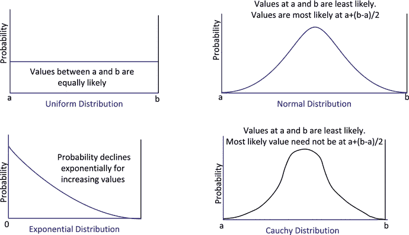

图 8-1。

Examples of distributions

图 [8-1](#Fig1) 中的每个图表显示了一系列可能值出现的概率。横轴记录变量的值；纵轴是概率。现实世界中不同种类的变量可以有非常不同的分布。如图 [8-1](#Fig1) 所示的均匀分布，所有可能的值都是等概率的；掷骰子的结果用均匀分布来表示。正态分布表示在平均值两侧变化的值。灯泡的寿命很可能是正态分布，因为灯泡的工作时间通常会在平均值的两侧变化，通常旧的灯丝灯泡为 2000 小时，而最新的 LED 灯泡可能超过 15，000 小时，尽管后者在实践中并不总是得到证实。指数分布通常与事件随时间发生的方式有关:例如，放射性物质发射粒子的时间间隔。图 [8-1](#Fig1) 中的第四个例子是柯西分布。在插图中，它看起来模糊地类似于正态分布，但它不是相同的-曲线的形状可以有很大的不同。柯西分布在现实生活中出现的频率比这里展示的其他分布要低；一个背景是量子力学中不稳定状态的能量分布。有时，一个发行版有不同的名称；例如，正态分布也称为高斯分布。正如您将看到的，STL 支持更多的发行版本。

### 熵是什么？

熵是无序的一种度量。宇宙的热寂将是达到最大熵的时候，根据热力学第二定律这是不可避免的。不过现在还不会——你还有时间读完这本书。数据环境中熵的含义是由美国数学家克劳德·香农提出的。熵衡量信息表现的效率；这也是对数据混乱程度的一种衡量。使用无损方法压缩文件(如用于生成 ZIP 文件的方法)会增加熵。如果您将一个文件压缩到 ZIP 存档中，发现文件大小没有显著减少，这是因为原始数据具有非常高的熵——换句话说，它是非常随机的——因此无法更有效地表示。英语文本的熵很低，因为它不是很随机。因为它不是随机数据，所以包含这一章的文件的大小可以通过压缩成 ZIP 文件而显著减小。文件内容的随机性越小，数据的熵就越低，压缩的潜力就越大。

在随机数生成的上下文中，熵度量比特序列的随机性。最大熵意味着一个完全随机的序列，每个比特都可能是一个`1`，一个`0`；这种序列的信息量是最大的，因为信息不能用更短的序列来表示。最小熵意味着一个序列是完全可预测的；交替的`1`和`0`，或者像`1010 1010 1010 ...`或`1100 1101 1100 1101...`这样的序列具有非常低的熵。这种序列的信息含量低，因为它是可预测的，并且信息可以容易地用短得多的序列来表示。当你生成随机数时，最大化序列的熵是可取的，尽管这必须与生成值所需的计算开销相平衡。

## 用 STL 生成随机数

STL 在随机数生成的上下文中使用了四个术语:

*   随机数引擎是一个类模板，它定义了一种产生无符号整数序列的机制，无符号整数序列是随机位序列。STL 定义了三个表示随机数引擎的类模板。我将在本章后面简要介绍这些，但是除非你对它们使用的算法有深入的了解，否则你不会想直接使用它们。你将使用一个随机数发生器。
*   随机数生成器是随机数引擎类模板的预定义实例。每个生成器将一组特定的模板参数应用于一个随机数引擎类模板——因此它是一个类型别名。STL 提供了几个预定义的随机数生成器，它们实现了众所周知的随机数生成算法。
*   随机数引擎适配器是一个类模板，用于通过修改由另一个随机数引擎生成的序列来生成随机数序列。
*   分布表示随机序列中的数字在整个范围内出现的概率。STL 定义了类模板，这些模板定义了各种不同发行版的函数对象，包括图 [8-1](#Fig1) 中所示的那些。

使用多个分布类模板生成随机数的原因是，您希望在给定上下文中生成的序列将取决于数据的性质。患者到达医院的模式可能与顾客到达商店的模式非常不同，因此将应用不同的分布。此外，商店顾客的模式将根据商店的种类及其位置等因素而变化，因此可能需要不同的分布来为不同商店的顾客到达建模。

有几种随机数引擎和生成器，因为没有一种算法可以生成适合所有情况的随机数。一些算法可以产生比其他算法更长的非重复序列；一些比另一些需要更少的计算开销。当您理解了要建模的数据的特征后，您就可以决定使用哪种分布和哪种随机序列生成功能了。

### 随机数生成中的种子

随机数生成算法总是从一个或多个种子开始，这些种子代表产生随机数的计算的初始输入。种子决定了随机数发生器的初始状态，并决定了整个序列。随机数发生器的状态由计算序列中下一个值所需的所有数据组成。算法是递归的，所以种子创建初始状态，用于产生序列中的第一个值；生成该值会改变状态，然后用于生成下一个值，依此类推。因此，对于给定的一个或多个种子，随机数发生器将总是产生相同的序列。这在程序测试过程中显然非常有用；至少可以说，当输入数据从一次运行到下一次运行可能任意改变时，确定程序是否正常工作是不容易的。当然，一旦程序被测试，您可能希望每次程序运行时从随机数生成器得到不同的序列。总是做同样事情的游戏程序不会有趣。为了在不同的时间产生不同的序列，你必须提供不同的种子——最好是随机值。这些值被称为不确定值，因为它们无法预测。

STL 中的所有随机数生成算法都可以用一个种子来启动。如果需要更多种子来定义初始状态，则会自动创建它们。显然，随机数序列的熵将取决于种子。种子中的位数很重要。对于 1 字节的种子，只有 255 个可能的值，因此最多只能产生 255 个不同的序列。为了最大化随机序列的熵，你需要两件事情:你需要一个真正随机的种子值——而不是伪随机的，你需要种子的可能值的范围很大。

### 获得随机种子

`random_device`类定义了函数对象，用于生成可以用作种子的随机无符号整数值。该类应该使用不确定的值源，这些值通常由操作系统提供。C++ 14 标准确实允许在不确定的来源不可用时使用随机数引擎，但在大多数实现中这是不必要的。不确定性来源可以是诸如连续键盘击键之间的时间、鼠标点击之间的间隔、当前时钟时间，或者通过测量一些物理属性。

您可以像这样创建一个`random_device`对象:

`std::random_device rd;             // Source of seeds!`

构造函数有一个类型为`string&`的参数，该参数有一个实现定义的默认值。当您省略它时，就像这里一样，您将获得您的环境的默认`random_device`对象。理论上，该参数允许您提供一个字符串来标识要使用的非确定性源，但是您需要查看您的文档来了解该选项是否适用于您的 C++库。下面是如何从`random_device`对象中创建一个种子值:

`auto my_1st_seed = rd();`

这用来自函数对象`rd`的初始值创建了`my_1st_seed`。这里有一个程序可以成功产生一系列种子:

`// Ex8_01.cpp`

`// Generating a succession of 8 seeds`

`#include <random>                                // For random_device class`

`#include <iostream>                              // For standard streams`

`int main()`

`{`

`std::random_device rd;                         // A function object for generating seeds`

`for(size_t n {}; n < 8; ++n)`

`std::cout << rd() << " ";`

`std::cout << std::endl;`

`}`

这只是调用了`rd`表示的函数八次，并输出它返回的值。我运行了两次，得到了下面两行输出:

`3638171046 3646201712 2185708196 587272045 1669986587 2512598564 1822700048 3845359386`

`360481879 3886461477 1775290740 2501731026 161066623 1931751494 751233357 3821236773`

您会注意到两次运行输出的值完全不同。除了`operator()()`，`random_device`类只定义了另外三个函数成员。`min()`和`max()`成员分别返回输出的最小和最大可能值。如果实现使用的是随机数引擎而不是不确定的源，则`entropy()`成员返回源的熵的估计值，类型为 double 或 0。

### 种子序列

`seed_seq`类是一个设置随机数生成器初始状态的帮助器。正如您将看到的，您可以创建一个随机数生成器，并通过向其构造函数传递一个种子值来设置其初始状态。构造函数参数也可以是一个`seed_seq`对象，它可以生成几个 32 位无符号值，这些值为生成器提供了比单个整数更多的熵。您也可以使用由一个`seed_seq`对象生成的值作为几个随机数生成器的种子。

`seed_seq`类不仅仅是一组值的简单容器。一个`seed_seq`对象基于您传递给构造函数的一组整数生成任意数量的无符号整数值。生成的值是通过应用预定义的算法产生的。您可以为`seed_seq`构造函数指定一个或多个整数，或者作为一个范围，或者作为一个初始化列表。生成的值将分布在 32 位无符号整数值的整个范围内，而不管输入值是如何分布的，也不管输入值有多少。对于相同的`seed_seq`构造函数参数，您总是得到相同的生成值序列。下面是一些说明创建一个`seed_seq`对象的各种方法的语句:

`std::seed_seq seeds1;                                      // Default object`

`std::seed_seq seeds2 {2, 3, 4, 5};                         // Create from simple integers`

`std::vector<unsigned int> data {25, 36, 47, 58};           // A vector of integers`

`std::seed_seq seeds3 {std::begin(data), std::end(data)};    // Create from a range of integers`

当然，您也可以使用由`random_device`对象返回的值作为`seed_seq`构造函数的参数:

`std::random_device rd {};`

`std::seed_seq seeds4 {rd(), rd()};                 // Create from non-deterministic integers`

这段代码每次执行时，`seeds4`对象都会生成不同的值。

通过将两个迭代器指定的范围传递给`seed_seq`对象的`generate()`函数成员，可以在容器中存储来自`seed_seq`对象的给定数量的值。例如:

`std::vector<unsigned int> numbers (10);            // Stores 10 integers`

`seeds4.generate(std::begin(numbers), std::end(numbers));`

调用`seeds4`的`generate()`成员将生成的值存储在`numbers`数组中。通过一个工作示例，我们可以看到`seed_seq`对象在各种条件下生成的值:

`// Ex8_02`

`// Values generated by seed_seq objects`

`#include <random>                                  // For seed_seq, random_device`

`#include <iostream>                                // For standard streams`

`#include <iterator>                                // For iterators`

`#include <string>                                  // For string class`

`using std::string;`

`// Generates and list integers from a seed_seq object`

`void gen_and_list(const std::seed_seq& ss, const string title = "Values:", size_t count = 8)`

`{`

`std::vector<unsigned int> values(count);`

`ss.generate(std::begin(values), std::end(values));`

`std::cout << title << std::endl;`

`std::copy(std::begin(values), std::end(values),`

`std::ostream_iterator<unsigned int>{std::cout, " "});`

`std::cout << std::endl;`

`}`

`int main()`

`{`

`std::random_device rd {};                           // Non-deterministic source - we hope!`

`std::seed_seq seeds1;                             // Default constructor`

`std::seed_seq seeds2 {3, 4, 5};                        // From consecutive integers`

`std::seed_seq seeds3 {rd(), rd()};`

`std::vector<unsigned int> data {25, 36, 47, 58};`

`std::seed_seq seeds4(std::begin(data), std::end(data));  // From a range`

`gen_and_list(seeds1, "seeds1");`

`gen_and_list(seeds1, "seeds1 again");`

`gen_and_list(seeds1, "seeds1 again", 12);`

`gen_and_list(seeds2, "seeds2");`

`gen_and_list(seeds3, "seeds3");`

`gen_and_list(seeds3, "seeds3 again");`

`gen_and_list(seeds4, "seeds4");`

`gen_and_list(seeds4, "seeds4 again");`

`gen_and_list(seeds4, "seeds4 yet again", 12);`

`gen_and_list(seeds4, "seeds4 for the last time", 6);`

`}`

`gen_and_list()`是一个助手函数，它从一个`seed_seq`对象生成给定数量的值，并在一个标识标题后输出它们。它在`main()`中被用来显示从以各种方式创建的`seed_seq`对象中生成的值。我得到了下面的输出，但是您的输出至少在某些方面会有所不同:

`seeds1`

`3071959997 669715714 1197567577 671623915 1173633267 2920800313 1209690436 2235109613`

`seeds1 again`

`3071959997 669715714 1197567577 671623915 1173633267 2920800313 1209690436 2235109613`

`seeds1 again`

`3527767669 372316564 1386412362 441784 2145070594 2276674640 2205342996 1276311706 1119507491 75413245 2656280031 1908737279`

`seeds2`

`3388710944 2239790942 3836628790 2213304795 3411013659 2658117409 3275085354 3542843550`

`seeds3`

`3899021117 3310665364 4171568438 3922561248 250650243 1402466647 3483637440 3437969619`

`seeds3 again`

`3899021117 3310665364 4171568438 3922561248 250650243 1402466647 3483637440 3437969619`

`seeds4`

`2664408363 1749470183 3260020574 1632320446 534203587 2689329558 3154702548 1526239767`

`seeds4 again`

`2664408363 1749470183 3260020574 1632320446 534203587 2689329558 3154702548 1526239767`

`seeds4 yet again`

`2165145204 3274376652 3408995137 1909945219 3899048536 1143678586 807504975 3977354488 3428929103 552995692 24106733 509227013`

`seeds4 for the last time`

`1443036549 3195987434 1624705198 3337303804 479673966 3579734797`

输出显示了关于`seed_seq`对象生成的值的一些事情:

*   不管如何创建`seed_seq`对象，都会生成各种各样的 32 位整数。即使是默认构造函数创建的对象，也会在整个范围内生成值。
*   `generate()`成员产生尽可能多的不同值来填充您指定的范围。
*   你想打多少次`generate()`都可以。
*   由`generate()`成员产生的序列中的值取决于序列的长度。给定长度的序列是相同的。不同长度的序列将包含不同的值。

如果您执行该程序两次，您将看到对于`seed_seq`构造函数的相同参数值，生成的值是相同的。如果提供了不同的构造函数参数，序列只能在不同的运行中有所不同，就像由`rd`函数对象返回的值一样。

还有另外两个`seed_seq`类的函数成员。成员返回用于创建对象的种子值的数量。`param()`成员提供原始种子值；它需要一个输出迭代器，将值的目的地标识为参数，并且没有返回值。`param()`成员将您提供给构造函数的原始种子值存储在以迭代器参数开始的范围内。下面的代码片段说明了这两个函数成员是如何工作的:

`std::seed_seq seeds {3, 4, 5};`

`std::vector<unsigned int> data(seeds.size());                 // Element for each seed value`

`seeds.param(std::begin(data));                                // Stores 3 4 5 in data`

这会创建一个`vector`，其元素数量由`seeds`对象的`size()`成员返回的值决定。然后，`seeds`的`param()`成员将传递给构造函数的三个值存储在`data`中。您还可以将这些值追加到容器中，如下所示:

`seeds.param(std::back_inserter(data));                        // Appends 3 4 5 to data`

当然，您不需要存储这些值——您可以将一个输出流迭代器作为参数传递给`param()`:

`seeds.param(std::ostream_iterator<unsigned int>{std::cout, " "});  // 3 4 5 to cout`

## 分发类别

STL 中的发行版是一个函数对象:代表特定发行版的类的实例。要生成具有给定分布的随机数，可以将该分布应用于随机数生成器生成的数字。这是通过将随机数生成器对象作为参数传递给作为分布的函数对象来实现的；函数对象将返回一个符合分布的随机值。在我详细讨论随机数发生器之前，我就介绍分布，这似乎有点奇怪。这有几个原因:

*   您应该始终使用分发对象来获取随机数。分发对象将随机数生成器生成的序列限制并形成应用程序上下文所需的形式。选择和使用适当的分布对象可以保证随机值在您想要的分布范围内。将您自己的算法直接应用于来自随机数生成器的值不太可能产生具有适当特征的分布。
*   要完全理解随机数生成器之间的差异，您需要了解它们实现的算法的数学知识。大多数程序员不需要也不想涉足这个领域。STL 提供了一个默认的随机数生成器，当与一个合适的分布对象结合使用时，它将满足许多(如果不是大多数)程序员的需求。

我将在这一节介绍默认的随机数生成器，这样我们就可以有知识地将它用于分布对象，然后讨论 STL 提供的分布类型。在我讨论了 STL 提供的分布类型之后，我将解释其他的随机数生成器。

有 21 个用于发行版的类模板，其中许多非常专业。我将详细讨论那些我认为可能是最有趣的，并且我将展示你如何使用它们。我只概述其余的，如果需要的话，让您更深入地研究它们。如果你只是想生成随机序列，而不考虑所有的可能性，掌握本章的这一节可能就是你所需要的。但是首先，为了有效地使用发行版，我们需要一个随机数生成器，这是下一个主题。

### 默认的随机数生成器

默认的随机数生成器是由`std::default_random_engine`类型别名定义的随机无符号整数的通用来源。这个别名所代表的是实现定义的；您应该查阅您的库的文档，了解它所提供的详细信息。它通常是我将在本章后面介绍的三个随机数引擎类模板之一的实例。模板类型的参数将被选择来为临时用户提供满意的序列。下面是创建类型为`default_random_engine`的生成器的最简单方法:

`std::default_random_engine rng1;         // Create random number generator with default seed`

这将调用默认构造函数，因此将使用默认种子值设置初始状态。由于种子保持不变，当随机数序列在不同的场合执行时，它将始终与来自`rng1`生成器的随机数序列相同。你当然可以提供自己的种子:

`std::default_random_engine rng2 {10};    // Create rng with 10 as seed`

这将创建以`10`为种子的`rng2`，因此来自该生成器的随机序列将不同于`rng1`，但仍然是固定的。如果希望每次代码执行时获得不同的序列，可以提供一个不确定的种子:

`std::random_device rd;                   // Non-determinstic seed source`

`std::default_random_engine rng3 {rd()};   // Create random number generator`

使用类型为`random_device`的函数对象`rd`获得种子值。每个`rd()`调用将返回一个不同的值，如果你的`random_device`的实现是不确定的，连续调用`rd()`产生的序列对于程序的每次执行将是不同的。

另一种选择是提供一个`seed_seq`对象作为`default_random_engine`构造函数的参数:

`std::seed_seq sd_seq {2, 4, 6, 8};`

`std::default_random_engine rng4 {sd_seq};  // Same random number sequence each time`

`std::random_device rd;                   // Non-determinstic seed source`

`std::default_random_engine rng5 {std::seed_seq{rd(), rd(), rd()}};`

这首先使用从固定初始种子创建的`seed_seq`对象生成`rng4`生成器；来自`rng4`的序列在每次代码执行时都是相同的。`rng5`由一个`seed_seq`对象构成，该对象的值由一个`random_device`函数对象产生，所以你永远不知道序列会是什么——每次都是一个惊喜。我们现在可以研究如何创建和使用分布对象，并开始一些严肃的随机活动。

### 创建分发对象

如前所述，分布由 function 对象表示，它需要一个随机数生成器对象作为参数来生成分布中的值。每次执行 distribution 对象时，它都会返回它所代表的分布中的一个随机数，该随机数是从随机数生成器中获得的值生成的。分布返回的第一个值之后的后续值取决于前一个值。创建分布对象将需要一组参数值，这些参数值将取决于分布的类型。例如，均匀分布需要生成的值的上限和下限，而正态分布需要平均值和标准偏差的值。尽管不同类型的发行版之间有很大的差异，但它们确实有很多共同点。所有分发对象都有以下`public`成员:

*   `result_type`是在类内为生成的值的类型定义的类型别名。
*   `min()`是一个函数成员，返回分布对象可以生成的最小值。
*   `max()`是一个函数成员，返回一个分布对象可以生成的最大值。
*   `reset()`是一个函数成员，它应该将分布对象重置为其原始状态，这样返回的下一个值就不会依赖于上一个值。这是否发生取决于您的实现。如果分布返回的值是独立的，`reset()`什么也不做。
*   `param_type`是在类中为`struct`定义的类型别名。不同的分布将需要不同的参数值集合，可能是不同的类型，这些值存储在特定于该分布的`param_type`类型的`struct`中。
*   `param()`是一个函数成员，它接受类型为`param_type`的参数，将分布对象的参数重置为新值。
*   `param()`是上一个成员的重载，该成员没有参数，返回分布对象包含的`param_type`对象。
*   默认构造函数，它具有定义分布的参数的默认值。
*   接受类型为`param_type`的参数来定义分布的构造函数。

我将展示这些成员如何用于某些类型的分发。流插入和提取操作符`<<`和`>>`为分布类型重载，以将分布对象的内部状态传输到流，或者从流中读回状态。这提供了从程序的先前执行中恢复发行状态的可能性。

### 均匀分布

在均匀分布中，一个范围内的所有值都有相同的可能性。均匀分布可以是离散的或连续的，如图 [8-2](#Fig2) 所示。

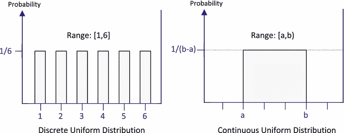

图 8-2。

Uniform distributions

注意图 [8-2](#Fig2) 中的范围规格。离散均匀分布包括上限和下限；连续均匀不包括上界，所以变量永远不可能是上界的值。

#### 离散均匀分布

`uniform_int_distribution`类模板定义了分布对象，这些对象将返回在一个封闭范围内均匀分布的随机整数`[a,b]`。模板参数是要生成的整数类型，默认类型是`int`:在类中定义的类型别名`result_type`对应于分布生成的值的类型。只有整数类型可以作为模板类型参数。一个构造函数有两个参数，用于标识范围的上限和下限；下限值的默认值为`0,`，上限值的默认值为所生成值类型的最大值。这里有一个例子:

`std::uniform_int_distribution<> d;    // Distribution over 0 to  max for type int, inclusive`

`std::cout << "Range from 0 to "`

`<< std::numeric_limits<std::uniform_int_distribution<>::result_type>::max()`

`<< std::endl;               // Range from 0 to 2147483647`

第一条语句调用默认构造函数来创建分布对象`d`。一切都是默认的，所以生成的值的类型将是`int`，范围将从`0`到类型`int`的最大值。最后一个注释显示了我得到的范围限制的输出；上限是`int`类型的最大值，由`limits`标题中定义的`numeric_limits()`功能模板产生。有一种更简单的方法来掌握范围限制。您可以调用所有分发对象都拥有的`min()`和`max()`成员:

`std::cout << "Range from " << d.min() << " to " << d.max() << std::endl;`

这种情况下还有另一种可能。`uniform_int_distribution`类模板还定义了函数成员`a()`和`b()`，它们分别返回范围的下限和上限，因此您可以将前面的语句写成:

`std::cout << "Range from "<< d.a() << " to " << d.b() << std::endl;`

成员`a()`和`b()`的名字比`min()`和`max()`更好地表明了它们返回的值与均匀分布的关系。

如果您只想得到大于或等于给定值的整数范围的分布，只需提供第一个构造函数参数:

`std::uniform_int_distribution<> d {500};`

`std::cout << "Range from "<< d.a() << " to " << d.b()`

`<< std::endl;                            // Range from 500 to 2147483647`

当然，构造函数参数可以是负的。通常，您会希望指定两个范围限制，因此这里有一个更现实的示例:

`std::uniform_int_distribution<long> dist {-5L, 5L};`

`std::random_device rd;                               // Non-deterministic seed source`

`std::default_random_engine rng {rd()};               // Create random number generator`

`for(size_t i {}; i < 8; ++i)`

`std::cout << std::setw(2) << dist(rng) << " ";     // -3  0  5  1 -2 -4  0  4`

第一条语句为类型为`long`的随机整数定义了一个分布对象。范围是从`-5`到`+5`，所以分布对象可以返回 11 个可能的值。因此，每个可能值出现的概率是`1/11`。一般来说，对于在`[a,b]`范围内的整数的均匀分布，任何特定值被返回的概率是`1/(1+b-a)`。在我的系统上，通过执行这段代码，我得到了附加在最后一条语句后面的注释中显示的输出，但是在您的系统上肯定会有所不同。

您可以调用均匀分布的`param()`成员来更改它生成的值的范围。传递给这里的`param()`成员`Uniform distribution:uniform_int_distribution`类的对象指定了新的范围限制——其类型由分布类定义的`param_type`别名指定。您也可以不带参数地调用`param()`来获得一个封装了当前分布参数集的对象。以下代码说明了这两种可能性:

`std::uniform_int_distribution<> dist {0, 6};`

`std::random_device rd;                               // Non-determinstic seed source`

`std::default_random_engine rng {rd()};               // Create random number generator`

`for(size_t i {}; i < 8; ++i)`

`std::cout << std::setw(3) << dist(rng) << " ";     // first output line`

`std::cout << std::endl;`

`// Save old range and set new range`

`auto old_range = dist.param();                       // Get current params`

`dist.param(std::uniform_int_distribution<>::param_type {-10,20});`

`for(size_t i {}; i < 8; ++i)`

`std::cout << std::setw(3) << dist(rng) << " ";     // Second output line`

`std::cout << std::endl;`

`// Restore old range...`

`dist.param(old_range);`

`for(size_t i {}; i < 8; ++i)`

`std::cout << std::setw(3) << dist(rng) << " ";     // Third output line`

`std::cout << std::endl;`

这段代码在我的系统上产生以下输出:

`6   1   5   6   1   3   6   2`

`19  16  15   5   0   7   6  -8`

`0   0   0   3   2   6   6   5`

您可以通过定义别名将参数的类型简化为`param()`:

`using Range = std::uniform_int_distribution<>::param_type;`

现在您可以编写`param()`调用来设置一个新的范围，如下所示:

`dist.param(Range {-10,20});`

您可以通过多种方式使用该功能来更改范围限制。一个明显的应用是当你需要一个程序中给定类型的值的几个均匀分布，每个分布有一组不同的参数。您可以只使用一个分布对象，并根据需要在程序中的任何地方设置参数。让我们来举一个例子。

##### 应用均匀整数分布

这个例子，`Ex8_03.cpp`，将使用一个`uniform_int_distribution`对象来发牌。代码挺多的，我就一点一点介绍吧。为了允许在代码的不同位置使用单个分布对象，我们可以将其定义为函数中的静态对象，如下所示:

`std::uniform_int_distribution<size_t>& dist()`

`{`

`static std::uniform_int_distribution<size_t> d;`

`return d;`

`}`

该分布将返回类型为`size_t`的值，这些值将是无符号整数。默认限制最初适用，但是我们可以通过调用对象的`param()`来设置限制。要使用分布对象，只需调用`dist()`函数来获得对它的引用。我们可以用同样的方式封装一个随机数生成器:

`std::default_random_engine& rng()`

`{`

`static std::default_random_engine engine {std::random_device()()};`

`return engine;`

`}`

静态的`engine`对象是用一个`random_device`对象返回的值初始化的，所以它每次创建时都会产生一个不同的序列。表达式`dist(rng())`将返回分布中的一个随机数。

我将用封装花色和面值的`pair`对象来表示一张牌。我将通过`enum`类型定义可能的套装和面值:

`enum class Suit : size_t { Clubs, Diamonds, Hearts, Spades };`

`enum class Face : size_t { Two, Three, Four, Five, Six, Seven, Eight, Nine, Ten, Jack, Queen, King, Ace };`

枚举器的默认值从 0 开始，这很重要，因为我们将使用枚举器值来索引一个容器，以获得一个代表`Suit`或`Face`实例名称的`string`。

我们可以为一张牌、一手牌、一副牌和一组牌的类型定义别名:

`using Card = std::pair<Suit,Face>;                       // The type of a card`

`using Hand = std::list<Card>;                            // Type for a hand of cards`

`using Deck = std::list<Card>;                            // Type for a deck of cards`

`using Hands = std::vector<Hand>;                         // Type for a container of hands`

`using Range = std::uniform_int_distribution<size_t>::param_type;`

将一副牌和一手牌定义为`list`容器将允许快速移除随机牌。您可以使用不同的序列容器，比如`vector`。

我们将希望输出`Card`对象，因此实现`operator<<()`将`Card`对象写入流将会很有用。下面是为`Card`对象重载`<<`的函数的定义:

`std::ostream& operator<<(std::ostream& out, const Card& card)`

`{`

`static std::array<string, 4> suits {"C", "D", "H", "S"};             // Suit names`

`static std::array<string, 13> values {"2", "3", "4", "5", "6", "7",  // Face value names`

`"8", "9", "10", "J", "Q", "K", "A"};`

`string suit {suits[static_cast<size_t>(card.first)]};`

`string value {values[static_cast<size_t>(card.second)]};`

`return out << std::setw(2) << value << suit;`

`}`

下面是将`Deck`容器初始化为标准的 52 张卡的函数定义:

`Deck& init_deck(Deck& deck)`

`{`

`static std::array<Suit,4> suits{Suit::Clubs, Suit::Diamonds, Suit::Hearts, Suit::Spades};`

`static std::array<Face, 13> values {Face::Two, Face::Three, Face::Four, Face::Five, Face::Six,`

`Face::Seven, Face::Eight, Face::Nine, Face::Ten,`

`Face::Jack,  Face::Queen, Face::King, Face::Ace};`

`deck.clear();`

`for(const auto& suit : suits)`

`for(const auto& value : values)`

`deck.emplace_back(Card {suit, value});`

`return deck;`

`}`

代表不同花色的所有对象都存储在`suits`容器中。代表可能的牌面值的对象是`values`容器中的元素。两个容器都是`array`类型，几乎和使用标准 C++数组一样高效。主要的优点是`array`容器总是知道它的大小；当您使用`at()`成员时，它还提供对超出范围的索引值的检查。嵌套循环在`deck`中放置元素，这些元素是代表每种花色的所有值的`Card`对象。

卡片在初始化的`Deck`对象中按顺序排列。我们需要向手牌发牌，但我们希望手牌随机接收牌。我们可以在发牌前洗牌，但为了实行不同限额的分配，我们将从牌堆中随机选择发牌。这是一个函数:

`void deal(Hands& hands, Deck& deck)`

`{`

`auto d = dist();`

`while(!deck.empty())`

`{`

`for(auto&& hand : hands)`

`{`

`size_t max_index = deck.size() - 1;`

`d.param(Range{0, max_index});`

`auto iter = std::begin(deck);`

`std::advance(iter, d(rng()));`

`hand.push_back(*iter);`

`deck.erase(iter);`

`}`

`}`

`}`

这将处理作为第二个参数传递的`Deck`对象中的所有牌。卡片分布在`Hands`容器中的`Hand`对象之间，这是第一个参数。外部循环继续，直到`deck`耗尽，这在其`empty()`成员返回`true`时指示。内部循环在`hands`中给每手牌发一张牌，因此最终`deck`中的所有`Card`对象将在`hands`中的`Hand`对象之间分配。

在循环中，`max_index`被初始化为`deck`中元素的最大合法索引值。由`dist()`返回的分布对象产生的值的限制被设置为`0`和`max_index`，这将导致分布对象在每次循环迭代中从不同的范围产生值。`iter`被初始化为`deck`中元素范围的 begin 迭代器，然后前进表达式`d(rng())`的值，这将是从`0`到`max_index`的随机增量。将`*iter`指定的元素添加到当前`hand`后，该元素将从`deck`容器中删除。

一手牌中的牌将是随机的，因为它们是随机选择的，但是一旦发牌，如果牌是按升序排列的，一手牌就更容易评估。该功能将在`Hands`容器中对每手牌进行分类:

`void sort_hands(Hands& hands)`

`{`

`for(auto&& hand : hands)`

`hand.sort( { return crd1.first < crd2.first ||`

`(crd1.first == crd2.first && crd1.second < crd2.second); });`

`}`

循环遍历`hands`中的`Hand`对象。每个`Hand`容器中的元素通过调用容器对象的`sort()`成员进行排序。该参数是一个由通用 lambda 表达式定义的比较函数，该表达式根据套装中的面值对`Card`对象进行排序。

我们肯定希望在发牌后输出这些牌。下面的函数将会解决这个问题:

`void show_hands(const Hands& hands)`

`{`

`for(auto&& hand : hands)`

`{`

`std::copy(std::begin(hand), std::end(hand), std::ostream_iterator<Card> {std::cout, " "});`

`std::cout << std::endl;`

`}`

`}`

它使用`copy()`算法将手从`hands`容器复制到一个输出流迭代器，该迭代器写入`cout`。流迭代器将使用我们之前定义的`operator<<()`函数将每个`Card`对象写入输出流。每当我们想举手表决时，我们只需叫一下`show_hands()`。

我们现在可以将这些函数放在一个完整的示例中，该示例将创建一副标准牌，发四手牌，然后输出已发的牌:

`// Ex8_03.cpp`

`// Dealing cards at random with a distribution`

`#include <iostream>                          // For standard streams`

`#include <ostream>                           // For ostream stream`

`#include <iomanip>                           // For stream manipulators`

`#include <iterator>                          // For iterators and begin() and end()`

`#include <random>                            // For random number generators & distributions`

`#include <utility>                           // For pair<T1,T2> template`

`#include <vector>                            // For vector<T> container`

`#include <list>                              // For list<T> container`

`#include <array>                             // For array<T,N> container`

`#include <string>                            // For string class`

`#include <type_traits>                       // For is_same predicate`

`using std::string;`

`enum class Suit : size_t {Clubs, Diamonds, Hearts, Spades};`

`enum class Face : size_t {Two, Three, Four, Five, Six, Seven, Eight, Nine, Ten, Jack, Queen, King, Ace};`

`using Card = std::pair<Suit,Face>;           // The type of a card`

`using Hand = std::list<Card>;                // Type for a hand of cards`

`using Deck = std::list<Card>;                // Type for a deck of cards`

`using Hands = std::vector<Hand>;             // Type for a container of hands`

`using Range = std::uniform_int_distribution<size_t>::param_type;`

`// Definition of operator<<() for a Card object goes here...`

`// Definition of rng() to return a reference to a static default_random_engine object goes here...`

`// Definition of dist() for a reference to a static uniform_int_distribution<size_t> object here...`

`// Definition of init_deck() to initialize a deck to a full set of 52 cards here...`

`// Definition of deal() that deals a complete deck here...`

`// Definition of sort_hands() to sort cards in hands here...`

`// Definition of show_hands to output all hands here...`

`int main()`

`{`

`// Create the deck`

`Deck deck;`

`init_deck(deck);`

`// Create and deal the hands`

`Hands hands(4);`

`deal(hands, deck);`

`// Sort and show the hands`

`sort_hands(hands);`

`show_hands(hands);`

`}`

我得到了下面的举手表决:

`3C  9C 10C  QC  AC  2D  3D  9D  QD  2H  6H  JS  QS`

`2C  4C  6D  8D  JD  KD  3H  8H  9H  KH  9S 10S  KS`

`5C  6C  8C  5D  AD  5H 10H  JH  QH  3S  4S  7S  AS`

`7C  JC  KC  4D  7D 10D  4H  7H  AH  2S  5S  6S  8S`

当然，利用这个例子进行分配的另一种可能性是玩家现在玩，每个玩家在一轮中从他们的手中随机打出一张牌。我不会告诉你怎么做。就在本章末尾`Exercise 2`让你去实现！

#### 连续均匀分布

`uniform_real_distribution`类模板定义了一个连续分布，它返回默认情况下类型为`double`的浮点值。您可以创建一个分布对象，它将返回范围`[0, 10)`内的值，如下所示:

`std::uniform_real_distribution<> values {0.0, 10.0};`

`std::random_device rd;                            // Non-determinstic seed source`

`std::default_random_engine rng {rd()};            // Create random number generator`

`for(size_t i {}; i < 8; ++i)`

`std::cout << std::fixed << std::setprecision(2)`

`<< values(rng) << " ";                // 8.37 6.72 6.41 6.08 6.89 6.10 9.75 4.07`

您创建和使用`uniform_real_distribution`功能对象的方式与您看到的`uniform_int_distribution`对象非常相似。您将一个随机数生成器对象作为参数传递给分布函数对象，以获得一个随机值。您可以通过调用对象的`param()`成员来获取和设置范围限制。除了返回分布范围限制的`min()`和`max()`成员之外，`uniform_real_distribution`对象还有`a()`和`b()`成员。请注意，连续分布的范围是半开放的，上限被排除在分布对象可以返回的可能值的范围之外。

在现实世界中，均匀连续分布适用于一个变量的情况很少见。例如，与天气相关的参数的测量在一个范围内不具有同样可能的值。一个可能的真实例子是，当你看手表时，手表上秒针的角度位置很可能是均匀分布的——但这并不是特别有用。均匀连续分布用于蒙特卡洛方法，该方法在金融行业以及工程和科学领域都有应用。我将在另一个上下文中给出一个工作示例——一个使用连续均匀分布来获得π值的程序。

##### 使用连续均匀分布

你知道你可以用一根棍子确定π的值吗？这并不包括用棍子威胁数学家来说服他们告诉你数值。只需要把棍子扔到地板上。它甚至不一定是一根棍子——你可以扔任何直的物体——一支铅笔甚至一根法兰克福香肠都可以。不过，它必须是一块有地板的裸地，而且你扔的物体是直的，其长度必须小于地板的宽度。这个过程很简单——你只需要数你扔了多少次棍子，以及棍子落地时越过木板边缘多少次。

你需要扔棍子很多次才能得到一个不错的结果。当然，这可能需要一些时间，而且有些乏味，更不用说很累了。不过，在几个均匀实数分布的帮助下，我们可以让计算机来做投掷和计数。图 [8-3](#Fig3) 显示了地板上任意位置的棍子及其与地板的关系。解释发生了什么需要一点数学，但这并不困难。

图 8-3。

A stick lying on the floor

图 [8-3](#Fig3) 显示了位于任意位置的杆，该位置距离板的底部边缘`y`并且与板成角度`theta`。棍子总会落在一块或另一块板子上，所以我们只需要考虑一块板子。图 [8-3](#Fig3) 显示了棍子与木板边缘相交的条件。当由`p1`和`p2`表示的杆的任一端在板的边缘上或越过板的边缘时，就会出现这种情况。为了使棍子穿过纸板边缘，从棍子中心到最近边缘的距离必须小于`L*sin(theta)/2`。

我们投掷木棒很多次，然后计算投掷的总次数为`throws`，木棒与棋盘边缘重叠的次数为`hits`。那么现在我们有了这两个计数，我们如何从它们得到π的值呢？图 [8-4](#Fig4) 应该有帮助。

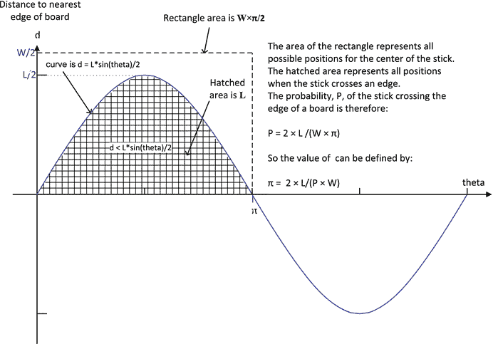

图 8-4。

Determining π from the probability of the stick crossing an edge of a floorboard

木棒穿过地板边缘的概率`P`将是`hits`与`throws`的比值。因此，我们可以使用`P`和图 [8-4](#Fig4) 中的最后一个等式得到π的值。π是以下表达式的结果:

`2*stick_length*throws/(board_width*hits)`

现在我们知道了它是如何工作的，下面是实现它的代码:

`// Ex8_04.cpp`

`// Finding pi by throwing a stick`

`#include <iostream>                                  // For standard streams`

`#include <random>                                    // For distributions, random number gen`

`#include <cmath>                                     // For sin() function`

`int main()`

`{`

`const double pi = 3.1415962;`

`double stick_length{};                             // Stick length`

`double board_width {};                             // Board width`

`std::cout << "Enter the width of a floorboard: ";`

`std::cin >> board_width;`

`std::cout << "Enter the length of the stick (must be less than " << board_width << "): ";`

`std::cin >> stick_length;`

`if(board_width < stick_length) stick_length = 0.9*board_width;`

`std::uniform_real_distribution<> angle {0.0, pi};   // Distribution for angle of stick`

`// Distribution for stick center position, relative to board edge`

`std::uniform_real_distribution<> position {0.0, board_width};`

`std::random_device rd;                                // Non-deterministic seed source`

`std::default_random_engine rng {rd()};                 // Create random number generator`

`const size_t throws{5'000'000};                     // Number of random throws`

`size_t hits {};                                     // Count of stick intersecting the board`

`// Throw the stick down throws times`

`for(size_t i {}; i < throws; ++i)`

`{`

`double y {position(rng)};`

`double theta {angle(rng)};`

`// Check if the stick crosses the edge of a board`

`if(((y + stick_length*sin(theta)/2) >= board_width) ||                                                    ((y - stick_length*sin(theta) / 2) <= 0))`

`++hits;                                                 // It does, so increment count`

`}`

`std::cout << "Probability of the stick crossing the edge of a board is: "`

`<< (static_cast<double>(hits)/ throws) << std::endl;`

`std::cout << "Pi is: " << (2* stick_length*throws)/(board_width*hits) << std::endl;`

`}`

您可能已经发现了这个程序中的一个小弱点——要确定π的值，您需要在开始之前知道π的值。然而，这只是一个模拟-和一个使用均匀真实分布的借口。唯一的选择是真的扔棍子 5，000，000 次，如果你非常健康并且有一根非常耐用的棍子，这可能是一个选择。如果你能做到每 3 秒扔一次，你应该在大约 8 个月内完成——只要你不需要吃饭或睡觉...

木棒中心相对于地板边缘的随机位置由`position`分布对象产生，木棒在每个位置的角度由`angle`分布产生。循环体实现图 [8-3](#Fig3) 中的计算，循环后的代码只是使用图 [8-4](#Fig4) 中的方程。您可以将投掷次数更改为系统中任何合理的值。我得到了以下输出:

`Enter the width of a floorboard: 12`

`Enter the length of the stick (must be less than 12): 5`

`Probability of the stick crossing the edge of a board is: 0.265281`

`Pi is: 3.14132`

当然，输出可能在运行之间有所不同，因为每次程序执行时随机序列都是不同的。球杆相对于地板宽度的长度也有影响，投掷次数也是如此。

Note

对于那些需要知道的人来说，显示图 [8-4](#Fig4) 中曲线下的阴影面积只是棍子的长度需要一点微积分——面积将:

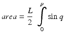

sin θ的积分是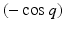所以面积是，计算得到，简单来说就是`L`！

#### 创建标准的均匀分布

标准的均匀分布是在`[0,1)`范围内的连续分布。`generate_canonical()`函数模板用给定数量的随机位在`[0,1)`范围内提供了浮点值的标准均匀分布。有三个模板参数:浮点类型、尾数中的随机位数和使用的随机数生成器的类型。该函数的参数是随机数生成器，因此推导出最后一个模板参数。下面是它的使用方法:

`std::vector<double> data(8);                         // Container with 8 elements`

`std::random_device rd;                               // Non-determinstic seed source`

`std::default_random_engine rng {rd()};               // Create random number generator`

`std::generate(std::begin(data), std::end(data),`

`[&rng] { return std::generate_canonical<double, 12>(rng); });`

`std::copy(std::begin(data), std::end(data), std::ostream_iterator<double>{std::cout, " "});`

在 lambda 表达式中调用了`generate_canonical()`函数，该表达式是`generate()`算法的第三个参数。lambda 将返回具有 12 个随机位的`double`类型的随机值，因此`generate()`将用这样的值填充`data`中的元素..在我的系统上执行这些语句会产生以下输出:

`0.766197 0.298056 0.409951 0.955263 0.419199 0.737496 0.547764 0.91622`

上面的输出显示的数字可能比我们想要的多，记住只指定了 12 个随机位。您可以像这样限制输出:

`std::copy(std::begin(data), std::end(data),`

`std::ostream_iterator<double>{std::cout << std::fixed << std::setprecision(4), " "});`

流操纵器应用于每个输出值，因此现在输出类似于:

`0.8514 0.5707 0.8322 0.6626 0.7026 0.8854 0.5427 0.8886`

如果您真的想得到这些位，您可以使用`hexfloat`操纵器以十六进制格式输出这些值。

显然，随机比特越少，可能的随机值的范围就越有限。您可以通过将位数指定为该类型的最大值来最大化范围。下面的一些代码展示了如何:

`std::vector<long double> data;                       // Empty container`

`std::random_device rd;                               // Non-determinstic seed source`

`std::default_random_engine rng {rd()};               // Create random number generator`

`std::generate_n(std::back_inserter(data), 10, [&rng]`

`{ return std::generate_canonical<long double, std::numeric_limits<long double>::digits>(rng); });`

`std::copy(std::begin(data), std::end(data), std::ostream_iterator<long double>{std::cout, " "});`

`std::cout << std::endl;`

注意与前面代码的不同之处。这个时间`generate_n()`与第一个参数一起用作`data`容器的`back_insert_iterator`,因此通过调用其`push_back()`成员将元素添加到`data`。`generate_canonical()`的第二个模板参数是`long double`类型的`numeric_limits`对象的`digits`成员的值。这是该类型尾数的位数，因此我们指定了该类型可能的最大随机位数(在我的系统上只有`53`)。我得到了这个输出，但是您的输出会有所不同:

`0.426365 0.0635646 0.208444 0.198286 0.338378 0.490884 0.841733 0.975676 0.193322 0.346017`

### 正态分布

正态(或高斯)分布如图 [8-5](#Fig5) 所示。它是一条连续的钟形曲线，其值平均分布在平均值的两边——平均值就是平均值。这是一个概率分布，所以曲线下的面积是 1。正态分布完全由两个参数定义，即平均值和标准偏差——标准偏差是对平均值两侧数值分布情况的度量。

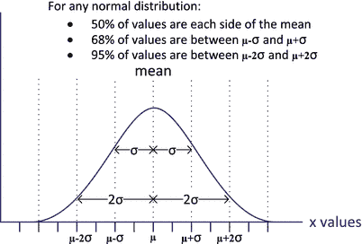

图 8-5。

The normal distribution

平均值和标准偏差分别由希腊字符μ - mu 和σ - sigma 表示，对于变量`x`的`n`样本，它们由以下等式定义:

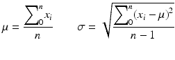

因此，平均值就是这些值的总和除以多少，换句话说就是平均值。通过将每个值和平均值之间的差的平方相加，除以`n-1`，然后取结果的平方根，可以获得标准偏差。正态分布曲线的相对宽度和高度可以随着平均值和标准偏差的不同值而有相当大的变化。然而，数值的分布总是如图 [8-5](#Fig5) 所示。这意味着，如果你知道一个符合正态分布的变量的平均值和标准差，比如一个大群体中个体的身高，那么你就知道 95%的人的身高与平均值相差不超过`2` σ。标准正态分布的均值为`0`，标准差为`1`。

`uniform_distribution`模板定义了产生随机浮点值的分布对象类型；默认情况下，这些是类型`double`。默认的构造函数创建了一个标准的正态分布——所以平均值是`0`,标准差是`1.0`:

`std::normal_distribution<> dist;                           // mu: 0 sigma: 1`

以下是创建具有特定平均值和标准差的正态分布的方法:

`double mu {50.0}, sigma {10.0};`

`std::normal_distribution<> norm {mu, sigma};`

这定义了一个分布对象来产生平均值为`50.0`和标准偏差为`10.0`的`double`值。为了生成值，您将一个随机数生成器传递给`norm`函数对象。例如:

`std::random_device rd;`

`std::default_random_engine rng {rd()};`

`std::cout << "Normally distributed values: "`

`<< norm(rng) << " " << norm(rng) << std::endl;   // 39.6153 45.5608`

您可以通过调用对象的`mean()`和`stddev()`成员来获得平均值和标准差的值:

`std::cout << "mu: " << norm.mean() << " sigma: " << norm.stddev()`

`<< std::endl;                                    // mu: 50 sigma: 10`

通过调用不带参数的`param()`成员，可以获得封装在`param_type`对象中的两个值。要设置平均值和/或标准偏差，需要将一个`param_type`对象传递给`param()`成员。`param_type`对象将拥有与其相关的分布类成员同名的函数成员，以提供均值和标准差。这里有一个使用这些的例子:

`using Params = std::normal_distribution<>::param_type;     // Type alias for readability`

`double mu {50.0}, sigma {10.0};`

`std::normal_distribution<> norm {mu, sigma};               // Create distribution`

`auto params = norm.param();                                // Get mean and standard deviation`

`norm.param(Params {params.mean(), params.stddev() + 5.0}); // Modify params`

`std::cout << "mu: " << norm.mean() << " sigma: " << norm.stddev()`

`<< std::endl;                                // mu: 50 sigma: 15`

这将不带参数地调用`param()`来获取包含平均值和标准偏差的`param_type`对象。一个`Params`对象被传递给`param()`的第二次调用，以通过`5.0`增加标准偏差。

您可以通过将一个`param_type`对象作为分布对象调用中的第二个参数来临时设置平均值和标准偏差:

`using Params = std::normal_distribution<>::param_type; // Type alias for readability`

`std::random_device rd;`

`std::default_random_engine rng {rd()};`

`std::normal_distribution<> norm {50.0, 10.0};          // Create distribution`

`Params new_p {100.0, 30.0};                            // mu=100 sigma=30`

`std::cout << norm(rng, new_p) << std::endl;            // Generate value with new_p: 100.925`

`std::cout << norm.mean() << " " << norm.stddev()`

`<< std::endl;                                // 50 10`

由`new_p`定义的平均值和标准偏差仅适用于作为第二个参数传递的`norm`的执行。原始均值和标准差将应用于后续的`norm`调用，无需第二个参数。

`min()`和`max()`成员返回分布可以产生的最小值和最大值。这对于正态分布不是特别有用，因为这些值将是可以由返回值的类型表示的最小和最大值:

`std::cout << "min: " << norm.min() << " max: " << norm.max()`

`<< std::endl;                                // min: 4.94066e-324 max: 1.79769e+308`

#### 使用正态分布

这个工作示例将允许使用从键盘输入的平均值和标准偏差值来创建正态分布对象。该程序将使用分布对象生成大量的随机值，然后将这些值绘制成直方图，以显示曲线的形状。概率会在页面上，样本值在页面下。下面是绘制一系列值的函数模板的代码:

`template<typename Iter>`

`void dist_plot(Iter& beg_iter, Iter& end_iter, size_t width=90)`

`{`

`// Create data for distribution plot`

`std::map<int, size_t> plot_data;                     // Elements are pair<value, frequency>`

`// Make sure all values are present in the plot`

`auto pr = std::minmax_element(beg_iter, end_iter, `

`{return v1 < v2; });`

`for(int n {static_cast<int>(*pr.first)}; n < static_cast<int>(*pr.second); ++n)`

`plot_data.emplace(n,0);`

`// Create the plot data`

`std::for_each(beg_iter, end_iter,`

`[&plot_data](double value) { ++plot_data[static_cast<int>(std::round(value))]; });`

`// Find maximum frequency to be plotted - must fit within page width`

`size_t max_f {std::max_element(std::begin(plot_data), std::end(plot_data),`

``

`{ return v1.second < v2.second; })->second};`

`// Draw distribution as histogram`

`std::for_each(std::begin(plot_data), std::end(plot_data),`

`[max_f, width](const std::pair<int, int>& v)`

`{std::cout << std::setw(3) << v.first << " -| "`

`<< string((width*v.second) / max_f, '*') << std::endl; });`

`}`

首先创建一个包含`pair`元素的`map`容器，每个元素存储一个整数值及其出现的频率。如果要绘制的值数量较少，则可能无法生成某个范围内的值。尽管如此，这些仍然应该出现在直方图中。为了确保要绘制的范围内的所有值都存在，我们使用`minmax_element()`算法找到最小值和最大值，然后在`map`中创建这个范围内的所有元素，计数为零。`minmax_element()`算法返回指向最小和最大元素的迭代器，因此这些迭代器必须解引用才能获得值。因为输入范围内的值可以是浮点型的，所以它们在存储到`map`之前会被转换成整数。在将值转换为类型`size_t`之前，`for_each()`算法应用于每个元素的 lambda 表达式使用`cmath`头中定义的`round()`函数将每个值四舍五入为最接近的整数。结果随后存储在`map`中。万一整数值已经不在`map`中，它将作为一个新元素被添加，其中`second`成员的频率增加到 1；如果它已经在`map`中，通常情况下，`pair`的第二个成员将递增。`round()`函数将整数中间的值向远离零的方向舍入，从而避免偏向零。

使用`max_element()`算法获得最大频率值。在这种情况下，元素通过 lambda 表达式进行比较，该表达式只比较元素的`second`成员。用由`max_element()`返回的迭代器指向的`pair`的`second`成员初始化`max_f`变量。直方图由`for_each()`算法绘制成一系列`string`对象。每个`string`包含的星号数量对应于缩放后的频率计数，因此最大值在一行的`width`个字符内。

下面是利用`dist_plot()`的程序:

`// Ex8_05.cpp`

`// Checking out normal distributions`

`#include <random>                                          // For distributions and random number generators`

`#include <algorithm>                                       // For generate(), for_each(),`

`//     max_element(), transform()`

`#include <numeric>                                         // For accumulate()`

`#include <vector>                                          // For vector container`

`#include <map>                                             // For map container`

`#include <cmath>                                           // For pow(), round() functions`

`#include <iostream>                                        // For standard streams`

`#include <iomanip>                                         // For stream manipulators`

`#include <string>                                          // For string class`

`using std::string;`

`using Params = std::normal_distribution<>::param_type;`

`// Template for dist_plot() function goes here...`

`int main()`

`{`

`std::random_device rd;`

`std::default_random_engine rng {rd()};`

`std::normal_distribution<> norm;`

`double mu {}, sigma {};`

`const size_t sample_count {20000};`

`std::vector<double> values(sample_count);`

`while(true)`

`{`

`std::cout << "\nEnter values for the mean and standard deviation, or Ctrl+Z to end: ";`

`if((std::cin >> mu).eof()) break;`

`std::cin >> sigma;`

`norm.param(Params{mu, sigma});`

`std::generate(std::begin(values), std::end(values), [&norm, &rng]{ return norm(rng); });`

`// Create data to plot histogram and plot it`

`dist_plot(std::begin(values), std::end(values));`

`// Get the mean and standard deviation for the generated random values`

`double mean {std::accumulate(std::begin(values), std::end(values), 0.0)/ values.size()};`

`std::transform(std::begin(values), std::end(values), std::begin(values),`

`[&mean](double value) { return std::pow(value-mean,2); });`

`double s_dev`

`{std::sqrt(std::accumulate(std::begin(values), std::end(values), 0.0)/(values.size() - 1))};`

`std::cout << "For generated values, mean = " << mean`

`<< " standard deviation = " << s_dev << std::endl;`

`}`

`}`

在每次`while`循环迭代中，系统会提示您输入正态分布的平均值和标准偏差。循环继续，直到您输入`Ctrl+Z`而不是平均值。您输入的值用于创建一个`param_type`对象，该对象被传递给分布对象`norm`的`param()`成员，该成员设置分布的平均值和标准偏差。创建一个包含类型为`double`的`sample_count`元素的`vector`，通过`generate()`算法将每个元素设置为由分布对象`norm`返回的随机值。然后通过调用`dist_plot()`产生对应于这些值的分布。为了查看生成值的平均值和标准偏差与原始规格的接近程度，分别使用`accumulate()`和`transform()`算法进行计算。

对于所示的输入，我得到了以下输出:

`Enter values for the mean and standard deviation, or Ctrl+Z to end: 8 3`

`-3 -|`

`-2 -|`

`-1 -| *`

`0 -| **`

`1 -| ******`

`2 -| ************`

`3 -| *********************`

`4 -| **********************************`

`5 -| **************************************************`

`6 -| ******************************************************************`

`7 -| ********************************************************************************`

`8 -| *************************************************************************************`

`9 -| **********************************************************************************`

`10 -| ********************************************************************`

`11 -| *****************************************************`

`12 -| ***********************************`

`13 -| **********************`

`14 -| ***********`

`15 -| *****`

`16 -| **`

`17 -| *`

`18 -|`

`19 -|`

`20 -|`

`21 -|`

`For generated values, mean = 8.02975 standard deviation = 2.99916`

`Enter values for the mean and standard deviation, or Ctrl+Z to end: ^Z`

输出显示生成值的分布具有正确的形状，从随机值计算的平均值和标准偏差非常接近为分布对象指定的值。你可以尝试不同的方法和标准偏差来了解形状是如何变化的。

### 对数正态分布

对数正态分布与正态分布相关，因为它表示随机变量的分布，其中值的对数分布是正态分布。对数正态分布由平均值和标准差定义，但这些参数与变量无关，它们与变量的对数有关。具体来说，具有均值μ和标准差σ的随机变量`x`的对数正态分布意味着`log x`是具有均值μ和标准差σ的正态分布。图 [8-6](#Fig6) 显示了对数正态分布曲线，以及改变平均值和标准偏差的影响。

图 8-6。

Lognormal distributions

对于自然界中的许多随机变量，对数正态分布比正态分布更接近于概率的表示。许多疾病的感染率遵循对数正态模式。

模板`lognormal_distribution`的一个实例定义了一个对数正态分布对象，该对象默认返回类型为`double`的浮点值。以下是对数正态分布对象的定义，其平均值为`5.0`，标准差为`0.5`:

`double mu {5.0}, sigma {0.5};`

`std::lognormal_distribution<> norm {mu, sigma};`

构造函数的参数有默认值 0 和`1`,所以省略参数定义了一个标准的对数正态分布。还有另一个构造函数接受一个`param_type`对象，该对象封装了平均值和标准偏差作为参数。

与所有分布类型都具有的函数成员一样，`lognormal_distribution`对象具有函数成员`m()`和`s()`，它们分别返回平均值和标准差。您使用对象的方式与您在其他发行版中看到的方式相同，所以让我们在一个示例中尝试一下。

#### 使用对数正态分布

本例将使用`Ex8_05`中的 dist_ `plot()`函数模板，并稍作修改，以隐藏图中包含零个星号的输出行。这是因为对数正态曲线可以有一个很长的尾巴，你不需要看到它来欣赏分布的形状。在`plot_data()`的最后声明将是:

`std::for_each(std::begin(plot_data), std::end(plot_data),`

`[max_f, width](const std::pair<int, int>& v)`

`{ if((width*v.second)/max_f > 0)`

`std::cout << std::setw(3) << v.first << " -| "`

`<< string((width*v.second)/max_f, '*') << std::endl;`

`});`

程序是这样的:

`// Ex8_06.cpp`

`// Checking out lognormal distributions`

`#include <random>                  // For distributions and random number generators`

`#include <algorithm>               // For generate(), for_each(), max_element(), transform()`

`#include <numeric>                 // For accumulate()`

`#include <iterator>                // For back_inserter()`

`#include <vector>                  // For vector container`

`#include <map>                     // For map container`

`#include <cmath>                   // For pow(), round(), log() functions`

`#include <iostream>                // For standard streams`

`#include <iomanip>                 // For stream manipulators`

`#include <string>`

`using std::string;`

`using Params = std::lognormal_distribution<>::param_type;`

`// Modified plot_data template goes here...`

`int main()`

`{`

`std::random_device rd;`

`std::default_random_engine rng {rd()};`

`std::lognormal_distribution<> log_norm;`

`double mu {}, sigma {};`

`const size_t sample_count {20000};`

`std::vector<double> values(sample_count);`

`std::vector<double> log_values;`

`while(true)`

`{`

`std::cout << "\nEnter values for the mean and standard deviation, or Ctrl+Z to end: ";`

`if((std::cin >> mu).eof()) break;`

`std::cin >> sigma;`

`log_norm.param(Params {mu, sigma});`

`std::generate(std::begin(values), std::end(values), [&log_norm, &rng] { return log_norm(rng); });`

`// Create data to plot lognormal curve`

`dist_plot(std::begin(values), std::end(values));`

`// Create logarithms of values`

`std::vector<double> log_values;`

`std::transform(std::begin(values), std::end(values), std::back_inserter(log_values),`

`[] (double v){ return log(v); });`

`// Create data to plot curve for logarithms of values`

`std::cout << "\nThe distribution for logarithms of the values:\n";`

`dist_plot(std::begin(log_values), std::end(log_values));`

`// Get the mean and standard deviation - for the logarithms of the values`

`double mean {std::accumulate(std::begin(log_values), std::end(log_values), 0.0)/log_values.size()};`

`std::transform(std::begin(log_values), std::end(log_values), std::begin(log_values),`

`[&mean](double value) { return std::pow(value - mean, 2); });`

`double s_dev {std::sqrt(std::accumulate(std::begin(log_values),                                        std::end(log_values), 0.0)/(log_values.size() - 1))};`

`std::cout << "For generated values, mean = " << mean`

`<< " standard deviation = " << s_dev << std::endl;`

`}`

`}`

这段代码的工作方式与`Ex8_05`基本相同，带有一个不确定的`while`循环，允许您尝试各种参数。明显的区别是它使用了一个`lognormal_distribution`对象。在每次循环迭代中都有一个额外的图，显示生成值的对数分布。平均值和标准偏差也与数值的对数有关。

以下是一些输出示例:

`Enter values for the mean and standard deviation, or Ctrl+Z to end: 3 .3`

`8 -| *`

`9 -| ******`

`10 -| ***********`

`11 -| *******************`

`12 -| *********************************`

`13 -| *******************************************`

`14 -| ************************************************************`

`15 -| ********************************************************************`

`16 -| **********************************************************************************`

`17 -| *****************************` `**********************************************************`

`18 -| ******************************************************************************************`

`19 -| ***************************************************************************************`

`20 -| ************************************************************************************`

`21 -| **********************************************************************************`

`22 -| *********************************************************************`

`23 -| ********************************************************************`

`24 -| **********************************************************`

`25 -| **************************************************`

`26 -| **********************************************`

`27 -| ****************************************`

`28 -| ************************************`

`29 -| **************************`

`30 -| *********************`

`31 -| *****************`

`32 -| **************`

`33 -| ************`

`34 -| **********`

`35 -| ********`

`36 -| ******`

`37 -| ******`

`38 -| *****`

`39 -| ****`

`40 -| **`

`41 -| **`

`42 -| **`

`43 -| *`

`45 -| *`

`The``distribution`T2】

`2 -| ****`

`3 -| ******************************************************************************************`

`4 -| ****`

`For generated values, mean = 2.99837 standard deviation = 0.298659`

`Enter values for the mean and standard deviation, or Ctrl+Z to end: ^Z`

你可以看到数值的对数是正态分布的；这是一个非常窄的图，标准差非常小。我为标准差选择了一个小值，以避免对数正态图中出现非常长的尾巴，这会占用书中太多的空间，但我建议您尝试不同的值，看看形状如何变化。σ越大，第一个图就越长，第二个图看起来就越像典型的正态分布。值为 3 和 2.1 应该很好。

### 与正态分布相关的其他分布

STL 为用正态分布分类的分布定义了另外四个模板，默认情况下，它们都生成类型为`double`的随机值。我将在这里概述它们——它们的创建和使用方式与您所看到的发行版类似。如果你需要它们，你已经知道很多了:

*   `chi_squared_distribution`模板定义了对象的分布类型，这些对象是由一个浮点参数定义的，该参数是自由度的数量；默认值为 1.0。一个对象有一个函数成员`n()`，它返回自由度的数量。这种分布在假设检验中被广泛使用——检验现实世界与理论的匹配程度。在一些学科中，现实世界和理论之间的不匹配是如此令人失望，以至于调整现实世界的测量以适应理论被认为是必要的。
*   `cauchy_distribution`模板定义了类似于正态分布的分布类型，但是在中位数的两边有较重的尾部。一个实例由两个参数值定义，一个是定义中点的中值`a`，另一个是决定曲线宽度的扩散`b`。这些值可以通过调用对象的`a()`和`b()`函数成员来获得。形式上，柯西分布没有均值或标准差，尽管中位数标识中点值。
*   `fisher_f_distribution`模板定义了用于确定两个差异何时相等的分布类型；它是两个卡方分布的比值。一个实例由两个参数值定义——分子分布中的自由度数量和分母的自由度数量；默认值都是 1.0。
*   `student_t_distribution`模板定义了用于少量样本和/或标准偏差未知时的分布类型。使用指定自由度数量的单个参数值创建实例；默认值为 1.0。

### 抽样分布

当您需要根据一组样本值(通常是来自现实世界的样本)来定义分布时，抽样分布非常有用。这些分布没有固定的概率曲线——您可以定义一个范围或一组范围内的值的可能性。STL 支持三种采样分布——离散分布、分段常数分布和分段线性分布。

#### 离散分布

根据从`0`到`n-1`的每个可能值的概率权重，`discrete_distribution`模板定义了返回范围`[0, n)`内的随机整数的分布。权重使您能够决定返回值的分布。这种分布的一个显而易见的应用是使用返回的值从可以使用索引访问的范围中选择随机对象或值。该范围可以包含任何类型的对象，包括函数对象，因此这提供了极大的灵活性。如果你想实现一个水果机模拟器，这个发行版会有所帮助。

您必须为要生成的值提供多个权重；权重的数量将决定可以生成的可能值的数量，并且权重的值用于确定概率。下面是一个如何模拟投掷面值从 1 到 6 的骰子的示例:

`std::discrete_distribution<size_t> d{1, 1, 1, 1, 1, 3};    // Six possible values`

`std::random_device rd;`

`std::default_random_engine rng {rd()};`

`std::map<size_t, size_t> results;                          // Store the results of throws`

`for(size_t go {}; go < 5000; ++go)                         // 5000 throws of the die`

`++results[d(rng)];`

`for(const auto& pr : results)`

`std::cout << "A " << (pr.first+1) << " was thrown " << pr.second << " times\n";`

构造函数的初始化列表包含 6 个权重，所以分布将只生成范围[0，6]内的值——这意味着值 0 到 5。最后一个值的权重是其他值的三倍，因此它出现的可能性是其他值的三倍。执行此操作会产生:

`A 1 was thrown 607 times`

`A 2 was thrown 645 times`

`A 3 was thrown 637 times`

`A 4 was thrown 635 times`

`A 5 was thrown 617 times`

`A 6 was thrown 1859 times`

六号更有可能。权重是浮点值，表示要生成的整数值的相对概率。每个值的概率是其权重除以所有权重的总和，因此前五个值的概率分别为`1/8`，最后一个值的概率为`3/8`。这个语句会产生相同的分布:

`std::discrete_distribution<size_t> d{20, 20, 20, 20, 20, 60};`

从`0`到`4`的每个值的概率是`20/160`，也就是`1/8`，最后一个值的概率是`60/160`或者`3/8`。

您也可以按范围指定权重。下面是使用相同随机数生成器的第一段代码的变体:

`std::array<double,6> wts {10.0, 10.0, 10.0, 10.0, 10.0, 30.0};`

`std::discrete_distribution<size_t> d{std::begin(wts), std::end(wts)};`

`std::array<string, 6> die_value {"one", "two", "three", "four", "five", "six"};`

`std::map<size_t, size_t> results;                        // Store the results of throws`

`for(size_t go {}; go < 5000; ++go)                       // 5000 throws of the die`

`++results[d(rng)];`

`for(const auto& pr : results)`

`std::cout << "A " << die_value[pr.first] << " was thrown " << pr.second << " times\n";`

这里的重量来自一个`array`容器。这一次，由 distribution 对象产生的值用于索引输出数组。这是我得到的:

`A one was thrown 653 times`

`A two was thrown 601 times`

`A three was thrown 611 times`

`A four was thrown 670 times`

`A five was thrown 600 times`

`A six was thrown 1865 times`

为一个`discrete_distribution`对象定义权重的另一个选项是为构造函数提供一个一元函数，从两个参数值创建给定数量的权重。这种工作方式有点复杂，所以我们将一步一步地检查它。

此构造函数有四个参数:

*   砝码数量的计数，`n`，
*   用于计算概率的类型为`double`、`xmin`和`xmax`的两个值，
*   `op`一元运算符。

`xmax`必须大于`xmin`，如果`n`为零，那么只会产生一个值为`1`的概率，所以在这种情况下分布会一直产生同一个值——`0`。

一个增量，我称之为`step`，定义为`(xmax - xmin)/n`。通过从`0`到`n-1`执行值为`k`的`op(xmin + (2*k+1)*step/2)`来计算概率。

因此，权重将为:

`op(xmin + step/2), op(xmin + 3*step/2), op(xmin + 5*step/2), ... op(xmin + (2*n-1)*step/2)`

一个带有数值的例子将有助于澄清正在发生的事情。假设`n`是`6`，`xmin`和`xmax`是`0`和`12`，那么`step`的值就是 2。如果我们假设`op`被定义为使参数值加倍，那么权重将为:`2`、`6`、`10`、`14`、`18`、22。因此，概率将为`1/36`、`1/12`、`5/36`、`7/36`、`1/4`和`11/36`。这是分发对象的定义:

`std::discrete_distribution<size_t> dist {6, 0, 12,  { return 2*v; }};`

一元运算符由返回两倍参数值的 lambda 表达式定义。您可以通过调用`probabilities()`成员从`discrete_distribution`对象中检索概率。你可以像这样获得`dist`物体的概率:

`auto probs = dist.probabilities();                 // Returns type vector<double>`

`std::copy(std::begin(probs), std::end(probs),`

`std::ostream_iterator<double> { std::cout << std::fixed << std::setprecision(2), " " });`

`std::cout << std::endl;                            // Output:  0.03 0.08 0.14 0.19 0.25 0.31`

一般来说，概率的数量是任意的，对应于您指定的任意数量的权重，因此它们被返回到一个`vector<double>`容器中。注释中显示的输出对应于我前面显示的分数的值。

您可以通过使用一组不同的权重值调用其`param()`成员来为`discrete_distribution`对象设置新的概率；重量的数量也可以不同:

`dist.param({2, 2, 2, 3, 3});                       // New set of weights`

`auto parm = dist.param().probabilities();`

`std::copy(std::begin(parm), std::end(parm),`

`std::ostream_iterator<double> {std::cout << std::fixed << std::setprecision(2), " "});`

`std::cout << std::endl;                            // Output: 0.17 0.17 0.17 0.25 0.25`

第一个`param()`成员调用的参数是一个权重列表，其值和数量都不同于原始值和数量。不带参数调用`param()`会返回一个`param_type`对象，但是你并不知道这个别名代表什么类型。但是，您知道它支持与原始分布对象相同的访问参数的函数成员。这意味着在这种情况下，您可以通过调用`param_type`对象的`probabilities()`成员来获取`param_type`对象中的值。这将返回一个可以访问的`vector<double>`容器。注释显示了它包含的概率，您可以看到它们与新的权重集相对应。

##### 使用离散分布

我们可以应用`discrete_distribution`对象来实现一个简单的游戏，你可以用四个骰子和计算机进行游戏。骰子是不寻常的，因为面的数量是非标准的，并且每个骰子是不同的。骰子上的面具有以下值:

`die 1: 3 3 3 3 3 3`

`die 2: 0 0 4 4 4 4`

`die 3: 1 1 1 5 5 5`

`die 4: 2 2 2 2 6 6`

为了玩这个游戏，你首先选择四个骰子中的任何一个。然后计算机从剩下的三个骰子中选择一个。两个骰子共掷 15 次，每掷一次，面值最高的骰子获胜。谁在 15 次投掷中得分最高，谁就是获胜者。因为没有两个骰子有相同的数值，所以一个骰子或另一个骰子总是赢得一次投掷，如果投掷次数为奇数，则不能进行游戏。

实现这一点的一个简单方法是定义一个`Die`类来表示骰子，这样每个`Die`对象存储它的 6 个面的值。该类可以定义一个函数成员，使用一个`discrete_distribution`对象来模拟投掷骰子，如下所示:

`std::discrete_distribution<size_t> throw_die{1, 1, 1, 1, 1, 1};`

然而，一个所有值都具有相同概率的对象并不能很好地演示离散分布，所以我将采用一种不同的、更复杂的方法。我们可以定义这个类来表示标题`Die.h`中的骰子，如下所示:

`#ifndef DIE_H`

`#define DIE_H`

`#include <random>                    // For discrete_distribution and random number generator`

`#include <vector>                    // For vector container`

`#include <algorithm>                 // For remove()`

`#include <iterator>                  // For iterators and begin() and end()`

`// Alias for param_type for discrete distribution`

`using Params = std::discrete_distribution<size_t>::param_type;`

`std::default_random_engine& rng();`

`// Class to represent a die with six faces with arbitrary values`

`// Face values do not need to be unique.`

`class Die`

`{`

`public:`

`Die() { values.push_back(0); };`

`// Constructor`

`Die(std::initializer_list<size_t> init)`

`{`

`std::vector<size_t> faces {init}; // Stores die face values`

`auto iter = std::begin(faces);`

`auto end_iter = std::end(faces);`

`std::vector<size_t> wts;         // Stores weights for face values`

`while(iter != end_iter)`

`{`

`values.push_back(*iter);`

`wts.push_back(std::count(iter, end_iter, *iter));`

`end_iter = std::remove(iter, end_iter, *iter++);`

`}`

`dist.param(Params {std::begin(wts), std::end(wts)});`

`}`

`size_t throw_it() { return values[dist(rng())]; }`

`private:`

`std::discrete_distribution<size_t> dist; // Probability distributtion for values`

`std::vector<size_t> values;           // Face values`

`};`

`#endif`

该类有两个私有成员，一个是用于为骰子生成随机面值的`discrete_distribution<size_t>`对象`dist`，另一个是存储唯一面值的`vector`容器`values`。默认构造函数创建一个对象，该对象的默认分布对象将总是返回`0`，而`values`成员包含一个值`0`。第二个构造函数需要一个初始化列表来指定骰子的面值。初始化列表用于用面值初始化本地`faces`容器。面值是可以复制的，每个面值的权重——决定其概率——就是面值出现的次数。构造函数中的`while`循环遍历`faces`中的当前元素范围，并计算第一个元素的面值出现的次数。计数存储在`wts`容器中，它所应用的面值被添加到`values`成员中。然后从`faces`中删除当前面值的所有出现，并将删除产生的新结束迭代器存储在`end_iter`中。当循环结束时，`values`将包含骰子的所有唯一面值，而`wts`将包含相应的权重。为`dist`成员调用`param()`会将分布参数设置为`wts`容器中的权重。

使用`Die`类实现游戏的程序代码如下所示:

`// Ex8_07.cpp`

`// Implementing a dice throwing game using discrete distributions`

`#include <random>                       // For discrete_distribution and random number generator`

`#include <array>                        // For array container`

`#include <utility>                      // For pair type`

`#include <algorithm>                    // For count(), remove()`

`#include <iostream>                     // For standard streams`

`#include <iomanip>                      // For stream manipulators`

`#include "Die.h"                        // Class to define a die`

`// Random number generator available throughout the program code`

`std::default_random_engine& rng()`

`{`

`static std::default_random_engine engine {std::random_device()()};`

`return engine;`

`}`

`int main()`

`{`

`size_t n_games {};                    // Number of games played`

`const size_t n_dice {4};              // Number of dice`

`std::array<Die, n_dice> dice          // The dice`

`{`

`Die {3, 3, 3, 3, 3, 3},`

`Die {0, 0, 4, 4, 4, 4},`

`Die {1, 1, 1, 5, 5, 5},`

`Die {2, 2, 2, 2, 6, 6}`

`};`

`std::cout <<`

`"For each game, select a die from the following by entering 1, 2, 3, or 4 (or Ctrl+Z to end):\n"`

`<< "die 1: 3 3 3 3 3 3\n"`

`<< "die 2: 0 0 4 4 4 4\n"`

`<< "die 3: 1 1 1 5 5 5\n"`

`<< "die 4: 2 2 2 2 6 6\n";`

`size_t you {}, me {};                                    // Stores index of my dice and your dice`

`while(true)`

`{`

`std:: cout << "\nChoose a die: ";`

`if((std::cin >> you).eof()) break;                // For EOF - it’s all over`

`if(you == 0 || you > n_dice)                      // Only 1 to 4 allowed`

`{`

`std::cout << "Selection must be from 1 to 4, try again.\n";`

`continue;`

`}`

`// Choose my die as next in sequence`

`me = you-- % n_dice;                                  // you from 0 to 3, and me you+1 mod 4`

`std::cout << "I’ll choose:  " << (me+1) << std::endl;`

`// Throw the dice`

`const size_t n_throws {15};`

`std::array<std::pair<size_t, size_t>, n_throws> goes; // Results of goes -`

`// pair<me_value, you_value>`

`std::generate(std::begin(goes), std::end(goes),      // Make the throws`

`[&dice, me, you] { return std::make_pair(dice[me].throw_it(), dice[you].throw_it()); });`

`// Output result of game`

`std::cout << "\nGame " << ++n_games << ":\n";`

`// Output results of my throws...`

`std::cout << "Me : ";`

`std::for_each(std::begin(goes), std::end(goes),`

``

`{  std::cout << std::setw(3) << pr.first; });`

`auto my_wins = std::count_``if`T2】

``

`{ return pr.first > pr.second; });`

`std::cout << " My wins:   " << std::setw(2) <<  std::right << my_wins`

`<< "   I " << ((my_wins > n_throws / 2) ? "win!!" : "lose {:-(")`

`<< std::endl;`

`// Output results of your corresponding throws - aligned below mine...`

`std::cout << "You: ";`

`std::for_each(std::begin(goes), std::end(goes), `

`{ std::cout << std::setw(3) << pr.second; });`

`std::cout << " Your wins: " << std::setw(2) << std:: right << n_throws - my_wins`

`<< "   You " << ((my_wins <= n_throws / 2) ? "win!!" : "lose!!!")`

`<< std::endl;`

`}`

`}`

`dice`数组容器保存四个不同骰子的`Die`对象。在提示输入之后，游戏在`while`循环中进行，每次迭代一个完整的游戏。玩家的骰子选择存储在`you`中，电脑的选择存储在`me`中。选择是从`1`到`4`的，所以这被递减以允许其用作`dice`数组的索引。`me`变量被任意设置为序列中的下一个芯片，以 4 为模，因此如果`you`选择索引`3`处的最后一个芯片，`me`将选择索引`0`处的第一个芯片。

`n_throws`变量指定一场比赛的投掷次数，在本例中为`15`;奇数场比赛确保总有一个赢家。`generate()`算法执行游戏中两个骰子的`15`投掷，并将每次投掷的结果存储在`pair`对象中，其中`first`成员存储计算机的骰子值，`second`成员存储玩家的骰子值。两个骰子的投掷由 lambda 表达式执行，它是`generate()`的第三个参数。投掷每个骰子的结果是通过调用其`throw_it()`成员产生的。

计算机获胜的投掷次数由`count_if()`算法计算并存储在`my_wins`中。如果来自`goes`容器的每个`pair`对象的`first`成员大于`second`，则计数递增。玩家的赢数是`n_throws-my_wins`。

我得到了以下输出:

`For each game, select a``die`T2】

`die 1: 3 3 3 3 3 3`

`die 2: 0 0 4 4 4 4`

`die 3: 1 1 1 5 5 5`

`die 4: 2 2 2 2 6 6`

`Choose a die: 2`

`I’ll choose:  3`

`Game 1:`

`Me :   5  1  5  1  5  5  1  1  5  5  5  5  1  5  5 My wins:   11   I win!!`

`You:   4  0  4  4  4  4  4  4  4  4  4  0  4  4  4 Your wins:  4   You lose!!!`

`Choose a die: 4`

`I’ll choose:  1`

`Game 2:`

`Me :   3  3  3  3  3  3  3  3  3  3  3  3  3  3  3 My wins:    9   I win!!`

`You:   6  6  2  2  2  2  2  2  6  6  2  2  2  6  6 Your wins:  6   You lose!!!`

`Choose a die: 1`

`I’ll choose:  2`

`Game 3:`

`Me :   0  0  0  0  4  4  4  4  4  0  4  4  4  4  4 My wins:   10   I win!!`

`You:   3  3  3  3  3  3  3  3  3  3  3  3  3  3  3 Your wins:  5   You lose!!!`

`Choose a die: 3`

`I’ll choose:  4`

`Game 4:`

`Me :   6  2  2  2  2  6  2  2  2  2  6  2  2  2  2 My wins:    9   I win!!`

`You:   5  5  5  5  1  5  5  5  1  1  5  1  1  1  5 Your wins:  6   You lose!!!`

`Choose a die: 3`

`I’ll choose:  4`

`Game 5:`

`Me :   2  2  6  2  2  2  6  2  2  2  2  6  2  6  6 My wins:   12   I win!!`

`You:   5  5  5  1  1  5  5  1  1  1  1  1  1  1  5 Your wins:  3   You lose!!!`

`Choose a die: 3`

`I’ll choose:  4`

`Game 6:`

`Me :   6  2  2  2  2  2  6  2  2  2  2  6  6  2  2 My wins:    8   I win!!`

`You:   5  5  5  5  5  5  1  1  1  1  5  5  1  5  1 Your wins:  7   You lose!!!`

`Choose a die: 2`

`I’ll choose:  3`

`Game 7:`

`Me :   5  5  1  1  5  5  5  5  5  5  5  1  1  1  1 My wins:   10   I win!!`

`You:   4  4  4  4  0  4  4  4  0  4  4  4  4  0  4 Your wins:  5   You lose!!!`

`Choose a die: ^Z`

这台电脑非常成功——它赢了每一场比赛。它的成功是因为玩家先选择一个骰子。四骰子是非传递性骰子的一个例子，是由美国统计学家布拉德利·埃夫隆发明的。一般来说，数字关系是可传递的，这意味着如果`a>b`和`b>c`，可以说`a>c`。这些骰子就不是这样了。对于`dice`数组中的`Die`对象，下面是`Ex8_07`实现游戏的情况:

*   `dice[3]`击败`dice[2]`击败`dice[1]`击败`dice[0]`击败`dice[3]`！

这是因为投掷产生面值的概率:

*   `dice[3]`击败`dice[2]`是因为来自`dice[3`(概率`1/3`的一个`6`总是赢，当`dice[2]`为`1`(概率`1/2`)时，来自`dice[3]`(概率`2/3`)的一个`2`总是赢。所以`dice[3]`获胜的总体概率是`1/3 + 2/3 × 1/2`，也就是`2/3`。
*   `dice[2]`击败`dice[1]`是因为来自`dice[2`(概率`1/2`的一个`5`总是赢，当`dice[1]`为`0`(概率`1/3`)时，来自`dice[2]`(概率`1/2`)的一个`1`总是赢。所以`dice[2]`获胜的总体概率是`1/2 + 1/2 × 1/3`，也就是`2/3`。
*   `dice[1]`打败`dice[0]`是因为`dice[1`(概率`2/3`)的一个`4`总是赢。
*   `dice[0]`击败`dice[3]`是因为`dice[3]`为`2`(概率`2/3`)时`dice[0`(概率`1`)的一个`3`赢了。所以`dice[0]`获胜的整体概率是`1 × 2/3`，也就是`2/3`。

这意味着无论你选择哪个骰子，计算机都可以从剩下的三个骰子中选择一个有 66%几率击败你的骰子。

#### 分段常数分布

`piecewise_constant_distribution`模板定义了一个用一组分段子区间生成浮点值的分布。给定子区间的值在其中均匀分布，每个子区间都有自己的权重。一个对象由定义 n-1 个常数子区间的一组 n 个区间边界和应用于子区间的一组 n-1 个权重来定义。图 [8-7](#Fig7) 说明了这一点。

图 8-7。

The piecewise constant distribution

图 [8-7](#Fig7) 中的分布定义了三个区间，每个区间都有自己的权重。三个间隔由容器`b`中定义的四个边界值定义。每个区间都有一个由容器`w`的元素定义的权重。前两个构造函数参数是指定边界范围的迭代器，第三个参数是指向权重范围内第一个元素的迭代器。每个区间内的值将均匀分布，随机值在特定区间内的概率由该区间的权重决定。

除了所有分布对象实现的函数成员之外，`piecewise_constant_distribution`还有`intervals()`和`densities()`成员，它们返回区间边界和区间中值的概率密度；这两个函数都返回`vector`容器中的值。我们可以应用这些成员，并通过尝试类似于图 [8-7](#Fig7) 所示的分布来获得对分布效果的一些了解，但是间隔更窄，因此输出需要的空间更少:

`// Ex8_08.cpp`

`// Demonstrating the piecewise constant distribution`

`#include <random>                          // For distributions and random number generator`

`#include <vector>                          // For vector container`

`#include <map>                             // For map container`

`#include <utility>                             // For pair type`

`#include <algorithm>                           // For copy(), count(), remove()`

`#include <iostream>                            // For standard streams`

`#include <iterator>                            // For stream iterators`

`#include <iomanip>                             // For stream manipulators`

`#include <string>                              // For string class`

`using std::string;`

`int main()`

`{`

`std::vector<double> b {10, 20, 35, 55};      // Intervals: 10-20, 20-35, 35-55`

`std::vector<double> w {4, 10, 6};            // Weights for the intervals`

`std::piecewise_constant_distribution<> d {std::begin(b), std::end(b), std::begin(w)};`

`// Output the interval boundaries and the interval probabilities`

`auto intvls = d.intervals();`

`std::cout << "intervals: ";`

`std::copy(std::begin(intvls), std::end(intvls), std::ostream_iterator<double>{std::cout, " "});`

`std::cout << "  probabilities: ";`

`auto probs = d.densities();`

`std::copy(std::begin(probs), std::end(probs), std::ostream_iterator<double>{std::cout, " "});`

`std::cout << '\n' << std::endl;`

`std::random_device rd;`

`std::default_random_engine rng {rd()};`

`std::map<int, size_t> results;               //Stores and counts random values as integers`

`// Generate a lot of random values...`

`for(size_t i {}; i < 20000; ++i)`

`++results[static_cast<int>(std::round(d(rng)))];`

`// Plot the integer values`

`auto max_count = std::max_element(std::begin(results), std::end(results),`

``

`{ return pr1.second < pr2.second; })->second;`

`std::for_each(std::begin(results), std::end(results),`

`[max_count](const std::pair<int, size_t>& pr)`

`{ if(!(pr.first % 10))  // Display value if multiple of  10`

`std::cout << std::setw(3) << pr.first << "-|";`

`else`

`std::cout << "    |";`

`std::cout << std::string(pr.second * 80 / max_count, '*')`

`<< '\n'; });`

`}`

这将使用您看到的间隔和权重创建一个分布，使用该分布生成大量的值，然后在将这些值转换为整数后，以直方图的形式绘制这些值出现的频率。这些值沿着页面向下排列，条形从左到右表示相对频率。我得到了以下输出:

`intervals: 10 20 35 55   probability densities: 0.02 0.0333333 0.015`

`10-|************************`

`|**********************************************`

`|*******************************************`

`|*******************************************`

`|*********************************************`

`|**********************************************`

`|************************************************`

`|***********************************************`

`|******************************************`

`|********************************************`

`20-|************************************************************`

`|****************************************************************************`

`|***********************************************************************`

`|**************************************************************************`

`|*****************************************************************************`

`|***************************************************************************`

`|*************************************************************************`

`|*******************************************************************************`

`|` `************************************************************************`

`|******************************************************************************`

`30-|******************************************************************************`

`|*****************************************************************************`

`|***********************************************************************`

`|***************************************************************************`

`|********************************************************************************`

`|*********************************************************`

`|*******************************`

`|***********************************`

`|********************************`

`|**********************************`

`40-|***************************************`

`|********************************`

`|*********************************`

`|**********************************`

`|*********************************`

`|********************************`

`|**********************************`

`|**********************************`

`|***********************************`

`|*******************************`

`50-|********************************`

`|*******************************`

`|*******************************`

`|************************************`

`|*********************************`

`|****************`

输出的有趣特征是概率密度的值，以及第一个和最后一个间隔中条形的相对长度。区间的权重分别为 4 和 6，因此值位于第一个区间的概率为`4/20`，即`0.2`，值位于第二个区间的概率为`10/20`，即`0.5`，值位于最后一个区间的概率为`6/20`，即`0.3`。然而，最后一个区间的输出棒线低于第一个区间的输出棒线，这似乎与这些概率相冲突。反正输出中的概率密度值是不一样的，为什么会这样呢？

原因是它们不一样。概率密度是区间中给定值出现的概率，而不是随机值出现在区间中的概率。值的概率密度对应于区间中的值将出现的概率，除以区间中值的范围。因此，三个范围内的值的概率密度分别为`0.2/10`、`0.5/15`和`0.3/20`，幸运的是，这与输出相同。最后一个时间间隔中生成的值大约是第一个时间间隔的两倍，但是这些值分布在更大的范围内，因此条形更短。因此，条形长度反映了概率密度。

#### 分段线性分布

`piecewise_linear_distribution`模板定义了浮点值的连续分布，其中概率密度函数由一组样本值定义的点连接而成；每个样本值都有一个确定其概率密度值的权重。图 [8-8](#Fig8) 显示了一个例子。

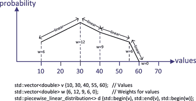

图 8-8。

A piecewise linear distribution

图 [8-8](#Fig8) 显示了由容器`v`中定义的五个样本值确定的分布。每个值都有一个由容器`w`的相应元素定义的权重，每个权重决定了相应值的概率密度。一个样本和下一个样本之间的值的概率密度在两个样本的概率密度之间是线性的。前两个构造函数参数是指定值范围的迭代器，第三个参数是指向权重范围内第一个元素的迭代器。该分布将产生从 10 到 60 的随机值，概率密度由分段线性曲线表示。通过调用`intervals()`成员，可以在`vector`中获得分布的样本值。您可以通过调用分布对象的`densities()`在`vector`容器中获得这些的概率密度。

确定整个范围内的值的概率密度有点复杂。整个概率曲线下的面积表示整个范围内任何值出现的概率，因此它必须为 1。为了适应这种情况，区间内值的概率计算如下:

First `s`计算为定义间隔的值的加权平均值之和，每个值乘以间隔长度。因而在一般情况下，`s`是由方程式定义的:

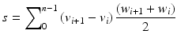

其中 v i 是样本值，w i 是它们对应的权重。

两个样本值之间的区间中的任何值`x`的概率`p`，【v i ，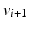由样本值的概率的线性组合来确定，其中来自区间的每一端的概率贡献与 x 到样本值的距离成比例。用数学术语来说，x 的概率是:

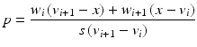

因此对于图 [8-8](#Fig8) 中的例子，`s`为:

`(30 - 10)×(12 + 6)/2 + (40 - 30)×(9 + 12)/2 +(55 - 40)×(6 + 9)/2 + (60 - 55)×(0 + 6)/2`

这相当于。

第`i`个样本值的概率为 w i /s，因此图 [8-8](#Fig8) 中值的概率为`6/412.5`、`12/412.5`、`9/412.5`、`6/412.5`和`0/412.5`。我可靠的计算器显示这些分别对应于`0.0145`、`0.029`、`0.0218`、`0.0145`和`0`。类似于`Ex8_08`的工作示例将显示这是否正确，并显示分段线性分布的总体特征:

`// Ex8_09.cpp`

`// Demonstrating the piecewise linear distribution`

`#include <random>                              // For distributions and random number generator`

`#include <vector>                              // For vector container`

`#include <map>                                 // For map container`

`#include <utility>                             // For pair type`

`#include <algorithm>                           // For copy(), count(), remove()`

`#include <iostream>                            // For standard streams`

`#include <iterator>                            // For stream iterators`

`#include <iomanip>                             // For stream manipulators`

`#include <string>                              // For string class`

`using std::string;`

`int main()`

`{`

`std::vector<double> v {10, 30, 40, 55, 60};  // Sample values`

`std::vector<double> w {6, 12, 9, 6, 0};      // Weights for the samples`

`std::piecewise_linear_distribution<> d {std::begin(v), std::end(v), std::begin(w)};`

`// Output the interval boundaries and the interval probabilities`

`auto values = d.intervals();`

`std::cout << "Sample values: ";`

`std::copy(std::begin(values), std::end(values), std::ostream_iterator<double>{std::cout, " "});`

`std::cout << "  probability densities: ";`

`auto probs = d.densities();`

`std::copy(std::begin(probs), std::end(probs), std::ostream_iterator<double>{std::cout, " "});`

`std::cout << '\n' << std::endl;`

`std::random_device rd;`

`std::default_random_engine rng {rd()};`

`std::map<int, size_t> results;              // Stores and counts random values as integers`

`// Generate a lot of random values...`

`for(size_t i {}; i < 20000; ++i)`

`++results[static_cast<int>(std::round(d(rng)))];`

`// Plot the integer values`

`auto max_count = std::max_element(std::begin(results), std::end(results),`

``

`{ return pr1.second < pr2.second; })->second;`

`std::for_each(std::begin(results), std::end(results),`

`[max_count](const std::pair<int, size_t>& pr)`

`{`

`if(!(pr.first % 10))  // Display value if multiple of  10`

`std::cout << std::setw(3) << pr.first << "-|";`

`else`

`std::cout << "    |";`

`std::cout << std::string(pr.second * 80 / max_count, '*')`

`<< '\n';`

`});`

`}`

与`Ex8_08`的唯一区别是分布对象的定义。对于分段线性分布，权重的数量必须与样本值的数量相同。这是我的程序输出:

`Sample values: 10 30 40 55 60   probability densities: 0.0145455 0.0290909 0.0218182 0.0145455 0`

`10-|******************`

`|*****************************************`

`|**************************************`

`|*********************************************`

`|********************************************`

`|*********************************************`

`|************************************************`

`|*************************************************`

`|***************************************************`

`|****************************************************`

`20-|********************************************************`

`|****************************************************`

`|**********************************************************`

`|*************************************************************`

`|*****************************************************************`

`|*****************************************************************`

`|*****************************************************************`

`|*****************************************************************`

`|***********************************************************************`

`|*********************************************************************`

`30-|********************************************************************************`

`|************************************************************************`

`|********************************************************************`

`|*******************************************************************`

`|**************************************************************`

`|********************************************************************`

`|*****************************************************************`

`|**********************************************************`

`|***********************************************************`

`|***********************************************************`

`40-|*******************************************************`

`|***************************************************`

`|*********************************************************`

`|*************************************************`

`|*************************************************`

`|************************************************`

`|***********************************************`

`|***********************************************`

`|*********************************************`

`|****************************************`

`50-|****************************************`

`|**************************************`

`|*************************************`

`|****************************************`

`|**************************************`

`|**********************************`

`|*****************************`

`|********************`

`|***************`

`|********`

`60-|*`

概率密度与我的计算器得出的值非常相似，这让我松了一口气。这种分布为定义任何形状的概率密度函数提供了一个强有力的工具。

### 其他分布

STL 为另外九种类型的发行版定义了模板。我将在这里概述它们以供参考，并展示由它们中的大多数产生的随机值的图的例子。请记住，分布曲线的形状会因不同的参数集而有很大的不同，并且显示的插图已被缩放以适合页面宽度。

#### 泊松分布

泊松分布定义了一个离散的 PDF，表示一组独立事件的发生频率，每个事件只有两种可能的结果，并且不同事件的成功概率可能不同。事件可以分布在时间或位置上。分配是由著名的法国数学家西米恩·泊松创立的。它的第一个应用是模拟普鲁士军队中士兵被马踢死的概率。它可用于模拟一段时间内设备故障的可能性或交通事故的发生率。

默认情况下，`poisson_distribution`模板定义了生成随机非负整数的函数对象的类型，这些整数的类型为`int`。根据分布平均值的`double`值创建一个对象，例如

`double mean {5.5};`

`std::poisson_distribution<> poisson_d {mean};`

默认构造函数为平均值 1.0 分配一个默认值。一个对象有一个返回平均值的`mean()`成员。图 [8-9](#Fig9) 显示了上面定义的`poisson_d`产生的随机值的出现次数。

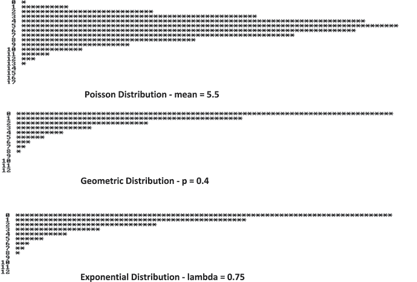

图 8-9。

Examples of Poisson, geometric, and exponential distributions

#### 几何分布

几何分布是一种离散分布，用于模拟为了在有两种可能结果的事情上取得成功而必须进行的试验次数。一个例子可能是建模你需要问多少随机选择的人来找到一个已经买了这本书的人。`geometric_distribution`模板定义了离散分布类型，这些分布类型返回类型为`int`的非负整数值。构造函数参数是一个指定试验成功概率的`double`值，因此它必须在`0`和`1`之间。这里有一个例子:

`double p_success {0.4};`

`std::geometric_distribution<> geometric_d {p_success};`

该对象有一个函数成员`p()`，它返回成功的概率。`geometric_d`分布图如图 [8-9](#Fig9) 所示。

#### 指数分布

指数分布模拟事件发生之间的时间。你可以把它看作是几何分布的连续等价物。默认情况下，`exponential_distribution`模板定义了返回类型为`double`的浮点值的分布类型。构造函数的参数是一个代表到达率的`double`值，通常标识为λ。这里有一个例子:

`double lambda {0.75};`

`std::exponential_distribution<> exp_d {lambda};`

对象的`lambda()`函数成员返回到达率的值。该分布图如图 [8-9](#Fig9) 所示。

#### 伽马分布

伽玛分布是一种连续分布，通常用于模拟事件的等待时间，但比指数分布更通用。分布由两个参数定义:形状值α和速率值β。默认情况下，`gamma_distribution`模板定义了返回类型为`double`的浮点值的分布。这里有一个例子:

`double alpha {5.0}, beta {1.5};`

`std::gamma_distribution<> gamma_d {alpha, beta};`

`alpha()`和`beta()`函数成员返回分布对象的参数。图 [8-10](#Fig10) 显示了`gamma_d`产生的值的曲线图。

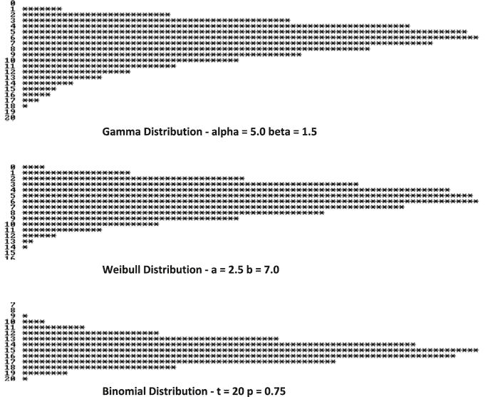

图 8-10。

Examples of Gamma, Weibull, and binomial distributions

#### 威布尔分布

威布尔分布定义了一个连续的 PDF，它将故障率建模为时间(通常是材料)的函数。它由两个参数定义，形状`a`和比例`b`。下面是一个创建`weibull_distribution`模板实例的例子:

`double a {2.5};                             // Shape`

`double b {7.0};                             // Scale`

`std::weibull_distribution<> weibull_d {a, b};`

默认情况下，`weibull_d`对象返回类型为`double`的随机值。你可以通过调用它的`a()`和`b()`成员来获得分布参数。图 [8-10](#Fig10) 中显示了`weibull_d`产生的值。

#### 二项式分布

二项式分布是一种离散分布，它在一组独立的二元事件中模拟成功率。一个事件只有两种可能的结果——成功或失败，所有事件成功的概率都是一样的。它由两个参数定义，`t`和`p`，其中`t`是试验次数，p 是试验成功的概率。下面是如何使用`binomial_distribution`模板创建一个对象:

`int t {20};                                 // Number of trials`

`double p {0.75};                            // Probability of success`

`std::binomial_distribution<> binomial_d {t, p};`

对象的`t()`和`p()`成员返回参数值。`binomial_d`产生的值的曲线图如图 [8-10](#Fig10) 所示。

伯努利分布是一种二项式分布，其中`t`参数的值为 1。STL 提供了`bernoulli_distribution`类来定义这种分布。由于`t`固定为 1，所以只需要给构造函数提供一个`p`的值，对象就会返回随机的`bool`值。有一个`p()`成员返回成功的概率。下面是演示创建和使用对象的代码片段:

`std::random_device rd;`

`std::default_random_engine rng {rd()};`

`double p {0.75};                            // Probability of success`

`std::bernoulli_distribution bernoulli_d {p};`

`std::cout << std::boolalpha;                // Output bool as true or false`

`for(size_t i {}; i < 15; ++i)`

`std::cout << bernoulli_d(rng) << ' ';`

`std::cout << std::endl;`

执行此操作后，我得到了以下输出:

`true true false true true true true true false true false true true false true`

#### 负二项分布

负二项式分布是一种离散分布，它模拟在指定数量的成功之前发生的一系列试验中的失败次数。这些试验只有两种可能的结果，并且相互独立。如果成功次数为 1，则分布与几何分布相同。您也可以将这种分布可视化为在给定的成功次数之前模拟失败次数。默认情况下，`negative_binomial_distribution`模板定义了返回类型为`int`的整数的对象类型。`negative_binomial_distribution`模板的构造函数需要两个参数，失败次数`k`和成功概率`p`。下面是一个创建对象的示例:

`int k {5};                                  // Number of successes`

`double p {0.4};                             // Probability of success`

`std::negative_binomial_distribution<> neg_bi_d {k, p};`

`neg_bi_d`的`k()`和 p()成员返回参数的值。由`neg_bi_d`对象产生的数值如图 [8-11](#Fig11) 所示。

图 8-11。

Examples of a negative binomial distribution and an extreme value distribution

#### 极值分布

极值分布是模拟以相同方式分布的独立变量序列的最大值或最小值分布的连续分布。一个应用是模拟极端的自然现象，如降雨或地震。默认情况下，`extreme_value_distribution`模板定义了返回浮点值的对象类型，这些浮点值是类型`double`。构造函数需要两个参数，位置参数`a`和比例参数`b`；这两个参数都是浮点值。这里有一个例子:

`double a {1.5};                             // location`

`double b {4.0};                             // Scale`

`std::extreme_value_distribution<> extreme_value_d {a, b};`

可以通过调用对象的`a()`和`b()`成员来获取对象的参数值。由`extreme_value_d`对象产生的数值如图 [8-11](#Fig11) 所示。

## 随机数引擎和生成器

STL 中有三个随机数引擎的类模板。它们都实现了一种众所周知的有效的生成随机数序列的算法，但是各有优缺点。这三个模板是 STL 提供的所有十个标准随机数生成器类类型的基础。除了实现定义的`default_random_engine`生成器类型之外，还有另外九种生成器类类型，它们定制引擎来实现已知的生成随机序列的可靠算法。还有三个随机数引擎适配器的模板，它们可以从引擎实例中定制序列。它们每个都有一个模板参数，用于标识它们所应用的引擎。引擎适配器模板包括:

*   `independent_bits_engine`适配器模板将引擎生成的值修改为指定的位数。
*   `discard_block_engine`适配器模板修改引擎生成的值，从给定长度的值序列中丢弃一些值。
*   `shuffle_order_engine`适配器模板以不同的顺序返回引擎生成的值。它通过存储来自引擎的给定长度的值序列，然后以随机序列返回这些值来实现这一点。

生成器类或者使用一组特定的模板参数值直接定制一个引擎模板，或者使用随机数引擎适配器定制另一个生成器。图 [8-12](#Fig12) 显示了发动机生产发电机的方式。

图 8-12。

The connection between random number generators and random number engines

每个生成器类类型都是通过将一组特定的模板参数值应用于引擎模板而创建的。我将在这里概述随机数引擎，以便让您了解它们的作用，但是我强烈建议您使用定制引擎的随机数生成器类类型之一，而不是尝试自己定制引擎模板。让我们更详细地检查一下引擎和由它们定义的生成器类型。

### 线性同余发动机

`linear_congruential_engine`类模板实现了一种最古老也是最简单的生成随机整数序列的算法，叫做线性同余法。该算法涉及三个参数，一个乘数`a`，一个增量`c`，以及一个模数`m`。这些值的选择对于产生合理质量的随机序列是至关重要的。该过程需要一个整数`seed`值，第一个随机值`x`的概念计算如下:

`unsigned int x = (a*seed + c) % m;`

每个随机数 x n 用于生成下一个，使用公式:

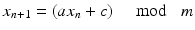

很明显，由于随机值是余数，所以能产生的不同值的最大数量是`m`，对于`a`和`c`的糟糕选择，会比这个少很多。虽然这种算法简单而快速，但当高质量的随机序列对应用程序很重要时，作为其他引擎之一的实例的生成器(如`mersenne_twister_engine`)是更好的选择。

#### 基于线性同余发动机的发电机

有两种随机数生成器类型被定义为`linear_congruential_engine`模板实例的别名`minstd_rand0`和`minstd_rand`，它们生成 32 位无符号整数。这些名字来自“最小标准随机数生成器”。`minstd_rand0`由 Stephen K. Park 和 Keith W. Miller 于 1988 年提出，作为生成随机数的最低标准，因为当时周围存在数量不佳的生成器；定义为`a`为`16807`，c 为`0`，而`m`为`2147483647`。`m`的值是小于 2 32 的最大梅森素数。`minstd_rand`发生器是`minstd_rand0`的改进型，将`a`改为`48271`。

`knuth_b`随机数发生器通过将`shuffle_order_engine`适配器应用于`minst_rand0`发生器产生的值，实现了唐纳德·克努特(Donald Knuth)的算法。这在他的经典著作《计算机编程的艺术》第二卷中有所描述，同时还有很多关于生成随机数和随机性测试的方法。通过消除连续值之间的相关性，应用适配器增加了序列的“随机性”。

你使用这些发生器——实际上是所有的发生器——就像你看到的`default_random_engine`一样，例如:

`std::random_device rd;`

`std::minstd_rand rng {rd()};`

`std::uniform_int_distribution<long> dist {-5L, 5L};`

`for(size_t i {}; i < 8; ++i)`

`std::cout << std::setw(2) << dist(rng) << " ";     // 3 -5 -2  4 -5  4  1  0`

### 梅森龙卷风引擎

`mersenne_twister_engine`类模板实现了 Mersenne twister 算法，之所以这么叫是因为周期长度是一个 Mersenne 素数。梅森素数是形式为`2` `n` `-1`的素数，所以 7 和 127 是梅森素数；当然，算法中使用的梅森素数要大得多。这种引擎使用非常广泛，因为它可以生成非常长的高质量序列，但它的缺点是相对较慢。该算法很复杂，涉及许多参数，所以我不会在这里解释它。

#### 作为 Mersenne Twister 引擎实例的发生器

定义特定生成器的`mersenne_twister_engine`实例有两个类型别名。`mt19937`生成随机无符号 32 位整数，`mt19937_64`生成无符号 64 位整数。`mt19937`随机数发生器的周期长度为`2` `19937` `-1`，因此得名。

您可以像使用其他发生器一样使用它们:

`std::random_device rd;`

`std::mt19937_64 rng {rd()};        // Generates random 64-bit integers`

`std::uniform_real_distribution<long double> dist {-5.0L, 5.0L};`

`for(size_t i {}; i < 8; ++i)`

`std::cout << std::setw(5)`

`<< dist(rng)`

`<< " ";                // -2.57481 3.0546 -1.6438 2.14798`

`// -3.84095 0.973843 -2.98971 -2.1067`

### 带进位引擎的减法器

`subtract_with_carry_engine`模板定义了一个随机数引擎，它实现了带进位的减法算法，这是对线性同余算法的改进。与线性同余法一样，带进位的减法算法使用递归关系来定义序列中的连续值，但是每个值 x i 都是从序列中两个较早的值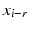和计算出来的，而不仅仅是前一个值。`r`和 s 分别称为长滞后和短滞后，且都必须为正，r 必须大于`s`。产生该序列的方程式是:

其中`m`为`2``n``n`为一个字的位数。

和如果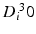

和如果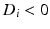

c 是一个“进位”,根据先前的状态，它可以是 0 或 1。该算法需要`r`种子值和进位的初始值`c`。与线性同余法一样，带进位的减法算法对参数值的选择非常敏感。

#### 作为带进位减法引擎实例的生成器

`ranlux24_base`生成器类产生 24 位整数的随机序列，其中`r`为`24`，而`s`为`10`。`ranlux48_base`类生成 48 位整数序列，其中`r`为`12`，而`s`为`5`。如图 [8-12](#Fig12) 所示，还有两类使用带进位减法引擎的生成器，`ranlux24`和`ranlux48`，它们是通过将`ranlux24_base`和`ranlux48_base`传递给`discard_block_engine`适配器的一个实例产生的。一个`ranlux24`实例从`ranlux24_base`产生的每个`223`值块中丢弃`200`；一个`ranlux48`实例丢弃了由`ranlux48_base`产生的每个`389`值块中的`378`,所以它们都对从底层来源接受的值很挑剔。

`ranlux24`和`ranlux48`在蒙特卡罗模拟中广泛使用。`ranlux`这个名字是由 Fred James 首创的，他首先用 Fortran 实现了这个算法；这个名字来自于 random 和从底层序列中丢弃如此多的值的奢侈。这里有一个使用`ranlux24`的例子:

`std::random_device rd;`

`std::ranlux24 rng {rd()};`

`std::uniform_real_distribution<long double> d {-5.0L, 5.0L};`

`for(size_t i {}; i < 8; ++i)`

`std::cout << std::setw(5) << d(rng)`

`<< " ";     // 2.02142 -0.920689 -0.277198 -1.33417 4.70217 -3.31706 -3.32692 4.36376`

代码基本上与其他生成器相同。生成器对象将根据构造函数的参数产生初始状态所需的值。

## 打乱一系列元素

`shuffle()`算法将一个范围内的元素重新排列成随机排列。`shuffle()`的函数模板是在`algorithm`头中定义的，但是我把它放在这里是因为它需要一个随机数发生器。元素的所有可能的排列都是同样可能的。`shuffle()`的前两个参数是定义范围的随机访问迭代器，第三个参数是一个函数对象，它是一个统一随机数生成器，将用于生成随机序列。这段代码说明了它是如何工作的:

`std::random_device rd;`

`std::mt19937 rng {rd()};`

`std::vector<string> words {"one", "two", "three", "four", "five", "six", "seven", "eight"};`

`for(size_t i {}; i < 4 ; ++i)`

`{`

`std::shuffle(std::begin(words), std::end(words), rng);`

`std::for_each(std::begin(words), std::end(words),`

` {std::cout << std::setw(8) << std::left << word; });`

`std::cout << std::endl;`

`}`

梅森扭扭器引擎`rng`作为最后一个参数传递给`for`循环中的`shuffle()`算法。这将重新排列每次迭代的`words`容器中的元素。我得到了这样的输出:

`two     seven   three   five    six     eight   one     four`

`eight   five    seven   six     three   four    one     two`

`seven   one     five    six     eight   four    two     three`

`three   four    six     five    seven   one     two     eight`

## 摘要

使用 STL 工具生成随机数序列通常包括三个部分:

*   可以生成随机位序列的随机数引擎。有三个定义随机数引擎的类模板:
    *   能够产生最高质量的序列，但它是三个中最慢的。
    *   `linear_congruential_engine` -最简单、最快但质量不如其他两个引擎的序列。
    *   `subtract_with_carry_engine` -能够生成比`linear_congruential_engine`实例质量更好的序列，但是状态占用更多内存，速度稍慢。
*   一个随机数生成器，它定制一个引擎模板来实现一个特定的算法，用于生成非负整数的统一随机序列。除了由实现定义的`default_random_engine`，还有九个类定义了不同的生成器:
    *   来自`mersenne_twister_engine`模板的`mt19937`和`mt19937_64`。
    *   来自`linear_congruential_engine`模板的`minstd_rand0`、`minstd_rand`和`knuth_b`。
    *   来自`subtract_with_carry_engine`模板的`ranlux24_base`、`ranlux48_base`、`ranlux24`和`ranlux48`。
*   一种分布函数对象，它使用随机数生成器中的序列来生成具有给定概率分布的整数或浮点值序列。有 21 个模板定义了发行版——除了一个以外都是类模板:
    *   均匀分布:`uniform_int_distribution`、`uniform_real_distribution`、`generate_canonical()`函数模板。
    *   正态分布:`normal_distribution`、`lognormal_distribution`、`chi_squared_distribution`、`cauchy_distribution`、`fisher_f_distribution`和`student_t_distribution`
    *   抽样分布:`discrete_distribution`、`piecewise_constant_distribution`和`piecewise_linear_distribution`
    *   伯努利分布:`bernoulli_distribution`、`geometric_distribution`、`binomial_distribution`和`negative_binomial_distribution`
    *   泊松分布:`poisson_distribution`、`gamma_distribution`、`weibull_distribution`、`extreme_value_distribution`和`exponential_distribution`

一些随机数发生器类型使用随机数引擎适配器来修改来自引擎的随机序列。引擎适配器有三种类别模板:

*   用于定义`knuth_b`的`shuffle_order_engine`。
*   用于定义`ranlux24`和`ranlux48`。
*   没有在 STL 中应用的。

随机数生成器需要一个或多个种子值来初始化其状态。`random_device`类定义了可以返回均匀分布的非负整数序列的函数对象，这些非负整数序列在大多数实现中都是不确定的。这些可以用作随机数生成器的种子值。为了确保你将得到高质量的序列，你不应该直接使用随机数引擎——总是使用随机数生成器。

ExercisesModify `Ex8_03` to use the `shuffle()` algorithm to shuffle the cards before dealing.   Extend the solution to the previous exercise to play a game after dealing the four random hands. Each player will play a random card from their hand in turn. Output the cards played in each round and identify the player with the winning card - the winning card being the highest in the sort sequence.   Simulate throwing two standard dice using a single discrete distribution so the distribution object generates values for the sum of the two dice. Generate 5000 throws and plot them in a histogram.   Write a program to estimate the probability of all possible faces being shown together when throwing six standard dice simultaneously by simulating a large number of throws.