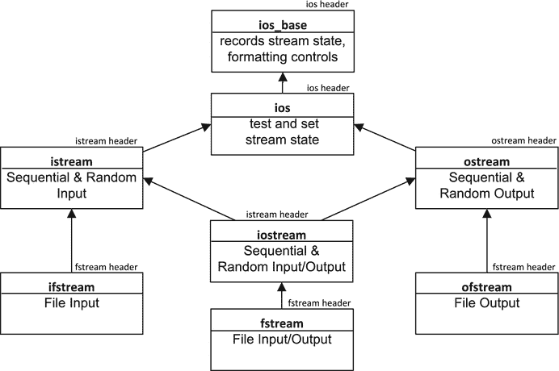
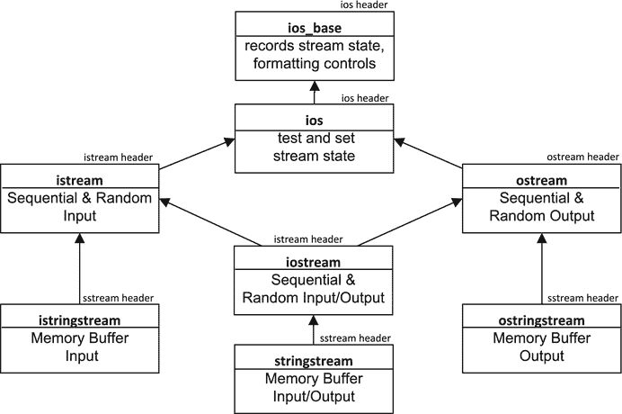

# 9.流操作

Electronic supplementary material The online version of this chapter (doi:[10.​1007/​978-1-4842-0004-9_​9](http://dx.doi.org/10.1007/978-1-4842-0004-9_9)) contains supplementary material, which is available to authorized users.

本章回顾了我在第 1 章中介绍的流迭代器，并详细讨论了它们的功能。它还介绍了流缓冲迭代器，并解释了如何将流和流缓冲迭代器与其他 STL 功能结合使用。在本章中，您将学习:

*   流迭代器类提供了哪些函数成员。
*   如何用流迭代器读写单个数据项？
*   什么是流缓冲迭代器，它们与流迭代器有何不同。
*   如何使用流迭代器读写文件？
*   如何使用流缓冲迭代器读写文件？
*   什么是字符串流，STL 定义了不同类型的字符串流。
*   如何对字符串流使用流迭代器和流缓冲区迭代器。

## 流迭代器

如你所知，一个流迭代器是一个单遍迭代器，如果它是一个输入流迭代器，它从一个流中读取；如果它是一个输出流迭代器，它向一个流中写入。流迭代器只能将一种给定类型的数据传入或传出流。如果您想使用流迭代器来传输一系列不同类型的数据项，您必须安排将数据项打包到一个单一类型的对象中，并确保该类型的流插入和/或提取操作符函数存在。与其他迭代器相比，流迭代器有点奇怪。例如，增加一个输入流迭代器不仅仅是移动迭代器指向下一个数据项——它从流中读取一个值。让我们进入细节。

### 输入流迭代器

输入流迭代器是一种可以在文本模式下从流中提取数据的输入迭代器，这意味着您不能将它用于二进制流。两个流迭代器通常用于读取流中的所有值:指向要读取的第一个值的 begin 迭代器和指向流末尾的 end 迭代器。当输入流的文件尾(`EOF`)流状态被识别时，结束迭代器被识别。在`iterator`头中定义的`istream_iterator`模板使用提取操作符`>>`从流中读取`T`类型的值。为此，必须有一个从`istream`对象中读取`T`类型值的`operator>>()`函数重载。因为是输入迭代器，`istream_iterator`的一个实例是单遍迭代器；它只能使用一次。默认情况下，流被认为包含类型`char`的字符。

通过向构造函数传递一个输入流对象来创建一个`istream_iterator`对象。有一个复制构造函数用于复制`istream_iterator`对象。下面是一个创建输入流迭代器的示例:

`std::istream_iterator<string> in  {std::cin};    // Reads strings from cin`

`std::istream_iterator<string> end_in;            // End-of-stream iterator`

默认的构造函数创建一个表示流结束的对象——也就是识别出`EOF`的时候。

虽然默认情况下流被认为包含类型为`char`的字符，但是您可以定义输入流迭代器来读取包含另一种类型字符的流。例如，下面是如何定义流迭代器来读取包含`wchar_t`字符的流:

`std::basic_ifstream<wchar_t> file_in {"no_such_file.txt"};      // File stream of wchar_t`

`std::istream_iterator<std::wstring, wchar_t> in {file_in};      // Reads strings of wchar_t`

`std::istream_iterator<std::wstring, wchar_t> end_in;            // End-of-stream iterator`

第一条语句定义了一个由`wchar_t`个字符组成的输入文件流。我将在下一节提醒您文件流的一些关键细节。第二条语句定义了一个用于读取文件的流迭代器。流中的字符类型由第二个模板类型参数指定，在本例中为`istream_iterator`、`wchar_t`。当然，指定要从流中读取的对象类型的第一个模板类型参数现在必须是`wstring`，这是由`wchar_t`字符组成的字符串的类型。

一个`istream_iterator`对象有以下函数成员:

*   返回流中当前对象的引用。您可以多次应用该运算符来重新读取相同的值。
*   `operator->()`返回当前对象在流中的地址。
*   `operator++()`从底层输入流中读取一个值，并将其存储在迭代器对象中。返回对迭代器对象的引用。因此，表达式`*++in`的值将是存储的最新新值。这是`not`的典型用法，因为它可能会跳过流中的第一个值。
*   `operator++(int)`从底层输入流中读取一个值，并将其存储在迭代器对象中，准备好使用`operator*()`或`operator->()`进行访问。该函数在存储流中的新值之前返回迭代器对象的代理。这意味着表达式`*in++`的值是在底层流的最新值被读取和存储之前存储在迭代器中的对象。

还有非成员函数，`operator==()`和`operator!=(),`用于比较两个相同类型的迭代器对象。如果两个输入迭代器都是同一流的迭代器，或者都是流尾迭代器，则它们相等；否则它们是不平等的。

#### 迭代器和流迭代器

认识到输入流迭代器不同于常规迭代器是很重要的，因为它们与数据项序列相关。正则迭代器指向数组或容器中的元素。递增一个正则迭代器会改变它所指向的对象；这对指向同一序列中元素的其他迭代器没有影响。可以有几个迭代器对象，每个对象指向同一序列中的不同元素。流迭代器就不是这样了。

当您考虑使用流迭代器读取标准输入流时会发生什么时，这一点就很明显了；当流迭代器用于文件时，这可能不那么明显，但它仍然适用。如果创建两个与同一个流相关的输入流迭代器，它们最初都指向第一个数据项。如果使用一个迭代器从流中读取，另一个迭代器将不再引用第一个数据值。当从标准输入流中读取时，值由第一个迭代器使用。这是因为迭代器在读取值时会修改流对象。输入流迭代器不仅改变了它所指向的内容——解引用时得到的内容——还改变了底层流中标识下一个读操作开始位置的位置。因此，给定流的两个或多个输入流迭代器总是指向该流中可用的下一个数据项。这意味着由两个输入流迭代器指定的范围只能由一个开始迭代器和一个流尾迭代器组成；您无法创建两个指向同一流中两个不同值的流迭代器。这并不是说你不能使用输入流迭代器来访问数据项。正如你将会看到的。

#### 使用输入流函数成员读取

下面的代码演示了如何使用函数成员来读取字符串:

`std::cout << "Enter one or more words. Enter ! to end:\n";`

`std::istream_iterator<string> in {std::cin};     // Reads strings from cin`

`std::vector<string> words;`

`while(true)`

`{`

`string word = *in;`

`if(word == "!") break;`

`words.push_back(word);`

`++in;`

`}`

`std::cout << "You entered " << words.size() << " words." << std::endl;`

循环从标准输入流中读取单词，并将它们添加到一个向量容器中，直到输入`"!"`为止。表达式`*in`的值是来自底层流的当前`string`对象。`++in`从流中读取下一个字符串对象，并存储在迭代器中，`in`。以下是执行此代码的输出示例:

`Enter one or more words. Enter ! to end:`

`Yes No Maybe !`

`You entered 3 words.`

下面是一个工作示例，它说明了如何使用函数成员来读取数字数据，但不一定说明应该如何使用它们:

`// Ex9_01.cpp`

`// Calling istream_iterator function members`

`#include <iostream>                                   // For standard streams`

`#include <iterator>                                   // For stream iterators`

`int main()`

`{`

`std::cout << "Enter some integers - enter Ctrl+Z to end.\n";`

`std::istream_iterator<int> iter {std::cin};       // Create begin input stream iterator...`

`std::istream_iterator<int> copy_iter {iter};      // ...and a copy`

`std::istream_iterator<int> end_iter;              // Create end input stream iterator`

`// Read some integers to sum`

`int sum {};`

`while(iter != end_iter)                           // Continue until Ctrl+Z read`

`{`

`sum += *iter++;`

`}`

`std::cout << "Total is " << sum << std::endl;`

`std::cin.clear();                                 // Clear EOF state`

`std::cin.ignore();                                // Skip characters`

`// Read integers using the copy of the iterator`

`std::cout << "Enter some more integers - enter Ctrl+Z to end.\n";`

`int product {1};`

`while(true)`

`{`

`if(copy_iter == end_iter) break;                // Break if Ctrl+Z was read`

`product *= *copy_iter++;`

`}`

`std::cout << "product is " << product << std::endl;`

`}`

在显示输入提示后，我们创建一个输入流迭代器，从`cin`中读取类型`int`的值；然后我们复制迭代器对象。在原始对象`iter`被使用后，我们将能够使用副本`copy_iter`来读取来自`cin`的输入，我们只需要一个结束迭代器对象，因为它永远不会改变。第一个循环对使用输入流迭代器读取的所有值求和，直到识别出`EOF`流状态，该状态通过从流中读取`Ctrl+Z`标志来设置。解引用`iter`使得它所指向的值可用，之后后增量操作将`iter`移动到下一个输入。如果这是`Ctrl+Z`，循环将结束。

在我们可以从`cin`读取更多数据之前，我们必须通过调用流对象的`clear()`来重置`EOF`标志；我们还需要跳过留在输入缓冲区中的`'\n'`字符，这是通过调用流对象的`ignore()`来完成的。第二个循环使用`copy_iter`读取值并计算它们的乘积。与第一个循环的主要区别在于，通过比较`copy_iter`与`end_iter`是否相等来终止循环。

下面是一个输出示例:

`Enter some integers - enter Ctrl+Z to end.`

`1 2 3 4^Z`

`Total is 10`

`Enter some more integers - enter Ctrl+Z to end.`

`3 3 2 5 4^Z`

`product is 360`

这不是大多数情况下使用输入流迭代器的方式。通常，您只需使用流开始和流结束迭代器作为函数的参数。您可能意识到了第一个循环和跟随它的输出语句可以被一个语句代替:

`std::cout << "Total is " << std::accumulate(iter, end_iter, 0) << std::endl;`

下面是一些通过使用输入流迭代器将浮点值从`cin`插入容器的代码:

`std::vector<double> data;`

`std::cout << "Enter some numerical values - enter Ctrl+Z to end.\n";`

`std::copy(std::istream_iterator<double>{std::cin}, std::istream_iterator<double>{},`

`std::back_inserter(data));`

任意数量的值将被`copy()`算法追加到`vector`容器中，直到`Ctrl+Z`被读取。有一个用于`vector`容器的构造函数，它接受一个范围来初始化元素，因此您可以在创建容器的语句中使用输入流迭代器来读取值:

`std::cout << "Enter some numerical values - enter Ctrl+Z to end.\n";`

`std::vector<double> data {std::istream_iterator<double>{std::cin}, std::istream_iterator<double>{}};`

这将从标准输入流中读取浮点值，并将它们用作容器中元素的初始值。

### 输出流迭代器

输出流迭代器由`ostream_iterator`模板定义，该模板具有第一个模板参数，即要写入的值的类型，以及第二个模板参数，即流中字符的类型；第二个模板参数的默认值为`char`。一个`ostream_iterator`对象是一个输出迭代器，它可以以文本模式将任何类型的对象`T`写入输出流，只要已经实现了将`T`对象写入流的`operator<<()`。因为它是一个输出迭代器，所以它支持前增量和后增量操作，并且它是一个单程迭代器。一个输出流迭代器定义了它的复制赋值操作符，这样它就可以使用插入操作符将一个`T`对象写到一个流中。默认情况下，输出流迭代器将值写成`char`字符序列。通过将类型指定为第二个模板类型参数，可以编写包含不同类型字符的流。一个`ostream_iterato` r 类型定义了以下函数成员:

*   构造函数:第一个构造函数从作为第一个参数的`ostream`对象和作为第二个参数的分隔符字符串为输出流创建一个 begin 迭代器。输出流对象在其写入流的每个对象后写入分隔符字符串。第二个构造函数省略了第二个参数，它创建了一个迭代器，这个迭代器只写没有后续分隔符的对象。
*   `operator=(const T& obj)`将`obj`写入流，然后写入分隔符字符串(如果给构造函数指定了一个)。该函数返回对迭代器的引用。
*   除了返回迭代器对象之外，不做任何事情。要使迭代器符合输出迭代器的条件，必须定义这个操作。
*   定义了`operator++()`和`operator++(int)`，但是除了返回迭代器对象之外，它们什么也不做。对于一个符合输出迭代器条件的迭代器，必须支持前增量和后增量操作。

不做任何事情的操作符函数是必不可少的，因为它们是输出迭代器的规范的一部分。如果您以文本模式写入一个流，并且随后打算以文本模式读取，则需要在流中的值之间使用分隔符。因此，虽然您可以显式编写分隔符，但带有两个参数的构造函数通常是合适的。

#### 使用输出流迭代器的函数成员编写

下面的示例展示了函数成员的各种使用方式:

`// Ex9_02.cpp`

`// Using output stream iterator function members`

`#include <iostream>                                   // For standard streams`

`#include <iterator>                                     // For iterators and begin() and end()`

`#include <vector>                                     // For vector container`

`#include <algorithm>                                  // For copy() algorithm`

`#include <string>`

`using std::string;`

`int main()`

`{`

`std::vector<string> words {"The", "quick", "brown", "fox", "jumped", "over", "the", "lazy", "dog"};`

`// Write the words container using conventional iterator notation`

`std::ostream_iterator<string> out_iter1 {std::cout};  // Iterator with no delimiter output`

`for(const auto& word : words)`

`{`

`*out_iter1++ = word;                              // Write a word`

`*out_iter1++ = " ";                               // Write a delimiter`

`}`

`*out_iter1++ = "\n";                                // Write newline`

`// Write the words container again using the iterator`

`for(const auto& word : words)`

`{`

`(out_iter1 = word) = " ";                         // Write the word and` `delimiter`

`}`

`out_iter1 = "\n";                                   // Write newline`

`// Write the words container using copy()`

`std::ostream_iterator<string> out_iter2 {std::cout, " "};`

`std::copy(std::begin(words), std::end(words), out_iter2);`

`out_iter2 = "\n";`

`}`

这以三种不同的方式将`words`容器的元素写入标准输出流。`out_iter1`流迭代器是通过调用构造函数创建的，只使用输出流作为参数。第一个循环使用传统的输出迭代器符号，在解引用迭代器后递增迭代器，并将`word`的当前值复制到解引用的结果`out_iter1`。循环后的语句会向流中写入一个换行符。请注意，您不能这样写:

`out_iter1 = '\n';                                      // Won’t compile!`

迭代器被定义为将`string`对象写入流，因此它不能写入任何其他类型的数据。`operator=()`成员将只接受一个字符串参数，所以语句不会被编译。

如前所述，`operator*()`成员和前后递增操作符除了返回对迭代器的引用之外什么也不做。因此，您可以省去这些操作，并在没有这些操作的情况下生成相同的输出，如第二个循环中的语句所示。语句中的括号对于确保应用于分隔符的第二个赋值操作将输出迭代器作为其左操作数非常重要。

第三行输出是由`copy()`算法以你在前面章节中看到的方式产生的。元素的值被复制到`out_iter2`，它由第二个构造函数参数定义，该参数指定了每个输出值后面的分隔符字符串。

## 重载插入和提取操作符

您必须为任何想要与流迭代器一起使用的类类型重载插入和提取操作符。这对你自己的班级来说很容易。您可以根据需要提供`get`和`set`函数来访问任何`private`或`public`数据成员，或者您可以将运算符函数指定为`friend`函数。下面是一个简单的表示名称的类的例子，它说明了这一点:

`class Name`

`{`

`private:`

`std::string first_name{};`

`std::string second_name{};`

`public:`

`Name() = default;`

`Name(const std::string& first, const std::string& second) :`

`first_name{first}, second_name {second} {}`

`friend std::istream& operator>>(std::istream& in, Name& name);`

`friend std::ostream& operator<<(std::ostream& out, const Name& name);`

`};`

`// Extraction operator for Name objects`

`inline std::istream& operator>>(std::istream& in, Name& name)`

`{ return in >> name.first_name >> name.second_name; }`

`// Insertion operator for Name objects`

`inline std::ostream& operator<<(std::ostream& out, const Name& name)`

`{ return out << name.first_name << ' ' << name.second_name; }`

通过这里定义的操作符重载，您可以使用流迭代器读写 name 对象，例如:

`std::cout << "Enter names as first-name second-name. Enter Ctrl+Z on a separate line to end:\n";`

`std::vector<Name> names {std::istream_iterator<Name> {std::cin}, std::istream_iterator<Name>{}};`

`std::copy(std::begin(names), std::end(names), std::ostream_iterator<Name>{std::cout, " "});`

容器`names`将被初始化为你输入的尽可能多的`Name`对象，直到输入`Ctrl+Z`结束输入。`copy()`算法将`Name`对象复制到输出流迭代器表示的目的地，迭代器将对象写入标准输出流。我们在这里写名字和第二个名字将通过指定字段宽度来防止列中的名字对齐。例如，这不会很好地工作:

`for(const auto& name: names)`

`std::cout << std::setw(20) << name << std::endl;`

想法是在一列中输出对齐的名称。这将不起作用，因为宽度规格仅适用于`first_name`成员。您可以通过更改`operator<<()`函数来实现这一点，以便它在写出名称之前将它们连接起来:

`inline std::ostream& operator<<(std::ostream& out, const Name& name)`

`{ return out << name.first_name + ' ' + name.second_name; }`

由于沿途创建的临时`string`对象，这比原来的效率低，但是它允许前面的循环按要求工作。

有时，您可能希望根据目标是否是文件来区别对待输出。例如，您可能希望在标准输出流的输出中包含您在写入文件时不想包含的附加信息。您可以通过测试`ostream`对象的实际类型来解决这个问题:

`inline std::ostream& operator<<(std::ostream& out, const Name& name)`

`{`

`if(typeid(out) != typeid(std::ostream))`

`return out << name.first_name << " " << name.second_name;`

`else`

`return out << "Name: " << name.first_name << ' ' << name.second_name;`

`}`

现在，一个名字只有在被写到一个属于`ostream`对象的流中时才会被加上前缀`"Name: "`。对于输出到文件流，或从`ostream`派生的其他类型的流，前缀被省略。

## 对文件使用流迭代器

流迭代器不知道底层流的性质。当然，他们只在文本模式下处理流，否则他们不会关心数据是什么。任何类型的流都可以使用流迭代器在文本模式下读写。这意味着您可以使用流迭代器在文本模式下读写文件。在我详细介绍对文件使用流迭代器之前，我将提醒您文件流的一些基本特征，以及如何创建封装文件的流对象。

### 对象

文件流封装了一个物理文件。一个文件流有一个长度，它是流中的字符数，所以对于一个新的输出文件它是 0；它有一个开头，是 stream - index `0`中第一个字符的索引；它有一个 end，是流中最后一个字符后面的索引。它还有一个当前位置，是下一个读或写操作开始的索引。您可以在文本模式或二进制模式下与流来回传输数据。

在文本模式下，数据是一个字符序列。可以使用提取和插入操作符读取或写入数据，因此至少对于输入，数据项必须由一个或多个空白字符分隔。数据通常被写成由`'\n'`终止的一系列行。有些系统，如 Microsoft Windows，在阅读或书写时会转换换行符。Microsoft Windows 将换行符写成两个字符:回车和换行符。当读取回车符和换行符时，它们被映射成一个字符`'\n'`。在其他系统中，换行符是作为单个字符来读写的。因此，文件输入流的长度可以取决于它所源自的系统环境。

在二进制模式下，字节在内存和流之间传输，不进行转换。流迭代器只在文本模式下工作，所以不能使用流迭代器来读写二进制文件。我将在本章后面解释的流缓冲迭代器可以读写二进制文件。

尽管二进制模式操作可以不加修改地在内存中来回传输字节，但是在处理写在不同系统上的二进制文件时，仍然存在缺陷。一个考虑因素是写入文件的系统的字节顺序与读取文件的系统的字节顺序。字节序决定了内存中一个字的字节写入的顺序。在小字节序处理器中，例如 Intel 的 x86 处理器，最低有效字节在最低地址中，因此字节以从最低有效到最高有效的顺序写入。在 IBM 大型机这样的大端序处理器中，字节的顺序相反，最高有效字节位于低位地址，因此它们在文件中的顺序与小端序处理器相反。因此，当您在小端系统上从大端系统读取二进制文件时，您需要考虑字节顺序的差异。

Note

大端字节顺序也称为网络字节顺序，因为数据通常以大端顺序在互联网上传输。

### 文件流类模板

有三个表示文件流的类模板:`ifstream`表示文件输入流，`ofstream`定义输出的文件流，`fstream`定义可以读写的文件流。这些的等级结构如图 [9-1](#Fig1) 所示。

图 9-1。

Inheritance hierarchy for class templates that represent file streams

文件流模板继承自`istream`和/或`ostream`，因此在文本模式下，它们的工作方式与标准流相同。你可以对文件流做什么是由它的打开模式决定的，你可以通过下列常量的组合来指定，这些常量在`ios_base`类中定义:

*   `binary`设置二进制模式。如果未设置二进制模式(这是默认设置)，则模式为文本模式。
*   `app`:每次写入前移动到文件末尾(app end 操作)。
*   `ate`打开文件后移动到文件末尾(在末尾)。
*   `in`打开文件进行阅读。这是一个`ifstream`对象和一个`fstream`对象的默认值。
*   `out`打开文件进行写入。这是一个`ostream`对象和一个`fstream`对象的默认值。
*   `trunc`将现有文件截短为零长度。

默认情况下，文件流对象以文本模式创建；要获得二进制模式，必须指定`binary`常量。文本模式操作使用`>>`和`<<`操作符来读取和写入数据，数值在写入流之前被转换成字符表示。在二进制模式下，没有数据转换；内存中的字节直接写入文件。当您为一个不存在的文件指定一个名称作为`ofstream`构造函数的参数时，该文件将被创建。如果在创建或打开文件输出流对象时没有指定`app`或`ate`，任何现有的文件内容都将被覆盖。

本章中的一些工作示例所读取的`dictionary.txt`文件包含在代码下载中。这是一个在 Microsoft Windows 环境中以文本模式编写的文件，但是如果您在不同的环境中执行它，示例仍然应该可以读取它。示例使用驱动器`G:`上的 Microsoft Windows 路径。我这样做是为了让您更有可能需要更改这些以适应您的系统环境。这让您有责任确保不会覆盖重要的文件。

### 使用流迭代器的文件输入

一旦创建了用于读取文件的文件流对象，使用流迭代器访问数据本质上与从标准输入流读取数据是一样的。我们可以编写一个程序，通过在代码下载中的字典文件中查找一个单词的变位词。在这种情况下，我们将使用流迭代器将字典文件中的所有单词读入一个容器。下面是代码:

`// Ex9_03.cpp`

`// Finding anagrams of a word`

`#include <iostream>                                    // For standard streams`

`#include <fstream>                                     // For file streams`

`#include <iterator>                                       // For iterators and begin() and end()`

`#include <string>                                      // For string class`

`#include <seT>                                         // For set container`

`#include <vector>                                      // For vector container`

`#include <algorithm>                                   // For next_permutation()`

`using std::string;`

`int main()`

`{`

`// Read words from the file into a set container`

`string file_in {"G:/Beginning_STL/dictionary.txt"};`

`std::ifstream in {file_in};`

`if(!in)`

`{`

`std::cerr << file_in << " not open." << std::endl;`

`exit(1);`

`}`

`std::set<string> dictionary {std::istream_iterator<string>(in), std::istream_iterator<string>()};`

`std::cout << dictionary.size() << " words in dictionary." << std::endl;`

`std::vector<string> words;`

`string word;`

`while(true)`

`{`

`std::cout << "\nEnter a word, or Ctrl+z to end: ";`

`if((std::cin >> word).eof()) break;`

`string word_copy {word};`

`do`

`{`

`if(dictionary.count(word))`

`words.push_back(word);`

`std::next_permutation(std::begin(word), std::end(word));`

`} while(word != word_copy);`

`std::copy(std::begin(words), std::end(words), std::ostream_iterator<string>{std::cout, " "});`

`std::cout << std::endl;`

`words.clear();                                              // Remove previous permutations`

`}`

`in.close();                                                // Close the file`

`}`

字典文件中有超过 100，000 个单词，因此可能需要几秒钟来阅读它。使用文件的完整路径`dictionary.txt`创建一个`ifstream`对象。这是一个文本文件，包含合理数量的不同单词，可以通过搜索来检查字谜。整个文件内容被用作集合容器的初始值。如你所知，一个集合容器将按升序存储单词，容器中的每个单词都是它自己的键。`words`容器存储从`cin`输入的单词的变位词。在 while 循环的第一个 if 表达式中读取每个单词。这将调用流对象的`eof()`，当输入`Ctrl+Z`时将返回 true。通过调用内部`do-while`循环中的`next_permutation()`算法来重新排列输入单词中的字母。为每个排列调用`count()`，包括第一个，确定单词是否在字典容器中。如果是，这个单词将被追加到`words`容器中。当排列返回到原始单词时,`do-while`循环结束。当一个单词的所有变位词都被找到时，使用`copy()`算法将这些单词写入`cout`，输出流迭代器作为目的地。如果您预计会出现八个以上的变位词，您可以使用一个循环在多行上生成输出:

`size_t count {}, max {8};`

`for(const auto& wrd : words)`

`std::cout << wrd << ((++count % max == 0) ? '\n' : ' ');`

以下是一些输出示例:

`109582 words in dictionary.`

`Enter a word, or Ctrl+z to end: realist`

`realist retails saltier slatier tailers`

`Enter a word, or Ctrl+z to end: painter`

`painter pertain repaint`

`Enter a word, or Ctrl+z to end: dog`

`dog god`

`Enter a word, or Ctrl+z to end: ^Z`

### 使用流迭代器重复读取文件

当然，如果字典文件非常大，您可能不希望将它全部读入内存。在这种情况下，每次想要查找变位词时，可以使用流迭代器来重新读取文件。这里有一个版本可以做到这一点——尽管它的性能并不令人印象深刻:

`// Ex9_04.cpp`

`// Finding anagrams of a word by re-reading the dictionary file`

`// include directives & using directive as Ex9_03.cpp...`

`int main()`

`{`

`string file_in {"G:/Beginning_STL/dictionary.txt"};`

`std::ifstream in {file_in};`

`if(!in)`

`{`

`std::cerr << file_in << " not open." << std::endl;`

`exit(1);`

`}`

`auto end_iter = std::istream_iterator<string> {};`

`std::vector<string> words;`

`string word;`

`while(true)`

`{`

`std::cout << "\nEnter a word, or Ctrl+z to end: ";`

`if((std::cin >> word).eof()) break;`

`string word_copy {word};`

`do`

`{`

`in.seekg(0);                                           // File position at beginning`

`// Use find() algorithm to read the file to check for an anagram`

`if(std::find(std::istream_iterator<string>(in), end_iter, word) != end_iter)`

`words.push_back(word);`

`else`

`in.clear();                                         // Reset EOF`

`std::next_permutation(std::begin(word), std::end(word));`

`} while(word != word_copy);`

`std::copy(std::begin(words), std::end(words), std::ostream_iterator<string>{std::cout, " "});`

`std::cout << std::endl;`

`words.clear();                                             // Remove previous permutations`

`}`

`in.close();                                               // Close the file`

`}`

结束流迭代器没有改变，所以它被定义为`end_iter`以允许它被多次使用。这个循环基本上是相同的，只是使用了`find()`算法来发现给定的排列是否在文件中，因此是一个变位词。文件位置需要是第一个字符位置，调用文件流对象的`seekg()`可以确保这一点。`find()`的前两个参数是`istream_iterator<string>`对象，它们定义了从当前文件位置(设置为开头)到文件结尾的范围。`find()`算法返回一个迭代器，指向与第三个参数匹配的元素，如果不存在，则返回结束迭代器。因此当`find()`返回结束流迭代器时，`word`没有找到；返回的任何其他迭代器都意味着找到了它。当没有找到`word`时，调用`clear()`让文件流对象清除`EOF`标志是必要的。如果不这样做，随后读取文件的尝试将会失败，因为`EOF`标志被设置。

下面是一些示例输出，展示了它的工作原理:

`Enter a word, or Ctrl+z to end: rate`

`rate tare tear erat`

`Enter a word, or Ctrl+z to end: rat`

`rat tar art`

`Enter a word, or Ctrl+z to end: god`

`god dog`

`Enter a word, or Ctrl+z to end: ^Z`

我选择输入短词，因为检查字谜的过程非常慢。一个有`n`个字符的单词有`n!`种排列。检查一个排列是否在文件中需要大约 100，000 次读取操作，这取决于它是否在文件中。因此，检查像“retain”这样的单词需要超过 700 万次的读取操作，所以这是一个缓慢过程的原因之一。一个`istream_iterator<T>`对象从一个流中一次读取一个`T`对象，所以如果有很多对象，它总是会很慢。一旦文件被读取以初始化`set`容器，`Ex9_03.cpp`比`Ex9_04.cpp`快得多，因为所有后续操作都是在内存中使用字典`words`。`Ex9_03.cpp`更快的第二个原因是访问一个集合容器涉及一个二分搜索法，它是`O(log n)`；串行访问文件包括从第一个单词开始读取每个单词，直到找到匹配，这是`O(n)`。如果文件中的数据是有序的(如`dictionary.txt`中的单词)，你可以使用二分搜索法技术来查找数据项。在这种情况下，使用流迭代器是多余的，因为您将总是读取单个单词，使用流对象的`>>`操作符可以更容易地做到这一点。然而，这并不容易实现，因为这些字的大小不同。

### 使用流迭代器的文件输出

写入文件与写入标准输出流没有什么不同。例如，您可以使用流迭代器复制`dictionary.txt`文件的内容，如下所示:

`// Ex9_05.cpp`

`// Copying file contents using stream iterators`

`#include <iostream>                              // For standard streams`

`#include <fstream>                               // For file streams`

`#include <iterator>                              // For iterators and begin() and end()`

`#include <string>                                // For string class`

`using std::string;`

`int main()`

`{`

`string file_in {"G:/Beginning_STL/dictionary.txt"};`

`std::ifstream in {file_in};`

`if(!in)`

`{`

`std::cerr << file_in << " not open." << std::endl;`

`exit(1);`

`}`

`string file_out {"G:/Beginning_STL/dictionary_copy.txt"};`

`std::ofstream out {file_out, std::ios_base::out | std::ios_base::trunc };`

`std::copy(std::istream_iterator<string> {in}, std::istream_iterator<string> {},`

`std::ostream_iterator<string> {out, " "});`

`in.clear();                                              // Clear EOF`

`std::cout << "Original file length: " << in.tellg() << std::endl;`

`std::cout << "File copy length: " << out.tellp() << std::endl;`

`in.close();`

`out.close();`

`}`

这个程序将单词从输入文件复制到输出文件，在输出中用空格分隔单词。这个程序总是覆盖输出文件的内容。这是我得到的输出:

`Original file length: 1154336`

`File copy length: 1154336`

除了`ios_base::out`标志之外，输出文件流还指定了打开模式标志`ios_base::trunc`，因此如果文件已经存在，它将被截断。如果多次运行该示例，这可以防止创建不断增长的文件。如果你用编辑器检查`dictionary.txt`的内容，你会看到单词被一个空格隔开。我们写文件副本时，单词之间只有一个空格，所以文件的长度是一样的。但是，如果原始文件中的单词由两个或更多空格分隔，文件副本会更短。为了确保使用流迭代器精确地复制原始文件，必须一个字符一个字符地读取文件，并防止`>>`操作符忽略空白。你可以这样做:

`std::copy(std::istream_iterator<char>{in >> std::noskipws}, std::istream_iterator<char>{},`

`std::ostream_iterator<char> {out});`

这会将`in`流复制为字符，包括空白。你可以用流缓冲迭代器更快地复制文件，我将在本章后面解释。

## 流迭代器和算法

您已经看到，您可以将诸如`find()`和`copy()`这样的算法与流迭代器一起使用。您可以使用流迭代器为任何接受输入迭代器来指定数据源的算法指定数据源。如果算法需要正向、双向或随机访问迭代器来定义输入，则不能使用流迭代器。当一个算法接受一个输出迭代器作为目的地时，它可以是一个输出流迭代器。这里有一个例子，使用带有流迭代器的`count_if()`算法来确定首字母相同的单词在`dictionary.txt`中出现的频率:

`// Ex9_06.cpp`

`// Using count_if() with stream iterators to count word frequencies`

`#include <iostream>                                    // For standard streams`

`#include <iterator>                                        // For iterators and begin() and end()`

`#include <iomanip>                                     // For stream manipulators`

`#include <fstream>                                     // For ifstream`

`#include <algorithm>                                   // For count_if()`

`#include <string>`

`using std::string;`

`int main()`

`{`

`string file_in {"G:/Beginning_STL/dictionary.txt"};`

`std::ifstream in {file_in};`

`if(!in)`

`{`

`std::cerr << file_in << " not open." << std::endl;`

`exit(1);`

`}`

`string letters {"abcdefghijklmnopqrstuvwxyz"};`

`const size_t perline {9};`

`for(auto ch : letters)`

`{`

`std::cout << ch << ": "`

`<< std::setw(5)`

`<< std::count_if(std::istream_iterator<string>{in}, std::istream_iterator<string>{},`

`[&ch](const string& s)`

`{ return s[0] == ch; })`

`<< (((ch - 'a' + 1) % perline) ? " " : "\n");`

`in.clear();                                            // Clear EOF...`

`in.seekg(0);                                           // ... and back to the beginning`

`}`

`std::cout << std::endl;`

`}`

我得到了这样的输出:

`a:  6541 b:  6280 c: 10324 d:  6694 e:  4494 f:  4701 g:  3594 h:  3920 i:  4382`

`j:  1046 k:   964 l:  3363 m:  5806 n:  2475 o:  2966 p:  8448 q:   577 r:  6804`

`s: 12108 t:  5530 u:  3312 v:  1825 w:  2714 x:    79 y:   370 z:   265`

这个程序使用流迭代器演示了`count_if()`算法，但是效率非常低。`for`循环遍历`letter`中的字符，并在每次迭代时调用`count_if()`，通过遍历文件中的所有单词来计算从当前字母开始的单词数。因为输入文件是有序的，所以不需要每次都读取整个文件。使用`for_each()`算法，我们可以更快地得到同样的结果:

`std::map <char, size_T> word_counts;           // Stores word count for each initial letter`

`size_t perline {9};                            // Outputs per line`

`// Get the words counts for each initial letter`

`std::for_each(std::istream_iterator<string>{in}, std::istream_iterator<string>{},`

`[&word_counts](const string& s) {word_counts[s[0]]++;});`

`std::for_each(std::begin(word_counts), std::end(word_counts),     // Write out the counts`

`[perline](const std::pair<char, size_T>& pr)`

`{ std::cout << pr.first << ": "`

`<< std::setw(5) << pr.second`

`<< (((pr.first - 'a' + 1) % perline) ? " " : "\n");`

`});`

`std::cout << std::endl;`

第一次调用`for_each()`算法遍历文件中的单词，并在第一次将带有给定首字母的单词传递给 lambda 表达式时，在`word_counts`容器中存储一个新的`pair`。当一个单词遇到先前已经找到的首字母时，`pair`的值递增。第二个`for_each()`调用从`map`输出元素。这个文件只被处理一次，所以它比以前的版本快了 26 倍。

`generate_n()`算法与流迭代器一起工作。下面是如何将一个流迭代器传递给一个算法来创建一个包含斐波那契数列中的一系列数字的文件，然后读取该文件以验证它是否工作:

`// Ex9_07.cpp`

`// Using stream iterators to write Fibonacci numbers to a file`

`#include <iostream>                                // For standard streams`

`#include <iterator>                                // For iterators and begin() and end()`

`#include <iomanip>                                 // For stream manipulators`

`#include <fstream>                                 // For fstream`

`#include <algorithm>                               // For generate_n() and for_each()`

`#include <string>`

`using std::string;`

`int main()`

`{`

`string file_name {"G:/Beginning_STL/fibonacci.txt"};`

`std::fstream fibonacci {file_name, std::ios_base::in | std::ios_base::out |   std::ios_base::trunc};`

`if(!fibonacci)`

`{`

`std::cerr << file_name << " not open." << std::endl;`

`exit(1);`

`}`

`unsigned long long first {0ULL}, second {1ULL};`

`auto iter = std::ostream_iterator<unsigned long long> {fibonacci, " "};`

`(iter = first) = second;                         // Write the first two values`

`const size_t n {50};`

`std::generate_n(iter, n, [&first, &second]`

`{ auto result = first + second;`

`first = second;`

`second = result;`

`return result; });`

`fibonacci.seekg(0);                                      // Back to file beginning`

`std::for_each(std::istream_iterator<unsigned long long> {fibonacci},`

`std::istream_iterator<unsigned long long> {},`

``

`{ const size_t perline {6};`

`static size_t count {};`

`std::cout << std::setw(12) << k << ((++count % perline) ? " " : "\n");`

`});`

`std::cout << std::endl;`

`fibonacci.close();                                       // Close the file`

`}`

这使用了一个`fstream`对象来封装文件，文件最初不会存在。一个`fstream`对象既可以写也可以读文件，默认情况下，它只打开存在的文件。将`ios_base::trunc`指定为打开模式标志会导致文件被创建(如果它不存在的话),如果它存在的话会导致内容被截断。Fibonacci 数增长很快，所以我使用`unsigned long long`作为值的类型，并且将数字限制为 50，除了前两个。前两个数字在`first`和`second`中定义，并使用`iter`写入文件，这是一个输出流迭代器。这使得文件位置比文件中的`second`值多一位，因此由`generate_n()`算法写入的 50 个值将跟随其后。写入值后，调用`seekg()`(查找获取数据)将文件设置回起始位置，准备读取。您可以使用`seekp()`(查找以存放数据)来重置文件位置以写入数据。

使用`for_each()`算法将文件内容写入标准输出流。lambda 表达式将六个值写入一行。您可以使用`generate_n()`将任何类型的值序列写入一个文件，您可以使用 function 对象生成该文件。假设您需要一个具有正态分布的随机温度值文件作为测试数据源。下面是如何使用流迭代器和`generate_n()`来实现这一点:

`// Ex9_08.cpp`

`// Using stream iterators to create a file of random temperatures`

`#include <iostream>                        // For standard streams`

`#include <iterator>                        // For iterators and begin() and end()`

`#include <iomanip>                         // For stream manipulators`

`#include <fstream>                         // For file streams`

`#include <algorithm>                       // For generate_n() and for_each()`

`#include <random>                          // For distributions and random number generator`

`#include <string>                          // For string class`

`using std::string;`

`int main()`

`{`

`string file_name {"G:/Beginning_STL/temperatures.txt"};`

`std::ofstream temps_out {file_name, std::ios_base::out | std::ios_base::trunc};`

`const size_t n {50};                                // Number of temperatures required`

`std::random_device rd;                              // Non-determistic source`

`std::mt19937 rng {rd()};                            // Mersenne twister generator`

`double mu {50.0}, sigma {15.0};                     // Mean: 50 degrees SD: 15`

`std::normal_distribution<> normal {mu, sigma};      // Create distribution`

`// Write random temperatures to the file`

`std::generate_n(std::ostream_iterator<double> { temps_out, " "}, n,`

`[&rng, &normal]`

`{ return normal(rng); });`

`temps_out.close();                                  // Close the output file`

`// List the contents of the file`

`std::ifstream temps_in {file_name};                 // Open the file to read it`

`for_each(std::istream_iterator<double> {temps_in}, std::istream_iterator<double> {},`

``

`{ const size_t perline {10};`

`static size_t count {};`

`std::cout << std::fixed << std::setprecision(2) << std::setw(5) << t`

`<< ((++count % perline) ? " " : "\n");`

`});`

`std::cout << std::endl;`

`temps_in.close();                                       // Close the input file`

`}`

我得到了以下输出:

`59.61 53.71 42.76 61.45 48.43 43.48 59.09 36.76 62.12 35.13`

`55.85 58.72 35.34 39.95 49.31 33.42 41.88 46.63 57.89 32.39`

`52.36 49.56 68.11 44.49 49.72 48.30 33.48 77.92 58.02 19.17`

`47.75 31.14 24.13 37.18 44.04 30.64 65.47 55.15 68.73 54.17`

`62.88 35.45 70.11  9.67 25.89 39.71 72.83 90.08 57.25 51.40`

这种工作方式与前面的例子`Ex9_07`类似，除了文件是用一个`ofstream`对象创建的，然后用一个`ifstream`对象读取。λ表达式是`generate_n()`的最后一个参数，它产生写入文件的值；它返回随机浮点温度，正态分布，平均值为`50`，标准差为`15`。`normal`对象定义了分布，`rng`对象是随机数生成器。虽然可以在`generate_n()`中使用流迭代器，但是不能在`generate()`算法中使用，因为它需要前向迭代器。

## 流缓冲迭代器

流缓冲迭代器与流迭代器的不同之处在于，它们只将字符传入或传出流缓冲区。它们直接访问流的缓冲区，因此不涉及插入和提取操作符。没有数据转换，也不需要数据中的分隔符，尽管如果有分隔符，您可以自己处理它们。因为流缓冲区迭代器不需要数据转换就可以读写字符，所以它们可以处理二进制文件。对于读写字符，流缓冲迭代器比流迭代器更快。`istreambuf_iterator`模板定义输入迭代器，而`ostreambuf_iterator`模板定义输出迭代器。您可以构造流缓冲区迭代器，读取或写入任何类型的字符`char`、`wchar_t`、`char16_t`或`char32_t`。

### 输入流缓冲区迭代器

要创建输入流缓冲区迭代器以从流中读取给定类型的字符，需要将流对象传递给构造函数:

`std::istreambuf_iterator<char> in {std::cin};`

这个对象是一个输入流缓冲迭代器，它将从标准输入流中读取类型为`char`的字符。表示流尾迭代器的对象由默认构造函数生成:

`std::istreambuf_iterator<char> end_in;`

您可以使用这两个迭代器将一个字符序列从`cin`读入到`string`中，直到`Ctrl+Z`被输入到单独的一行中，以表示流的结束——例如:

`std::cout << "Enter something: ";`

`string rubbish {in, end_in};`

`std::cout << rubbish << std::endl;               // Whatever you enter will be output`

`string`对象`rubbish`将用您从键盘输入的所有字符进行初始化，直到识别出流的结尾。

输入流缓冲区迭代器具有以下函数成员:

*   `operator*()`返回流中当前字符的副本。流位置不会前移，因此您可以重复获取当前字符。
*   访问当前角色的成员——如果它有成员的话。
*   `operator++()`和`operator++(int)`都将流位置移动到下一个字符。`operator++()`在移动位置后返回流迭代器，`operator++(int)`在移动位置前返回流迭代器的代理。前缀`++`运算符很少使用。
*   `equal()`接受另一个输入流缓冲区迭代器的参数，如果当前迭代器和参数都不是流尾迭代器，或者都是流尾迭代器，则返回`true`。如果其中只有一个是流尾迭代器，则返回`false`。

还有非成员函数，`operator==()`和`operator!=()`，它们比较两个迭代器。您不必依赖流的结尾来终止输入。您可以使用递增和取消引用操作符从流中读取字符，直到找到特定的字符。例如:

`std::istreambuf_iterator<char> in {std::cin};`

`std::istreambuf_iterator<char> end_in;`

`char end_ch {'*'};`

`string rubbish;`

`while(in != end_in && *in != end_ch) rubbish += *in++;`

`std::cout << rubbish << std::endl;               // Whatever you entered up to '*' or EOF`

`while`循环从`cin`开始读取字符，直到识别出流的结尾，或者直到输入星号并按下 Enter 键。循环体中应用于`in`的解引用操作符返回流中的当前字符，然后后缀增量操作符移动迭代器指向下一个字符。注意，在循环表达式中解引用`in`表明它不会改变迭代器；只要不是`'*'`，在迭代器递增之前，在循环体中再次读取同一个字符。

### 输出流缓冲区迭代器

您可以创建一个`ostreambuf_iterator`对象，通过将 stream 对象传递给构造函数，将给定类型的字符写入流中:

`string file_name {"G:/Beginning_STL/junk.txt"};`

`std::ofstream junk_out {file_name};`

`std::ostreambuf_iterator<char> out {junk_out};`

`out`对象可以将类型为`char`的字符写入文件输出流`junk_out`，该输出流封装了名为`junk.txt`的文件。要编写不同类型的字符，例如`char32_t`，只需指定模板类型参数作为字符类型。当然，必须为字符类型创建流，所以不能使用`ofstream`，因为`ofstream`是类型`basic_ofstream<char>`的别名。这里有一个你可以怎么做的例子:

`string file_name {"G:/Beginning_STL/words.txt"};`

`std::basic_ofstream<char32_T> words_out {file_name};`

`std::ostreambuf_iterator<char32_T> out {words_out};`

这个流缓冲区迭代器可以将 Unicode 字符写入流缓冲区。类型为`wchar_t`的字符的文件流由别名`wofstream`定义。

还可以通过将流缓冲区的地址传递给构造函数来创建输出流缓冲区对象。您可以通过编写以下代码生成上面的对象`out`:

`std::ostreambuf_iterator<char> out {junk_out.rdbuf()};`

对象的成员返回流的内部缓冲区的地址。`rdbuf()`成员继承自`ios_base`，它是所有流对象的基类。

一个`ostreambuf_iterator`对象有以下函数成员:

*   将作为参数的字符写入流缓冲区。如果`EOF`被识别，这将是当流缓冲区满时，写操作失败。
*   当前一次写入缓冲器失败时，`failed()`返回`true`。这将是当`EOF`被识别，因为输出流缓冲区已满。
*   `operator*()`无所作为。之所以这样定义，是因为它要求一个`ostreambuf_iterator`对象是一个输出迭代器。
*   `operator++()`和`operator++(int)`什么都不做。定义这些是因为它们是`ostreambuf_iterator`对象成为输出迭代器所必需的。

您通常关心的唯一函数成员是赋值操作符。下面是使用它的一种方法:

`string ad {"Now is the discount of our winter tents!\n"};`

`std::ostreambuf_iterator<char> iter {std::cout};      // Iterator for output to cout`

`for(auto ch: ad)`

`iter = ch;                                          // Write the character to the stream`

执行这段代码会将字符串逐字符写入标准输出流。当然，您可以通过使用`copy()`算法获得相同的结果:

`std::copy(std::begin(ad), std::end(ad), std::ostreambuf_iterator<char> {std::cout});`

我相信您知道，这两个例子都是对以下语句进行编码的可笑方式:

`std::cout << ad;`

尽管它没有告诉你太多关于输出流缓冲迭代器的信息...

### 对文件流使用流缓冲区迭代器

您可以使用流缓冲迭代器一个字符一个字符地复制文件，没有格式化读写的开销。这是一个复制`dictionary.txt`的程序:

`// Ex9_09.cpp`

`// Copying a file using stream buffer iterators`

`#include <iostream>                                    // For standard streams`

`#include <iterator>                                    // For iterators and begin() and end()`

`#include <fstream>                                     // For file streams`

`#include <string>                                      // For string class`

`using std::string;`

`int main()`

`{`

`string file_name {"G:/Beginning_STL/dictionary.txt"};`

`std::ifstream file_in {file_name};`

`if(!file_in)`

`{`

`std::cerr << file_name << " not open." << std::endl;`

`exit(1);`

`}`

`string file_copy {"G:/Beginning_STL/dictionary_copy.txt"};`

`std::ofstream file_out {file_copy, std::ios_base::out | std::ios_base::trunc};`

`std::istreambuf_iterator<char> in {file_in};             // Input stream buffer iterator`

`std::istreambuf_iterator<char> end_in;                   // End of stream buffer iterator`

`std::ostreambuf_iterator<char> out {file_out};           // Output stream buffer iterator`

`while(in != end_in)`

`out = *in++;                                           // Copy character from in to out`

`std::cout << "File copy completed." << std::endl;`

`file_in.close();                                         // Close the file`

`file_out.close();                                        // Close the file`

`}`

这会将由`ifstream`对象`file_in`封装的文件复制到由`ofstream`对象`file_out`封装的文件中。通过将输入文件流缓冲区逐字符复制到输出文件流缓冲区来复制输入文件。`while`循环使用流缓冲对象`in`和`out`进行复制。解引用`in`返回输入缓冲区中的当前字符，后缀`++`操作符将迭代器推进到输入缓冲区中的下一个字符。输出流缓冲区对象的赋值操作将作为右操作数的字符存储在输出流缓冲区中，并将迭代器推进到输出缓冲区中的下一个位置。

这演示了直接使用流缓冲对象的函数成员，但是你也可以使用`copy()`算法。您可以用一条语句替换`while`循环和定义`in`、`end_in`和`out`的语句:

`std::copy(std::istreambuf_iterator<char> {file_in}, std::istreambuf_iterator<char> {},`

`std::ostreambuf_iterator<char>{file_out});`

这会将前两个迭代器指定的范围复制到第三个参数指定的迭代器。文件缓冲区代表整个文件流的窗口，必要时会进行调整。因此，当输入缓冲区被读取时，它从流中被补充，当输出缓冲区满时，它被写入输出流。

流缓冲迭代器不关心原始文件是如何编写的。您可以将文件流定义为由`wchar_t`字符组成的流，这是两个字节的字符，如下所示:

`std::wifstream file_in {file_name};`

`std::wofstream file_out {file_copy, std::ios_base::out | std::ios_base::trunc};`

然后，您可以将原始文件复制为`wchar_t`字符:

`std::copy(std::istreambuf_iterator<wchar_T>{file_in}, std::istreambuf_iterator<wchar_T>{},`

`std::ostreambuf_iterator<wchar_T> {file_out});`

只需要改变流缓冲迭代器的模板类型参数。

## 字符串流、流和流缓冲区迭代器

您可以使用流迭代器和流缓冲区迭代器在字符串流之间来回传输数据。字符串流是代表 I/O 内存中字符缓冲区的对象，是在`sstream`标题中定义的三个模板之一的实例:

*   `basic_istringstream`支持从内存中的字符缓冲区读取数据。
*   支持将数据写入内存中的字符缓冲区。
*   支持字符缓冲区的输入和输出操作。

字符数据类型是一个模板参数，对于类型`char` : `istringstream`、`ostringstream`和`stringstream`，字符串流有类型别名。这些的继承层次如图 [9-2](#Fig2) 所示。

图 9-2。

Inheritance hierarchy for string stream types

我相信您会注意到，直接和间接基类与文件流类型的基类是相同的。这意味着几乎任何你可以用文件流做的事情，你也可以用字符串流做。您可以使用插入和提取运算符对字符串流执行格式化的 I/O；这意味着您可以使用流迭代器读取或写入它们。它们还支持文件流支持的无格式 I/O 操作，因此您可以使用流缓冲区迭代器来读取或写入它们。

字符串流类型有别名来存储类型`wchar_t`的字符；这些名字是以`'w'`为前缀的`char`别名的名字。我将只对类型`char`使用字符串流，因为它们是最常用的。

能够对内存中的缓冲区执行 I/O 操作提供了巨大的灵活性。当你需要多次读取数据时，从内存中的缓冲区读取要比从外部设备读取快得多。出现这种情况的一种情况是，输入流的内容是可变的，您需要多次读取它，以确定数据是什么。我可以用新版本的`Ex9_03.cpp`演示如何使用流缓冲迭代器的字符串流:

`// Ex9_10.cpp`

`// Using a string stream as the dictionary source to anagrams of a word`

`#include <iostream>                                    // For standard streams`

`#include <fstream>                                     // For file streams`

`#include <iterator>                                       // For iterators and begin() and end()`

`#include <string>                                      // For string class`

`#include <seT>                                         // For set container`

`#include <vector>                                      // For vector container`

`#include <algorithm>                                   // For next_permutation()`

`#include <sstream>                                     // For string streams`

`using std::string;`

`int main()`

`{`

`string file_in {"G:/Beginning_STL/dictionary.txt"};`

`std::ifstream in {file_in};`

`if(!in)`

`{`

`std::cerr << file_in << " not open." << std::endl;`

`exit(1);`

`}`

`std::stringstream instr;                             // String stream for file contents`

`std::copy(std::istreambuf_iterator<char>{in}, std::istreambuf_iterator<char>(),`

`std::ostreambuf_iterator<char>{instr});`

`in.close();                                          // Close the file`

`std::vector<string> words;`

`string word;`

`auto end_iter = std::istream_iterator<string> {};    // End-of-stream iterator`

`while(true)`

`{`

`std::cout << "\nEnter a word, or Ctrl+z to end: ";`

`if((std::cin >> word).eof()) break;`

`string word_copy {word};`

`do`

`{`

`instr.clear();                                   // Reset string stream EOF`

`instr.seekg(0);                                  // String stream position at beginning`

`// Use find() to search instr for word`

`if(std::find(std::istream_iterator<string>(instr), end_iter, word) != end_iter)`

`words.push_back(word);                             // Store the word found`

`std::next_permutation(std::begin(word), std::end(word));`

`} while(word != word_copy);`

`std::copy(std::begin(words), std::end(words), std::ostream_iterator<string>{std::cout, " "});`

`std::cout << std::endl;`

`words.clear();                                         // Remove previous anagrams`

`}`

`}`

通过`copy()`算法将`dictionary.txt`的全部内容复制到一个`stringstream`对象中。复制过程使用流缓冲迭代器，所以不涉及数据转换——来自文件的字节被复制到`instr`对象。当然，您可以将格式化的 I/O 操作与流迭代器一起使用，在这种情况下，复制操作应该是:

`std::copy(std::istream_iterator<string>{in}, std::istream_iterator<string>(),`

`std::ostream_iterator<string>{instr, " "});`

这当然证明了流迭代器可以处理字符串流对象，但是会比前一个版本慢很多。有一种更快的方法将文件内容复制到`stringstream`对象:

`instr << in.rdbuf();`

对象的成员返回封装文件内容的 T2 对象的地址。`basic_filebuf`将`basic_streambuf`作为基类，并且`operator<<()`被重载以将字符从右操作数指向的`basic_streambuf`对象插入到左操作数的`basic_ostream`对象中。这是一个快速操作，因为不涉及格式化或数据转换。

搜索`instr`的字谜和搜索文件流是一样的，因为它是一个流——它只是碰巧在内存中。从字符串流中读取会移动当前位置，所以当您想要再次读取内容时，您必须调用它的`seekg()`成员来将位置重置回起始位置。类似地，读取到`instr`中数据的末尾会设置 EOF 标志，您必须调用`clear()`成员来重置该标志；否则，后续的读取操作将会失败。

下面是来自`Ex9_10.cpp`的一些示例输出:

`Enter a word, or Ctrl+z to end: part`

`part prat rapt tarp trap`

`Enter a word, or Ctrl+z to end: painter`

`painter pertain repaint`

`Enter a word, or Ctrl+z to end: ^Z`

这在我的系统上比`Ex9_04.cpp`要快，但还是不令人印象深刻。它分析四个字母的单词相当快，但七个字母的单词需要更长时间——比将文件内容读入`set`容器的`Ex9_03.cpp`版本慢。除了七个字母的单词大约是四个字母的单词的 210 倍之外，这在一定程度上表明了使用提取操作符进行格式化输入的开销有多大。另一个慢得多的原因是访问`set`容器来查找单词使用了二分搜索法，但是这里我们是从开始顺序搜索字符串流中的单词。

## 摘要

在这一章中，我解释了 STL 帮助你处理流的各种方法。流迭代器读写格式化的字符流，流缓冲区迭代器在内存和流之间传输字节，不进行转换。流迭代器是由类模板定义的。`istream_iterator`定义用于读取流的单次输入迭代器，而`ostream_iterator`定义用于写入流的单次输出迭代器。要读取或写入的数据类型由第一个模板类型参数定义。第二个模板类型参数标识流的字符类型，并具有类型`char`的默认值。`istreambuf_iterator`类模板定义了读取流的流缓冲迭代器，而`ostreambuf_iterator`模板定义了写入流的迭代器。流中的字符类型由第一个模板类型参数定义，默认类型为`char`。

您可以使用 stream 和 steam buffer 迭代器的函数成员来读取和写入流，正如一些示例所演示的那样，但这很少是必要的或可取的。直接对流使用流提取或插入操作符通常更简单、更有效。这些迭代器主要用于算法。能够使用输入流迭代器将文件的内容转移到算法，并使用输出流迭代器将结果写入另一个文件，这是一种非常强大的机制。流迭代器和流缓冲区迭代器通常可以极大地简化读写文件所需的代码，但是与使用流类提供的 I/O 功能相比，您要付出执行时间增加的代价。在数据量不大的情况下，为了代码的简单性，开销是一个合理的代价。但是，当读取或写入大量数据，或者重复读取或写入流时，开销可能是不可接受的。

ExercisesWrite a program that stores a first name and the age of a person as an object of type `std::pair<string, size_t>`. The program should read an arbitrary number of first name/age pairs and write them to an output file. The program should then close the file, open it as an input file, read the pair objects from the file, and write them to the standard output stream. All input and output should be carried out using stream iterators.   Write a program that will read the file produced by the solution to Exercise 1, and write a new file containing the `pair` objects in reverse order. All input and output should use stream iterators.   Write a program to read the contents of the file produced by the solution to Exercise 1 into a `stringstream` object using stream buffer iterators. Access the `string` and `size_t` values in the `stringstream` using an input stream iterator and write them as pair objects to a container; choose the container such that the pair objects are in ascending sequence of the names. Output the contents of the container to the standard output stream using stream iterators to demonstrate that everything works as it should.   Use stream iterators to write one hundred random integers to a file with values that are uniformly distributed between zero and one million. Use algorithms and stream iterators to determine the minimum and maximum values, and to calculate the average. Output the calculated values, then the values from the file, eight on each line. Use iterators for all input and output.